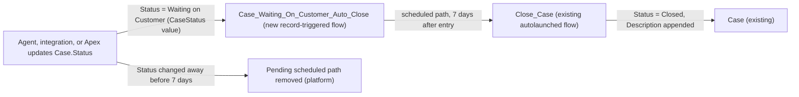

# Implementation spec — Auto-close Cases after 7 days in Waiting on Customer

> Add a `Waiting on Customer` open Case status and close any Case that stays in that status for 7 calendar days, reusing the existing `Close_Case` flow.

_Based on the requirement, the evidence reported by AskCoworker, and read-only org queries where noted. Assumptions and missing evidence are identified below. Specification only — nothing is implemented or deployed._

---

## 1. The requirement

Cases that have been in the status `Waiting on Customer` for 7 days are closed automatically. The status does not exist in the org; the user chose to add it as a new open status (*user decision*). The clock runs while `Case.Status` stays `Waiting on Customer`; it is 7 calendar days (*assumption*, from the requirement wording). The requirement contained no deploy or data-change instruction.

| # | Responsibility | Trigger | Where it lives |
| --- | --- | --- | --- |
| 1 | Offer `Waiting on Customer` as an open Case status | Agent or integration sets `Case.Status` | `CaseStatus` (StandardValueSet) |
| 2 | Start a 7-day clock when a Case enters `Waiting on Customer`, and cancel it when the Case leaves that status | Case created or updated so that `Status` = `Waiting on Customer` | `Case_Waiting_On_Customer_Auto_Close` (Flow) |
| 3 | Close the Case after 7 days in that status and record why | Scheduled path, 7 days after entry | `Case_Waiting_On_Customer_Auto_Close` calling `Close_Case` (existing) |

## 2. Grounding — reuse before building

Target org: `TestWriteSpecDE` (Developer Edition, not a sandbox, `00Dak00001COqNeEAL`). API version: `67.0`.

- **`Case.Status`** (standard picklist, value set `CaseStatus`) — active values are `New` (default), `On Hold`, `Escalated`, `Closed`; `Waiting on Customer` does not exist. _verified by org query_ (`sobject describe Case`). Nine Case records exist: 4 `New`, 2 `Working` (not an active value), 3 `Closed`; none has `Waiting on Customer`. _verified by org query_
- **`CaseStatus`** (standard object) — only `Closed` has `IsClosed = true`. _verified by org query_
- **Case record types and support processes** — only `Master`; `BusinessProcess` returns 0 rows, so a new value needs no support-process assignment. _verified by org query_
- **Existing Case automation** — no Apex triggers (Tooling `ApexTrigger`), no record-triggered flows (`FlowDefinitionView`), no workflow rules (Tooling `WorkflowRule`), no validation rules (Tooling `ValidationRule`) on Case. The only active scheduled flow is `Orch` (namespace `runtime_industries_recurrence`, no trigger object). _verified by org query_
- **`Close_Case`** (Flow, autolaunched, active, no namespace) — inputs `caseId`, `closeReason`, `resolutionNotes`; outputs `isSuccess`, `resultMessage`, `returnedCase`. It looks up the Case, skips it if `Status` = `Closed`, else sets `Status` = `Closed` and appends `--- Resolution (<now>) --- Reason: <closeReason> | Notes: <resolutionNotes>` to `Description`; fault path returns `$Flow.FaultMessage`. Run mode `SystemModeWithoutSharing`. _verified by org query_ (Tooling `Flow.Metadata`). It is the invocation target of agent action `Close_Case_179hk0000002Pjx` (`GenAiFunctionDefinition`). _verified by org query_ It is reused unchanged, so that caller is not affected.
- **Status-entry timestamp** — no custom field on Case records when a status was entered (Tooling `CustomField` on Case: `EngineeringReqNumber`, `PotentialLiability`, `Product`, `SLAViolation`, `Business_Account`, `Storefront`). _verified by org query_ `Case.Status` history tracking is on, and `CaseHistory` has 0 Status rows. _verified by org query_
- **Apex that writes Case** — `CaseSummaryCardAction`, `AgentCaseCreateActions` set `Status` = `New` only; no Apex class is Schedulable or Batchable over Case. _verified by org query_ (Apex bodies searched, unmanaged classes only).
- **`BusinessHours`** — one record, `Default`, `America/Los_Angeles`. _verified by org query_ Not used, because the clock is in calendar days.

Candidates examined and rejected: `On Hold` — the user chose a new value instead; `Case.StopStartDate` / `IsStopped` — entitlement milestone clock, not a status-entry time (_reported by AskCoworker_); `CloseCase` (namespace `SvcCopilotTmpl`, managed) — not editable and not needed because `Close_Case` fits; a `Waiting_Since__c` field plus a nightly scheduled flow — adds a field and a stamping step where a scheduled path needs neither.

Evidence sources: `sf org display`; `sobject describe Case`; `sobject list --sobject custom` (110 custom objects, none about cases, waiting, or support tickets); SOQL on `CaseStatus`, `Case` (GROUP BY `Status`), `BusinessProcess`, `BusinessHours`, `Organization`, `FlowDefinitionView`, `FieldDefinition`, `CaseHistory`, `DataStream`; Tooling SOQL on `CustomField`, `ApexTrigger`, `WorkflowRule`, `ValidationRule`, `FlowDefinition`, `Flow`, `ApexClass`, `GenAiFunctionDefinition`. AskCoworker returned no citedReferences.

## 3. Architecture

Why the pieces are drawn this way:

1. `CaseStatus` gains `Waiting on Customer` with `closed = false`, so `IsClosed` stays false while the Case waits. The value is needed before the flow can reference it. _user decision_ for the value; _assumption_ for the open category.
2. `Case_Waiting_On_Customer_Auto_Close` is a record-triggered flow, the platform's standard mechanism for a delay tied to a record state. It needs no new field because the scheduled path's time source is the moment the record starts meeting the entry condition. _assumption (documented platform behavior)_. No Apex is used: nothing here needs code.
3. The entry condition is `Status` = `Waiting on Customer` with "Only when a record is updated to meet the condition requirements". A Case created with that status, or updated into it, schedules one path. Later saves that keep the status do not reschedule it, so the 7 days count from entry. When a later save leaves the status, the platform removes the pending path. _assumption (documented platform behavior)_, load-bearing.
4. The scheduled path calls `Close_Case` as a subflow with `caseId` = `{!$Record.Id}`, `closeReason` = `Auto-closed after 7 days in Waiting on Customer`, and `resolutionNotes` blank. Reuse gives the same close logic and audit text as the agent action. `Close_Case` skips Cases already `Closed`. _verified by org query_
5. Because the path is removed when the status changes, a Case that reaches the scheduled path is still in `Waiting on Customer`; the flow still re-checks `{!$Record.Status}` in a Decision before the subflow call as a guard (see Section 4).

## 4. Metadata changes

**Data model**

- **Update `CaseStatus`** — Add value `Waiting on Customer` (label and API value `Waiting on Customer`, `closed = false`, `default = false`). Keep all existing values, including the inactive `Working`, unchanged. Retrieve the StandardValueSet before editing so that no existing value is dropped. Deploy before the flow.

**Automation**

- **Create `Case_Waiting_On_Customer_Auto_Close`** — Record-triggered flow, object `Case`, trigger "A record is created or updated", after save (Actions and Related Records). Entry condition: `Status` Equals `Waiting on Customer`; "Only when a record is updated to meet the condition requirements". No immediate-path actions. Scheduled path `Close_After_7_Days`: time source "When the record is created or updated to meet the conditions" (`RecordTriggerEvent`), offset 7 Days after. In the path: Decision `Still_Waiting` (`{!$Record.Status}` Equals `Waiting on Customer`); if true, Subflow `Close_Case` with `caseId` = `{!$Record.Id}`, `closeReason` = `Auto-closed after 7 days in Waiting on Customer`, `resolutionNotes` blank. The subflow reports errors through `isSuccess` and `resultMessage` and does not throw; the flow takes no further action on failure. Label "Case Waiting on Customer Auto Close". Status Active on deploy.

## 5. Data 360 (Data Cloud) data involved

Not applicable — this change does not use Data 360. `SELECT COUNT() FROM DataStream` returns 0. _verified by org query_

## 6. Security considerations

- **Execution context.** The scheduled path runs asynchronously as the Automated Process user in system context; `Close_Case` runs `SystemModeWithoutSharing`. _assumption (documented platform behavior)_ for the scheduled path user; _verified by org query_ for the subflow run mode. Sharing and FLS do not limit the close.
- **CRUD/FLS for people.** Setting `Status` = `Waiting on Customer` uses the caller's existing Edit access on Case and `Case.Status`; the new value needs no new grant. Permission sets reported with Case Edit include `Agentforce_Reference_App`, `Agentforce_Actions`, `sfdc_accelerate_dms`, `Pronto_Deep_Dive_Workshop`, and `sfdc_a360` (_reported by AskCoworker_, not re-queried; profiles also grant access).
- **Permission sets.** No permission set change. The flow and value add no new field or object.
- **Data exposure.** The close reason is appended to `Case.Description`, visible to anyone with Read on that field. It contains no customer data.

## 7. Testing strategy

Flow Tests cannot run scheduled paths (asynchronous), and the flow has no immediate-path logic to assert, so the inventory has no `FlowTest` row. The following are recommended verification, run in a sandbox or this org after deployment:

1. **Value present and open.** `Waiting on Customer` appears in the `Case.Status` picklist; a Case in that status has `IsClosed` = false.
2. **Entry on update.** Update a `New` Case to `Waiting on Customer`; Setup > Time-Based Workflow (Scheduled Actions) shows one pending path for the Case, due 7 days later.
3. **Entry on create.** Create a Case with `Status` = `Waiting on Customer`; one pending path is scheduled. Verifies assumption 3 in Section 8 (load-bearing).
4. **No reschedule while waiting.** Edit `Subject` on a waiting Case; the due time does not change.
5. **Leave before 7 days.** Change the Case to `On Hold`; the pending path is removed. Set it back to `Waiting on Customer`; a new path is scheduled from that moment. Verifies assumption 2 in Section 8 (load-bearing).
6. **Close after 7 days.** For a test Case, let the path run (or temporarily deploy a copy with a short offset in a sandbox). Expect `Status` = `Closed`, `ClosedDate` set, and the reason appended to `Description`.
7. **Already closed.** Close a waiting Case manually; the path is removed, and if it runs, `Close_Case` skips the Case without error.
8. **Bulk.** Update 200 Cases to `Waiting on Customer` in one transaction; 200 paths are scheduled and each closes its Case.
9. **Delete.** Delete a waiting Case; its pending path is removed. Undelete it; no path is scheduled (see Section 8).
10. **Agent caller unchanged.** Run agent action `Close_Case_179hk0000002Pjx` on an open Case; behavior is unchanged, because `Close_Case` is not modified.

No tests have been run.

## 8. Open decisions

### Open

1. **Deployment sequence (non-blocking).** Retrieve `CaseStatus`, add the value, deploy it; then deploy and activate `Case_Waiting_On_Customer_Auto_Close`. The flow references the value, so it cannot deploy first.
2. **Scheduled-path cancellation on status change (non-blocking; load-bearing assumption).** The design relies on the platform removing pending scheduled paths when a record no longer meets the entry condition under "Only when a record is updated to meet the condition requirements". _assumption (documented platform behavior)_. The `Still_Waiting` decision is a guard if this is wrong. Verified by Section 7, case 5.
3. **Entry on create (non-blocking; load-bearing assumption).** A Case inserted with `Waiting on Customer` enters the flow under this setting. _assumption (documented platform behavior)_. AskCoworker stated the opposite; see Resolved. Verified by Section 7, case 3.
4. **Meaning of "unchanged" (non-blocking).** The user said Cases "unchanged 7 days". The design reads this as "status unchanged for 7 days"; edits to other fields do not reset the clock. _assumption_. If any edit should reset the clock, the design changes to a `Waiting_Since__c` style timestamp or a check on `LastModifiedDate`.
5. **Undelete (non-blocking).** Record-triggered flows do not run on undelete, so an undeleted waiting Case gets no new path. _assumption (documented platform behavior)_. Recommended default: accept; the user sets the status again to restart the clock.
6. **Close reason text (non-blocking).** `closeReason` = `Auto-closed after 7 days in Waiting on Customer` and blank `resolutionNotes` are defaults. _assumption_.
7. **Scheduled-path volume (non-blocking).** Time-based flow interviews are subject to the org's daily asynchronous limits. The org has 9 Case records, so this is not a concern now. _assumption (documented platform behavior)_.

### Resolved

- **Status to watch — user decision.** Asked whether to add `Waiting on Customer`, reuse `On Hold`, or use another value; the user accepted adding `Waiting on Customer` as a new status.
- **7 calendar days, not business days — assumption.** The requirement says "7 days" and names no business hours.
- **Mechanism — assumption.** A record-triggered flow with a scheduled path was chosen over a new timestamp field and a nightly scheduled flow: fewer components, and no backfill because no Case has the status yet (_verified by org query_: 0 rows).
- **AskCoworker corrections.** It said the scheduled path is anchored to `LastModifiedDate`; the time source is the moment the record meets the condition. It said 29 Cases have `Waiting on Customer`; the org query returned 0. It proposed Flow Tests with mocked time for the scheduled path; Flow Tests cannot cover asynchronous paths, so these became manual checks. It said a Case created with the status would not enter the flow; the setting applies to creates too (Open item 3). It cited a limit of 2,000 scheduled actions per hour; this was not confirmed, so Open item 7 uses the general asynchronous limit. It said validation rules were not queryable; the Tooling query ran and returned 0.
- **Dropped AskCoworker proposals.** A pre-close notification, a fault-path Task or Platform Event, and an audit of `sfdc_a360` were not requested and are not included.

## 9. Change set

| # | Action | Type | API name | Module | Why |
| --- | --- | --- | --- | --- | --- |
| 1 | Update | StandardValueSet | `CaseStatus` | force-app/main/default/standardValueSets | Add the open status `Waiting on Customer`, which does not exist |
| 2 | Create | Flow | `Case_Waiting_On_Customer_Auto_Close` | force-app/main/default/flows | Schedule a close 7 days after a Case enters `Waiting on Customer` and call the existing `Close_Case` |

One new value on `CaseStatus` and one record-triggered flow whose 7-day scheduled path reuses `Close_Case` deliver the auto-close.

Total: 2 · Create: 1 · Update: 1 · Delete: 0
