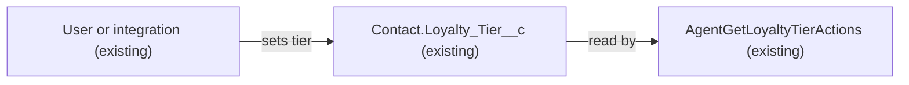

# Implementation spec — Customer loyalty tier tracking

> Record which loyalty tier (Explorer, Insider, Plus, One, Elite) each customer is in, using the existing `Contact.Loyalty_Tier__c` field.

_Based on the requirement, the evidence reported by AskCoworker, and read-only org queries where noted. Assumptions and missing evidence are identified below. Specification only — nothing is implemented or deployed._

---

## 1. The requirement

Store each customer's current loyalty tier; the user confirmed the scope is "just the tier value on the customer" (*user decision*), and the org already meets it with `Contact.Loyalty_Tier__c`, so no metadata changes are required. The request contained no deploy or data-change instruction.

| # | Responsibility | Trigger | Where it lives |
| --- | --- | --- | --- |
| 1 | Hold one loyalty tier per customer from the set Explorer, Insider, Plus, One, Elite | User or integration edits the Contact record | `Contact.Loyalty_Tier__c` (existing) |

## 2. Grounding — reuse before building

Target org: `TestWriteSpecDE` (Developer Edition, org ID `00Dak00001COqNeEAL`). API version: `67.0`.

- **`Contact.Loyalty_Tier__c`** (CustomField, restricted picklist) — label "Loyalty Tier", description "The customer's current loyalty program tier.", values `Explorer` (default), `Insider`, `Pronto Plus`, `Pronto One`, `Pronto Elite`; not required; history tracking off. _verified by org query_
- **Contact is the customer object** — `Contact.Contact_Status__c` has the values "Active Customer" and "Lapsed Customer", and `Contact` carries `Member_Number__c`, `Lifetime_Orders__c`, and `Lifetime_Value__c`. _verified by org query_
- **No other tier field exists.** Tooling `CustomField` names containing "Tier" or "Loyalty" return only `Contact.Loyalty_Tier__c`; `FieldDefinition` labels containing "Tier" on `Account`, `Contact`, `Lead`, `Loyalty_Transaction__c`, and `Transaction__c` return only this field. _verified by org query_
- **Field-level access** (complete list of `FieldPermissions` rows for the field): Read and Edit — `Agentforce_Reference_App`, `sfdc_accelerate_dms`; Read only — `sfdc_a360_sfcrm_data_extract`, `sfdc_slack`, `Pronto_Deep_Dive_Workshop`. No profile rows were returned. _verified by org query_
- **`AgentGetLoyaltyTierActions`** (ApexClass) — the only component that `MetadataComponentDependency` lists for the field, and the only unmanaged Apex class whose body mentions it; it reads the value and does not write it. No agent action (`GenAiFunctionDefinition`) invokes it. _verified by org query_
- **Automation on `Contact`** — 0 Apex triggers and 0 flows in `FlowDefinitionView` for `Contact` or `Loyalty_Transaction__c`. _verified by org query_
- **Current data** — all 198 Contacts have a blank `Loyalty_Tier__c`. _verified by org query_

Candidates examined and rejected: `PromotionTier` (standard object) — tiers of a promotion, not a customer's tier; `Loyalty_Transaction__c` — points activity (0 records), not needed for storing a tier value. _verified by org query_

Evidence sources: `sf org display`; `sf sobject list` (custom and all); `sf sobject describe Contact`; Tooling `CustomField` (name search and `Metadata` by Id), `MetadataComponentDependency`, `ApexClass` and `ApexTrigger` bodies, `GenAiFunctionDefinition`, `FlexiPage`, `Layout`; `FieldDefinition`, `FieldPermissions`, `FlowDefinitionView`, and `GROUP BY` counts on `Contact` and `Loyalty_Transaction__c`. AskCoworker returned no citedReferences.

## 3. Architecture

Why the pieces are drawn this way:

1. `Contact.Loyalty_Tier__c` holds the tier; users with `Agentforce_Reference_App` or `sfdc_accelerate_dms` can edit it. _verified by org query_
2. `AgentGetLoyaltyTierActions` reads the field and returns it; it is the only verified reader. _verified by org query_

## 4. Metadata changes

No metadata changes are required. The existing restricted picklist `Contact.Loyalty_Tier__c` already stores one of the five tiers per customer.

## 5. Data 360 (Data Cloud) data involved

Not applicable — this change does not use Data 360. `sfdc_a360_sfcrm_data_extract` can read the field (_verified by org query_), but nothing changes.

## 6. Security considerations

No access changes. Edit access is limited to `Agentforce_Reference_App` and `sfdc_accelerate_dms`; three other permission sets have Read only (_verified by org query_). Permission sets are not the only grant path; the query returned no profile rows for this field, so whether profiles such as System Administrator can see it is Not specified.

## 7. Testing strategy

No tests are needed because nothing changes. Recommended verification: open a Contact on the `Customer_Contact_Record_Page` FlexiPage and confirm the "Loyalty Tier" field shows and accepts the five values for a user with `Agentforce_Reference_App`; confirm that a new Contact created in the UI gets `Explorer` by default.

## 8. Open decisions

### Open

1. **Blank tier on existing customers (non-blocking).** All 198 Contacts have no tier (_verified by org query_). The user had no preference, so they stay blank (*assumption*); setting real tiers is a data load with values from the loyalty program owner, not a metadata change. Safe procedure if wanted: export `Id` and `Loyalty_Tier__c` first, load the values with Data Loader or `sf data import`, and restore from the export to roll back.
2. **Field placement (non-blocking).** Whether the field is on the Contact layouts or `Customer_Contact_Record_Page` could not be read with the allowed commands. Check the page and layouts; if missing, adding it is a UI change for everyone who uses that page.
3. **Automatic tier assignment (non-blocking, proposal).** No automation sets the tier (_verified by org query_). Assigning tiers from points in `Loyalty_Transaction__c` would need thresholds and was not requested; it is out of scope.

### Resolved

- **Tier names.** The requirement says "Plus, One, Elite"; the org values are `Pronto Plus`, `Pronto One`, `Pronto Elite`. The user answered "Just the tier value on the customer", which maps to keeping the existing values (*assumption*, mapping of the answer). Renaming them would change what `AgentGetLoyaltyTierActions`, Data Cloud, and Slack see.
- **Scope.** Tier value only; no points balance, thresholds, or assignment automation (*user decision*).
- **Customer object.** `Contact`, based on `Contact.Contact_Status__c` customer values and the existing field (*assumption*, from org semantics).
- **AskCoworker proposals dropped.** A roll-up points balance, threshold metadata, a `GlobalValueSet`, and an audit of `sfdc_accelerate_dms` were dropped as not requested. Its claim that renaming picklist labels needs a data migration was corrected: changing only a label keeps the stored API value (*assumption (documented platform behavior)*); renaming the API value would update existing records.
- **Picklist default.** `Explorer` is the default value (_verified by org query_); whether it applies to API inserts that omit the field is an *assumption (documented platform behavior)* and is included in the Section 7 check for UI creates only.

## 9. Change set

| # | Action | Type | API name | Module | Why |
| --- | --- | --- | --- | --- | --- |

No metadata changes are required; the existing `Contact.Loyalty_Tier__c` picklist already tracks each customer's tier.

Total: 0 · Create: 0 · Update: 0 · Delete: 0
