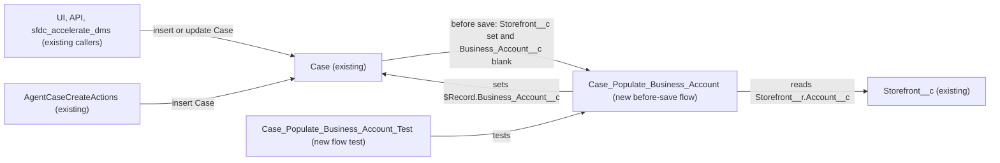

# Implementation spec — Case business account from storefront

> Fill `Case.Business_Account__c` from the related storefront's account when a Case has a storefront and no business account.

_Based on the requirement, the evidence reported by AskCoworker, and read-only org queries where noted. Assumptions and missing evidence are identified below. Specification only — nothing is implemented or deployed._

---

## 1. The requirement

When a Case is created or updated with `Case.Storefront__c` set and `Case.Business_Account__c` blank, copy `Storefront__c.Account__c` into `Case.Business_Account__c`; a non-blank business account is never overwritten (*user decision*: fill only when blank, on create and on update). The request contained no deploy or data-change instruction.

| # | Responsibility | Trigger | Where it lives |
| --- | --- | --- | --- |
| 1 | Copy the storefront's account into a blank `Case.Business_Account__c` | Case create, and Case update, when `Case.Storefront__c` is set and `Case.Business_Account__c` is blank | New before-save flow `Case_Populate_Business_Account` |
| 2 | Keep a non-blank `Case.Business_Account__c` unchanged, including values supplied by `AgentCaseCreateActions` callers | Same events | Entry condition of `Case_Populate_Business_Account` |
| 3 | Prove the behavior | Before deployment | New flow test `Case_Populate_Business_Account_Test` |

## 2. Grounding — reuse before building

Target org: `TestWriteSpecDE` (Developer Edition, not a sandbox, `00Dak00001COqNeEAL`). API version: `67.0`.

- **`Case.Storefront__c`** (CustomField, Lookup to `Storefront__c`, relationship `Storefront__r`, nillable) — the "case about a storefront" signal. _verified by org query_
- **`Case.Business_Account__c`** (CustomField, Lookup to `Account`, nillable, updateable) — the target "business account" field. On sibling objects the same field name is described as "the merchant business account" (`Gift_Certificate__c.Business_Account__c`, `Refund__c.Business_Account__c`). _verified by org query_
- **`Storefront__c.Account__c`** (CustomField, Lookup to `Account`, description "The related account to the storefront", nillable) — the source value. All 21 `Storefront__c` records have it set. _verified by org query_
- **Automation on `Case`**: zero Apex triggers (any namespace) on `Case`, `Storefront__c`, or `Account`; zero flows with trigger object `Case` or `Storefront__c`; zero validation rules on `Case`. The project's `force-app/main/default/triggers` folder is empty. _verified by org query_; _verified by project file_
- **`AgentCaseCreateActions`** (ApexClass, `with sharing`) — inserts Case and sets `Business_Account__c` and `Storefront__c` only from the caller's `businessAccountId` and `storefrontId` inputs; it never derives one from the other. It is reused unchanged: the new flow fills the gap when a caller passes only `storefrontId`. _verified by org query (class body)_
- **Case assignment rule `Standard`** (AssignmentRule, active) — its entries cannot be read; it does not write `Business_Account__c` as far as can be checked. _verified by org query_ (rule exists); entries not readable.
- **Readers of the Case fields**: `MetadataComponentDependency` returned no references to `Case.Business_Account__c` or `Case.Storefront__c`; a search of all 70 non-namespaced Apex class bodies found only `AgentCaseCreateActions` writing `Case.Business_Account__c`. _verified by org query_
- **Field access** (complete list of FieldPermissions rows for both fields): Edit on both fields for `Agentforce_Reference_App`, `Agentforce_Actions`, `sfdc_accelerate_dms`; Read only for `sfdc_a360_sfcrm_data_extract`, `sfdc_slack`, `Pronto_Deep_Dive_Workshop`; no profile rows. _verified by org query_
- **Existing data**: 9 Cases; 4 have `Storefront__c` set, and all 4 have `Business_Account__c` blank; no Case has `Business_Account__c` set. _verified by org query_

Candidates examined and rejected: `Case.AccountId` — the standard customer account, not the "business account" the requirement names (the field literally labelled Business Account exists); a formula field — a formula cannot be a Lookup and cannot write `Case.Business_Account__c`; an Apex trigger — a before-save flow meets the requirement declaratively; `CaseRule` and `CaseCommentRule` — these are `sc_ext` and `shield_ext` managed package classes, and no Case trigger exists to run them, so they do not populate the field. _verified by org query_

Evidence sources: `sf sobject describe` for `Case` and `Storefront__c`; Tooling `ApexTrigger`, `CustomField`, `ValidationRule`, `MetadataComponentDependency`, `ApexClass` bodies; `FlowDefinitionView`; `FieldPermissions`; `AssignmentRule`; `Organization`; `DataStream` count; Case and Storefront counts. AskCoworker returned no citedReferences.

## 3. Architecture

Why the pieces are drawn this way:

1. Callers of `Case` DML are the UI, API, integrations with Edit access (`sfdc_accelerate_dms`), and `AgentCaseCreateActions`. _verified by org query_ (FieldPermissions, class body)
2. A before-save record-triggered flow is the platform's standard declarative mechanism for setting a field on the record being saved, with no extra DML. _assumption (documented platform behavior)_ No Apex is needed, so none is proposed.
3. The flow reads the parent value through the `$Record.Storefront__r.Account__c` cross-object reference, which before-save flows support; no Get Records element is needed. _assumption (documented platform behavior)_
4. The flow writes only `$Record.Business_Account__c`. No other automation runs on `Case`. _verified by org query_

## 4. Metadata changes

**Automation**

- **Create `Case_Populate_Business_Account`** — Flow (record-triggered, Fast Field Updates / before save). Object `Case`; trigger "A record is created or updated". Entry conditions (all): `Storefront__c` Is Null `false`; `Business_Account__c` Is Null `true`; "Only when a record is updated to meet the condition requirements" is NOT selected, so the flow runs on every qualifying save. Element 1, Decision `Has_Storefront_Account`: `{!$Record.Storefront__r.Account__c}` Is Null `false`. Element 2 (on that outcome), Assignment: `{!$Record.Business_Account__c}` Equals `{!$Record.Storefront__r.Account__c}`. Default outcome does nothing, so a storefront without an account leaves the field blank. Status Active on deploy; API version 67.0.

**Tests**

- **Create `Case_Populate_Business_Account_Test`** — FlowTest for `Case_Populate_Business_Account`. Test cases: (a) create with `Storefront__c` set and `Business_Account__c` blank asserts `Business_Account__c` equals the storefront's `Account__c`; (b) update path with the same starting values asserts the same; (c) create with `Business_Account__c` already set to a different Account asserts it is unchanged (entry condition not met). Uses an existing `Storefront__c` record with `Account__c` set as test data.

## 5. Data 360 (Data Cloud) data involved

Not applicable — this change does not use Data 360. The org has 0 data streams (_verified by org query_); `sfdc_a360_sfcrm_data_extract` has Read on `Case.Business_Account__c` (_verified by org query_), so a future Case data stream would pick up the populated values with no change here.

## 6. Security considerations

- Record-triggered flows run in system context without sharing. The flow reads `Storefront__c.Account__c` and writes `Case.Business_Account__c` regardless of the running user's sharing or field-level security. _assumption (documented platform behavior)_ This is intended: a user who can save a Case with a storefront gets the business account filled even without Edit on `Case.Business_Account__c`.
- The value written is an Account Id already present on a storefront the user linked. Users without Read FLS on `Case.Business_Account__c` still cannot see it; no permission set or profile grant changes. The Read and Edit grants listed in Section 2 are unchanged. _verified by org query_ (current grants)
- `AgentCaseCreateActions` runs `with sharing`; a caller-supplied `businessAccountId` is kept because the entry condition requires a blank field. _verified by org query_ (class body); flow behavior is _assumption (documented platform behavior)_.
- No new fields, objects, Apex, or credentials; no data leaves the org.

## 7. Testing strategy

Planned test: `Case_Populate_Business_Account_Test` (FlowTest), cases (a), (b), (c) in Section 4, covering Responsibilities 1 and 2. Tests are planned, not run.

Recommended verification (manual, in the org after deployment):

1. Create a Case in the UI with a storefront and no business account; the saved Case shows the storefront's account in `Business_Account__c`.
2. Create a Case with both a storefront and a different business account; the business account is unchanged.
3. On an existing Case with a business account, change `Storefront__c` to a storefront with a different account; `Business_Account__c` is unchanged (user decision: never overwrite).
4. On a Case with a storefront, clear `Business_Account__c` and save; it is refilled from the storefront (see Section 8, Open 2).
5. Invoke `AgentCaseCreateActions` with `storefrontId` only; the returned `businessAccountId` is the storefront's account (the class queries the Case back after insert, so it returns the flow-set value).
6. Bulk: insert or update 200 Cases with storefronts through Data Loader or the API; all get the business account and no SOQL governor limit error occurs (verifies the load-bearing cross-object reference behavior in bulk).
7. A Case with no storefront: the flow does not run and `Business_Account__c` stays blank.
8. Delete and undelete do not run before-save flows; no check needed beyond confirming no error on undelete.

## 8. Open decisions

### Open

1. **Backfill of existing Cases (non-blocking).** 4 existing Cases have `Storefront__c` set and `Business_Account__c` blank (_verified by org query_). The flow only acts on future saves. Recommended data step after deployment: export the 4 Cases (Id, `Storefront__c`, `Business_Account__c`) as a backup, then either re-save them or set `Business_Account__c` to their storefront's `Account__c` with Data Loader or Data Import Wizard. Rollback: re-import the export with `Business_Account__c` blank. Not performed by this spec.
2. **Clearing the field while a storefront is set (non-blocking).** Because the flow runs whenever the field is blank on save, a user cannot leave `Case.Business_Account__c` blank on a Case that has a storefront whose account is set; it is refilled on the next save. This follows from the user decision ("if blank, copy, on create and update"). Recommended: accept and tell support users.
3. **Changing the storefront on a Case that already has a business account (non-blocking).** The old business account is kept even if the new storefront belongs to another account (user decision: never overwrite). Recommended: accept; users correct it by hand.
4. **Deployment sequence (non-blocking).** Deploy `Case_Populate_Business_Account` (active) and `Case_Populate_Business_Account_Test` together, run the flow test, then do the Open 1 data step.
5. **Assignment rule entries unreadable (non-blocking).** Case assignment rule `Standard` is active (_verified by org query_) but its entries cannot be read. Assignment rules run after before-save flows and set the owner, not `Business_Account__c`. _assumption (documented platform behavior)_

### Resolved

- **Update behavior and overwrite rule** — *user decision*: fill `Case.Business_Account__c` only when it is blank and `Case.Storefront__c` is set, on create and on update.
- **Target field** — `Case.Business_Account__c`, not `Case.AccountId`. *assumption*: the requirement's words match the field's label, and the same field name means the merchant business account on sibling objects (_verified by org query_).
- **Hidden `CaseRule` / `CaseCommentRule` (AskCoworker called this blocking)** — corrected: they are managed-package classes (`sc_ext`, `shield_ext`) and no Case trigger exists in any namespace, so they cannot populate the field on save. _verified by org query_
- **Get Records and per-record SOQL (AskCoworker proposal)** — corrected: the design uses the `$Record.Storefront__r.Account__c` reference instead of Get Records. AskCoworker's claim that a before-save flow issues one SOQL query per record in a batch contradicts documented flow bulkification, where record-triggered flow interviews in one transaction are batched. _assumption (documented platform behavior)_; checked by Section 7 step 6.
- **Storefronts without an account** — no `Storefront__c` record lacks `Account__c` today (_verified by org query_); the Decision guard keeps the field blank if one appears.
- **Permission sets** — no changes; the flow runs in system context and no new field is added. *assumption (documented platform behavior)*
- **Dropped AskCoworker proposals** — a guard checkbox for intentional clearing, an Apex trigger fallback, and anonymous Apex for the backfill were dropped (not requested; anonymous Apex is replaced by a Data Loader step).

## 9. Change set

| # | Action | Type | API name | Module | Why |
| --- | --- | --- | --- | --- | --- |
| 1 | Create | Flow | `Case_Populate_Business_Account` | force-app/main/default/flows | Before-save Case flow that copies `Storefront__c.Account__c` into a blank `Case.Business_Account__c` on create and update |
| 2 | Create | FlowTest | `Case_Populate_Business_Account_Test` | force-app/main/default/flowtests | Flow test for fill-when-blank and no-overwrite behavior |

One new before-save flow on Case fills the business account from the storefront when it is blank, with a flow test.

Total: 2 · Create: 2 · Update: 0 · Delete: 0
