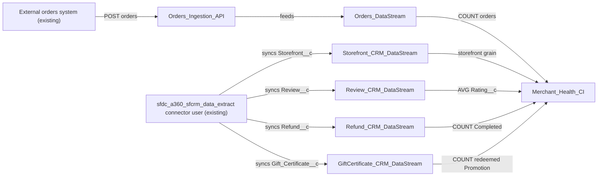

# Implementation spec — Merchant health calculated insight per storefront

> Build a Data 360 (Data Cloud) calculated insight that reports average rating, refund rate, and promo usage for each `Storefront__c`.

_Based on the requirement, the evidence reported by AskCoworker, and read-only org queries where noted. Assumptions and missing evidence are identified below. Specification only — nothing is implemented or deployed._

---

## 1. The requirement

Create one Data 360 calculated insight, `Merchant_Health_CI`, at storefront grain with three measures: average review rating, refund rate (completed refunds divided by orders, a user decision), and promo usage. The user confirmed a Data 360 calculated insight rather than CRM fields. Orders are not stored in Salesforce, so the design adds an order ingestion path. The request contained no deploy or data-change instruction.

| # | Responsibility | Trigger | Where it lives |
| --- | --- | --- | --- |
| 1 | Bring `Storefront__c`, `Review__c`, `Refund__c`, and `Gift_Certificate__c` records into Data 360 | CRM connector sync schedule | `Storefront_CRM_DataStream`, `Review_CRM_DataStream`, `Refund_CRM_DataStream`, `GiftCertificate_CRM_DataStream` |
| 2 | Bring order records from the external orders system into Data 360 | External system calls the Ingestion API | `Orders_Ingestion_API`, `Orders_DataStream` |
| 3 | Compute average rating per storefront | Calculated insight refresh | `Merchant_Health_CI` |
| 4 | Compute refund rate per storefront (completed refunds / orders) | Calculated insight refresh | `Merchant_Health_CI` |
| 5 | Compute promo usage per storefront | Calculated insight refresh | `Merchant_Health_CI` |

## 2. Grounding — reuse before building

Target org: `TestWriteSpecDE` (Developer Edition, user `epic.2b9dd11f2b2a@orgfarm.salesforce.com`). API version: `67.0`.

- **Data 360 provisioning** — Data space `default` exists; `DataStream`, `MktCalculatedInsight`, and Tooling `DataStreamDefinition` each return 0 records; no `__dlm` entities are visible. Nothing in Data 360 can be reused. _verified by org query_
- **`Storefront__c`** (CustomObject, 21 records) — the grain of the insight. `Status__c` picklist: Active, Inactive, Pending Activation, Suspended, Closed. _verified by org query_
- **`Storefront__c.Average_Review_Score__c`** (formula, Number) — `Total_Score__c / Total_Reviews__c`. `Total_Reviews__c` is a roll-up COUNT of `Review__c` and `Total_Score__c` is a roll-up SUM of `Review__c.Rating__c`; neither roll-up has a filter. The calculated insight matches this definition (all reviews, no filter). _verified by org query_
- **`Review__c`** (CustomObject, 92 records) — `Storefront__c` master-detail, `Rating__c` Number(1,0), `Status__c` picklist (Submitted, Published) blank on all 92 records, `Comments__c` long text. _verified by org query_
- **`Refund__c`** (CustomObject, 0 records) — `Storefront__c` lookup, `Status__c` picklist (Pending, Approved, Processing, Completed, Failed, Cancelled), `Amount__c`. _verified by org query_
- **`Gift_Certificate__c`** (CustomObject, 1 record) — `Storefront__c` lookup, `Type__c` (Purchased, Recovery, Promotion, Loyalty Reward, Referral Bonus), `Status__c` (Draft, Active, Partially Redeemed, Fully Redeemed, Expired, Cancelled), `Recipient__c` Contact lookup. _verified by org query_
- **`Promotion__c`** (CustomObject, 1 record) — `Storefront__c` lookup and `Status__c`, but no redemption or usage field, so it cannot measure usage. _verified by org query_
- **Orders** — standard `Order` has 0 records, and neither `Refund__c` nor `Storefront__c` has an order lookup. _verified by org query_ Orders live in an external system (Heroku Orders API). _reported by AskCoworker_
- **`sfdc_a360_sfcrm_data_extract`** (PermissionSet, Data 360 CRM connector) — assigned to active user `cloud@00dak00001coqneeal` and grants Read on `Storefront__c`, `Review__c`, `Refund__c`, `Gift_Certificate__c`, and `Promotion__c`. The CRM connector can read the source objects without a permission change. _verified by org query_
- **Automation** — no Apex triggers and no record-triggered flows on the five objects; `Get_Partner_Quality_Watchlist` (flow) reads `Storefront__c.Average_Review_Score__c`; no Apex class aggregates refund rate or promo usage. _reported by AskCoworker_

Evidence sources: Tooling `FieldDefinition` on the five objects; `sobject describe` for picklists and formulas; Tooling `CustomField.Metadata` for both roll-ups; `COUNT()` on the five objects and `Order`; `EntityDefinition`, `DataSpace`, `DataStream`, `MktCalculatedInsight`, and Tooling `DataStreamDefinition`; `PermissionSetAssignment` and `ObjectPermissions` for the connector permission set; `GROUP BY` on `Review__c.Status__c`, `Gift_Certificate__c.Type__c`, and `Promotion__c.Status__c`. AskCoworker returned no citedReferences.

## 3. Architecture

Why the pieces are drawn this way:

1. The external orders system is the only order source. `Order` is empty and no order link exists on `Refund__c` or `Storefront__c` (verified by org query), so the refund-rate denominator must be ingested. The Ingestion API is the default connector because the source mechanism is not specified (Section 8).
2. The connector user holds `sfdc_a360_sfcrm_data_extract` with Read on all source objects (verified by org query), so the four CRM data streams reuse the existing connector access.
3. `Promotion__c` is not streamed: it has no usage data (verified by org query). Promo usage comes from `Gift_Certificate__c`.
4. `Merchant_Health_CI` joins every stream on the storefront key. No Apex is used; the calculated insight is declarative.

## 4. Metadata changes

**Ingestion**

- **Create `Orders_Ingestion_API`** — Conditional: applies only if the external orders system can push through the Ingestion API; if it exposes another channel (for example Amazon S3 or MuleSoft), use that connector type instead. Ingestion API connector with an order schema of at least `order_id` (text, primary key), `storefront_id` (text, the `Storefront__c` record Id), `order_date` (datetime), and `status` (text).
- **Create `Orders_DataStream`** — Data stream on `Orders_Ingestion_API`. Primary key `order_id`. Maps to an orders data model object with a relationship from `storefront_id` to the storefront data model object from `Storefront_CRM_DataStream`.
- **Create `Storefront_CRM_DataStream`** — CRM connector data stream for `Storefront__c`. Fields: `Id`, `Name`, `Status__c`. Primary key `Id`. Maps to the storefront data model object that is the grain of the insight.
- **Create `Review_CRM_DataStream`** — CRM connector data stream for `Review__c`. Fields: `Id`, `Storefront__c`, `Rating__c`, `Status__c`. Excludes `Comments__c`. Relationship `Storefront__c` to the storefront data model object.
- **Create `Refund_CRM_DataStream`** — CRM connector data stream for `Refund__c`. Fields: `Id`, `Storefront__c`, `Status__c`. Relationship `Storefront__c` to the storefront data model object.
- **Create `GiftCertificate_CRM_DataStream`** — CRM connector data stream for `Gift_Certificate__c`. Fields: `Id`, `Storefront__c`, `Type__c`, `Status__c`. Excludes `Recipient__c`. Relationship `Storefront__c` to the storefront data model object.

**Calculated Insight**

- **Create `Merchant_Health_CI`** — Calculated insight with dimension storefront Id and three measures: `avg_rating` = AVG of `Review__c.Rating__c` (null when the storefront has no reviews); `refund_rate` = COUNT of `Refund__c` with `Status__c` = 'Completed' divided by COUNT of orders, with the denominator wrapped so zero orders returns null instead of an error; `promo_usage` = COUNT of `Gift_Certificate__c` with `Type__c` = 'Promotion' and `Status__c` IN ('Partially Redeemed', 'Fully Redeemed'), zero when none. Refresh daily after the CRM connector sync.

## 5. Data 360 (Data Cloud) data involved

Data 360 is the platform for this change. Five new data streams feed data model objects in the `default` data space: four from the CRM connector (`Storefront__c`, `Review__c`, `Refund__c`, `Gift_Certificate__c`) and one from the new Ingestion API connector (orders). `Merchant_Health_CI` reads those data model objects and writes one output row per storefront with `avg_rating`, `refund_rate`, and `promo_usage`. No data stream or calculated insight exists today (verified by org query). CRM deletes propagate to data model objects on the next connector sync; the Ingestion API does not delete orders automatically, so cancelled or removed orders must be sent as updates (reported by AskCoworker).

## 6. Security considerations

- **Execution context.** The CRM data streams run as the connector user `cloud@00dak00001coqneeal`, whose access comes from `sfdc_a360_sfcrm_data_extract` (verified by org query). The calculated insight runs in Data 360 compute; CRM sharing, org-wide defaults, and CRUD/FLS do not apply to it at compute time (reported by AskCoworker).
- **CRUD/FLS.** The connector permission set grants object Read on all four source objects (verified by org query). Field-level Read on `Rating__c`, `Status__c`, `Type__c`, and `Storefront__c` for that permission set was not checked; confirm it during manual verification. Profiles and other permission sets are also grant paths and are unchanged.
- **Permission sets.** No CRM permission set changes are in this inventory. Access to the calculated insight output is granted through Data 360 permission sets; who should see it is not specified (Section 8).
- **Data exposure.** The streams select only the fields the measures need. `Review__c.Comments__c` (free text) and `Gift_Certificate__c.Recipient__c` (Contact) are excluded. The output contains only storefront-level aggregates.

## 7. Testing strategy

No Apex is in the inventory, so there are no Apex test classes. All cases below are recommended verification in a sandbox with Data 360; none have run.

- **Average rating.** A storefront with ratings 2, 4, 5 returns 3.67. A storefront with no reviews returns null. Compare `avg_rating` with `Storefront__c.Average_Review_Score__c` for the 21 existing storefronts; they should match because both use all reviews.
- **Refund rate.** 2 Completed refunds and 10 orders return 0.20. A Pending refund is excluded. Zero refunds with orders return 0. Zero orders return null and the refresh does not fail (divide-by-zero case). `Refund__c` has 0 records today (verified by org query), so test data is required.
- **Promo usage.** Only `Type__c` = 'Promotion' with `Status__c` 'Partially Redeemed' or 'Fully Redeemed' counts. Recovery, Loyalty Reward, Active, and Expired certificates are excluded. A storefront with no certificates returns 0.
- **Ingestion.** An order posted to `Orders_Ingestion_API` appears in the orders data model object and joins to its storefront. An order with an unknown `storefront_id` does not create a storefront row.
- **Deletes.** Deleting a `Review__c` in CRM removes it from the data model object after the next sync, and `avg_rating` changes at the next refresh.
- **Permissions.** Confirm the connector user can read every streamed field (fields arrive non-null). Confirm `Comments__c` and `Recipient__c` are absent from the data model objects.

## 8. Open decisions

1. **Order source and connector type (non-blocking; Conditional change).** `Create Orders_Ingestion_API` is conditional on the external orders system being able to push through the Ingestion API. The user had no preference. Default: Ingestion API. The external system is reported by AskCoworker only (Heroku Orders API); its schema and push mechanism are not specified.
2. **Which orders count in the denominator (non-blocking).** The user defined refund rate as completed refunds / orders. Default: count every ingested order for the storefront, with no status filter. AskCoworker proposed excluding cancelled, voided, and failed orders; that is listed here as a proposal because the external status values are unknown.
3. **Promo usage definition (non-blocking).** The user had no preference. Default: redeemed `Gift_Certificate__c` records with `Type__c` = 'Promotion'. Alternative: count of `Promotion__c` records per storefront, which measures promotions created, not used (`Promotion__c` has no redemption field, verified by org query).
4. **Review moderation (non-blocking).** `Review__c.Status__c` is blank on all 92 records (verified by org query). Default: include all reviews, matching `Storefront__c.Average_Review_Score__c`. A filter on 'Published' can be added later.
5. **Refresh cadence and output access (non-blocking).** Default: daily refresh after the CRM connector sync. Which users or Data 360 permission sets may read the output is not specified; no grant is included.
6. **Inventory corrections.** AskCoworker typed the calculated insight as `MktCalculatedInsight` (an sObject); it is corrected to the `MktCalcInsightObjectDef` metadata type. AskCoworker's conditional row to create a CRM connector was dropped: `sfdc_a360_sfcrm_data_extract` is assigned to an active connector user with Read on all source objects (verified by org query). `Average_Review_Score__c` and `Total_Reviews__c` were removed from the storefront stream and `Amount__c`, `Order_Date__c` from other streams because no measure uses them. AskCoworker's "Conditional" notes on `Orders_DataStream` and `Merchant_Health_CI` were ordering and data dependencies, not unresolved facts, so they are covered in Sections 5 and 7.
7. **Data model objects and mappings (non-blocking).** Each data stream row includes creating its data model object and field mapping; they are not listed as separate changes. Exact data model object API names are set at build time.
8. **Module paths (assumption).** The Module paths in Section 9 assume Data 360 metadata is kept in this project's source; the project currently has no Data 360 metadata folders.
9. **AskCoworker R/T timeout.** The combined runtime and testing call timed out and was split into two narrower calls, which both returned. AskCoworker cited facts from a "prior session" (Heroku Orders API, class bodies); only those confirmed by org query are tagged as verified.

## 9. Change set

| # | Action | Type | API name | Module | Why |
| --- | --- | --- | --- | --- | --- |
| 1 | Create | DataConnectorIngestApi | `Orders_Ingestion_API` | force-app/main/default/dataConnectorIngestApis | Receives orders from the external system; orders are the refund-rate denominator |
| 2 | Create | DataStreamDefinition | `Orders_DataStream` | force-app/main/default/dataStreamDefinitions | Lands ingested orders in Data 360 |
| 3 | Create | DataStreamDefinition | `Storefront_CRM_DataStream` | force-app/main/default/dataStreamDefinitions | Storefront grain of the insight |
| 4 | Create | DataStreamDefinition | `Review_CRM_DataStream` | force-app/main/default/dataStreamDefinitions | Source of average rating |
| 5 | Create | DataStreamDefinition | `Refund_CRM_DataStream` | force-app/main/default/dataStreamDefinitions | Source of completed refunds |
| 6 | Create | DataStreamDefinition | `GiftCertificate_CRM_DataStream` | force-app/main/default/dataStreamDefinitions | Source of promo usage |
| 7 | Create | MktCalcInsightObjectDef | `Merchant_Health_CI` | force-app/main/default/mktCalcInsightObjectDefs | Computes avg rating, refund rate, and promo usage per storefront |

Five data streams feed one declarative calculated insight at storefront grain, with orders ingested from the external system.

Total: 7 · Create: 7 · Update: 0 · Delete: 0
