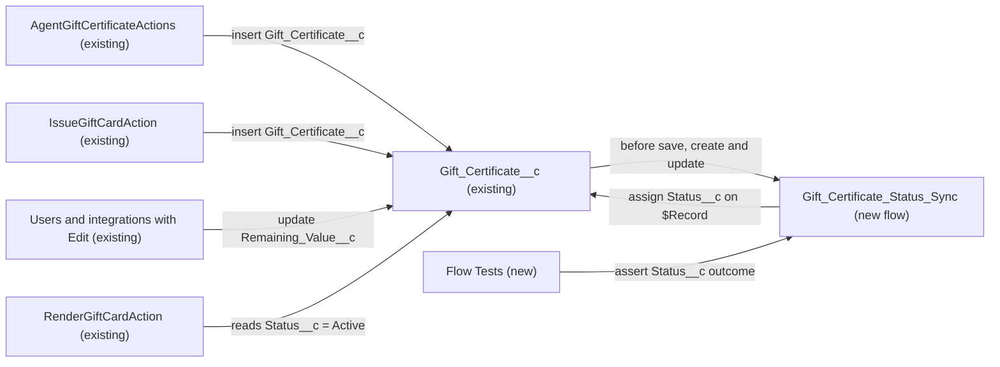

# Implementation spec — Gift certificate status derived from remaining value

> Set `Gift_Certificate__c.Status__c` automatically to Fully Redeemed or Partially Redeemed when `Gift_Certificate__c.Remaining_Value__c` changes, without overriding Cancelled, Expired, or Draft certificates.

_Based on the requirement, the evidence reported by AskCoworker, and read-only org queries where noted. Assumptions and missing evidence are identified below. Specification only — nothing is implemented or deployed._

---

## 1. The requirement

When a gift certificate is saved, its status follows its remaining value: a remaining value of zero means Fully Redeemed, and a remaining value below the original value means Partially Redeemed. The user decided that the automation never overrides a status of Cancelled, Expired, or Draft (*user decision*). The request contained no deploy or data-change instruction.

| # | Responsibility | Trigger | Where it lives |
| --- | --- | --- | --- |
| 1 | Set `Status__c` = Fully Redeemed when `Remaining_Value__c` is zero (or below zero) | Create or update of `Gift_Certificate__c` | New before-save flow `Gift_Certificate_Status_Sync` |
| 2 | Set `Status__c` = Partially Redeemed when `Remaining_Value__c` is above zero and below `Original_Value__c` | Create or update of `Gift_Certificate__c` | New before-save flow `Gift_Certificate_Status_Sync` |
| 3 | Leave Cancelled, Expired, and Draft certificates unchanged | Create or update of `Gift_Certificate__c` | Entry conditions of `Gift_Certificate_Status_Sync` |
| 4 | Prove the behavior before delivery | Deployment | New Flow Tests `Gift_Certificate_Status_Sync_Fully_Redeemed`, `Gift_Certificate_Status_Sync_Partially_Redeemed`, `Gift_Certificate_Status_Sync_Protected_Status` |

## 2. Grounding — reuse before building

Target org: `TestWriteSpecDE` (connected; user `epic.2b9dd11f2b2a@orgfarm.salesforce.com`). API version: `67.0` (from `sfdx-project.json`, *verified by project file*).

- **`Gift_Certificate__c`** (CustomObject, DurableId `01Iak00000Dx4JX`) — the only object that holds status, original value, and remaining value; it has no custom child objects. _verified by org query_
- **`Gift_Certificate__c.Status__c`** (Picklist, nillable, updateable; description "Lifecycle status of the gift certificate.") — active values Draft, Active, Partially Redeemed, Fully Redeemed, Expired, Cancelled. Both target values already exist, so no picklist change is needed. _verified by org query_
- **`Gift_Certificate__c.Remaining_Value__c`** (Currency 18,2, nillable, not a formula or roll-up; description "The remaining monetary value available for redemption.") — the input that drives the status. _verified by org query_
- **`Gift_Certificate__c.Original_Value__c`** (Currency 18,2, nillable; description "The original monetary value of the gift certificate at time of issue.") — the "original" comparator named in the requirement. _verified by org query_
- **`Gift_Certificate__c.Value__c`** (Currency 18,0; description "The monetary value of the gift certificate.") — not used; the requirement says "original", which matches `Original_Value__c` by description. _verified by org query_
- **`AgentGiftCertificateActions`** (ApexClass, `with sharing`) — inserts certificates with `Original_Value__c` = `Remaining_Value__c` = `giftValue` and `Status__c` = Active when blank; it checks only that `giftValue` is not null. _verified by org query (Apex body)_
- **`IssueGiftCardAction`** (ApexClass, `with sharing`) — inserts certificates with `Original_Value__c` = `Remaining_Value__c` = `giftValue` and `Status__c` = Active; rejects `giftValue` null or <= 0; its duplicate guard queries `Status__c = 'Active'`. _verified by org query (Apex body)_
- **`RenderGiftCardAction`** (ApexClass, `with sharing`) — read-only; looks up certificates with `Status__c = 'Active'`. _verified by org query (Apex body)_
- **Existing automation on `Gift_Certificate__c`**: 0 Apex triggers (Tooling `ApexTrigger`), 0 record-triggered flows (`FlowDefinitionView`), 0 validation rules (Tooling `ValidationRule`), and no flow among the `MetadataComponentDependency` references to the object or to `Status__c`, `Remaining_Value__c`, `Original_Value__c`. _verified by org query_
- **Readers and writers of `Status__c`** (`MetadataComponentDependency` plus a search of all 70 unmanaged Apex class bodies): `AgentGiftCertificateActions`, `IssueGiftCardAction`, `RenderGiftCardAction`. Test classes `IssueGiftCardActionTest` and `RenderGiftCardActionTest` also insert certificates. No Apex class updates `Remaining_Value__c` after insert. _verified by org query_
- **Edit access on `Status__c`**: `Agentforce_Reference_App`, `Agentforce_Action_Access`, `Pronto_Deep_Dive_Workshop`, `sfdc_accelerate_dms`; read-only: `sfdc_a360_sfcrm_data_extract`, `sfdc_slack` (complete list of `FieldPermissions` rows for the field). _verified by org query_
- **Data shape**: 1 record exists, with `Remaining_Value__c` = 50, `Original_Value__c` = 50, `Status__c` = Active. _verified by org query_
- No flow named like `%Gift%` exists (Tooling `FlowDefinition`), so the new flow name is free. _verified by org query_

Candidates examined and rejected: formula field — `Status__c` is a writable picklist and a formula cannot be a picklist (*assumption (documented platform behavior)*); roll-up summary — no child redemption object exists (*verified by org query*); the org-wide search for other remaining-value or redemption fields found only Data 360 data lake fields (`TableEnumOrId` starting `9sd`), none on CRM objects (*verified by org query*); changing the existing Apex classes — they only create certificates and would not catch later edits of `Remaining_Value__c`.

Evidence sources: `sf org display`; `sf sobject list --sobject custom`; `sf sobject describe Gift_Certificate__c`; Tooling queries on `ApexTrigger`, `ValidationRule`, `CustomField`, `FlowDefinition`, `MetadataComponentDependency`, `ApexClass` bodies; standard queries on `FlowDefinitionView`, `FieldDefinition`, `FieldPermissions`, `DataStream`, and aggregate record data. AskCoworker returned no citedReferences.

## 3. Architecture

Why the pieces are drawn this way:

1. `AgentGiftCertificateActions` and `IssueGiftCardAction` are the only Apex writers, and they insert with `Remaining_Value__c` equal to `Original_Value__c` (*verified by org query*). No component in the org updates `Remaining_Value__c` after insert, so later changes come from users or integrations holding Edit access (*verified by org query* for the grants; the actual writer is *not specified*).
2. A before-save record-triggered flow is the platform's standard mechanism for deriving a field on the same record: it assigns `$Record.Status__c` without DML, so it cannot recurse (*assumption (documented platform behavior)*). No trigger or flow exists on the object to extend (*verified by org query*), so a new flow is created. Apex is not needed: all inputs are on the same record.
3. `RenderGiftCardAction` and the `IssueGiftCardAction` duplicate guard stay unchanged (*assumption*, user had no preference); after this change they no longer find certificates that became Partially Redeemed or Fully Redeemed (see Section 8).

## 4. Metadata changes

**Automation**

- **Create `Gift_Certificate_Status_Sync`** — Flow (record-triggered, Fast Field Updates / before save) on `Gift_Certificate__c`, trigger "A record is created or updated", run "every time a record is updated and meets the condition requirements". Entry conditions (All conditions are met): `Remaining_Value__c` Is Null = false; `Original_Value__c` Is Null = false; `Status__c` Does Not Equal Cancelled; `Status__c` Does Not Equal Expired; `Status__c` Does Not Equal Draft. Decision "Determine New Status", outcomes evaluated in order: (1) Fully Redeemed when `{!$Record.Remaining_Value__c} <= 0` → Assignment `{!$Record.Status__c}` = `Fully Redeemed`; (2) Partially Redeemed when `{!$Record.Remaining_Value__c} > 0` AND `{!$Record.Remaining_Value__c} < {!$Record.Original_Value__c}` → Assignment `{!$Record.Status__c}` = `Partially Redeemed`; (3) Restored when `{!$Record.Remaining_Value__c} >= {!$Record.Original_Value__c}` AND `Status__c` equals Partially Redeemed or Fully Redeemed → Assignment `{!$Record.Status__c}` = `Active`; default outcome makes no assignment. No Get Records, no DML, no fault path needed. API version 67.0. Activated at deployment.

**Tests**

- **Create `Gift_Certificate_Status_Sync_Fully_Redeemed`** — FlowTest for `Gift_Certificate_Status_Sync`, update path: initial record `Original_Value__c` = 50, `Remaining_Value__c` = 50, `Status__c` = Active; updated record `Remaining_Value__c` = 0; assert `$Record.Status__c` = Fully Redeemed.
- **Create `Gift_Certificate_Status_Sync_Partially_Redeemed`** — FlowTest for `Gift_Certificate_Status_Sync`, update path: initial record `Original_Value__c` = 50, `Remaining_Value__c` = 50, `Status__c` = Active; updated record `Remaining_Value__c` = 20; assert `$Record.Status__c` = Partially Redeemed.
- **Create `Gift_Certificate_Status_Sync_Protected_Status`** — FlowTest for `Gift_Certificate_Status_Sync`, update path: initial record `Original_Value__c` = 50, `Remaining_Value__c` = 50, `Status__c` = Cancelled; updated record `Remaining_Value__c` = 0; assert the entry conditions are not met and `$Record.Status__c` stays Cancelled.

## 5. Data 360 (Data Cloud) data involved

Not applicable — this change does not use Data 360. `SELECT COUNT() FROM DataStream` returned 0 (*verified by org query*). `sfdc_a360_sfcrm_data_extract` has Read on `Status__c` (*verified by org query*), so a future Gift Certificate data stream would receive the new status values without schema changes (*assumption*).

## 6. Security considerations

- **Execution context:** record-triggered flows run in system context without sharing, so `Status__c` is assigned even when the saving user has read-only field access to it (*assumption (documented platform behavior)*). This is intended: the status is derived, not user-entered.
- **CRUD/FLS:** no new object or field is created, so no new grants and no default profile field access. Users and integrations that change `Remaining_Value__c` already need Edit on it; the four permission sets with Edit on `Status__c` (`Agentforce_Reference_App`, `Agentforce_Action_Access`, `Pronto_Deep_Dive_Workshop`, `sfdc_accelerate_dms`) are the complete list from `FieldPermissions` (*verified by org query*).
- **Permission sets:** no changes.
- **Behavior change for other writers:** any user or integration that sets `Status__c` by hand to Active, Partially Redeemed, or Fully Redeemed has the value replaced by the derived status on save when a decision outcome matches. Cancelled, Expired, and Draft are never replaced (*user decision*).
- **Data exposure:** none new; the flow reads and writes fields on the same record only.

## 7. Testing strategy

Flow Tests in the inventory (FlowTest metadata; they exercise the before-save path directly):

| Flow Test | Behavior |
| --- | --- |
| `Gift_Certificate_Status_Sync_Fully_Redeemed` | Responsibility 1: remaining value 0 → Fully Redeemed |
| `Gift_Certificate_Status_Sync_Partially_Redeemed` | Responsibility 2: 0 < remaining < original → Partially Redeemed |
| `Gift_Certificate_Status_Sync_Protected_Status` | Responsibility 3: Cancelled is not overridden |

Recommended verification (manual, in a sandbox; no test planned as a component):

1. Remaining value below zero → Fully Redeemed.
2. Remaining value equal to original on an Active certificate → stays Active; the same on a Partially Redeemed or Fully Redeemed certificate → Active.
3. Expired and Draft certificates with remaining value 0 → status unchanged.
4. Blank `Remaining_Value__c` or blank `Original_Value__c` → status unchanged.
5. A record starts matching: a Draft certificate with remaining 20 of 50 is set to Active → saved as Partially Redeemed in the same save. A record stops matching: a Partially Redeemed certificate set to Cancelled → saved as Cancelled.
6. Bulk: update 200 certificates through Data Loader or an API client with mixed statuses and values; each record gets its own outcome and no SOQL limit is consumed (the flow has no Get Records).
7. Insert through `IssueGiftCardAction` (agent action) → stays Active. Run `IssueGiftCardActionTest` and `RenderGiftCardActionTest` → they still pass, because their inserted records have remaining equal to original.
8. Read-only field access: a user with Edit on `Remaining_Value__c` but Read on `Status__c` lowers the remaining value → status is still derived (verifies the system-context assumption).
9. Delete and undelete: the flow does not run on delete; on undelete the stored status is kept (before-save flows do not run on undelete, *assumption (documented platform behavior)*).

No test is claimed to have run.

## 8. Open decisions

### Open

1. **Agent lookups filter on Active (non-blocking).** `RenderGiftCardAction` and the duplicate guard in `IssueGiftCardAction` query `Status__c = 'Active'` (*verified by org query*). Once a certificate becomes Partially Redeemed, the agent can no longer render it, although it still has value. The user had no preference, so the classes stay unchanged (*assumption*). Proposal, not in the inventory: add `'Partially Redeemed'` to those filters in a separate change.
2. **Who lowers `Remaining_Value__c` (non-blocking).** No component in the org writes it after insert (*verified by org query*). The flow fires for any writer (UI, API, or `sfdc_accelerate_dms`, which has Edit, *verified by org query*), so the design does not depend on the answer. If a writer sets `Status__c` in the same save, the derived value wins.
3. **Zero or negative issue value (non-blocking).** `AgentGiftCertificateActions` checks only that `giftValue` is not null (*verified by org query*), so a certificate issued with value 0 is saved as Fully Redeemed. Proposal, not in the inventory: reject `giftValue <= 0` there, as `IssueGiftCardAction` already does.
4. **Existing data (non-blocking).** The single existing record (remaining 50 of 50, Active) needs no backfill (*verified by org query*). The flow applies only on the next save of each record; no data step is required.
5. **Deployment sequence (non-blocking).** Deploy the flow, then the three Flow Tests (they reference the flow). Check reports and list views that filter on `Status__c` = Active for certificates that now move to Partially Redeemed or Fully Redeemed; they cannot be read with the allowed commands.

### Resolved

- **Protected statuses (user decision).** The automation never overrides Cancelled, Expired, or Draft.
- **Agent classes unchanged (assumption).** Asked; the user had no preference, so the recommended default (no change) was taken.
- **Comparator is `Original_Value__c`, not `Value__c` (assumption).** The requirement says "original" and the field descriptions match; both are set to the same value at insert (*verified by org query*).
- **Remaining value below zero is Fully Redeemed (assumption, load-bearing for responsibility 1).** "Hits zero" is read as "zero or less"; no validation rule prevents negatives (*verified by org query*).
- **Restoring the remaining value returns the status to Active (assumption).** The status is derived from the remaining value, so a Partially Redeemed or Fully Redeemed certificate whose remaining value is restored to the original becomes Active. AskCoworker proposed this only for Partially Redeemed; extended to Fully Redeemed so a restored certificate cannot stay Fully Redeemed.
- **System context (assumption (documented platform behavior), load-bearing).** Before-save record-triggered flows run without enforcing the saving user's FLS on `Status__c`; verified by manual case 8.
- **Corrections to AskCoworker.** It reported field precision 16,2 (describe shows 18,2); reported that `IssueGiftCardAction` prevents a zero original value for all creators (only that class does; `AgentGiftCertificateActions` does not); reported validation rules as not queryable (Tooling `ValidationRule` returned 0 rows); referred to a "bounds validation rule (separate requirement)" that nothing in this request or the org supports (dropped); and proposed a single Flow Test with ten methods (Flow Tests hold one scenario each, so three Flow Tests cover the main outcomes and the rest are manual checks).
- **Dropped AskCoworker proposals.** Changes to the agent classes, a negative-value validation rule, and a DMS confirmation as blocking were dropped or moved to proposals above; they are not needed to meet the requirement.

## 9. Change set

| # | Action | Type | API name | Module | Why |
| --- | --- | --- | --- | --- | --- |
| 1 | Create | Flow | `Gift_Certificate_Status_Sync` | force-app/main/default/flows | Derives `Status__c` from `Remaining_Value__c` and `Original_Value__c` on create and update, skipping Cancelled, Expired, Draft |
| 2 | Create | FlowTest | `Gift_Certificate_Status_Sync_Fully_Redeemed` | force-app/main/default/flowtests | Asserts remaining 0 → Fully Redeemed |
| 3 | Create | FlowTest | `Gift_Certificate_Status_Sync_Partially_Redeemed` | force-app/main/default/flowtests | Asserts 0 < remaining < original → Partially Redeemed |
| 4 | Create | FlowTest | `Gift_Certificate_Status_Sync_Protected_Status` | force-app/main/default/flowtests | Asserts Cancelled is not overridden |

One before-save record-triggered flow on `Gift_Certificate__c` derives the status from the remaining value, with three Flow Tests covering its main outcomes.

Total: 4 · Create: 4 · Update: 0 · Delete: 0
