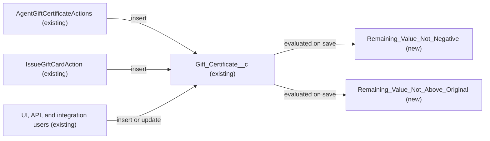

# Implementation spec — Gift certificate remaining value bounds

> Block any save of a `Gift_Certificate__c` record whose `Remaining_Value__c` is negative or greater than its `Original_Value__c`.

_Based on the requirement, the evidence reported by AskCoworker, and read-only org queries where noted. Assumptions and missing evidence are identified below. Specification only — nothing is implemented or deployed._

---

## 1. The requirement

The remaining value of a gift certificate must never be below zero or above the certificate's original value, on create and on every update, from every caller (UI, API, Apex, integrations). No user questions were needed. The request contained no deploy or data-change instruction.

| # | Responsibility | Trigger | Where it lives |
| --- | --- | --- | --- |
| 1 | Reject a save where `Remaining_Value__c` is below zero | Insert or update of `Gift_Certificate__c` | `Gift_Certificate__c.Remaining_Value_Not_Negative` (new validation rule) |
| 2 | Reject a save where `Remaining_Value__c` is greater than `Original_Value__c` | Insert or update of `Gift_Certificate__c` (including edits that lower `Original_Value__c`) | `Gift_Certificate__c.Remaining_Value_Not_Above_Original` (new validation rule) |

## 2. Grounding — reuse before building

Target org: `TestWriteSpecDE` (Developer Edition, org ID `00Dak00001COqNeEAL`). API version: `67.0`.

- **`Gift_Certificate__c`** (CustomObject) — unmanaged (no namespace), `DurableId` `01Iak00000Dx4JX`, no custom child objects. _verified by org query_
- **`Gift_Certificate__c.Remaining_Value__c`** (CustomField, Currency 18,2, nillable, not a formula or roll-up) — description "The remaining monetary value available for redemption." This is the bounded field. _verified by org query_
- **`Gift_Certificate__c.Original_Value__c`** (CustomField, Currency 18,2, nillable) — description "The original monetary value of the gift certificate at time of issue." This is the upper bound. _verified by org query_
- **`Gift_Certificate__c.Value__c`** (CustomField, Currency 18,0) — description "The monetary value of the gift certificate." Not used as the bound; see Section 8. _verified by org query_
- **Existing automation on `Gift_Certificate__c`:** 0 validation rules (Tooling `ValidationRule` by `EntityDefinitionId`), 0 Apex triggers, 0 flows triggered on the object (`FlowDefinitionView`). _verified by org query_
- **`AgentGiftCertificateActions`** (ApexClass, `with sharing`) — inserts `Gift_Certificate__c` with `Value__c`, `Original_Value__c`, and `Remaining_Value__c` all set to `giftValue`; rejects only a null `giftValue`, so a negative value reaches DML today. The insert is inside `try/catch` that returns `success = false`. _verified by org query (Apex body)_
- **`IssueGiftCardAction`** (ApexClass, `with sharing`) — same insert pattern; rejects `giftValue <= 0` before DML; insert inside `try/catch`. _verified by org query (Apex body)_
- **Readers and writers of the two fields and the object** (`MetadataComponentDependency` plus a search of all unmanaged Apex bodies): `AgentGiftCertificateActions`, `IssueGiftCardAction`, `RenderGiftCardAction`, `RenderGiftCardActionTest`, and FlexiPage `Storefront_Record_Page`. Only the first two write the value fields. Reports, list views, and external integrations cannot be read, so this list is partial for those categories. _verified by org query_
- **Edit access on `Gift_Certificate__c.Remaining_Value__c`:** `Agentforce_Reference_App`, `Agentforce_Action_Access`, `Pronto_Deep_Dive_Workshop`, `sfdc_accelerate_dms`; Read only: `sfdc_a360_sfcrm_data_extract`, `sfdc_slack`. _verified by org query_
- **Data shape:** 1 record, `Original_Value__c` 50, `Remaining_Value__c` 50, `Value__c` 50 — it passes both new rules. _verified by org query_
- **Existing tests:** `IssueGiftCardActionTest` (giftValue 25, 10, 0) and `RenderGiftCardActionTest` (giftValue 15); no test class for `AgentGiftCertificateActions`. _verified by org query_

Candidates examined and rejected: `Gift_Certificate__c.Value__c` as the upper bound — the requirement says "original value" and `Original_Value__c` is described as the value at time of issue; other "Balance" / "Remaining" fields in the org belong to Data 360 data model objects (`TableEnumOrId` `9sd…`) and do not represent gift certificates. _verified by org query_

Evidence sources: `sf org display`; `sf sobject list --sobject custom`; `sf sobject describe Gift_Certificate__c`; Tooling queries on `EntityDefinition`, `CustomField`, `ValidationRule`, `ApexTrigger`, `MetadataComponentDependency`, `ApexClass` bodies; standard queries on `FlowDefinitionView`, `FieldPermissions`, `DataStream`, and `Gift_Certificate__c` aggregates; AskCoworker D1, D2, I, R, T (returned no citedReferences).

## 3. Architecture

Why the pieces are drawn this way:

1. Both Apex classes insert `Gift_Certificate__c` and are the only Apex writers of the value fields. _verified by org query_
2. UI, API, and integration callers with Edit access (four permission sets) can update the fields directly. _verified by org query_ Which external systems actually write them is not specified.
3. Validation rules are the platform's standard mechanism for rejecting invalid field values; they run on every insert and update regardless of the caller's FLS or sharing, including Apex DML. _assumption (documented platform behavior)_ No flow or Apex is needed. There is no other automation on the object that runs before or after them. _verified by org query_
4. Two rules instead of one give each violation its own error message on `Remaining_Value__c`. _assumption_

## 4. Metadata changes

**Data Integrity**

- **Create `Gift_Certificate__c.Remaining_Value_Not_Negative`** — ValidationRule, active. Error condition formula: `AND(NOT(ISBLANK(Remaining_Value__c)), Remaining_Value__c < 0)`. Error message: "Remaining Value cannot be negative." Error location: field `Remaining_Value__c`. Blank `Remaining_Value__c` passes; 0 passes.
- **Create `Gift_Certificate__c.Remaining_Value_Not_Above_Original`** — ValidationRule, active. Error condition formula: `AND(NOT(ISBLANK(Remaining_Value__c)), NOT(ISBLANK(Original_Value__c)), Remaining_Value__c > Original_Value__c)`. Error message: "Remaining Value cannot exceed the Original Value." Error location: field `Remaining_Value__c`. Equal values pass; if either field is blank the rule does not fire. Fires on any update that makes the condition true, including lowering `Original_Value__c` below the current `Remaining_Value__c`.

## 5. Data 360 (Data Cloud) data involved

Not applicable — this change does not use Data 360. The org has 0 data streams. _verified by org query_

## 6. Security considerations

- Validation rules evaluate for every caller, independent of sharing and FLS; they grant and expose nothing. _assumption (documented platform behavior)_
- AskCoworker said the `with sharing` Apex classes enforce FLS on their inserts. That is incorrect: `with sharing` enforces record sharing only; Apex DML runs in system mode for CRUD/FLS unless user mode is used. This does not change the design, because the rules fire for Apex DML either way. _assumption (documented platform behavior)_
- No permission set or profile changes. Validation rules have no access settings. The error messages contain no record data.

## 7. Testing strategy

No test component is in the inventory: validation rules need no Apex coverage. _assumption (documented platform behavior)_ All cases below are recommended verification (manual in a sandbox, or a future Apex test; see Section 8).

- **Rule 1, update:** set `Remaining_Value__c` to -1 on a record with `Original_Value__c` 50 — save blocked with "Remaining Value cannot be negative." on the field.
- **Rule 1, insert through Apex:** invoke `AgentGiftCertificateActions` with `giftValue` = -5 — returns `success = false` with the rule message (the class catches the DML exception). This also verifies the platform assumption that validation rules fire for Apex DML.
- **Rule 2, update:** set `Remaining_Value__c` to 50.01 with `Original_Value__c` 50 — blocked with "Remaining Value cannot exceed the Original Value."
- **Rule 2, bound lowered:** set `Original_Value__c` to 30 while `Remaining_Value__c` is 50 — blocked.
- **Boundaries that pass:** `Remaining_Value__c` = 0; `Remaining_Value__c` = `Original_Value__c`; `Remaining_Value__c` blank; `Original_Value__c` blank.
- **Unrelated edit:** edit `Notes__c` on the existing valid record — saves.
- **Bulk:** insert 200 valid records — all succeed; a Data Loader update with some invalid rows — only those rows fail with `FIELD_CUSTOM_VALIDATION_EXCEPTION`.
- **Regression:** run `IssueGiftCardActionTest` and `RenderGiftCardActionTest` — they use only positive values (and `IssueGiftCardAction` rejects 0 before DML), so they should pass unchanged.
- **Delete and undelete:** validation rules are not evaluated on delete; not a concern for this requirement.

## 8. Open decisions

### Open

1. **Integration writers (non-blocking).** `sfdc_accelerate_dms` and three other permission sets have Edit on `Remaining_Value__c`; external redemption callers, if any, cannot be identified with read-only queries. After deployment they receive `FIELD_CUSTOM_VALIDATION_EXCEPTION` on out-of-bounds writes, which is the intended behavior. Recommended: tell the owners of those integrations before deploying.
2. **Blank values (non-blocking).** Both fields are nillable and both rules skip blank values; a record with blank `Original_Value__c` has no upper bound. The only existing record has both values set. Proposal (not in inventory): make both fields required or add a rule that requires them, if the business wants that.
3. **Apex test for the rules (non-blocking).** Proposal (not in inventory): an Apex test class asserting both violations and `AgentGiftCertificateActions` returning `success = false` for a negative `giftValue`; that class currently has no test.
4. **Reports and list views (non-blocking).** They cannot be read; they are unaffected by validation rules, so no check is needed.

### Resolved

- **Upper bound is `Original_Value__c`, not `Value__c`** — *assumption*, answered by the requirement wording and the field descriptions; all three fields are set equal at insert by both Apex classes. _verified by org query_
- **Validation rules over flow or trigger** — *assumption*: standard declarative mechanism, applies to all callers, and rejection (not silent clamping) matches "can't".
- **Two rules instead of one combined rule** — *assumption*: separate, specific error messages.
- **Existing data** — the 1 existing record passes both rules; no clean-up data step. _verified by org query_
- **Deployment sequence** — the two rules are independent; deploy together.
- **AskCoworker corrections:** D2 said validation rules are not queryable; the Tooling `ValidationRule` query succeeded and returned 0 rules. I and T referred to a `Gift_Certificate_Status_Sync` before-save flow; no flow exists on the object, so those items were dropped. R's claim that `with sharing` enforces FLS was corrected in Section 6. Dropped AskCoworker proposals: a combined rule, a clamping flow, an Apex trigger, and a pre-check in `AgentGiftCertificateActions` (redundant once the rule exists).
- **Load-bearing platform assumption:** validation rules fire on Apex DML inserts and updates from the two action classes; verified by the Rule 1 Apex case in Section 7.

## 9. Change set

| # | Action | Type | API name | Module | Why |
| --- | --- | --- | --- | --- | --- |
| 1 | Create | ValidationRule | `Gift_Certificate__c.Remaining_Value_Not_Negative` | force-app/main/default/objects/Gift_Certificate__c/validationRules | Remaining value must not go negative |
| 2 | Create | ValidationRule | `Gift_Certificate__c.Remaining_Value_Not_Above_Original` | force-app/main/default/objects/Gift_Certificate__c/validationRules | Remaining value must not exceed the original value |

Two validation rules on `Gift_Certificate__c` enforce `0 <= Remaining_Value__c <= Original_Value__c` for every caller.

Total: 2 · Create: 2 · Update: 0 · Delete: 0
