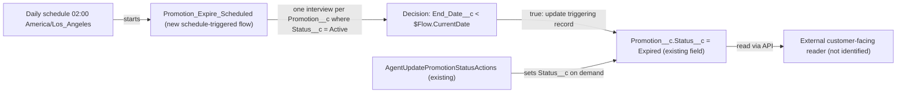

# Implementation spec — Promotion auto-expiry

> Set `Promotion__c.Status__c` to `Expired` automatically once a promotion's `End_Date__c` has passed, so that readers filtering on status stop showing it to customers.

_Based on the requirement, the evidence reported by AskCoworker, and read-only org queries where noted. Assumptions and missing evidence are identified below. Specification only — nothing is implemented or deployed._

---

## 1. The requirement

Every `Active` promotion whose `End_Date__c` is before today is changed to `Expired` by a daily schedule-triggered flow; the customer-facing reader of promotions is outside this org and must honor `Status__c` for customers to stop seeing it. The request contained no deploy or data-change instruction.

| # | Responsibility | Trigger | Where it lives |
| --- | --- | --- | --- |
| 1 | Change `Promotion__c.Status__c` from `Active` to `Expired` when `End_Date__c` < today | Daily schedule, 02:00 org time (America/Los_Angeles) | `Promotion_Expire_Scheduled` (new schedule-triggered flow) |
| 2 | Customers stop seeing expired promotions | Customer-facing read of `Promotion__c` | Not specified — the reader is outside the org and unidentified (Section 8, Open 1) |

## 2. Grounding — reuse before building

Target org: `TestWriteSpecDE` (Developer Edition, `00Dak00001COqNeEAL`, time zone America/Los_Angeles). API version: `67.0`.

- **`Promotion__c`** (CustomObject, `DurableId` `01Iak00000Dx4JZ`) — the promotion object; 1 record, `Status__c` = `Active`, `End_Date__c` = 2027-04-12; 0 records are currently `Active` with `End_Date__c` < TODAY. _verified by org query_
- **`Promotion__c.Status__c`** (Picklist, unrestricted, not required, no default; description "Tracks the current state of the promotion.") — values `Active`, `Expired`, `Canceled`. `Expired` already exists, so no picklist change is needed. _verified by org query_
- **`Promotion__c.End_Date__c`** (Date; description "The date when the promotion ends.") — the expiry condition. It is a Date with no time part. _verified by org query_
- **Existing automation on `Promotion__c`** — 0 Apex triggers, 0 flows (`FlowDefinitionView` by trigger object), 0 validation rules; no flow named like `%Promotion%`; no custom Apex class implements `Schedulable` or `Database.Batchable` or contains the string `Expired`. The only active scheduled flow is `Orch` (managed, `runtime_industries_recurrence` namespace, no trigger object). Scheduled jobs (`CronTrigger`) are 5 platform jobs, none for promotions. _verified by org query_
- **Readers and writers of `Promotion__c`** (Apex bodies and `MetadataComponentDependency`, complete for Apex and for metadata that the dependency API reports): `AgentCreatePromotionActions` (creates records, sets `Status__c`), `AgentUpdatePromotionStatusActions` (with sharing; sets `Status__c` on demand; used by the `Update_Promotion_Status` agent actions), `MerchantRiskScoreAction` (reads `Start_Date__c` only). None displays promotions to customers. _verified by org query_
- **Customer-facing display** — no Salesforce component queries `Promotion__c` for customers; the reader is likely an external app using the API. _reported by AskCoworker_; the Apex part of this is _verified by org query_ (body search above). Experience Cloud sites (`Network`) exist but all three are `UnderConstruction`. _verified by org query_
- **Access to `Promotion__c`** — object Read: System Administrator (and Edit), `sfdc_accelerate_dms` (and Edit), `Pronto_Deep_Dive_Workshop`, `sfdc_slack`, `sfdc_a360_sfcrm_data_extract`, profile Analytics Cloud Integration User. Field `Status__c`: Edit only on `sfdc_accelerate_dms`; Read on the other three permission sets. _verified by org query_
- **Project source** — `force-app` contains no `Promotion__c` metadata. _verified by project file_

Candidates examined and rejected: standard `Promotion` object — has no end date or status picklist (_reported by AskCoworker_); `Campaign.EndDate` / `Campaign.Status` — a different concept, not used by promotions (_reported by AskCoworker_); `Gift_Certificate__c.Expiration_Date__c` — same expiry pattern on another object, but no existing automation expires gift certificates that could be reused (_verified by org query_: no scheduled Apex or flow); `AgentUpdatePromotionStatusActions` — an on-demand invocable action, not a schedule, and its `accountId` ownership check is built for a single agent request.

Evidence sources: `sf org display`; `sf sobject list`; `sf sobject describe Promotion__c`; Tooling `EntityDefinition`, `CustomField` (+ `Metadata` for `Status__c`), `ApexTrigger`, `ValidationRule`, `ApexClass` bodies, `MetadataComponentDependency`, `GenAiFunctionDefinition`; standard `FlowDefinitionView`, `CronTrigger`, `Organization`, `ObjectPermissions`, `FieldPermissions`, `Network`, `DataStream`, aggregate record counts. AskCoworker returned no citedReferences.

## 3. Architecture

Why the pieces are drawn this way:

1. A schedule-triggered flow is the standard declarative mechanism for a change caused by the passage of time. No formula can write a picklist, and no record-triggered event occurs when a date passes. _assumption (documented platform behavior)_
2. The start object is `Promotion__c` with the start filter `Status__c` Equals `Active`, so the platform runs one interview per record in batches, and `Canceled`, blank, and already `Expired` records are never touched. _assumption (documented platform behavior)_
3. The date comparison sits in a Decision element (`End_Date__c` Less Than `$Flow.CurrentDate`, with `End_Date__c` Is Null = false). `$Flow.CurrentDate` is the date in the org time zone. Records with a blank `End_Date__c` stay unchanged. _assumption (documented platform behavior)_
4. The update is "Update Triggering Record", `Status__c` = `Expired`. There is no record-triggered automation on `Promotion__c` that this save would start (_verified by org query_).
5. `AgentUpdatePromotionStatusActions` is drawn because it is the other writer of `Status__c`; it is unchanged.
6. The external reader is drawn without a change because it is not in this org; whether it filters on `Status__c` is Open 1.

## 4. Metadata changes

**Automation**

- **Create `Promotion_Expire_Scheduled`** — Flow (Schedule-Triggered Flow, `AutoLaunchedFlow` process type), label "Promotion - Expire After End Date", status Active. Start: object `Promotion__c`; frequency Daily; start time 02:00 (org time zone America/Los_Angeles); start condition `Status__c` Equals `Active`. Decision `Is_Past_End_Date`: `{!$Record.End_Date__c}` Is Null = false AND `{!$Record.End_Date__c}` Less Than `{!$Flow.CurrentDate}`. True outcome: Update Records "Use the triggering record", set `Status__c` = `Expired`. Default outcome: end. Fault path on the update: none beyond the platform's flow error email (non-blocking; Section 8). Runs in system context without sharing, as the Automated Process user.

## 5. Data 360 (Data Cloud) data involved

Not applicable — this change does not use Data 360. `SELECT COUNT() FROM DataStream` returned 0 (_verified by org query_).

## 6. Security considerations

- **Execution context.** A schedule-triggered flow runs as the Automated Process user in system context without sharing, so it reads and updates every `Active` `Promotion__c` regardless of owner, sharing, CRUD, or FLS. _assumption (documented platform behavior)_ No permission set or profile needs a new grant, and no permission set is created.
- **No new fields.** Nothing new is exposed. `Status__c` keeps its current access: Edit on `sfdc_accelerate_dms` and System Administrator; Read on `Pronto_Deep_Dive_Workshop`, `sfdc_slack`, `sfdc_a360_sfcrm_data_extract`. _verified by org query_
- **Data exposure.** The flow only narrows exposure (records move out of `Active`). Whether customers actually stop seeing a promotion depends on the external reader filtering on `Status__c` (Open 1).
- **Shared writer.** `AgentUpdatePromotionStatusActions` (with sharing) can set a past-dated promotion back to `Active`; the next run changes it to `Expired` again (Section 8, Resolved).

## 7. Testing strategy

Flow Tests (`FlowTest`) do not support schedule-triggered flows, and Apex cannot start a schedule-triggered flow, so there is no automated test row in the inventory. _assumption (documented platform behavior)_ Use these recommended verification steps in a sandbox, with Flow Builder Debug (which can run the flow against a chosen record) and then one real scheduled run:

1. **Past end date** — `Active`, `End_Date__c` = yesterday → `Expired`.
2. **Boundary** — `Active`, `End_Date__c` = today → stays `Active` (expiry is the day after the end date).
3. **Future** — `Active`, `End_Date__c` = tomorrow → stays `Active`.
4. **Blank end date** — `Active`, `End_Date__c` blank → stays `Active`.
5. **Other statuses** — `Canceled` or `Expired` with a past `End_Date__c` → unchanged; blank `Status__c` with a past `End_Date__c` → unchanged.
6. **Bulk** — 250 `Active` records with past `End_Date__c` → all `Expired` after one scheduled run, with no errors in the flow error email or Paused and Failed Flow Interviews.
7. **Transitions on update** — change `End_Date__c` of an `Active` record to the past → `Expired` on the next run; set an `Expired`, past-dated record back to `Active` (for example through `Update_Promotion_Status`) → `Expired` again on the next run; move `End_Date__c` to the future before the run → stays `Active`.
8. **Sharing (load-bearing assumption)** — a record owned by a user whose records the Automated Process user would not see under sharing → still `Expired`.
9. **Time zone (load-bearing assumption)** — confirm that a 02:00 America/Los_Angeles run treats `End_Date__c` = the previous calendar day as passed.
10. **End to end** — confirm the external customer-facing reader no longer shows the promotion after `Status__c` = `Expired` (depends on Open 1).

No tests have been run.

## 8. Open decisions

### Open

1. **External customer-facing reader (blocking for delivery of responsibility 2).** No Salesforce component displays `Promotion__c` to customers (_verified by org query_ for Apex; the external reader is _reported by AskCoworker_). Confirm which system shows promotions to customers and that it hides records whose `Status__c` is not `Active`. If it filters only on dates or not at all, it needs its own change outside this spec. Responsibility 1 does not depend on this.
2. **Run time and lag (non-blocking).** The flow runs once a day at 02:00 America/Los_Angeles, so a promotion becomes `Expired` about 2 hours after its end date's day ends. Default: 02:00. A shorter lag would need a more frequent job, which the requirement does not ask for.
3. **Failure notification (non-blocking).** Update failures go to the platform's flow error email recipients (Process Automation Settings). Default: no custom fault path. Confirm who receives flow error emails.
4. **Deployment sequence (non-blocking).** Deploy and activate `Promotion_Expire_Scheduled` only. No backfill: 0 records currently match (_verified by org query_); the first run expires any that match at that time. Rollback: deactivate the flow; to reverse a run, set affected records back to `Active` from a report of `Promotion__c` where `Status__c` = `Expired` and `LastModifiedById` = Automated Process user.
5. **Existing invalid default (non-blocking, not in scope).** `AgentCreatePromotionActions` defaults `Status__c` to `Draft`, which is not a picklist value (_verified by org query_: class body and picklist values; the picklist is unrestricted, so the value saves). Such records are not `Active` and will never auto-expire. Proposal: fix separately.

### Resolved

- **"Passes" means `End_Date__c` < today (assumption).** `End_Date__c` is a Date described as "the date when the promotion ends", so the promotion is live through that day and expires the next day.
- **Only `Active` records change (assumption, load-bearing).** The requirement says the promotion should "flip to Expired"; `Canceled` is already a terminal state, and blank or invalid values are not live promotions. Changing them would overwrite a status someone set on purpose.
- **Manual re-activation of a past-dated promotion is overridden (assumption).** The requirement's wording ("when end date passes, it should automatically flip to Expired") answers this: a promotion is extended by moving `End_Date__c`, not by setting `Active`. No guard field is added.
- **Schedule-triggered flow instead of Apex (assumption).** The standard declarative mechanism fits; volume is 1 record (_verified by org query_).
- **Corrected AskCoworker proposal:** its flow used Get Records + Loop + Update on a collection. Replaced with a start object and filter, which the platform batches per record and which avoids the single-transaction 50,000-row query limit. Its claim that a record-triggered flow scheduled path cannot run relative to `End_Date__c` is wrong (scheduled paths can use a record date field); that alternative was still rejected because existing records get a scheduled path only after a later save, and every edit of `End_Date__c` or `Status__c` needs correct re-evaluation.
- **Dropped AskCoworker proposals:** an invocable Apex class `PromotionExpireAction` plus test class to make the logic unit-testable (adds code for testability only, and Rule 4 prefers the flow); a `Suppress_Auto_Expire__c` guard field (not requested).

## 9. Change set

| # | Action | Type | API name | Module | Why |
| --- | --- | --- | --- | --- | --- |
| 1 | Create | Flow | `Promotion_Expire_Scheduled` | force-app/main/default/flows | Daily schedule-triggered flow that sets `Status__c` = `Expired` on `Active` promotions whose `End_Date__c` is before today |

One new daily schedule-triggered flow on `Promotion__c` changes past-dated `Active` promotions to `Expired`; no other metadata changes.

Total: 1 · Create: 1 · Update: 0 · Delete: 0
