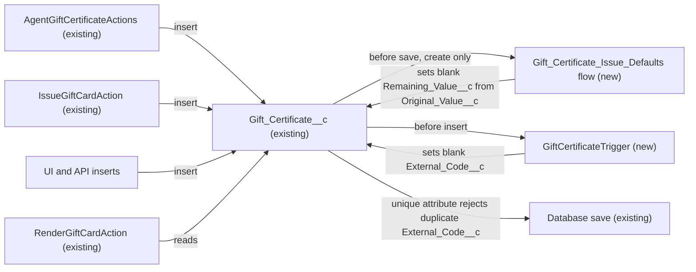

# Implementation spec — Gift certificate issue defaults

> When a `Gift_Certificate__c` record is created, copy `Original_Value__c` into a blank `Remaining_Value__c` and fill a blank `External_Code__c` with a random unique code.

_Based on the requirement, the evidence reported by AskCoworker, and read-only org queries where noted. Assumptions and missing evidence are identified below. Specification only — nothing is implemented or deployed._

---

## 1. The requirement

On insert of a new gift certificate, default `Gift_Certificate__c.Remaining_Value__c` to `Gift_Certificate__c.Original_Value__c` and generate a unique `Gift_Certificate__c.External_Code__c`. No question was asked of the user; every choice below is an implementation decision recorded in Section 8. The request contained no instruction to deploy or change data.

| # | Responsibility | Trigger | Where it lives |
| --- | --- | --- | --- |
| 1 | Default the remaining value to the original value | Insert of `Gift_Certificate__c` with `Remaining_Value__c` blank and `Original_Value__c` not blank | `Gift_Certificate_Issue_Defaults` (new before-save record-triggered flow) |
| 2 | Generate a unique code | Insert of `Gift_Certificate__c` with `External_Code__c` blank | `GiftCertificateTrigger` (new Apex trigger); uniqueness enforced by the existing unique attribute of `Gift_Certificate__c.External_Code__c` |
| 3 | Prove both behaviors | Deployment test run | `GiftCertificateTriggerTest` (new Apex test class) |

## 2. Grounding — reuse before building

Target org: `TestWriteSpecDE` (Developer Edition, org ID `00Dak00001COqNeEAL`, not a sandbox). API version: `67.0` (`sfdx-project.json`). The local `force-app/main/default/classes` and `force-app/main/default/triggers` folders are empty, so the org is the only source of truth (verified by project file).

- **`Gift_Certificate__c`** (CustomObject, `DurableId` `01Iak00000Dx4JX`) — the only object in scope. No other custom object represents a gift certificate or voucher. _verified by org query_
- **`Gift_Certificate__c.Original_Value__c`** (Currency(18,2), optional) — description "The original monetary value of the gift certificate at time of issue." This is the source value. _verified by org query_
- **`Gift_Certificate__c.Remaining_Value__c`** (Currency(18,2), optional, writable) — description "The remaining monetary value available for redemption." This is the target. _verified by org query_
- **`Gift_Certificate__c.External_Code__c`** (Text(40), unique, external ID, optional) — description "Human-readable code printed/encoded on the gift certificate (e.g., for barcode or QR scan)." This is the code field; the unique attribute already rejects duplicates. AskCoworker reports it as case-insensitive unique. _verified by org query_ (case sensitivity: _reported by AskCoworker_)
- **`Gift_Certificate__c.Value__c`** (Currency(18,0)) — "The monetary value of the gift certificate." A second value field. The requirement says "original value", which matches `Original_Value__c` by name and description, so `Value__c` is not used. _verified by org query_
- **`Gift_Certificate__c.Name`** (Auto Number) — the record number; sequential, so not used as the code. _verified by org query_
- **`Gift_Certificate__c.Status__c`** (Picklist: `Draft`, `Active`, `Partially Redeemed`, `Fully Redeemed`, `Expired`, `Cancelled`). _verified by org query_
- **`AgentGiftCertificateActions`** (ApexClass, `with sharing`) — inserts `Gift_Certificate__c` with `Value__c`, `Original_Value__c`, and `Remaining_Value__c` all set to `giftValue`; does not set `External_Code__c`; wraps the insert in `try`/`catch` that returns `success = false`. _verified by org query (Apex body)_
- **`IssueGiftCardAction`** (ApexClass, `with sharing`) — same field assignments and the same `try`/`catch` pattern; does not set `External_Code__c`. _verified by org query (Apex body)_
- **`RenderGiftCardAction`** (ApexClass) — reads `Gift_Certificate__c`; no insert. _verified by org query (Apex body)_
- **`IssueGiftCardActionTest`**, **`RenderGiftCardActionTest`** (ApexClass) — existing tests whose inserts will also fire the new automation. _verified by org query_
- **Automation on `Gift_Certificate__c`** — no Apex trigger (no unmanaged Apex trigger exists in the org at all), no record-triggered flow (`FlowDefinitionView`), and no validation rule. _verified by org query_
- **Unmanaged Apex that references `Gift_Certificate__c` or `External_Code`** — only the four classes above; none references `External_Code__c`. `MetadataComponentDependency` returns no reference to `External_Code__c`. _verified by org query_
- **Data shape** — 1 record exists (`Status__c = Active`, `Source_Channel__c = Agentforce`); it has `Original_Value__c` and `Remaining_Value__c` set and `External_Code__c` blank. _verified by org query_
- **Code fields on other objects** — `Account.Merchant_Code__c`, `Lead.Referral_Code__c`, `Promotion__c.Promotion_Code__c`; none represents a gift certificate code. _verified by org query_

Candidates examined and rejected: `Name` Auto Number as the code — sequential and guessable, unsuitable for a redeemable code; converting `External_Code__c` to Auto Number — same reason, and it would stop callers from supplying a code; changing `AgentGiftCertificateActions` and `IssueGiftCardAction` — covers only those two callers, not UI or API inserts, and they already set `Remaining_Value__c`; a field default value — a default value formula cannot reference another field on the same record (assumption (documented platform behavior)).

Evidence sources: `sf org display`; `sf sobject list --sobject custom`; `sf sobject describe` of `Gift_Certificate__c`; Tooling `EntityDefinition`, `CustomField` (by object and by name pattern), `ApexTrigger`, `ValidationRule`, `ApexClass` bodies, `MetadataComponentDependency`; `FlowDefinitionView`; aggregate SOQL on `Gift_Certificate__c`; `FieldPermissions`; `DataStream` count; `Organization`. AskCoworker returned no citedReferences; its statements are recorded as reported by AskCoworker.

## 3. Architecture

Why the pieces are drawn this way:

1. The three insert paths are the two Apex classes (verified by org query) and direct UI or API inserts, which bypass those classes. The new automation sits on the object so that every path gets the defaults.
2. Order of execution: before-save record-triggered flows run before `before` Apex triggers, then the record is saved (assumption (documented platform behavior)). The two components write different fields and read none of each other's output, so their order does not change the result. AskCoworker stated the opposite order; see Section 8.
3. `Remaining_Value__c` uses a before-save flow because copying one field to another on the same record is a field update that the platform's declarative tools handle without code, DML, or a test class.
4. `External_Code__c` uses Apex because the code must be unpredictable, and Flow has no cryptographic random function; Apex `Crypto.generateAESKey(128)` with `EncodingUtil.convertToHex` gives 128 random bits as 32 hex characters, which fits `Text(40)` (assumption (documented platform behavior)). A sequential Auto Number would let anyone who holds one certificate guess others.
5. Uniqueness is guaranteed by the existing unique attribute on `External_Code__c` (verified by org query); the random source makes a collision negligible, and a collision fails the save instead of creating a duplicate.
6. `RenderGiftCardAction` is shown as a reader only; it does not currently select `External_Code__c` (verified by org query).

## 4. Metadata changes

**Automation**

- **Create `Gift_Certificate_Issue_Defaults`** — Flow (record-triggered, before save, object `Gift_Certificate__c`, trigger "A record is created"). Entry conditions (AND): `Remaining_Value__c` Is Null = `true`; `Original_Value__c` Is Null = `false`. One Assignment element: `{!$Record.Remaining_Value__c}` = `{!$Record.Original_Value__c}`. No Get Records and no DML. A caller-supplied `Remaining_Value__c` (including 0) is never overwritten. Status Active on deploy.
- **Create `GiftCertificateTrigger`** — ApexTrigger `on Gift_Certificate__c (before insert)`. For each record in `Trigger.new` where `String.isBlank(External_Code__c)`, set `External_Code__c = EncodingUtil.convertToHex(Crypto.generateAESKey(128)).toUpperCase()` (32 characters, `[0-9A-F]`). One loop, no SOQL, no DML. A caller-supplied code is kept. Apex is used because Flow cannot generate cryptographically random values (Section 3).

**Tests**

- **Create `GiftCertificateTriggerTest`** — ApexClass (`@isTest`). Covers `GiftCertificateTrigger` and, through Apex DML, `Gift_Certificate_Issue_Defaults`. Methods are listed in Section 7.

## 5. Data 360 (Data Cloud) data involved

Not applicable — this change does not use Data 360. The org has no data streams (`SELECT COUNT() FROM DataStream` = 0, verified by org query). The permission set `sfdc_a360_sfcrm_data_extract` has Read access to the three fields (verified by org query); whether any Data 360 extraction reads `Gift_Certificate__c` is not verified.

## 6. Security considerations

- **Execution context:** Apex triggers and before-save record-triggered flows run in system context; they set the two fields regardless of the running user's field-level security (assumption (documented platform behavior)). No user needs new access for the defaults to work.
- **Existing field access (verified by org query, permission sets only; profiles not listed):**
  - Read and Edit on `Original_Value__c`, `Remaining_Value__c`, and `External_Code__c`: `Agentforce_Reference_App`, `Pronto_Deep_Dive_Workshop`, `Agentforce_Action_Access`, `sfdc_accelerate_dms`.
  - Read only on the same fields: `sfdc_a360_sfcrm_data_extract`, `sfdc_slack`.
- **Permission set changes:** none. The trigger and flow need no grant, and the requirement does not ask to expose the code to anyone new.
- **Data exposure:** `External_Code__c` becomes a redeemable value on every new certificate. Everyone with Read on the field (the six permission sets above, plus users with View All Data) can see it. Users with Edit can also supply their own code on insert, which the trigger keeps. See Section 8.
- **Existing callers:** `AgentGiftCertificateActions` and `IssueGiftCardAction` run `with sharing` (verified by org query); the new automation does not change their sharing.

## 7. Testing strategy

`GiftCertificateTriggerTest` inserts records through Apex DML, which fires both the trigger and the before-save flow, so one Apex test class covers both components. Tests are planned, not run.

| # | Test method | Behavior |
| --- | --- | --- |
| 1 | `codeGeneratedWhenBlank` | Insert with `External_Code__c` blank: code is 32 characters and matches `[0-9A-F]{32}`. |
| 2 | `callerCodeKept` | Insert with `External_Code__c = 'MYCODE'`: value unchanged. |
| 3 | `bulkCodesDistinct` | Insert 200 records in one DML, half with a supplied code: supplied codes unchanged; the rest generated and all 200 values distinct. |
| 4 | `remainingDefaultsToOriginal` | Insert with `Original_Value__c = 50`, `Remaining_Value__c` blank: `Remaining_Value__c = 50`. |
| 5 | `callerRemainingKept` | Insert with `Original_Value__c = 50`, `Remaining_Value__c = 25`: stays 25. Also `Remaining_Value__c = 0`: stays 0. |
| 6 | `blankOriginalLeavesRemainingBlank` | Insert with both values blank: `Remaining_Value__c` stays blank. |
| 7 | `updateDoesNotChangeValues` | Update a record: clear `External_Code__c` and change `Original_Value__c`; neither automation runs, so values stay as updated. |
| 8 | `duplicateCodeRejected` | Insert two records with the same supplied code: the second insert throws `DmlException` (proves the unique attribute the design relies on). |

Recommended verification (not run as part of this specification):

1. Run `IssueGiftCardActionTest` and `RenderGiftCardActionTest` with the new components deployed; they insert `Gift_Certificate__c` and must still pass.
2. Invoke `IssueGiftCardAction` and `AgentGiftCertificateActions` in a sandbox: the new record has a generated `External_Code__c` and `Remaining_Value__c = giftValue` (set by the class, not the flow).
3. Create a record in the UI with only `Original_Value__c`: both defaults are applied.
4. Confirm case-insensitive uniqueness: inserting `abc123` after `ABC123` fails (AskCoworker reports case-insensitive; the describe result does not show case sensitivity).
5. Delete and undelete a record: neither automation fires; values are retained (assumption (documented platform behavior)).

## 8. Open decisions

### Open

1. **Existing record without a code (non-blocking).** The one existing certificate has a blank `External_Code__c` (verified by org query). The requirement covers new certificates only, and the trigger does not run on update. Recommended data step after deployment, if the business wants a code on it: export the record's `Id` and `External_Code__c` first, then set `External_Code__c` by a one-time data fix using the same expression as the trigger; rollback is clearing the field on that `Id`. Its `Remaining_Value__c` is already set.
2. **Deployment sequence (non-blocking).** Deploy `GiftCertificateTrigger` and `GiftCertificateTriggerTest` together (the test is required for Apex coverage); the flow can go in the same deployment. Run the optional data step in item 1 afterwards.
3. **Code visibility and caller-supplied codes (non-blocking).** Six permission sets can read the code and four can edit it (verified by org query). Anyone with Edit can supply a predictable code on insert, which the trigger keeps. Recommended default: keep this behavior, because the requirement only asks for a default; restricting Edit on `External_Code__c` is a separate access decision for the owner.
4. **Changes after insert (non-blocking).** Both components run on insert only, as the requirement says. If `Original_Value__c` is filled or changed later, or `External_Code__c` is cleared later, nothing re-defaults them. Recommended default: leave as is; redemption logic owns `Remaining_Value__c` after issue.
5. **`Value__c` stays separate (non-blocking).** `Value__c` and `Original_Value__c` both hold the issue amount in the two Apex callers (verified by org query). A UI user who fills only `Value__c` gets no `Remaining_Value__c` default. Proposal, not in scope: consolidate the two fields or default `Original_Value__c` from `Value__c`.

### Resolved

- **Trigger event: insert only** — *assumption*: the requirement says "when a new gift certificate is issued", and `Issue_Date__c` is set on creation by both callers. Records created as `Draft` also get the defaults.
- **Default only when blank** — *assumption*: "default" means fill an empty value; the two Apex callers already set `Remaining_Value__c` and must not be overridden.
- **Source field is `Original_Value__c`, not `Value__c`** — *assumption*: matches the requirement's words and the field description.
- **Code format: 32 uppercase hex characters from 128 random bits** — *assumption*: implementation choice; fits `Text(40)` and is not guessable. AskCoworker's D1 proposed a 16-character form; the full 32 characters were kept.
- **Flow plus trigger, not one trigger** — *assumption*: the declarative part stays in Flow per the preference for declarative tools; only code generation needs Apex.
- **Order of execution corrected** — AskCoworker (R) said `before` Apex triggers run before before-save flows. Documented Salesforce order runs before-save flows first (assumption (documented platform behavior)). The design does not depend on the order.
- **AskCoworker R timed out** once and was retried as a narrower runtime-only call; the security half was covered by org queries (`FieldPermissions`, Apex bodies). AskCoworker D2 also timed out once; its narrowed retry covered creators, and validation rules, flows, triggers, and permissions were covered by org queries.
- **Dropped AskCoworker items:** a zero-value open decision citing a "status-sync requirement" that is not part of this request; the claim that validation rules were checked "in a prior session" (replaced by this run's query).

## 9. Change set

| # | Action | Type | API name | Module | Why |
| --- | --- | --- | --- | --- | --- |
| 1 | Create | Flow | `Gift_Certificate_Issue_Defaults` | force-app/main/default/flows | Default blank `Remaining_Value__c` to `Original_Value__c` on insert |
| 2 | Create | ApexTrigger | `GiftCertificateTrigger` | force-app/main/default/triggers | Generate a random unique `External_Code__c` on insert when blank |
| 3 | Create | ApexClass | `GiftCertificateTriggerTest` | force-app/main/default/classes | Test both defaults, bulk, and duplicate rejection; required Apex coverage |

A before-save flow copies the original value into the remaining value, and a before-insert trigger fills the code, with the field's existing unique attribute preventing duplicates.

Total: 3 · Create: 3 · Update: 0 · Delete: 0
