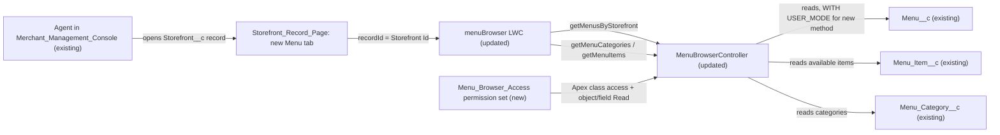

# Implementation spec — Storefront menu browser by category for console agents

> Let human agents in the `Merchant_Management_Console` open a `Storefront__c` record and browse its active menu's available items grouped by `Menu_Category__c`.

_Based on the requirement, the evidence reported by AskCoworker, and read-only org queries where noted. Assumptions and missing evidence are identified below. Specification only — nothing is implemented or deployed._

---

## 1. The requirement

Add a component that lets agents browse a storefront's menu by category; the user decided that "agents" means human agents working in the service console, and that the component is a menu browser grouped by category (not an Agentforce chat component). The requirement contained no instruction to deploy or change data, and none was acted on.

The org already has an unplaced `menuBrowser` LWC and its `MenuBrowserController` Apex class that do category browsing, but they expect a `Menu__c` record Id and have category-selection bugs. This spec reuses and repairs them, places them on the storefront page, and grants access.

| # | Responsibility | Trigger | Where it lives |
| --- | --- | --- | --- |
| 1 | Show the component on a storefront record in the console | Agent opens a `Storefront__c` record | `Storefront_Record_Page` (new "Menu" tab) |
| 2 | Resolve the storefront to its active menus and let the agent pick one when there is more than one | Component load | `menuBrowser` + `MenuBrowserController.getMenusByStorefront` |
| 3 | List the menu's categories with item counts | Menu selected | `MenuBrowserController.getMenuCategories` (existing) + `menuBrowser` |
| 4 | Show the items of the selected category, or all items | Agent clicks a category or "All Categories" | `menuBrowser` (client-side filter over `MenuBrowserController.getMenuItems`) |
| 5 | Give agents access to the controller and the menu data | Permission set assignment | `Menu_Browser_Access` |

## 2. Grounding — reuse before building

Target org: `TestWriteSpecDE` (Developer Edition, not a sandbox, ID `00Dak00001COqNeEAL`). API version: `67.0`. _verified by org query_

- **`menuBrowser`** (LightningComponentBundle, API 58, exposed; targets `lightning__RecordPage`, `lightning__AppPage`, `lightning__HomePage`, `lightningCommunity__Page`, `lightningCommunity__Default`) — a two-panel category list and item grid. It passes `recordId` as a `Menu__c` Id to both controller methods, so on a `Storefront__c` page it would return nothing. `handleCategorySelect` reads `event.detail.categoryId`, but the button only sets `data-category-id`, so category selection never works; the template calls `handleAllCategories`, which is not defined; it also has keyword-based "Vegetarian" and "Spicy" filters. `MetadataComponentDependency` shows no FlexiPage references it. AskCoworker reported "no LWC exists", which this query contradicts. _verified by org query_
- **`MenuBrowserController`** (ApexClass, `with sharing`, API 58) — `getMenuCategories(String menuId)` derives categories from `Menu_Item__c` rows with `Available__c = true` and returns `CategoryWrapper` (id, Name, description, itemCount) ordered by `Display_Order__c`, `Name`; `getMenuItems(String menuId)` returns available items ordered by `Menu_Category__c`, `Name`. Queries run without `WITH USER_MODE`. No test class exists and coverage is 0 of 32 lines. Only the System Administrator profile has Apex class access to it. _verified by org query_
- **`Storefront__c`**, **`Menu__c`**, **`Menu_Category__c`**, **`Menu_Item__c`** (CustomObject) — `Menu__c.Storefront__c` is master-detail to `Storefront__c`; `Menu_Item__c.Menu__c` and `Menu_Item__c.Menu_Category__c` are lookups; `Menu_Category__c` has no field that links it to `Menu__c` or `Storefront__c`. `Menu_Item__c` has no field that links it directly to `Storefront__c`. _verified by org query_
- **Data shape** — 23 `Menu__c` records, all `Active__c = true`; at most 2 menus per storefront; 206 `Menu_Item__c` records, all `Available__c = true` and all with `Menu_Category__c`, but 73 have no `Menu__c`; 67 `Menu_Category__c` records, none with `Display_Order__c`. _verified by org query_
- **`Storefront_Record_Page`** (FlexiPage, `RecordPage` for `Storefront__c`, template `flexipage:recordHomeTemplateDesktop`, unmanaged) — main tabset with "Details" and "Related" tabs; the Related tab already has a "Menus" dynamic related list. _verified by org query_
- **`Merchant_Management_Console`** (CustomApplication, console navigation, unmanaged) — includes the `Storefront__c` tab; it has no record-page override for `Storefront__c` in its profile overrides. _verified by org query_
- **Automation** — no Apex triggers and no record-triggered flows on the four objects. Validation rules were not checked; the component is read-only, so they do not affect it. _verified by org query_
- **`Agentforce_Reference_App`** (PermissionSet, unmanaged, 1 assignee who is the System Administrator) — has Read on the four objects and field Read on the menu fields. The only active standard human user in the org is the System Administrator. _verified by org query_
- **Agentforce actions** `Get_Active_Menus` and `Get_Menu_Items` (`AgentGetActiveMenusActions`, `AgentGetMenuItemsActions`) — serve the Merchant Support Agent; they require an `accountId` and return flat lists, so they are not a fit for an LWC controller. _verified by org query_

Evidence sources: `sf org display`; `sobject describe` on the four objects; Tooling queries on `LightningComponentBundle`, `LightningComponentResource`, `ApexClass` (bodies), `ApexCodeCoverageAggregate`, `ApexTrigger`, `MetadataComponentDependency`, `FlexiPage` (metadata), `CustomApplication` (metadata), `GenAiFunctionDefinition`, `GenAiPlannerDefinition`, `GenAiPluginDefinition`; standard queries on `FlowDefinitionView`, `BotDefinition`, `ObjectPermissions`, `FieldPermissions`, `SetupEntityAccess`, `PermissionSet`, `PermissionSetAssignment`, `User`, `Organization`, `DataStream`, and aggregates on the menu objects. AskCoworker returned no citedReferences.

## 3. Architecture

Why the pieces are drawn this way:

1. The agent reaches the storefront through the console app, which includes the `Storefront__c` tab. _verified by org query_
2. The page passes the storefront Id as `recordId` to the LWC. The LWC calls the new `getMenusByStorefront` to find active menus, because `Menu_Category__c` has no link to a menu or storefront and categories can only be reached through `Menu_Item__c`. _verified by org query_
3. Apex is used because an LWC needs an `@AuraEnabled` server method (or UI API) to read related records; a declarative alternative (a related list) cannot group items by category, and the existing controller already does the grouping. Extending it is smaller than any new component. _assumption (documented platform behavior)_
4. Category and "All Categories" filtering happens in the browser over the items already loaded, so no extra server call is made per click. _assumption_
5. The new permission set grants the controller and the data the component reads. _assumption_

## 4. Metadata changes

**Backend**

- **Update `MenuBrowserController`** — Add `@AuraEnabled(cacheable=true) public static List<Menu__c> getMenusByStorefront(Id storefrontId)` that returns `Id`, `Name`, `Menu_Display_Name__c` from `Menu__c WHERE Storefront__c = :storefrontId AND Active__c = true WITH USER_MODE ORDER BY Menu_Display_Name__c, Name LIMIT 50`, and an empty list when `storefrontId` is null. Leave `getMenuCategories` and `getMenuItems` unchanged (including the `Available__c = true` filter). The class stays `with sharing`.
- **Create `MenuBrowserControllerTest`** — Test class for all three methods; see Section 7. It covers the existing 32 uncovered lines as well as the new method.

**Frontend**

- **Update `menuBrowser`** — (a) On load, call `getMenusByStorefront({ storefrontId: recordId })`. If one menu is returned, select it; if more than one, show a `lightning-combobox` labelled "Menu" (label `Menu_Display_Name__c`, falling back to `Name`) with the first menu selected; if none, show "This storefront has no active menus." (b) When a menu is selected, load `getMenuCategories` and `getMenuItems` with that menu Id. (c) Fix `handleCategorySelect` to read `event.currentTarget.dataset.categoryId`. (d) Add `handleAllCategories`, which sets `selectedCategoryId = null` and reapplies filters. (e) Remove the `recordId` design property from the `lightning__RecordPage` target config so the record page always supplies the storefront Id. The existing search, "Vegetarian", and "Spicy" controls are left as they are.

**UI**

- **Update `Storefront_Record_Page`** — Add a third tab "Menu" to the `maintabs` tabset, after "Related", containing one `menuBrowser` component instance with no properties. This changes the page for every user who sees `Storefront_Record_Page`; the change only adds a tab.

**Access**

- **Create `Menu_Browser_Access`** — New permission set (label "Menu Browser Access"): Apex class access to `MenuBrowserController`; Read on `Storefront__c`, `Menu__c`, `Menu_Item__c`, `Menu_Category__c`; field Read on `Menu__c.Menu_Display_Name__c`, `Menu__c.Active__c`, `Menu_Item__c.Menu__c`, `Menu_Item__c.Menu_Category__c`, `Menu_Item__c.Description__c`, `Menu_Item__c.Price__c`, `Menu_Item__c.Image_URL__c`, `Menu_Item__c.Available__c`, `Menu_Item__c.Calories__c`, `Menu_Category__c.Description__c`, `Menu_Category__c.Display_Order__c`. No Create, Edit, or Delete.

## 5. Data 360 (Data Cloud) data involved

Not applicable — this change does not use Data 360. The org has 0 `DataStream` records. _verified by org query_

## 6. Security considerations

- **Execution context and sharing.** `MenuBrowserController` is `with sharing`, so record sharing applies to all three methods. _verified by org query_ The new `getMenusByStorefront` also uses `WITH USER_MODE`, which enforces object permissions and field-level security for the running user. _assumption (documented platform behavior)_ The existing `getMenuCategories` and `getMenuItems` do not enforce CRUD or FLS (see Section 8). _verified by org query_
- **Authorization input.** The only input is the storefront or menu Id that the page supplies; because the class runs with sharing, a user can see only menus and items they can already read through sharing. _assumption (documented platform behavior)_
- **CRUD/FLS and permission sets.** Today only the System Administrator profile can call `MenuBrowserController`. _verified by org query_ `Menu_Browser_Access` grants Apex class access and Read-only object and field access. Profiles and other permission sets (for example `Agentforce_Reference_App`, which already has Read on the objects) are other grant paths; this spec does not change them.
- **Data exposure.** The component shows menu names, category names and descriptions, item names, descriptions, prices, calories, image URLs, and availability. No personal data is read. _assumption_ Image URLs render as `` from whatever host is stored in `Menu_Item__c.Image_URL__c`. _verified by org query (existing template)_
- **No writes.** The component performs no DML. _verified by org query (existing controller body)_

## 7. Testing strategy

**`MenuBrowserControllerTest`** (creates its own `Storefront__c`, `Menu__c`, `Menu_Category__c`, and `Menu_Item__c` data in `@TestSetup`; no `SeeAllData`):

1. `getMenusByStorefront` returns 2 menus for a storefront with 2 active menus, excludes an inactive menu, returns an empty list for a storefront with no menus, and returns an empty list for a null Id.
2. `getMenusByStorefront` run as a user created in the test with a minimum-access profile and no `Menu_Browser_Access` throws or returns no rows (user-mode enforcement); the same user with `Menu_Browser_Access` assigned in the test returns the menus.
3. `getMenuCategories` returns one `CategoryWrapper` per category used by available items, with correct `itemCount`; excludes categories used only by unavailable items; ignores items with a null `Menu_Category__c`; returns an empty list for a menu with no items; orders by `Name` when `Display_Order__c` is null.
4. `getMenuItems` returns only available items of the given menu and excludes items of another menu and items with no `Menu__c`.
5. Bulk: 200 items across 10 categories on one menu return correct counts within governor limits.

**Recommended verification (manual; no Jest tests exist or are planned):**

- As a user with `Menu_Browser_Access`, open a storefront in `Merchant_Management_Console`, open the Menu tab, and confirm categories and item counts appear.
- Click a category: only its items show; click "All Categories": all items show.
- Open a storefront with 2 active menus: the Menu picker appears and switching menus reloads categories and items.
- Open a storefront with no menus: the empty message appears and no error is shown.
- As a user without Apex class access, confirm the component shows its error state rather than breaking the page.

## 8. Open decisions

### Open

1. **Deployment sequence (non-blocking).** Deploy `MenuBrowserController` and `MenuBrowserControllerTest` together, then `menuBrowser`, then `Menu_Browser_Access` (it references the class), then `Storefront_Record_Page`. Assign `Menu_Browser_Access` to the console agents afterwards; today the only active human user is the System Administrator, who already has access through the profile.
2. **Items with no menu (non-blocking).** 73 of 206 `Menu_Item__c` records have no `Menu__c`, and `Menu_Item__c` has no other path to a storefront, so the component cannot show them. _verified by org query_ Fixing this is a data task outside this spec; recommended default: report the list to the menu owners.
3. **Category order (non-blocking).** `Display_Order__c` is null on all 67 categories, so categories render alphabetically. _verified by org query_ Recommended default: accept alphabetical order; populating `Display_Order__c` is a data task.
4. **FLS on existing controller methods (non-blocking).** `getMenuCategories` and `getMenuItems` do not enforce CRUD/FLS. Proposal (not in inventory): add `WITH USER_MODE` to both queries. Recommended default: leave as is, because every field they return is granted by `Menu_Browser_Access`.
5. **Unrequested filters (non-blocking).** The existing "Vegetarian" and "Spicy" checkboxes match keywords in names and descriptions, not data fields. Proposal (not in inventory): remove them. Recommended default: leave them, since the requirement does not ask to change them.
6. **Record page activation (non-blocking).** Whether `Storefront_Record_Page` is the org default or an app default for `Merchant_Management_Console` could not be read with the allowed commands; the app has no `Storefront__c` override. _assumption_ If another page is active, add the Menu tab there instead.

### Resolved

- **Human agents vs. Agentforce (user decision).** The org has Agentforce agents with menu actions and `lightning__AgentforceInput`/`lightning__AgentforceOutput` LWCs, so "agents" was ambiguous. The user chose a menu browser in the service console, grouped by category.
- **Reuse instead of a new component (assumption).** AskCoworker D1 and D2 reported that no menu-browsing LWC exists; org queries found `menuBrowser` and `MenuBrowserController`, so the design repairs and places them.
- **Permission set (assumption).** AskCoworker proposed adding Apex class access to `Agentforce_Reference_App`; the design uses a new, dedicated `Menu_Browser_Access` instead, because least-access grants are the default and `Agentforce_Reference_App` is a broad app permission set with Create and Edit on the menu objects. AskCoworker also stated both that no permission change was needed and that one was; the org query (only the System Administrator profile has class access) settles that one is needed.
- **Multiple menus (assumption).** Storefronts have up to 2 active menus, so the component shows a menu picker rather than using the first menu only, as AskCoworker first proposed. `LIMIT 10` was raised to `LIMIT 50` for headroom.
- **Dropped AskCoworker proposals.** Adding `cacheable=true` to the existing methods, removing the keyword filters, adding a `Menu__c` lookup on `Menu_Category__c`, platform-event refresh, and Jest tests were dropped or moved to Open as proposals because the requirement does not need them. AskCoworker's B4 case cited 73 items without `Menu__c` as evidence for null categories; in fact all items have a category.

## 9. Change set

| # | Action | Type | API name | Module | Why |
| --- | --- | --- | --- | --- | --- |
| 1 | Update | ApexClass | `MenuBrowserController` | force-app/main/default/classes | Add `getMenusByStorefront` so the component can start from a storefront |
| 2 | Create | ApexClass | `MenuBrowserControllerTest` | force-app/main/default/classes | Coverage for the controller (currently 0%) and its behaviors |
| 3 | Update | LightningComponentBundle | `menuBrowser` | force-app/main/default/lwc | Start from the storefront, add menu picker, fix category and "All Categories" selection |
| 4 | Update | FlexiPage | `Storefront_Record_Page` | force-app/main/default/flexipages | Place the component on a new Menu tab |
| 5 | Create | PermissionSet | `Menu_Browser_Access` | force-app/main/default/permissionsets | Least-access grant of the controller and read access to menu data |

The existing `menuBrowser` LWC and `MenuBrowserController` are repaired to start from a storefront, placed on a new Menu tab of `Storefront_Record_Page`, and granted through a new read-only permission set.

Total: 5 · Create: 2 · Update: 3 · Delete: 0
