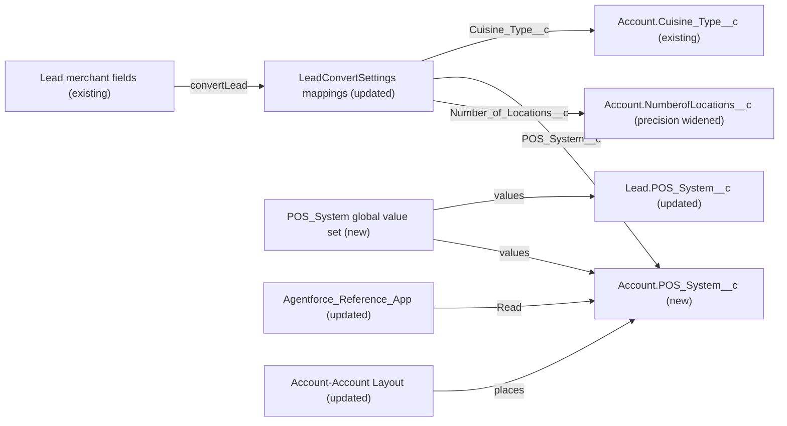

# Implementation spec — Lead-to-Account merchant field mapping on conversion

> Copy the merchant's cuisine type, POS system, and number of locations from a converted Lead to its Account through the standard lead field mapping.

_Based on the requirement, the evidence reported by AskCoworker, and read-only org queries where noted. Assumptions and missing evidence are identified below. Specification only — nothing is implemented or deployed._

---

## 1. The requirement

When a merchant Lead is converted, its cuisine type, POS system, and number of locations must be carried to the resulting Account. The user decided that "Number of Locations" lands in `Account.NumberofLocations__c`. The request contained no deploy or data-change instruction; nothing was acted on in the org.

| # | Responsibility | Trigger | Where it lives |
| --- | --- | --- | --- |
| 1 | Copy `Lead.Cuisine_Type__c` to `Account.Cuisine_Type__c` | Lead conversion (UI, API, `Database.convertLead`) | `LeadConvertSettings` mapping |
| 2 | Copy `Lead.POS_System__c` to a new `Account.POS_System__c` with the same values | Lead conversion | `LeadConvertSettings` mapping; `POS_System` global value set; new `Account.POS_System__c` |
| 3 | Copy `Lead.Number_of_Locations__c` to `Account.NumberofLocations__c` without overflow | Lead conversion | `LeadConvertSettings` mapping; `Account.NumberofLocations__c` widened to Number(5,0) |
| 4 | Let users of the merchant app see the new Account POS value | Record view | `Agentforce_Reference_App`; `Account-Account Layout` |

## 2. Grounding — reuse before building

Target org: `TestWriteSpecDE` (Developer Edition org farm org). API version: `67.0`.

- **`Lead.Cuisine_Type__c`** (CustomField, picklist, unrestricted, 38 values, local value set) — source for cuisine. _verified by org query_
- **`Account.Cuisine_Type__c`** (CustomField, picklist, restricted, the same 38 values, local value set) — existing target for cuisine; reused. _verified by org query_
- **`Lead.POS_System__c`** (CustomField, picklist "POS System Used", unrestricted, values `Square`, `Toast`, `Clover`, `Revel`, `Lightspeed`, `Other`) — source for POS. _verified by org query_
- No POS field exists on `Account` or on any other object (Tooling `CustomField` search for `%POS%` and `%Point_of_Sale%`, all objects). _verified by org query_
- **`Lead.Number_of_Locations__c`** (CustomField, Number(5,0)) — the merchant "Number of Locations" field: created in the same ID block as `Lead.Cuisine_Type__c` and `Lead.POS_System__c` and granted by the same permission sets. _verified by org query_ Choosing it as the source is an _assumption_ (see Section 8).
- **`Lead.NumberofLocations__c`** (CustomField, Number(3,0), same label "Number of Locations") — sample field on `Lead-Lead (Sales) Layout` and `Lead-Lead (Marketing) Layout`; not used as the source. _verified by org query_
- **`Account.NumberofLocations__c`** (CustomField, Number(3,0)) — target for locations; referenced only by `Account-Account (Marketing) Layout`, `Account-Account (Sales) Layout`, `Account-Account (Support) Layout` (MetadataComponentDependency; no custom Apex body references it). _verified by org query_
- **`Account.Total_Storefronts__c`** (CustomField, Number(18,0)) — same concept family; not the target per user decision. _verified by org query_
- **`Agentforce_Reference_App`** (PermissionSet, custom, no namespace, 1 assignee with the System Administrator profile) — grants Edit on `Lead` and `Account`, Edit on the Lead merchant fields, and Read on `Account.Cuisine_Type__c` and `Account.NumberofLocations__c`. _verified by org query_
- `sfdc_accelerate_dms`, `sfdc_a360_sfcrm_data_extract`, `sfdc_slack` (PermissionSet, namespace `sfdcInternalInt`, Session type) — platform-owned; cannot be edited. _verified by org query_
- **`Account-Account Layout`** (Layout) — holds `Account.Cuisine_Type__c`; the Account FlexiPages `Account_Record_Page_Customer` and `Business_Account_Record_Page` do not reference it, so they do not place these fields through Dynamic Forms. _verified by org query_
- Automation on `Lead` and `Account`: 0 Apex triggers, 0 validation rules, 1 record-triggered flow (`ApprovalDispatcher`, on `Lead`, inactive). No non-namespaced Apex class references the three merchant fields or calls `convertLead`. _verified by org query_
- `AccountRule` exists only as managed classes in `sc_ext` and `shield_ext` (Security Center / Shield packages); unrelated. `CreateSalesLead` is a platform flow in `sales_sfa_flows`. _verified by org query_
- Data shape: 5 Leads, all unconverted, 0 with any of the four merchant Lead fields populated; 200 Accounts, 10 with `Cuisine_Type__c` and `NumberofLocations__c`. Converted lead status is `Qualified`. _verified by org query_
- No global value sets exist. _verified by org query_
- Current `LeadConvertSettings` mappings cannot be read with the allowed commands. _verified by org query (not readable)_

Candidates examined and rejected: `Account.Total_Storefronts__c` — user chose `Account.NumberofLocations__c`; `Lead.NumberofLocations__c` — sample field, not the merchant field; `Storefront__c.Cuisine__c` — per-storefront child data, not the Account; `Contact.Favorite_Cuisine__c` — customer preference; record-triggered flow or Apex after conversion — the standard lead field mapping covers the need.

Evidence sources: `sf sobject describe` on `Lead`, `Account`, `Storefront__c`, `Onboarding_Application__c`; Tooling `CustomField` (with `Metadata` by Id), `MetadataComponentDependency`, `ApexTrigger`, `ApexClass` bodies, `ValidationRule`, `FlexiPage`, `Layout`, `GlobalValueSet`; `FlowDefinitionView`, `FieldPermissions`, `ObjectPermissions`, `PermissionSet`, `PermissionSetAssignment`, `LeadStatus`, `DataStream`, aggregate `Lead` and `Account` counts. AskCoworker returned no citedReferences.

## 3. Architecture

Why the pieces are drawn this way:

1. Lead field mapping (`LeadConvertSettings`) is the platform's standard mechanism for copying Lead values at conversion, and it applies to UI, API, and Apex conversions. _assumption (documented platform behavior)_ No trigger or flow is needed, and none exists on these objects. _verified by org query_
2. `Account.Cuisine_Type__c` is reused as the cuisine target; its values match the Lead field. _verified by org query_
3. `Account.POS_System__c` is new because no POS field exists on Account. Its values come from a new `POS_System` global value set that `Lead.POS_System__c` also uses, so the two lists cannot drift (Rule 4: share picklist values instead of copying).
4. `Account.NumberofLocations__c` is widened from Number(3,0) to Number(5,0) so every value the Number(5,0) source can hold fits the target. Widening precision keeps existing values. _assumption (documented platform behavior)_
5. The permission set and layout make the new field visible, matching how `Account.Cuisine_Type__c` is exposed today.

## 4. Metadata changes

**Data model**

- **Create `POS_System`** — GlobalValueSet, values `Square`, `Toast`, `Clover`, `Revel`, `Lightspeed`, `Other` (same order and labels as `Lead.POS_System__c` today); sorted: false.
- **Update `Lead.POS_System__c`** — CustomField; replace the local value set with `valueSetName` `POS_System`. Use Setup "Promote to Global Value Set" on the field (named `POS_System`), then retrieve, because the Metadata API may reject switching a local value set to a global one. The field becomes restricted (global value sets are always restricted); 0 Leads hold a value today.
- **Create `Account.POS_System__c`** — CustomField, Picklist, label "POS System", `valueSetName` `POS_System`, not required, no default, description "POS system used by the merchant; mapped from Lead.POS_System__c on conversion."
- **Update `Account.NumberofLocations__c`** — CustomField; precision 3 to 5, scale 0, so values from `Lead.Number_of_Locations__c` (Number(5,0)) up to 99,999 fit. Label and other attributes unchanged.

**Automation**

- **Update `LeadConvertSettings`** — LeadConvertSettings. Conditional: current mappings cannot be read; retrieve `LeadConvertSettings` first and merge. Add or replace the Account mappings `Cuisine_Type__c` → `Cuisine_Type__c`, `POS_System__c` → `POS_System__c`, and `Number_of_Locations__c` → `NumberofLocations__c`. Only one Lead field can map to an Account field, so any existing mapping from `Lead.NumberofLocations__c` to `Account.NumberofLocations__c` is replaced. Keep every other existing mapping.

**Security**

- **Update `Agentforce_Reference_App`** — PermissionSet; add Read (not Edit) on `Account.POS_System__c`, matching the existing Read on `Account.Cuisine_Type__c` and `Account.NumberofLocations__c`. No other grants change.

**UX**

- **Update `Account-Account Layout`** — Layout; add `Account.POS_System__c` next to `Account.Cuisine_Type__c`, read/write per FLS.

**Tests**

- **Create `LeadConvertMerchantMappingTest`** — ApexClass (`@isTest`). Conditional: depends on row 5. Inserts Leads with the three merchant fields, calls `Database.convertLead` with converted status `Qualified`, and asserts the Account values (cases in Section 7).

## 5. Data 360 (Data Cloud) data involved

Not applicable — this change does not use Data 360. The org has 0 data streams (_verified by org query_). `sfdc_a360_sfcrm_data_extract` reads the existing merchant fields (_verified by org query_), but it is platform-owned and gets no grant on the new field (see Section 8).

## 6. Security considerations

- **Execution context.** Lead conversion runs as the converting user with that user's object and sharing access. _assumption (documented platform behavior)_ Mapped values are written as part of the conversion; whether the converting user needs Edit FLS on the Account target fields is not confirmed — see Section 8 item 3 and Section 7 case 7 (_load-bearing assumption_).
- **CRUD/FLS.** `Agentforce_Reference_App` gets Read on `Account.POS_System__c`. No other permission set or profile gets access. Platform-owned `sfdc_accelerate_dms`, `sfdc_a360_sfcrm_data_extract`, and `sfdc_slack` cannot be edited and get none. On deploy, profiles get no default access to the new field unless the deployment includes profiles; this spec deploys none. System Administrator users see all fields through View All Data. _verified by org query (grants); assumption (documented platform behavior) for profile defaults_
- **Picklist restriction.** Promoting `Lead.POS_System__c` to a global value set makes it restricted, so callers (for example the DMS integration that holds Edit through `sfdc_accelerate_dms`) can no longer write values outside the list. 0 Leads hold a value today. _verified by org query (data); assumption (documented platform behavior)_
- **Data exposure.** POS system, cuisine, and location count are business attributes, not personal data. No new external exposure.

## 7. Testing strategy

`LeadConvertMerchantMappingTest` (Apex, because `LeadConvertSettings` has no Flow Test form and `Database.convertLead` applies the mapping in tests — _assumption (documented platform behavior)_). Never claimed to have run.

1. New Account: Lead with `Cuisine_Type__c = 'Italian'`, `POS_System__c = 'Toast'`, `Number_of_Locations__c = 5` → Account has the same three values.
2. Blank source: Lead with all three blank → Account fields blank, conversion succeeds.
3. Boundary: `Number_of_Locations__c = 1000` and `99999` → Account stores them (requires row 4).
4. Existing Account with blank targets → values filled.
5. Existing Account with populated targets → existing values kept. This tests the _load-bearing assumption_ that conversion into an existing Account fills only blank fields.
6. Bulk: convert 200 Leads in one `Database.convertLead` call → every Account has the mapped values.
7. Permission: as a test user with a Standard User profile plus `Agentforce_Reference_App`, convert a Lead → Account values are set. This tests the _load-bearing assumption_ in Section 8 item 3. If it fails, add Edit on the three Account fields to `Agentforce_Reference_App`.
8. Negative: Lead with a `Cuisine_Type__c` value outside the Account's restricted list (possible because the Lead picklist is unrestricted) → document the resulting conversion error.

Recommended verification (manual, after deploy): convert one Lead in the UI and check the Account; check that `Account.POS_System__c` shows on `Account-Account Layout`; in Setup > Lead > Fields > Map Lead Fields, confirm the three mappings; check reports and list views that use `Account.NumberofLocations__c` still display correctly (non-blocking).

## 8. Open decisions

### Open

1. **LeadConvertSettings current mappings (blocking).** Row 5 is `Conditional:` because the current mappings cannot be read. Retrieve `LeadConvertSettings` before editing and merge the three mappings; confirm whether `Lead.NumberofLocations__c` is mapped today (the replacement removes that mapping; that field holds no Lead values). Row 8, `LeadConvertMerchantMappingTest`, depends on row 5 and is also Conditional on it.
2. **Deployment sequence (blocking).** (a) Promote `Lead.POS_System__c` to global value set `POS_System` in Setup and retrieve rows 1–2; (b) deploy rows 3–4; (c) deploy row 5; (d) deploy rows 6–8.
3. **FLS on mapped Account fields at conversion (non-blocking, load-bearing).** It is not confirmed whether the converting user needs Edit FLS on `Account.Cuisine_Type__c`, `Account.POS_System__c`, and `Account.NumberofLocations__c`; AskCoworker reports that FLS applies. The only `Agentforce_Reference_App` assignee is a System Administrator. Recommended default: keep Read only, and add Edit on the three fields if Section 7 case 7 fails.
4. **Cuisine picklist mismatch (non-blocking).** `Lead.Cuisine_Type__c` is unrestricted and `Account.Cuisine_Type__c` is restricted, so a Lead value outside the list would block conversion. 0 Leads hold a value. Proposal (not in inventory): restrict the Lead field or share one global value set for both cuisine fields.
5. **Data 360 grant on the new field (non-blocking).** `sfdc_a360_sfcrm_data_extract` reads the other merchant fields but is platform-owned; granting it `Account.POS_System__c` is out of scope unless Data Cloud ingestion is wanted.

### Resolved

- **Locations target (user decision).** "Number of Locations" maps to `Account.NumberofLocations__c`, not `Account.Total_Storefronts__c`.
- **Locations source (assumption).** The user's answer did not pick between the two Lead fields labelled "Number of Locations". `Lead.Number_of_Locations__c` was chosen because it shares its creation block and grants with the other merchant fields; `Lead.NumberofLocations__c` is the sample field.
- **Precision (assumption).** `Account.NumberofLocations__c` is widened to Number(5,0) instead of accepting conversion errors for values over 999 (AskCoworker proposed accepting it as-is).
- **POS values (assumption).** Shared through a new global value set, instead of AskCoworker's proposed unrestricted copy of the values.
- **LeadConvertSettings action (correction).** AskCoworker listed it as Create; it is an org setting, so it is an Update of the existing settings.
- **Existing-Account overwrite (correction).** AskCoworker's R answer said mappings overwrite existing Account values, including with blanks. Conversion into an existing Account fills only blank fields. _assumption (documented platform behavior), load-bearing_, tested in Section 7 case 5.
- **Access (correction).** AskCoworker's I proposed Edit on three Account fields in `Agentforce_Reference_App`; reduced to Read on the new field (item 3).
- **Dropped AskCoworker items.** Hidden `AccountRule` (managed package class, unrelated), `CreateSalesLead` body (platform flow), `Storefront__c` cuisine data, and "prior session" facts not needed by the design.

## 9. Change set

| # | Action | Type | API name | Module | Why |
| --- | --- | --- | --- | --- | --- |
| 1 | Create | GlobalValueSet | `POS_System` | force-app/main/default/globalValueSets | Shared POS values for Lead and Account |
| 2 | Update | CustomField | `Lead.POS_System__c` | force-app/main/default/objects/Lead/fields | Use the shared value set |
| 3 | Create | CustomField | `Account.POS_System__c` | force-app/main/default/objects/Account/fields | POS target on Account |
| 4 | Update | CustomField | `Account.NumberofLocations__c` | force-app/main/default/objects/Account/fields | Fit Number(5,0) source values |
| 5 | Update | LeadConvertSettings | `LeadConvertSettings` | force-app/main/default/settings | Conditional: map the three merchant fields on conversion |
| 6 | Update | PermissionSet | `Agentforce_Reference_App` | force-app/main/default/permissionsets | Read on the new Account field |
| 7 | Update | Layout | `Account-Account Layout` | force-app/main/default/layouts | Place the new field next to cuisine |
| 8 | Create | ApexClass | `LeadConvertMerchantMappingTest` | force-app/main/default/classes | Conditional: verify mapping on conversion |

The standard lead field mapping copies cuisine, POS, and locations to the Account, backed by one new Account field, one shared value set, and one widened field.

Total: 8 · Create: 3 · Update: 5 · Delete: 0
