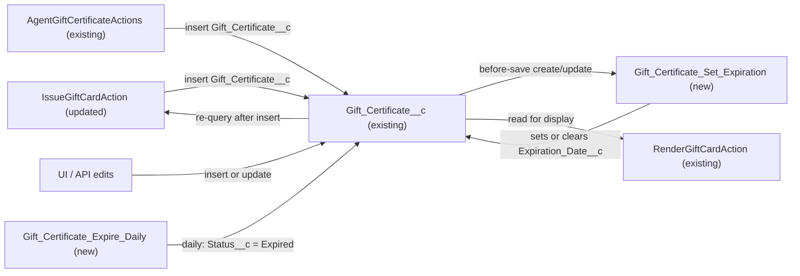

# Implementation spec — Gift certificate expiration by certificate type

> Purchased gift certificates never expire, while promotional certificates (Promotion, Recovery, Loyalty Reward, Referral Bonus) expire 12 months after issue and are marked Expired automatically.

_Based on the requirement, the evidence reported by AskCoworker, and read-only org queries where noted. Assumptions and missing evidence are identified below. Specification only — nothing is implemented or deployed._

---

## 1. The requirement

The requirement contradicts itself ("must never expire" and "all ... should auto-expire after 12 months"); the user resolved it: `Gift_Certificate__c` records with `Type__c = 'Purchased'` never expire, and Promotion, Recovery, and Loyalty Reward certificates expire 12 months after issue (*user decision*). Referral Bonus, which the user did not mention, is treated as promotional (*assumption*). The request contained no deploy or data-change instruction; nothing was deployed or changed.

| # | Responsibility | Trigger | Where it lives |
| --- | --- | --- | --- |
| 1 | Purchased certificates never carry an expiration date | Create or update of `Gift_Certificate__c` | `Gift_Certificate_Set_Expiration` (new flow) |
| 2 | Promotional certificates get `Expiration_Date__c` = issue date + 12 months | Create, or update of `Type__c` / `Issue_Date__c` | `Gift_Certificate_Set_Expiration` (new flow) |
| 3 | Promotional certificates past their expiration date move to `Status__c = 'Expired'` | Daily schedule | `Gift_Certificate_Expire_Daily` (new flow) |
| 4 | Remove the conflicting 90-day expiry hardcode so the flow is the single source of the expiry rule | Agent action `IssueGiftCardAction` | `IssueGiftCardAction` (updated) |

## 2. Grounding — reuse before building

Target org: `TestWriteSpecDE` (Developer Edition, `00Dak00001COqNeEAL`). API version: `67.0`.

- **`Gift_Certificate__c`** (CustomObject, DurableId `01Iak00000Dx4JX`) — the certificate record. _verified by org query_
- **`Gift_Certificate__c.Type__c`** (Picklist: Purchased (default), Recovery, Promotion, Loyalty Reward, Referral Bonus; not required) — drives the rule. _verified by org query_
- **`Gift_Certificate__c.Issue_Date__c`** (Date, not required) — the 12-month anchor. _verified by org query_
- **`Gift_Certificate__c.Expiration_Date__c`** (Date, not required, updateable) — reused; no new field is needed. Referenced by `AgentGiftCertificateActions`, `IssueGiftCardAction`, `RenderGiftCardAction`, and FlexiPage `Storefront_Record_Page` (complete list from `MetadataComponentDependency`). _verified by org query_
- **`Gift_Certificate__c.Status__c`** (Picklist: Draft, Active (default), Partially Redeemed, Fully Redeemed, Expired, Cancelled) — the `Expired` value already exists. _verified by org query_
- **Automation on `Gift_Certificate__c`**: 0 Apex triggers (also 0 on `Contact`), 0 flows triggered on the object, 0 flows with "Gift" in the API name, 0 validation rules. Nothing sets `Status__c = 'Expired'` today (Apex bodies of all 70 unmanaged classes searched). _verified by org query_
- **`IssueGiftCardAction`** (ApexClass, `with sharing`) — sets `Issue_Date__c = Date.today()` and hardcodes `Expiration_Date__c = Date.today().addDays(90)`, then re-queries the inserted record to build its response. _verified by org query_
- **`AgentGiftCertificateActions`** (ApexClass, `with sharing`) — sets `Issue_Date__c = Date.today()` and `Expiration_Date__c` from an optional caller-supplied `expirationDate`. _verified by org query_
- **`RenderGiftCardAction`** (ApexClass) — reads `Expiration_Date__c` for display only. _verified by org query_
- **Tests**: `IssueGiftCardActionTest`, `AgentActionsTest`, `RenderGiftCardActionTest` exist; none assert `Expiration_Date__c`. _verified by org query_
- **Data**: 1 `Gift_Certificate__c` record (Type Recovery, Status Active, `Issue_Date__c` and `Expiration_Date__c` blank, created 2026-08-27). _verified by org query_
- **Access**: `Agentforce_Action_Access`, `Agentforce_Reference_App`, `Pronto_Deep_Dive_Workshop`, `sfdc_accelerate_dms` grant Read/Create/Edit; `sfdc_a360_sfcrm_data_extract` and `sfdc_slack` grant Read (permission sets only; profiles not listed). _verified by org query_
- **`Promotion__c`** has its own `End_Date__c`; it is a discount object, not a stored-value certificate, and is out of scope. _reported by AskCoworker_
- No state or jurisdiction field exists on `Gift_Certificate__c`; the user chose a type-based rule, so no address logic is needed. _reported by AskCoworker_

Evidence sources: `sf org display`; `sobject describe Gift_Certificate__c`; Tooling queries on `EntityDefinition`, `ApexTrigger`, `ValidationRule`, `CustomField`, `MetadataComponentDependency`, `ApexClass` bodies; standard queries on `FlowDefinitionView`, `ObjectPermissions`, `Organization`, `DataStream`, and aggregate/limited `Gift_Certificate__c` data. AskCoworker returned no citedReferences.

## 3. Architecture

Why the pieces are drawn this way:

1. Every insert path (both Apex actions, UI, API) ends in DML on `Gift_Certificate__c`; a before-save record-triggered flow is the one place that sees all of them, so the expiry rule lives there and nowhere else. Both actions are verified to insert records directly (*verified by org query*).
2. A before-save flow runs after the Apex assignment and before the row is written, so it overrides any value the Apex set (*assumption (documented platform behavior)*). `IssueGiftCardAction` re-queries after insert, so its response shows the flow's value (*verified by org query*).
3. `IssueGiftCardAction` is updated only to remove the 90-day line, so there is one source of truth for the expiry rule. This is a code removal; no new Apex logic is added.
4. Status transition to `Expired` is date-driven and needs no user event, so a schedule-triggered flow is used. It also covers records that already exist, which a scheduled path on a record-triggered flow would not.
5. `GiftCertificateExpirationTest` is Apex because it exercises both the flow and `IssueGiftCardAction` in one test run and supports the Apex coverage needed to deploy the class update; no declarative alternative covers the Apex class.

## 4. Metadata changes

**Automation**

- **Create `Gift_Certificate_Set_Expiration`** — Record-triggered flow, before-save (Fast Field Updates), object `Gift_Certificate__c`, runs on create and update. Entry condition (formula): `ISNEW() || ISCHANGED({!$Record.Type__c}) || ISCHANGED({!$Record.Issue_Date__c}) || (NOT(OR(ISPICKVAL({!$Record.Type__c}, 'Promotion'), ISPICKVAL({!$Record.Type__c}, 'Recovery'), ISPICKVAL({!$Record.Type__c}, 'Loyalty Reward'), ISPICKVAL({!$Record.Type__c}, 'Referral Bonus'))) && NOT(ISBLANK({!$Record.Expiration_Date__c})))` (entry formulas cannot reference flow resources, so the type list is repeated inline). Formula resource `f_IsExpiringType` (Boolean): `OR(ISPICKVAL({!$Record.Type__c}, 'Promotion'), ISPICKVAL({!$Record.Type__c}, 'Recovery'), ISPICKVAL({!$Record.Type__c}, 'Loyalty Reward'), ISPICKVAL({!$Record.Type__c}, 'Referral Bonus'))`. Formula resource `f_ExpirationDate` (Date): `IF({!f_IsExpiringType}, ADDMONTHS(BLANKVALUE({!$Record.Issue_Date__c}, BLANKVALUE(DATEVALUE({!$Record.CreatedDate}), TODAY())), 12), NULL)`. One Assignment: `{!$Record.Expiration_Date__c}` = `{!f_ExpirationDate}`. Blank handling: blank `Type__c` is not an expiring type, so the result is blank (never expires); blank `Issue_Date__c` falls back to the created date, or today on create. `ADDMONTHS` keeps month-end dates (for example 2028-02-29 becomes 2029-02-28). No SOQL or DML. Formula size is far below the 3,900-character limit.
- **Create `Gift_Certificate_Expire_Daily`** — Schedule-triggered flow, frequency Daily (start time 01:00 org time), object `Gift_Certificate__c`, start conditions with logic `(1 OR 2 OR 3 OR 4) AND (5 OR 6) AND 7`: 1–4 `Type__c` equals Promotion / Recovery / Loyalty Reward / Referral Bonus; 5–6 `Status__c` equals Active / Partially Redeemed; 7 `Expiration_Date__c` Is Null = false. Decision: `{!$Record.Expiration_Date__c}` < `{!$Flow.CurrentDate}` (the certificate is redeemable through its expiration date). Outcome: Update Records on the triggering record, `Status__c` = `Expired`. Purchased and blank-type records are never selected.

**Apex**

- **Update `IssueGiftCardAction`** — Delete the `Date expiry = Date.today().addDays(90);` declaration and the `gc.Expiration_Date__c = expiry;` assignment. No other change: the post-insert re-query already returns the flow-set `Expiration_Date__c`, so `GiftCardView.expirationDate` shows the 12-month date or blank for Purchased. The duplicate-guard query is unchanged.

**Tests**

- **Create `GiftCertificateExpirationTest`** — `@isTest` class covering the cases in Section 7 through DML on `Gift_Certificate__c` and a call to `IssueGiftCardAction`.

## 5. Data 360 (Data Cloud) data involved

Not applicable — this change does not use Data 360. The org has 0 `DataStream` records (*verified by org query*); `sfdc_a360_sfcrm_data_extract` has Read on `Gift_Certificate__c` (*verified by org query*), so a future stream would see the new values without changes.

## 6. Security considerations

- Both flows run in system context without sharing (*assumption (documented platform behavior)*: record-triggered and schedule-triggered flows run in system context by default). They set `Expiration_Date__c` and `Status__c` regardless of the saving user's FLS, which is intended: the rule must apply to every save.
- The schedule-triggered flow runs as the Automated Process user (*assumption (documented platform behavior)*).
- No new fields, objects, or permission set changes. Existing grants on `Gift_Certificate__c` (Section 2) are unchanged; permission sets are not the only grant path, and profiles were not listed.
- Behavior change for callers: a caller of `AgentGiftCertificateActions` that passes `expirationDate` has it replaced by the policy value; users can no longer keep an expiration date on a Purchased certificate. No data becomes more visible.

## 7. Testing strategy

`GiftCertificateExpirationTest` (planned; not run):

1. Insert `Type__c = 'Purchased'` with an `Expiration_Date__c` supplied → saved blank.
2. Insert each of Promotion, Recovery, Loyalty Reward, Referral Bonus with `Issue_Date__c` = a fixed date → `Expiration_Date__c` = that date + 12 months (include a Feb-29 issue date).
3. Insert a promotional type with blank `Issue_Date__c` → today + 12 months.
4. Insert with blank `Type__c` → `Expiration_Date__c` blank.
5. Update Recovery → Purchased → cleared; Purchased → Promotion → set from `Issue_Date__c`; change `Issue_Date__c` → recalculated.
6. Update an unrelated field (`Notes__c`) on a promotional record whose `Expiration_Date__c` was edited manually → value unchanged (entry condition false).
7. Bulk: insert 200 mixed-type records in one DML → each has the right value.
8. `IssueGiftCardAction` with a promotional type → returned `expirationDate` is today + 12 months, not +90 days; with `Purchased` → blank.

Existing `IssueGiftCardActionTest`, `AgentActionsTest`, and `RenderGiftCardActionTest` do not assert `Expiration_Date__c` and are expected to pass unchanged; run them in the deploy.

Recommended verification (no planned automated test): schedule-triggered flows cannot be invoked from Apex tests. In the org, after activation, create a promotional record with `Expiration_Date__c` = yesterday and Status Active, a Purchased record, and a promotional record expiring tomorrow; after the next run (or a Debug run of the flow), only the first is `Expired`. Confirm records already `Fully Redeemed`, `Cancelled`, or `Expired` are untouched.

## 8. Open decisions

### Open

1. **Backfill the existing record (blocking for delivery).** The one existing Recovery certificate has blank `Issue_Date__c` and `Expiration_Date__c` (*verified by org query*); no flow selects it until it is saved. Procedure after both flows are active (run by an admin, not by this spec): export `Id, Issue_Date__c, Expiration_Date__c, Status__c` for all `Gift_Certificate__c` records as a backup; set `Issue_Date__c` to the record's created date (2026-08-27) — the before-save flow then sets `Expiration_Date__c` to 2027-08-27. Rollback: re-import the exported values (blank) with the flow deactivated. Re-check the record count at deploy time; any other pre-existing promotional record gets the same step.
2. **Deployment sequence (non-blocking).** Deploy and activate `Gift_Certificate_Set_Expiration`, deploy `IssueGiftCardAction` with `GiftCertificateExpirationTest`, run the backfill (item 1), then activate `Gift_Certificate_Expire_Daily`. Activating the daily flow last avoids expiring records before their dates are correct.
3. **Legal confirmation of the type split (non-blocking).** California Civil Code §1749.5 generally bars expiration dates on gift certificates sold, and exempts certificates issued free under awards, loyalty, or promotional programs (*assumption (documented platform behavior)* — legal text, not org behavior). Recommend legal confirm that Recovery (service goodwill) and Referral Bonus certificates fall under the exemption; if Referral Bonus must not expire, remove it from `f_IsExpiringType` and from the daily flow's start conditions.
4. **Agent action description (non-blocking, proposal only).** The `expirationDate` input of `AgentGiftCertificateActions` is now always overridden. Proposal outside this inventory: update its description, or remove the input, so agents do not promise a custom date.
5. **Reactivated records (non-blocking).** If someone sets an `Expired` promotional record back to Active while `Expiration_Date__c` is in the past, the daily flow expires it again at the next run; extending it requires changing `Issue_Date__c` or `Expiration_Date__c`. Accepted as the intended rule.

### Resolved

- **Contradictory requirement (user decision).** Asked which rule applies; the user chose: Purchased never expires; Promotion, Recovery, Loyalty certificates expire after 12 months. No jurisdiction (California address) logic, so `Contact` is not used.
- **Referral Bonus (assumption).** Not named by the user; treated as promotional because it is not paid for (see Open item 3).
- **Blank or future `Type__c` values (assumption).** Only the four named promotional values expire; blank or new values never expire, because expiring a paid certificate is the legal risk. This replaces AskCoworker's proposal to expire everything that is not Purchased.
- **Caller-supplied dates are overridden (assumption).** "All ... should auto-expire after 12 months" makes the rule authoritative, so the flow overrides `AgentGiftCertificateActions` input rather than defaulting only when blank.
- **Corrections to AskCoworker proposals.** `Issue_Date__c + 365` replaced by `ADDMONTHS(..., 12)` (leap years); insert-only trigger extended to updates of `Type__c` / `Issue_Date__c` and to clearing dates on non-expiring types; scheduled path on a record-triggered flow replaced by a schedule-triggered flow so existing records are covered; "0 records" corrected to 1 record (*verified by org query*); backfill anchor changed from today to the created date; the concern that Developer Edition cannot run schedule-triggered flows dropped (*assumption (documented platform behavior)*: they are available in Developer Edition). Proposals to update existing test classes, remove the `expirationDate` parameter, add a validation rule, or use Apex batch were dropped as not required.

## 9. Change set

| # | Action | Type | API name | Module | Why |
| --- | --- | --- | --- | --- | --- |
| 1 | Create | Flow | `Gift_Certificate_Set_Expiration` | force-app/main/default/flows | Sets `Expiration_Date__c` to issue + 12 months for promotional types and clears it for Purchased on every relevant save |
| 2 | Create | Flow | `Gift_Certificate_Expire_Daily` | force-app/main/default/flows | Daily transition of past-date promotional certificates to `Status__c = 'Expired'` |
| 3 | Update | ApexClass | `IssueGiftCardAction` | force-app/main/default/classes | Remove the conflicting 90-day expiry hardcode so the flow is the single source of the rule |
| 4 | Create | ApexClass | `GiftCertificateExpirationTest` | force-app/main/default/classes | Tests the expiry rule across types, updates, bulk, and the agent action |

A before-save flow owns the expiry date for every insert path and a daily schedule-triggered flow marks past-date promotional certificates Expired.

Total: 4 · Create: 3 · Update: 1 · Delete: 0
