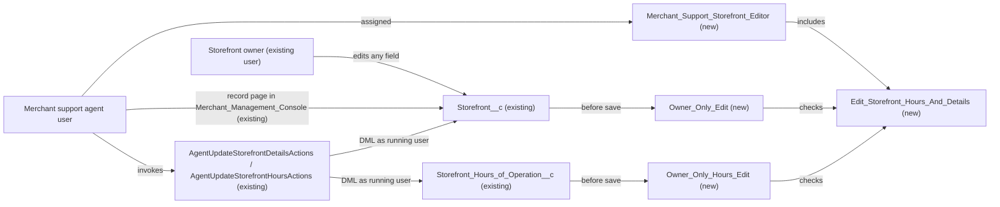

# Implementation spec — Owner-only storefront editing with a scoped support-agent exception

> Restrict editing of `Storefront__c` records to the storefront owner, while letting merchant support agents change only storefront hours and details through the existing agent actions or a scoped permission set.

_Based on the requirement, the evidence reported by AskCoworker, and read-only org queries where noted. Assumptions and missing evidence are identified below. Specification only — nothing is implemented or deployed._

---

## 1. The requirement

The storefront owner is the only user who can edit a `Storefront__c` record freely; merchant support agents are a scoped exception who may change only the hours (`Storefront_Hours_of_Operation__c`) and the detail fields (`Storefront__c.Description__c`, `Storefront__c.Phone__c`, `Storefront__c.Status__c`, `Storefront__c.Storefront_Overview__c`), from the `Merchant_Management_Console` app or through the existing update agent actions. The requirement contradicted itself ("only the account owner" versus "all merchant support agents"); the user resolved it this way (*user decision*). The request contained no deploy or data-change instruction.

| # | Responsibility | Trigger | Where it lives |
| --- | --- | --- | --- |
| 1 | Block edits to `Storefront__c` by anyone other than the record owner | Update of a `Storefront__c` record (UI, API, Apex, agent action) | `Storefront__c.Owner_Only_Edit` (new validation rule) |
| 2 | Block create and edit of hours by anyone other than the parent storefront's owner | Insert or update of a `Storefront_Hours_of_Operation__c` record | `Storefront_Hours_of_Operation__c.Owner_Only_Hours_Edit` (new validation rule) |
| 3 | Let merchant support agents change hours and the four detail fields, and nothing else, on any storefront | Update from the console record page, or a call to `AgentUpdateStorefrontDetailsActions` / `AgentUpdateStorefrontHoursActions` | `Edit_Storefront_Hours_And_Details` (new custom permission) in `Merchant_Support_Storefront_Editor` (new permission set), checked by both validation rules |
| 4 | Give merchant support agents access to storefronts and hours in the console | Permission set assignment | `Merchant_Support_Storefront_Editor` |

## 2. Grounding — reuse before building

Target org: `TestWriteSpecDE` (Developer Edition, not a sandbox, ID `00Dak00001COqNeEAL`). API version: `67.0`.

- **`Storefront__c`** (CustomObject) — the storefront; internal sharing model `ReadWrite` (Public Read/Write), external `Private`. Every internal user with object Edit permission can edit every storefront today. _verified by org query_
- **`Storefront__c.OwnerId`** — the owner used by this design. All 21 storefront records have `OwnerId` equal to `Account__r.OwnerId`, and none has a blank `Account__c`; all 21 are owned by one System Administrator user. _verified by org query_
- **`Storefront__c` fields** — updateable fields: `Name`, `OwnerId`, `Account__c`, `Address__c` (components `Address__Street__s`, `Address__City__s`, `Address__PostalCode__s`, `Address__StateCode__s`, `Address__CountryCode__s`, `Address__Latitude__s`, `Address__Longitude__s`, `Address__GeocodeAccuracy__s`), `Cuisine__c`, `Description__c`, `Image_URL__c`, `Phone__c`, `Primary_Contact__c`, `Status__c`, `Type__c`, `Storefront_Overview__c`, `Review_Summary__c`. Read-only: `Menu_Count__c` (roll-up COUNT of `Menu__c`), `Total_Reviews__c` (roll-up COUNT of `Review__c`), `Total_Score__c`, `Average_Review_Score__c`. _verified by org query_
- **`Storefront_Hours_of_Operation__c`** (CustomObject) — hours; master-detail child of `Storefront__c` through `Storefront_Hours_of_Operation__c.Storefront__c`, sharing `ControlledByParent`. Fields `Day_of_Week__c`, `Opening_Time__c`, `Closing_Time__c`, `Notes__c`. _verified by org query_
- **Existing automation** — no Apex triggers, no record-triggered flows, and no validation rules on either object. _verified by org query_
- **`AgentUpdateStorefrontDetailsActions`** (ApexClass, `with sharing`) — updates only `Description__c`, `Phone__c`, `Status__c`, `Storefront_Overview__c` with plain DML (no `stripInaccessible`, no user mode), after checking that a caller-supplied `accountId` equals `Storefront__c.Account__c`. It catches exceptions and returns the message. _verified by org query (class body)_
- **`AgentUpdateStorefrontHoursActions`** (ApexClass, `with sharing`) — inserts or updates one `Storefront_Hours_of_Operation__c` row per day with plain DML, same caller-supplied `accountId` check, same exception handling. _verified by org query (class body)_
- **Other Apex writers** — of 70 unmanaged Apex classes, only the two classes above perform DML on `Storefront__c` or `Storefront_Hours_of_Operation__c` (test classes insert test data). Flows were checked only for record triggers; flow bodies were not read, so this list is partial for flows. _verified by org query_
- **Agent actions** — `GenAiFunctionDefinition` rows `Update_Storefront_Details` and `Update_Storefront_Hours` (and suffixed copies) invoke the two classes. Agents in the org: `Merchant_Management_Agent` and `Merchant_Account_Manager_Agent` (employee agents), `Merchant_Support_Agent` and `Merchant_Support_Agent_AS` (service agents). Which agents' topics include the update actions was not verified (the link-table query failed). _verified by org query_
- **Object access** — edit access to `Storefront__c` exists only in `Agentforce_Reference_App`, `sfdc_accelerate_dms`, and the System Administrator profile (all with Modify All on both objects); `Pronto_Deep_Dive_Workshop`, `sfdc_a360_sfcrm_data_extract`, `sfdc_slack`, and the Analytics Cloud Integration User profile have read only. This list is complete for `ObjectPermissions`. _verified by org query_
- **`Merchant_Support_Agent_Permissions`** (PermissionSet, label "Merchant_Support_Agent Permissions") — 0 assignments and no object or field permissions on either object. Its name follows the pattern of a service-agent user permission set, so it is not reused for human agents. _verified by org query_; the naming inference is an _assumption_.
- **Merchant Support Profile** — 1 active user; no object access to `Storefront__c`. _verified by org query_
- **`Merchant_Management_Console`** (Lightning app, `NavType` Console) — "the console" in the requirement. _verified by org query_; mapping it to the requirement is an _assumption_.
- **Page and tab** — `Storefront__c-Storefront Layout`, `Storefront_Hours_of_Operation__c-Storefront Hours of Operation Layout`, FlexiPage `Storefront_Record_Page`, and tab `Storefront__c` exist. _verified by org query_
- **Custom permissions** — none exists for storefronts; `Edit_Storefront_Hours_And_Details`, `Merchant_Support_Storefront_Editor`, and the two validation rule names are unused. _verified by org query_
- **Data 360** — `SELECT COUNT() FROM DataStream` returns 0. _verified by org query_

Evidence sources: `EntityDefinition` sharing models; Tooling `CustomField`, `ApexTrigger`, `ValidationRule`, `ApexClass` bodies, `GenAiFunctionDefinition`, `Layout`, `FlexiPage`, `CustomField.Metadata` for two roll-ups; standard `ObjectPermissions`, `FieldPermissions`, `PermissionSet`, `PermissionSetAssignment`, `Profile`, `User`, `BotDefinition`, `AppDefinition`, `TabDefinition`, `CustomPermission`, `FlowDefinitionView`, `DataStream`, `Organization`, and record aggregates on `Storefront__c`; `sobject describe Storefront__c`. AskCoworker (5 calls) returned no citedReferences.

## 3. Architecture



Why the pieces are drawn this way:

1. The owner edits `Storefront__c` directly; the validation rules pass whenever the running user is the owner (`Storefront__c.OwnerId`, prior value). _user decision_
2. Validation rules run on every save path (UI, API, Apex, agent actions) and evaluate `$User` as the running user, so one rule per object enforces the restriction everywhere, including inside the two `with sharing` action classes, whose DML ignores CRUD and FLS. _assumption (documented platform behavior)_; the classes' plain DML is _verified by org query_.
3. The support-agent exception is a custom permission, so it is granted only through the new permission set and can be checked by `$Permission` in both rules. _assumption (documented platform behavior)_
4. The org-wide default stays `ReadWrite`. Tightening it to Public Read Only (AskCoworker's proposal) would make the `with sharing` action DML fail for non-owner agents, and permission sets cannot grant record-level edit without Modify All, which would give agents full edit. _assumption (documented platform behavior)_
5. No Apex is added. Validation rules and a permission set meet every responsibility.

## 4. Metadata changes

**Security**

- **Create `Edit_Storefront_Hours_And_Details`** — CustomPermission. Label "Edit Storefront Hours and Details". Description: "Allows a non-owner to change storefront hours and the fields Description, Phone, Status, and Overview." No connected app. Granted only by `Merchant_Support_Storefront_Editor`.
- **Create `Merchant_Support_Storefront_Editor`** — PermissionSet, label "Merchant Support Storefront Editor", no license. Contents:
  - Custom permission `Edit_Storefront_Hours_And_Details`: enabled.
  - `Storefront__c`: Read and Edit (no Create, Delete, View All, or Modify All).
  - `Storefront__c` field permissions: Edit on `Storefront__c.Description__c`, `Storefront__c.Phone__c`, `Storefront__c.Status__c`, `Storefront__c.Storefront_Overview__c`; Read on `Storefront__c.Account__c`. No other field access.
  - `Storefront_Hours_of_Operation__c`: Read, Create, and Edit (no Delete, View All, or Modify All).
  - `Storefront_Hours_of_Operation__c` field permissions: Edit on `Storefront_Hours_of_Operation__c.Day_of_Week__c`, `Storefront_Hours_of_Operation__c.Opening_Time__c`, `Storefront_Hours_of_Operation__c.Closing_Time__c`, `Storefront_Hours_of_Operation__c.Notes__c`.
  - Apex class access: `AgentUpdateStorefrontDetailsActions`, `AgentUpdateStorefrontHoursActions`.
  - Tab setting: `Storefront__c` Visible. App visibility: `Merchant_Management_Console` Visible.
  - Assignment to users is a data step (Section 8), not part of this metadata.

**Automation**

- **Create `Storefront__c.Owner_Only_Edit`** — ValidationRule, active. Error message: "Only the storefront owner can edit this storefront. Support agents can change only hours, description, phone, status, and overview." Error location: top of page. Error condition formula:

  ```
  AND(
    NOT(ISNEW()),
    $User.Id <> PRIORVALUE(OwnerId),
    OR(
      AND(
        NOT($Permission.Edit_Storefront_Hours_And_Details),
        OR(
          ISCHANGED(Description__c),
          ISCHANGED(Phone__c),
          ISCHANGED(Status__c),
          ISCHANGED(Storefront_Overview__c)
        )
      ),
      ISCHANGED(Name),
      ISCHANGED(OwnerId),
      ISCHANGED(Account__c),
      ISCHANGED(Cuisine__c),
      ISCHANGED(Image_URL__c),
      ISCHANGED(Primary_Contact__c),
      ISCHANGED(Type__c),
      ISCHANGED(Review_Summary__c),
      ISCHANGED(Address__Street__s),
      ISCHANGED(Address__City__s),
      ISCHANGED(Address__PostalCode__s),
      ISCHANGED(Address__StateCode__s),
      ISCHANGED(Address__CountryCode__s)
    )
  )
  ```

  `PRIORVALUE(OwnerId)` lets the current owner transfer the record. The rule lists changed fields instead of blocking every non-owner save, so roll-up recalculation of `Menu_Count__c` and `Total_Reviews__c` (which saves the parent when a non-owner inserts a `Menu__c` or `Review__c`) is not blocked. Address latitude, longitude, and geocode accuracy are left out so geocoding updates are not blocked. Formula size is about 800 characters, under the 3,900-character limit. Blank handling does not apply (no arithmetic); `ISCHANGED` treats blank-to-value and value-to-blank as changes.
- **Create `Storefront_Hours_of_Operation__c.Owner_Only_Hours_Edit`** — ValidationRule, active. Error message: "Only the storefront owner or a merchant support agent can change storefront hours." Error condition formula:

  ```
  AND(
    $User.Id <> Storefront__r.OwnerId,
    NOT($Permission.Edit_Storefront_Hours_And_Details)
  )
  ```

  Fires on insert and update, so creating a new day's hours counts as editing hours. Validation rules do not fire on delete; see Section 8.

## 5. Data 360 (Data Cloud) data involved

Not applicable — this change does not use Data 360. The org has no data streams (_verified by org query_); `sfdc_a360_sfcrm_data_extract` keeps its existing read access.

## 6. Security considerations

- **Execution context.** Both rules evaluate `$User` as the user who performs the save. The two action classes run `with sharing` and write with plain DML, so they ignore CRUD and FLS but not validation rules (_assumption (documented platform behavior)_). The rules are therefore the only restriction on the action path, and they apply to it.
- **Caller-supplied ID.** The actions' `accountId` check is caller-supplied and is not an authorization control (_verified by org query_). This design does not rely on it: a non-owner without `Edit_Storefront_Hours_And_Details` is blocked by the validation rules whatever `accountId` they pass.
- **Scope of the exception.** A holder of `Edit_Storefront_Hours_And_Details` can change the four detail fields and hours on every storefront, not only those of one account. That matches "all merchant support agents" (_user decision_). FLS in `Merchant_Support_Storefront_Editor` limits which fields they can edit in the UI and API; the validation rule enforces the same limit on the Apex path and against other permission sets the user may hold.
- **Who loses edit access.** Every non-owner loses edit access, including System Administrators and users of `Agentforce_Reference_App` and `sfdc_accelerate_dms` (Modify All does not bypass validation rules). See Section 8.
- **Record creation.** Creating a `Storefront__c` is not restricted (the creator becomes the owner by default).
- **Delete.** With the `ReadWrite` model, deleting a `Storefront__c` still needs ownership, a role above the owner, or Modify All (_assumption (documented platform behavior)_). Deleting hours needs Delete on the child and edit on the parent; only the Modify All holders listed in Section 2 have Delete on `Storefront_Hours_of_Operation__c` (_verified by org query_). The new permission set grants no Delete.
- **Data exposure.** Agents gain read of `Storefront__c` records (visible already through `ReadWrite` sharing) and read of `Storefront__c.Account__c` and the edited fields only. Permission sets are not the only grant path: profiles can also grant access.

## 7. Testing strategy

No test class is in the inventory, because no Apex changes. Recommended verification (not run):

1. Owner edits any `Storefront__c` field and any hours row: saves.
2. A non-owner without the custom permission edits `Storefront__c.Cuisine__c`: blocked. Edits `Storefront__c.Description__c`: blocked. Inserts or updates an hours row: blocked.
3. A user with `Merchant_Support_Storefront_Editor` edits the four detail fields and hours from the `Storefront_Record_Page` in `Merchant_Management_Console`: saves. Tries `Storefront__c.Type__c` through the API (bypassing FLS by a second permission set, if any): blocked by `Owner_Only_Edit`.
4. The same user invokes `Update_Storefront_Details` and `Update_Storefront_Hours` from an employee agent: success. A user without the permission set invokes them: the action returns `success = false` with the validation message (the classes catch the exception).
5. Owner transfers a storefront to another user: saves. A non-owner changes `OwnerId`: blocked.
6. A non-owner inserts a `Review__c` or `Menu__c` for a storefront they do not own: saves (roll-up recalculation is not blocked).
7. Bulk: data-load 200 `Storefront__c` updates as the owner (all pass) and as a non-owner without permission (all fail per row).
8. Test data: the org has one storefront owner (a System Administrator). Create a second, non-admin user as a storefront owner in a sandbox or scratch org to test the non-owner paths realistically.

## 8. Open decisions

### Open

1. **Assign the permission set to merchant support agents (blocking for delivery).** Responsibility 3 fails until `Merchant_Support_Storefront_Editor` is assigned to each agent. The org has 1 active user on Merchant Support Profile (_verified by org query_). Recommended: assign to the Merchant Support Profile users, or a permission set group, after deployment.
2. **Service agents that call the update actions (non-blocking).** If `Merchant_Support_Agent` or `Merchant_Support_Agent_AS` topics include `Update_Storefront_Details` or `Update_Storefront_Hours`, they run as their agent user, who is not the owner, so their updates will be rejected after deployment. Which topics include the actions was not verified. Granting the permission set to an agent user is a grant to an integration the requirement did not ask for. Recommended default: do not grant; confirm the agent topic contents, and grant only if the business wants merchants to update storefronts through the service agent.
3. **Administrators and integrations are blocked (non-blocking).** System Administrators and `Agentforce_Reference_App` / `sfdc_accelerate_dms` users who are not the owner can no longer edit storefronts, which follows the literal requirement. Recommended default: no bypass; if an admin or data-load bypass is needed, add a second custom permission checked in both rules.
4. **"Account owner" means `Storefront__c.OwnerId` (non-blocking).** Today it always equals `Account__r.OwnerId` (_verified by org query_). If they diverge and the business means the account's owner, replace `PRIORVALUE(OwnerId)` with `Account__r.OwnerId` and `Storefront__r.OwnerId` with `Storefront__r.Account__r.OwnerId`.
5. **Formula field references (non-blocking).** The rule assumes `ISCHANGED` accepts the long text area fields and the `Address__c` component fields (_assumption (documented platform behavior)_). If the deploy rejects one, use `PRIORVALUE(field) <> field` for it.
6. **Fields added later (non-blocking).** A new editable `Storefront__c` field is not protected until it is added to `Owner_Only_Edit`. Record this in the object's change checklist.
7. **Hours deletes and undeletes (non-blocking).** Validation rules do not fire on delete or undelete. Only Modify All holders can delete hours today (_verified by org query_), so no new path opens; a before-delete trigger would be needed to block them.
8. **Queue owners (non-blocking).** If a storefront is owned by a queue, `$User.Id` never equals the owner, so only permission holders can edit it. No storefront is queue-owned today (_verified by org query_).
9. **Deployment sequence (non-blocking).** Deploy `Edit_Storefront_Hours_And_Details`, then `Merchant_Support_Storefront_Editor`, then both validation rules in the same or a later deployment; then assign the permission set (item 1).
10. **Unreadable automation (non-blocking).** Flow bodies were not read; a non-record-triggered flow running as a non-owner that writes `Storefront__c` fields in the rule's list would be blocked.

### Resolved

- **Contradictory requirement.** "Only the account owner" versus "all merchant support agents": the owner edits directly; agents edit only hours and details through the agent actions or a scoped permission set. _user decision_
- **Rejected AskCoworker proposal: change the org-wide default to Public Read Only.** It would make the `with sharing` action DML fail for non-owner agents and would force Modify All grants to restore agent access. The default stays `ReadWrite`; validation rules enforce the restriction. _assumption (documented platform behavior)_
- **Dropped AskCoworker proposals.** `Modify_All_Storefront` custom permission and grants to the System Administrator profile, `Agentforce_Reference_App`, and `sfdc_accelerate_dms` (admin bypass not requested; see Open item 3); read-only grants to `Merchant_Support_Agent_Permissions` (a service-agent-style permission set with 0 assignments; a new dedicated permission set is used instead).
- **Corrected AskCoworker claims.** `AgentUpdateStorefrontDetailsActions` does not use `Security.stripInaccessible` (_verified by org query_); the classes catch DML exceptions and return them rather than throwing; the roll-up recalculation concern is handled by the field-change list in `Owner_Only_Edit`; permission sets do not "call" actions.
- **Hours inserts are restricted.** Creating an hours row is part of "editing hours", so `Owner_Only_Hours_Edit` has no `ISNEW()` exception. _assumption_

## 9. Change set

| # | Action | Type | API name | Module | Why |
| --- | --- | --- | --- | --- | --- |
| 1 | Create | CustomPermission | `Edit_Storefront_Hours_And_Details` | force-app/main/default/customPermissions | Marks the scoped support-agent exception checked by both validation rules |
| 2 | Create | PermissionSet | `Merchant_Support_Storefront_Editor` | force-app/main/default/permissionsets | Grants agents the custom permission, console access, and edit on hours and the four detail fields only |
| 3 | Create | ValidationRule | `Storefront__c.Owner_Only_Edit` | force-app/main/default/objects/Storefront__c/validationRules | Blocks non-owner storefront edits except detail-field edits by permission holders |
| 4 | Create | ValidationRule | `Storefront_Hours_of_Operation__c.Owner_Only_Hours_Edit` | force-app/main/default/objects/Storefront_Hours_of_Operation__c/validationRules | Blocks non-owner hours changes except by permission holders |

Two validation rules enforce owner-only editing on every save path, and a custom permission in a new permission set carves out hours and detail edits for merchant support agents.

Total: 4 · Create: 4 · Update: 0 · Delete: 0
