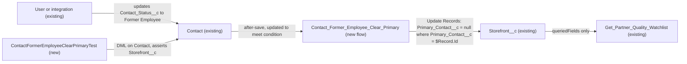

# Implementation spec — Clear storefront primary contact when a contact becomes a Former Employee

> When `Contact.Contact_Status__c` changes to `Former Employee`, clear `Storefront__c.Primary_Contact__c` on every storefront that points to that contact.

_Based on the requirement, the evidence reported by AskCoworker, and read-only org queries where noted. Assumptions and missing evidence are identified below. Specification only — nothing is implemented or deployed._

---

## 1. The requirement

When a contact's status changes to Former Employee, remove that contact as the primary contact on every storefront that uses it. No user question was needed; the requirement names the field value and the target, and the org has one matching field for each. The request contained no deploy or data-change instruction.

| # | Responsibility | Trigger | Where it lives |
| --- | --- | --- | --- |
| 1 | Detect that a contact's status became `Former Employee` | Update of `Contact` where `Contact_Status__c` changes to `Former Employee` | `Contact_Former_Employee_Clear_Primary` (new record-triggered flow) |
| 2 | Clear `Storefront__c.Primary_Contact__c` on every storefront that references that contact | Same event, same transaction | `Contact_Former_Employee_Clear_Primary` (new record-triggered flow) |
| 3 | Prove the behavior before deployment | Test run | `ContactFormerEmployeeClearPrimaryTest` (new Apex test class) |

## 2. Grounding — reuse before building

Target org: `TestWriteSpecDE` (Developer Edition, not a sandbox, org ID `00Dak00001COqNeEAL`). API version: `67.0` (`sfdx-project.json`). _verified by org query; verified by project file_

- **`Contact.Contact_Status__c`** (CustomField, picklist) — the "status" in the requirement. Active values: `Current Employee`, `Former Employee`, `Active Customer`, `Lapsed Customer`. Data: 79 `Active Customer`, 108 `Lapsed Customer`, 11 blank, 0 `Former Employee`, 0 `Current Employee`. _verified by org query_
- **`Storefront__c.Primary_Contact__c`** (CustomField, Lookup(Contact)) — the target field. `required = false`, `deleteConstraint = SetNull`, no lookup filter, description "The main point of contact for the storefront…". All 21 storefronts have a value; one contact is primary on up to 4 storefronts. The 10 contacts used as primary contacts all have a blank `Contact_Status__c`. _verified by org query_
- **Automation on `Contact` and `Storefront__c`** — no Apex triggers, no record-triggered flows, and no validation rules on either object. _verified by org query_ (Tooling `ApexTrigger`, `FlowDefinitionView`, Tooling `ValidationRule` by `EntityDefinitionId`). No flow has `Former` or `Primary` in its API name. _verified by org query_
- **`Get_Partner_Quality_Watchlist`** (Flow, autolaunched, active) — the only component in `MetadataComponentDependency` that references `Storefront__c.Primary_Contact__c`. It lists the field only in the `queriedFields` of two Get Records elements; it does not filter on it or write it, so a blank value only means a blank column in its output. _verified by org query_
- **Unmanaged Apex** — no unmanaged class body contains `Primary_Contact__c`. `AgentCustomerActions` reads `Contact_Status__c` for output only and does not write it. _verified by org query_ The two `ContactRule` classes are managed (`sc_ext`, `shield_ext` namespaces) security-product classes, not related to storefronts. _verified by org query_
- **`Contact.Contact_Status__c` dependencies** — only `Contact Layout` references the field. _verified by org query_ No automation in the org sets `Former Employee`; users or integrations set it. _verified by org query (no triggers or record-triggered flows on `Contact`; partial: Apex bodies searched for the field name)_
- **Permission sets with Edit on `Storefront__c.Primary_Contact__c`**: `Agentforce_Reference_App`, `sfdc_accelerate_dms`; Read only: `sfdc_a360_sfcrm_data_extract`, `sfdc_slack`, `Pronto_Deep_Dive_Workshop` (permission sets only; profiles not listed). _verified by org query_

Candidates examined and rejected: `Contact.CleanStatus` — Data.com clean status, not employment status (_verified by org query_: values `Matched`, `Different`, …); `Contact.Level__c` — customer level, not status; `AgentUpdateStorefrontDetailsActions` — updates other storefront fields, and extending an agent action would not run on a status change (_reported by AskCoworker_); lookup filter on `Primary_Contact__c` — it would not clear existing values.

Evidence sources: `sf sobject describe` on `Contact` and `Storefront__c`; `sf sobject list --sobject custom`; Tooling `CustomField` (search by name and `Metadata` for `Primary_Contact__c`), `ApexTrigger`, `ValidationRule`, `ApexClass` bodies, `MetadataComponentDependency`, `Flow.Metadata` for `Get_Partner_Quality_Watchlist`; SOQL on `FlowDefinitionView`, `EntityDefinition`, `FieldPermissions`, `Organization`, and aggregates on `Contact` and `Storefront__c`. AskCoworker returned no citedReferences.

## 3. Architecture

Why the pieces are drawn this way:

1. A record-triggered flow is the standard declarative mechanism for a cross-object update on a field change. No roll-up, formula, or assignment rule can clear a lookup on other records. An after-save flow is required because a before-save flow can change only the triggering record. _assumption (documented platform behavior)_
2. The flow has no Get Records element. One Update Records element with filter criteria (`Primary_Contact__c` Equals `{!$Record.Id}`) updates all matching storefronts. The platform batches these updates across the contacts in one transaction. _assumption (documented platform behavior)_
3. No trigger or flow exists on `Storefront__c`, so the update starts no further automation there. _verified by org query_
4. `Get_Partner_Quality_Watchlist` only reads the field, so it is not affected beyond showing a blank contact. _verified by org query_
5. The test is an Apex DML test, not a Flow Test, because the outcome to assert is on `Storefront__c` records, not on the triggering `$Record`. _assumption (documented platform behavior)_

## 4. Metadata changes

**Automation**

- **Create `Contact_Former_Employee_Clear_Primary`** — Flow (record-triggered, after save). Object `Contact`; trigger "A record is updated". Entry condition: `Contact_Status__c` Equals `Former Employee`; "Only when a record is updated to meet the condition requirements". One Update Records element: object `Storefront__c`, filter `Primary_Contact__c` Equals `{!$Record.Id}`, set `Primary_Contact__c` to blank (`null`). No other elements. Fault path: none, so a failure rolls back the contact save and shows the error (fail loud). Runs in system context without sharing (the default for record-triggered flows) so that storefronts the user cannot edit are also cleared. Label "Contact: Former Employee clears storefront primary contact". Deploy as Active.

**Tests**

- **Create `ContactFormerEmployeeClearPrimaryTest`** — ApexClass (`@isTest`). Inserts an `Account`, contacts, and `Storefront__c` records in test data; updates `Contact_Status__c` and asserts `Storefront__c.Primary_Contact__c`. Methods listed in Section 7.

## 5. Data 360 (Data Cloud) data involved

Not applicable — this change does not use Data 360.

## 6. Security considerations

- **Execution context:** record-triggered flows run in system context without sharing. The flow clears `Primary_Contact__c` on every matching storefront, even when the user who changed the contact cannot see or edit that storefront. This is intended: the requirement says "any storefront". _assumption (documented platform behavior)_
- **CRUD/FLS:** the running user needs only Edit on `Contact.Contact_Status__c` to start the flow. The flow does not check the user's FLS on `Storefront__c.Primary_Contact__c`. _assumption (documented platform behavior)_
- **Permission sets:** no changes. No new field or object is created, so no grants are needed. Existing grants on `Storefront__c.Primary_Contact__c` are listed in Section 2.
- **Data exposure:** the flow only writes a blank value. It exposes no data. The storefront's `LastModifiedById` shows the user who changed the contact.
- **Test data:** the Apex test creates its own records and runs as the test user; it needs no permission set.

## 7. Testing strategy

`ContactFormerEmployeeClearPrimaryTest` (Apex DML test; it exercises the flow through a real `Contact` update):

| Method | Behavior |
| --- | --- |
| `clearsAllStorefrontsOnTransition` | Contact that is primary on 4 storefronts changes from blank to `Former Employee`; all 4 have a blank `Primary_Contact__c`. A storefront with a different primary contact is unchanged. |
| `bulkTransition` | 200 contacts, each primary on one storefront, change to `Former Employee` in one `update`; all 200 storefronts are cleared and no governor limit is hit (verifies the batching assumption in Section 3 item 2). |
| `otherStatusDoesNotClear` | Contact changes to `Active Customer`, `Lapsed Customer`, or `Current Employee`; storefront keeps its primary contact. |
| `alreadyFormerEmployeeDoesNotRefire` | Contact already `Former Employee`; a Former Employee is then set as primary on a storefront and an unrelated contact field is updated; the storefront keeps the value (documents the behavior in Section 8, item 1). |
| `noStorefrontsNoError` | Contact with no storefronts changes to `Former Employee`; the save succeeds. |
| `restrictedUserStillClears` | A user without edit access to the storefront changes the contact (`System.runAs` with a test user on the `Standard User` profile, which has Edit on `Contact` and no object access to `Storefront__c`, _verified by org query_; the test owner of the `Contact` must be that user or the contact shared to it); the storefront is cleared (verifies system context). |

Recommended verification (manual, after deploy to a test environment):

- Change a contact that is primary on a storefront to `Former Employee` in the UI; confirm the storefront shows no primary contact.
- Change a contact away from `Former Employee`; confirm nothing is restored (Section 8, item 2).
- Merge two contacts where the surviving contact is `Former Employee`; confirm whether storefronts move to the surviving contact (Section 8, item 3).
- Run `Get_Partner_Quality_Watchlist` after a clear; confirm it returns the storefront with a blank contact and no error.

Tests have not been run.

## 8. Open decisions

### Open

1. **Former Employees can be set as primary contact again (non-blocking).** The flow reacts only to the status change. A user can later pick a Former Employee as `Storefront__c.Primary_Contact__c`. The requirement does not ask to prevent this. Proposal (not in inventory): a lookup filter on `Storefront__c.Primary_Contact__c` excluding `Former Employee`, or a validation rule on `Storefront__c`.
2. **No restore on status reversal (non-blocking).** If a contact changes from `Former Employee` back to another value, storefronts are not given back their primary contact; the previous value is not stored. Recommended default: accept; restoring was not requested.
3. **Contact merge (non-blocking).** On merge, related records of the losing contact move to the surviving contact; the surviving contact's status does not change, so the flow does not fire. If the surviving contact is already `Former Employee`, moved storefronts keep it as primary. _assumption (documented platform behavior)_ Recommended default: accept; merges are rare and this is covered by manual verification.
4. **Storefronts with no primary contact afterwards (non-blocking).** Cleared storefronts have no primary contact until someone assigns a new one. The requirement does not ask for a notification or reassignment. Proposal (not in inventory): a report of `Storefront__c` with a blank `Primary_Contact__c`.
5. **Deployment sequence (non-blocking).** Deploy `ContactFormerEmployeeClearPrimaryTest` and `Contact_Former_Employee_Clear_Primary` in one deployment and run the test class. No data step is needed: 0 contacts are `Former Employee` today, so there is nothing to backfill (_verified by org query_; re-check before deploying).

### Resolved

- **Which status field** — `Contact.Contact_Status__c` is the only employment status field on `Contact`; it holds the value `Former Employee`. _assumption_ (decided from the org's picklist values; `CleanStatus` is Data.com status).
- **Trigger events** — update only. A new contact cannot be a storefront's primary contact before it is saved, so insert needs no handling; delete is already handled by `deleteConstraint = SetNull` (_verified by org query_). _assumption_
- **Flow instead of Apex trigger** — no complex logic; declarative mechanism preferred (Rule 4). _assumption_
- **Correction to AskCoworker (inventory):** it proposed a Get Records, a Decision, and an Update Records on the collection. One Update Records element with filter criteria does the same with fewer elements. It also proposed a formula entry condition with `ISCHANGED`; the standard "updated to meet the condition requirements" option gives the same behavior.
- **Correction to AskCoworker (runtime):** it stated that N contacts in one transaction cause N separate DML statements and could hit the 150-DML limit. Record-triggered flows batch the same Update Records element across the records in a transaction. _assumption (documented platform behavior)_; verified by the `bulkTransition` test.
- **Correction to AskCoworker (merge):** it stated that the losing contact's storefronts are set to null on merge. Merge moves related records to the surviving contact instead. _assumption (documented platform behavior)_ See Open item 3.
- **Correction to AskCoworker (discovery):** it described the two `ContactRule` classes as having hidden bodies that might implement the requirement. They are managed classes in the `sc_ext` and `shield_ext` namespaces; no unmanaged Apex references `Primary_Contact__c` (_verified by org query_). It also reported that validation rules are not queryable; the Tooling query returned 0 rules on both objects (_verified by org query_).
- **`Get_Partner_Quality_Watchlist` null handling** — AskCoworker listed this as unknown. The flow metadata shows the field only in `queriedFields` (_verified by org query_), so it is resolved.
- **Security half of R** — the R call timed out and the narrowed retry covered runtime and sharing only; permission grants were covered by the `FieldPermissions` query.
- Dropped AskCoworker proposals: Flow Test (cannot assert the `Storefront__c` outcome), scheduled flow, and a separate validation rule (not requested).

## 9. Change set

| # | Action | Type | API name | Module | Why |
| --- | --- | --- | --- | --- | --- |
| 1 | Create | Flow | `Contact_Former_Employee_Clear_Primary` | force-app/main/default/flows | Clears `Storefront__c.Primary_Contact__c` when `Contact_Status__c` changes to `Former Employee` |
| 2 | Create | ApexClass | `ContactFormerEmployeeClearPrimaryTest` | force-app/main/default/classes | Proves the flow clears all matching storefronts, in bulk and across sharing |

One after-save record-triggered flow on `Contact` clears the lookup on matching storefronts, with one Apex test class.

Total: 2 · Create: 2 · Update: 0 · Delete: 0
