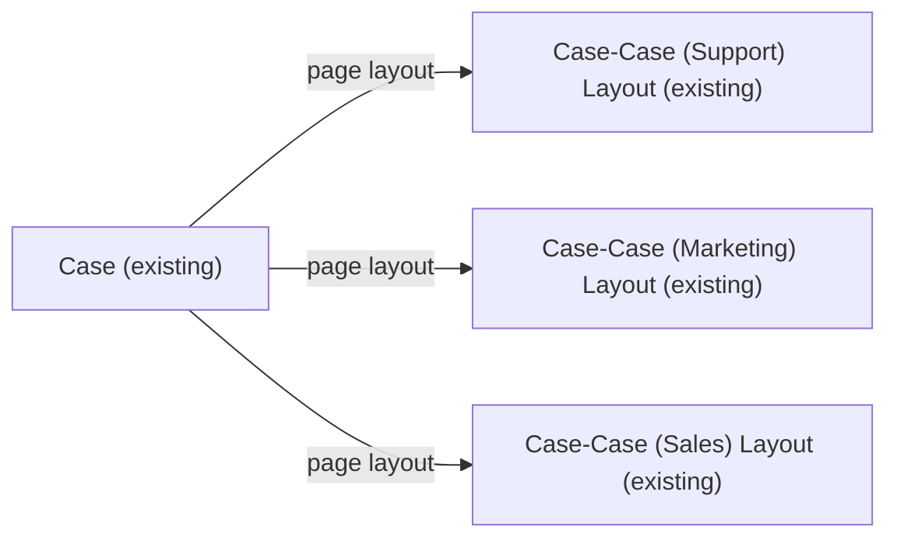

# Implementation spec — Remove unused Case fields Product, Engineering Req Number, and Potential Liability

> Delete the three unused custom fields `Case.Product__c`, `Case.EngineeringReqNumber__c`, and `Case.PotentialLiability__c` from the Case object.

_Based on the requirement, the evidence reported by AskCoworker, and read-only org queries where noted. Assumptions and missing evidence are identified below. Specification only — nothing is implemented or deployed._

---

## 1. The requirement

The requester wants the Case "Product" picklist (the one with values such as `GC1040`) and the Case fields "Engineering Req Number" and "Potential Liability" removed from the org. The request contains no deploy or data-change instruction to act on; nothing was deployed.

| # | Responsibility | Trigger | Where it lives |
| --- | --- | --- | --- |
| 1 | Remove the Case Product picklist with the `GC1040` values | Deployment of destructive changes | `Case.Product__c` |
| 2 | Remove the Case Engineering Req Number field | Deployment of destructive changes | `Case.EngineeringReqNumber__c` |
| 3 | Remove the Case Potential Liability field | Deployment of destructive changes | `Case.PotentialLiability__c` |

## 2. Grounding — reuse before building

Target org: `TestWriteSpecDE` (connected; user `epic.2b9dd11f2b2a@orgfarm.salesforce.com`). API version: `67.0`.

- **`Case.Product__c`** (CustomField, Picklist) — label "Product"; values `GC1040`, `GC1060`, `GC3020`, `GC3040`, `GC3060`, `GC5020`, `GC5040`, `GC5060`, `GC1020`; local value set (no `valueSetName`); `required` false; not history tracked; unmanaged (`NamespacePrefix` null). This is the field the requirement means by "the case Product field with the GC1040 stuff". _verified by org query_
- **`Case.EngineeringReqNumber__c`** (CustomField, Text(12)) — label "Engineering Req Number"; `required` false; not unique or external ID; not history tracked; unmanaged. _verified by org query_
- **`Case.PotentialLiability__c`** (CustomField, Picklist) — label "Potential Liability"; values `No`, `Yes`; `required` false; not history tracked; unmanaged. _verified by org query_
- **Data** — `SELECT COUNT(Id), COUNT(Product__c), COUNT(EngineeringReqNumber__c), COUNT(PotentialLiability__c) FROM Case` returned 9 Cases and 0 non-null values for each of the three fields. _verified by org query_
- **References** — Tooling `MetadataComponentDependency` (queried by 18- and 15-character field IDs) returns only layouts: `Case-Case (Support) Layout` references all three fields; `Case-Case (Marketing) Layout` and `Case-Case (Sales) Layout` reference `Case.Product__c` and `Case.PotentialLiability__c`. _verified by org query_
- **Apex** — the bodies of all 70 unmanaged Apex classes and all 5 Apex triggers in the org contain none of the three field names (case-insensitive search); no unmanaged class body is hidden. _verified by org query_
- **`CaseRule`, `CaseCommentRule`** (ApexClass, managed namespaces `sc_ext` and `shield_ext`) — bodies are `(hidden)`, so they could not be searched. _verified by org query_
- **Flows** — the Metadata of the 13 active unmanaged flows (`FlowDefinitionView WHERE NamespacePrefix = null`) contains none of the three field names; none is record-triggered on Case. _verified by org query_
- **`Case_Record_Page`** (FlexiPage, the only Case FlexiPage) — its Metadata contains none of the three field names. _verified by org query_
- **Other Case logic** — Case has 0 validation rules, 0 workflow rules, and 0 approval processes (`ProcessDefinition`). _verified by org query_
- **Field-level security** — 154 `FieldPermissions` rows grant the three fields: profiles (Read/Edit), permission sets `Agentforce_Actions` and `sfdc_accelerate_dms` (Read/Edit), and `sfdc_a360_sfcrm_data_extract`, `sfdc_slack`, `Agentforce_Reference_App`, `Pronto_Deep_Dive_Workshop` (Read). _verified by org query_
- **Data 360** — `SELECT COUNT() FROM DataStream` returned 0. _verified by org query_
- **Project source** — `force-app` contains no Case metadata and no file referencing the three fields. _verified by project file_

Candidates examined and rejected: `Case.ProductId` (standard Lookup(Product)) — a different field; the requirement identifies the field by its `GC1040` values, which only `Case.Product__c` holds. _reported by AskCoworker; the `GC1040` values verified by org query._ No other object has a custom field named `EngineeringReqNumber`, `PotentialLiability`, or `Product` (Tooling `CustomField` search across the org). _verified by org query_

Evidence sources: `sf sobject describe Case`; Tooling `CustomField` (list and per-field `Metadata`), `MetadataComponentDependency`, `ApexClass` and `ApexTrigger` bodies, `Flow.Metadata`, `FlexiPage.Metadata`, `ValidationRule`, `WorkflowRule`; standard `FieldDefinition`, `FieldPermissions`, `FlowDefinitionView`, `ProcessDefinition`, `DataStream`, and an aggregate Case count. AskCoworker returned no citedReferences.

## 3. Architecture

Why the pieces are drawn this way:

1. After the change, the three fields no longer exist, so they are not drawn. The three layouts are the only components that referenced them (_verified by org query_), and they remain without the fields.
2. Deleting a custom field removes it from page layouts and removes its field permissions from profiles and permission sets. _assumption (documented platform behavior)_ So no Layout or PermissionSet row is needed.

## 4. Metadata changes

**Removal**

- **Delete `Case.Product__c`** — CustomField (Picklist). Impact: 0 of 9 Cases hold a value, so no business data is lost; the field is removed from `Case-Case (Support) Layout`, `Case-Case (Marketing) Layout`, `Case-Case (Sales) Layout`, and all FLS grants. Prerequisites: none found in Apex, flows, FlexiPages, validation rules, workflow, or approval processes; check reports and list views (Section 8). Backup: retrieve `CustomField:Case.Product__c` and the three Case layouts into source control before deletion. Rollback: undelete the field from Setup > Object Manager > Case > Fields & Relationships > Deleted Fields within the retention window (15 days), or redeploy the retrieved metadata.
- **Delete `Case.EngineeringReqNumber__c`** — CustomField (Text(12)). Impact: 0 of 9 Cases hold a value; the field is removed from `Case-Case (Support) Layout` and all FLS grants. Prerequisites: same as above. Backup: retrieve `CustomField:Case.EngineeringReqNumber__c`. Rollback: undelete within 15 days, or redeploy the retrieved metadata.
- **Delete `Case.PotentialLiability__c`** — CustomField (Picklist). Impact: 0 of 9 Cases hold a value; the field is removed from `Case-Case (Support) Layout`, `Case-Case (Marketing) Layout`, `Case-Case (Sales) Layout`, and all FLS grants. Prerequisites: same as above. Backup: retrieve `CustomField:Case.PotentialLiability__c`. Rollback: undelete within 15 days, or redeploy the retrieved metadata.

## 5. Data 360 (Data Cloud) data involved

Not applicable — this change does not use Data 360. The org has 0 data streams (_verified by org query_), so no Data 360 mapping reads these fields.

## 6. Security considerations

- Execution context and sharing: Not applicable. The deletion is a metadata deployment; no Apex, flow, or sharing rule runs.
- CRUD/FLS: the platform removes the fields' `FieldPermissions` rows from profiles and from the permission sets `Agentforce_Actions`, `sfdc_accelerate_dms`, `sfdc_a360_sfcrm_data_extract`, `sfdc_slack`, `Agentforce_Reference_App`, and `Pronto_Deep_Dive_Workshop` (the grants are _verified by org query_; the automatic removal is _assumption (documented platform behavior)_). No permission set or profile is edited.
- Data exposure: no data becomes more visible. All three fields are empty (_verified by org query_), so no values are lost.
- Integration callers: an API client that still names a deleted field in a query or write gets an `INVALID_FIELD` error. _assumption (documented platform behavior)_ The fields are empty on every Case (_verified by org query_), so no caller has stored a value in them.

## 7. Testing strategy

No Apex or Flow test is added: the change is three field deletions with no code or flow logic. Recommended verification (manual checks, none run):

1. Validate the destructive deployment first (`sf project deploy start --dry-run` with a `destructiveChanges.xml` listing the three fields) and confirm it succeeds.
2. After deployment, confirm in Object Manager that `Case.Product__c`, `Case.EngineeringReqNumber__c`, and `Case.PotentialLiability__c` are gone and appear under Deleted Fields.
3. Open `Case-Case (Support) Layout`, `Case-Case (Marketing) Layout`, and `Case-Case (Sales) Layout` and the `Case_Record_Page` record page; confirm they render with no errors.
4. Create and edit a Case through the UI and through the Agentforce actions (`AgentCaseCreateActions`, `AgentCaseActions`, `CaseSummaryCardAction`); confirm no errors.
5. Exercise Case and Case comment functions of the managed `sc_ext` and `shield_ext` packages; confirm no runtime errors in debug logs (load-bearing check for the hidden managed code, Section 8 item 2).
6. Open Case reports and list views that the report and list view check (Section 8 item 1) identified; confirm they run without the removed columns or filters.

## 8. Open decisions

### Open

1. **Reports and list views (non-blocking).** Report columns and list view filters cannot be read with the allowed queries. Deployment step: in Setup, check Case reports and list views for the three fields and remove or re-point any filter that uses them before deleting.
2. **Managed package code (non-blocking).** `CaseRule` and `CaseCommentRule` in `sc_ext` and `shield_ext` have hidden bodies. Managed code cannot hold a compile-time reference to a subscriber-created field, so it cannot block the deletion; it could only read the fields dynamically. _assumption (documented platform behavior)_ Recommended default: run verification step 5 in a sandbox or after a dry-run before deleting in this org.
3. **Integration owners (non-blocking).** `sfdc_accelerate_dms` and `Agentforce_Actions` have Read/Edit and four other permission sets have Read on the fields (_verified by org query_). All values are empty, so no integration has stored a value in them. Recommended default: notify the owners of these permission sets that the fields are being removed.

Deployment sequence: (1) retrieve the three fields and three layouts into source control; (2) complete the report and list view check; (3) validate the destructive deployment with a dry run; (4) deploy the three deletions together.

### Resolved

- **Which "Product" field.** The requirement identifies it by the `GC1040` values; `Case.Product__c` holds them, and `Case.ProductId` is a different, standard field. _assumption (resolved from the requirement's wording and the verified picklist values)_
- **No question to the user.** The requirement names all three fields, each matches exactly one Case field by label, and none holds data or is read by code or automation, so the delete set is not ambiguous. _assumption_
- **No Layout or PermissionSet rows.** Field deletion removes the fields from layouts and FLS. _assumption (documented platform behavior)_
- **AskCoworker corrections.** AskCoworker said Case validation rules are not queryable; Tooling `ValidationRule` is queryable and returned 0 rules for Case (_verified by org query_). AskCoworker said layout references block field deletion; they do not, because deletion removes the field from layouts (_assumption (documented platform behavior)_). AskCoworker treated `CaseRule` and `CaseCommentRule` as possibly local classes; they are managed (`sc_ext`, `shield_ext`) (_verified by org query_). AskCoworker called `sfdc_accelerate_dms` an active writer of Case data and made its check blocking; the fields are empty on all Cases, so it is non-blocking. After these errors, every AskCoworker fact kept in this spec was re-checked by org query. Dropped AskCoworker proposals: blocking treatment of layouts and approval processes (0 approval processes, _verified by org query_), and alternatives that only hide the fields.

## 9. Change set

| # | Action | Type | API name | Module | Why |
| --- | --- | --- | --- | --- | --- |
| 1 | Delete | CustomField | `Case.Product__c` | force-app/main/default/objects/Case/fields | Requirement: remove the unused Case Product picklist (`GC1040` values); 0 values stored |
| 2 | Delete | CustomField | `Case.EngineeringReqNumber__c` | force-app/main/default/objects/Case/fields | Requirement: remove Engineering Req Number; 0 values stored |
| 3 | Delete | CustomField | `Case.PotentialLiability__c` | force-app/main/default/objects/Case/fields | Requirement: remove Potential Liability; 0 values stored |

Three independent CustomField deletions on Case; the platform removes the fields from the three Case layouts and from all FLS grants.

Total: 3 · Create: 0 · Update: 0 · Delete: 3
