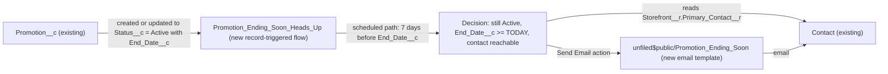

# Implementation spec — Promotion ending heads-up email to the storefront's primary contact

> Seven days before an Active promotion's end date, email the primary contact of the promotion's storefront once, using an email template.

_Based on the requirement, the evidence reported by AskCoworker, and read-only org queries where noted. Assumptions and missing evidence are identified below. Specification only — nothing is implemented or deployed._

---

## 1. The requirement

Send one templated heads-up email to `Storefront__c.Primary_Contact__c` seven days before `Promotion__c.End_Date__c`, for Active promotions only (*user decision*: Active only, one email per promotion, from an email template). The request contained no deploy or data-change instruction; nothing was deployed or changed.

| # | Responsibility | Trigger | Where it lives |
| --- | --- | --- | --- |
| 1 | Schedule the heads-up for each Active promotion that has an end date | `Promotion__c` created, or updated so that it newly meets `Status__c = Active` and `End_Date__c` not blank | `Promotion_Ending_Soon_Heads_Up` (Flow, new) |
| 2 | At 7 days before `End_Date__c`, confirm the promotion is still Active and the recipient can receive email | Scheduled path, 7 days before `End_Date__c` | `Promotion_Ending_Soon_Heads_Up` (Flow, new) |
| 3 | Send the heads-up email to the storefront's primary contact | Same scheduled path | `Promotion_Ending_Soon_Heads_Up` Send Email action with `unfiled$public/Promotion_Ending_Soon` (EmailTemplate, new) |
| 4 | Cover the promotion that is already Active today | One-time data step after deployment | Section 8, Open item 1 |

## 2. Grounding — reuse before building

Target org: `TestWriteSpecDE` (Developer Edition, not a sandbox; `OrganizationType = 'Developer Edition'`, `IsSandbox = false`). API version: `67.0` (`sfdx-project.json`, _verified by project file_).

- **`Promotion__c`** (CustomObject) — the promotion. Its custom fields (Tooling `CustomField` on `TableEnumOrId = '01Iak00000Dx4JZ'`, complete list) are `Description`, `Discount_Percentage`, `End_Date`, `Promotion_Code`, `Start_Date`, `Status`, `Storefront`. No field records a sent notification. _verified by org query_
- **`Promotion__c.End_Date__c`** (Date, nillable) — description "The date when the promotion ends." The scheduled path is offset from this field. _verified by org query_
- **`Promotion__c.Status__c`** (Picklist) — values `Active`, `Expired`, `Canceled`; the value set is not marked restricted (`valueSet.restricted` is empty in `CustomField.Metadata`). Description "Tracks the current state of the promotion." _verified by org query_
- **`Promotion__c.Storefront__c`** (Lookup to `Storefront__c`, nillable) — "The storefront that is hosting the promotion." _verified by org query_
- **`Storefront__c.Primary_Contact__c`** (Lookup to `Contact`, nillable) — "The main point of contact for the storefront, typically responsible for handling communications, updates, and operational coordination." This is the recipient. _verified by org query_
- **`Contact.Email`**, **`Contact.HasOptedOutOfEmail`** (standard fields) — recipient address and opt-out flag. _verified by org query_
- **Data shape** — 1 `Promotion__c` record: `Status__c = 'Active'`, `End_Date__c = 2027-04-12`, with a storefront, a primary contact, and a contact email (`COUNT(Storefront__r.Primary_Contact__r.Email) = 1`). _verified by org query_
- **Existing automation on `Promotion__c` and `Storefront__c`** — 0 Apex triggers (Tooling `ApexTrigger`, also checked `Contact`), 0 flows triggered on either object (`FlowDefinitionView` by `TriggerObjectOrEventId IN`), 0 validation rules (Tooling `ValidationRule` by `EntityDefinitionId`). The only active scheduled flow is `Orch`, which has no trigger object. _verified by org query_
- **Readers of `Promotion__c`** (partial: `MetadataComponentDependency` on the object only) — `AgentCreatePromotionActions`, `AgentUpdatePromotionStatusActions`, `MerchantRiskScoreAction` (Apex). None send email (searched the bodies of the first two for `Email` and `Messaging`). _verified by org query_
- **Email components** — 0 `EmailTemplate` records whose name or developer name contains `Promo`, `Expir`, or `Storefront`; 0 `WorkflowAlert`; 0 `OrgWideEmailAddress`; 0 email template folders in `Folder`. _verified by org query_

Candidates examined and rejected: `ScheduledEmail`, `EmailUtil` (Apex) — managed classes in namespaces `sc_ext` and `shield_ext`, not editable, and not related to promotions (_verified by org query_ for the namespaces); `Storefront__c.OwnerId`, `Promotion__c.OwnerId` — Users, not the storefront's communications contact (_verified by org query_); a schedule-triggered flow proposed by AskCoworker — rejected in Section 8.

Evidence sources: `sf org display`; `sf sobject list --sobject custom`; `sf sobject describe` of `Promotion__c` and `Storefront__c`; Tooling queries on `EntityDefinition`, `CustomField`, `ApexTrigger`, `ValidationRule`, `MetadataComponentDependency`, `ApexClass`; standard queries on `FieldDefinition`, `FlowDefinitionView`, `EmailTemplate`, `OrgWideEmailAddress`, `Folder`, `ObjectPermissions`, `Organization`, `DataStream`, and aggregate counts on `Promotion__c`. AskCoworker returned no citedReferences.

## 3. Architecture

Why the pieces are drawn this way:

1. `Promotion__c` is the triggering object because it holds `End_Date__c` and `Status__c`, and the recipient is reached through `Promotion__c.Storefront__c` then `Storefront__c.Primary_Contact__c` (_verified by org query_).
2. A record-triggered flow with a scheduled path offset "7 Days Before" `End_Date__c` is the platform's standard mechanism for a date-relative action. Scheduled paths are removed when the record is updated so that it no longer meets the entry conditions, and they are recalculated when the offset field changes (*assumption (documented platform behavior)*, load-bearing). The flow runs after save, on "A record is created or updated", with "Only when a record is updated to meet the condition requirements"; this makes each qualifying promotion schedule one heads-up per entry into the criteria, which gives the "one email per promotion" rule without a sent flag (*assumption*, see Section 8).
3. The decision on the scheduled path re-checks the record's values at run time (*assumption (documented platform behavior)*: the scheduled path reads the current record) so that a stale or unreachable recipient is skipped silently, without an error.
4. The flow's Send Email action (`emailSimple`) uses the template through `emailTemplateId`, with `recipientId` = the primary contact and `relatedRecordId` = the promotion, so that `{!Promotion__c.…}` and `{!Contact.…}` merge fields resolve (*assumption (documented platform behavior)*, load-bearing). No Apex is needed, and no email alert is used because an email alert on `Promotion__c` cannot address a contact that is two lookups away (*assumption (documented platform behavior)*).
5. No existing automation on `Promotion__c` conflicts: no triggers, flows, or validation rules (_verified by org query_).

## 4. Metadata changes

**Notification**

- **Create `unfiled$public/Promotion_Ending_Soon`** — EmailTemplate, Classic Text (`type` `text`), available for use, stored in the public `unfiled$public` folder because the org has no email template folders (_verified by org query_). Subject: `Your promotion {!Promotion__c.Name} ends on {!Promotion__c.End_Date__c}`. Body: greets `{!Contact.FirstName}`, states that the promotion `{!Promotion__c.Name}` (code `{!Promotion__c.Promotion_Code__c}`, `{!Promotion__c.Description__c}`) ends in 7 days on `{!Promotion__c.End_Date__c}`, and invites the contact to reach out with questions. Only `Promotion__c` and `Contact` merge fields are used. Deploy before the flow.

**Automation**

- **Create `Promotion_Ending_Soon_Heads_Up`** — Flow, record-triggered (`AutoLaunchedFlow`, trigger type `RecordAfterSave`), object `Promotion__c`, "A record is created or updated". Entry conditions (all): `Status__c` Equals `Active`; `End_Date__c` Is Null `false`. "When to run": "Only when a record is updated to meet the condition requirements". Immediate path: none. Scheduled path `Seven_Days_Before_End`: time source `Promotion__c: End_Date__c`, offset 7 Days Before, batch size default. On that path: Decision `Still_Eligible` (all): `{!$Record.Status__c}` Equals `Active`; `{!$Record.End_Date__c}` Greater Than or Equal `{!$Flow.CurrentDate}`; `{!$Record.Storefront__r.Primary_Contact__c}` Is Null `false`; `{!$Record.Storefront__r.Primary_Contact__r.Email}` Is Null `false`; `{!$Record.Storefront__r.Primary_Contact__r.HasOptedOutOfEmail}` Equals `false`. If true: Send Email action (`emailSimple`) with `emailTemplateId` = the Id of `Promotion_Ending_Soon` (looked up with a Get Records on `EmailTemplate` where `DeveloperName` = `Promotion_Ending_Soon`, so no Id is hard-coded), `recipientId` = `{!$Record.Storefront__r.Primary_Contact__c}`, `relatedRecordId` = `{!$Record.Id}`, `logEmailOnSend` = true. If false: end, no error. Runs in system context.

## 5. Data 360 (Data Cloud) data involved

Not applicable — this change does not use Data 360. `SELECT COUNT() FROM DataStream` returned 0 (_verified by org query_), and the flow writes no fields.

## 6. Security considerations

- **Execution context.** The scheduled path runs as the Automated Process user in system context, so it reads `Promotion__c`, `Storefront__c`, and `Contact` regardless of the saving user's sharing or FLS (*assumption (documented platform behavior)*).
- **CRUD/FLS and permission sets.** No new fields or objects, so no field access is granted and no profile receives default field access on deploy. No permission set changes. Existing grants on `Promotion__c` (non-profile, _verified by org query_): `Pronto_Deep_Dive_Workshop`, `sfdc_a360_sfcrm_data_extract`, `sfdc_slack` (Read), `sfdc_accelerate_dms` (Read, Edit). `Agentforce_Reference_App` has a row for `Storefront__c` but none for `Promotion__c` (_verified by org query_; AskCoworker's first table reported otherwise, see Section 8). These grants are unchanged.
- **Template access.** `unfiled$public` is visible to internal users who can see email templates (*assumption (documented platform behavior)*). The template contains no data beyond promotion name, code, description, end date, and the contact's first name.
- **Data exposure.** The email goes to an external contact and exposes only that contact's own storefront promotion. The recipient is always the primary contact of the promotion's own storefront, and the saving user cannot supply a different address (the flow takes no input).
- **Opt-out.** `HasOptedOutOfEmail = true` suppresses the send (*assumption*, default taken; see Section 8 Resolved).
- **Sender.** No `OrgWideEmailAddress` exists (_verified by org query_), so the From address is the platform default for the Automated Process user (*assumption (documented platform behavior)*, load-bearing; see Section 8 Open item 2).

## 7. Testing strategy

The flow's only logic runs on a scheduled path, so no Flow Test or Apex test is in the inventory: Flow Tests cannot run scheduled paths, and an Apex test cannot wait for the scheduled path to fire. All cases below are recommended verification in a sandbox or scratch org; none have been run.

1. **Happy path.** Create a `Promotion__c` with `Status__c = Active`, a storefront whose primary contact has an email, and `End_Date__c` = today + 8. In Setup > Time-Based Workflow (or Paused and Failed Flow Interviews > scheduled), confirm one pending interview for `Seven_Days_Before_End` at today + 1. After it runs, confirm one email, rendered from `Promotion_Ending_Soon` with all merge fields filled, and an activity logged.
2. **End date changes.** Move `End_Date__c` on that record; confirm the pending interview moves to the new date minus 7 days and there is still exactly one (verifies the load-bearing recalculation assumption).
3. **Stops matching.** Change `Status__c` to `Canceled`; confirm the pending interview is removed and no email is sent.
4. **Re-entry.** Change `Status__c` back to `Active`; confirm one new pending interview (documents the re-entry behavior in Section 8 Open item 3).
5. **Short notice.** Create an Active promotion with `End_Date__c` = today + 3; confirm the path runs shortly after save and sends one email (end date is not past). With `End_Date__c` = yesterday, confirm no email.
6. **Unreachable recipient.** Separately: storefront with no primary contact; contact with blank email; contact with `HasOptedOutOfEmail = true`; promotion with no storefront. Confirm no email and no failed interview.
7. **Bulk.** Insert 200 Active promotions with the same `End_Date__c`; confirm 200 pending interviews and, after the run, 200 emails with no failures, within the org's daily single-email limit (Developer Edition limits apply).
8. **Not triggered.** Update a non-status field on an already Active promotion; confirm no second pending interview. Undelete a deleted Active promotion; confirm no interview is created (record-triggered flows do not run on undelete, *assumption (documented platform behavior)*).
9. **Sender.** Confirm the From address on the received email and that it is delivered to an external mailbox (verifies the sender assumption in Section 8 Open item 2).

## 8. Open decisions

### Open

1. **Existing Active promotion (blocking for delivery).** The one existing `Promotion__c` (`Status__c = 'Active'`, `End_Date__c = 2027-04-12`, _verified by org query_) already meets the entry conditions, so it will not enter the flow on a normal edit. Data step after deployment: export the record's `Id` and `Status__c`, then save `Status__c = Expired` and save `Status__c = Active` again, which makes it newly meet the criteria and schedules its heads-up for 2027-04-05. Impact: two extra field-history and `LastModifiedDate` changes; no other automation reacts to `Promotion__c` changes (_verified by org query_: no triggers, flows, or validation rules). Rollback: set `Status__c` back to the exported value. Alternative: send that one email manually on 2027-04-05.
2. **Sender address (non-blocking, load-bearing).** No `OrgWideEmailAddress` exists. The design assumes the Automated Process user can send a template email to an external contact with the platform default From address. Recommended Setup step: create and verify an org-wide email address (for example the storefront partner support address) and set the Send Email action's `senderType` to `OrgWideEmailAddress` with that address. Also confirm Setup > Deliverability "Access level" is "All email" (cannot be read with the allowed commands).
3. **Re-activation sends again (non-blocking).** If a promotion goes Active, then Canceled or Expired, then Active again before 7 days before its end date, it is scheduled again and can receive a second email if the first had already been sent. Recommended default: accept; a sent flag would add a field the requirement did not ask for. Proposal only: a `Promotion__c.Heads_Up_Sent__c` checkbox checked by the flow.
4. **Status values outside the picklist (non-blocking).** `AgentCreatePromotionActions` defaults `Status__c` to `'Draft'`, and `AgentUpdatePromotionStatusActions` describes `Draft`, `Active`, `Paused`, `Ended` (_verified by org query_, class bodies), while the picklist lists `Active`, `Expired`, `Canceled` and is not restricted. Promotions created as `Draft` are not Active and get no email until they are set to `Active`, which then schedules the heads-up. No change proposed.
5. **Deployment sequence (non-blocking).** Deploy `unfiled$public/Promotion_Ending_Soon`, then `Promotion_Ending_Soon_Heads_Up` (activate it), then run the data step in item 1.

### Resolved

- **Status filter** — only `Status__c = Active` promotions get the email; one email per promotion; sent from an email template. *user decision*
- **Opt-out** — the user had no preference; skip contacts with `HasOptedOutOfEmail = true` because the flag is the org's recorded email preference. *assumption*
- **Promotions ending in less than 7 days** — a scheduled path whose time is already past runs shortly after save, so such promotions still get one heads-up; promotions whose end date is past do not. *assumption* (reason: "heads-up before it ends" is still useful late; documented platform behavior for past scheduled times)
- **Trigger mechanism** — AskCoworker's inventory proposed a schedule-triggered daily flow and stated that a scheduled path "fires N days after a record is saved, not N days before `End_Date__c`". That contradicts documented behavior: scheduled paths can be offset before a date field on the record. Replaced with a record-triggered flow with a scheduled path. *assumption (documented platform behavior)*
- **Other AskCoworker corrections** — it stated the Send Email action honors `HasOptedOutOfEmail` automatically (not relied on; the decision checks it explicitly); it placed the template in a `Pronto` folder (no email template folders exist, _verified by org query_; used `unfiled$public`); it offered `Case__r` merge fields and `Storefront__c` merge fields in a Classic text template (dropped; only `Promotion__c` and `Contact` merge fields); it said undelete fires the flow (record-triggered flows do not run on undelete); its manual step "update the existing promotion to trigger entry" would not re-enter the criteria (replaced by Open item 1); its D2 permission table listed `Agentforce_Reference_App` with Read, Create, Edit on `Promotion__c`, which the org query contradicts. After these wrong claims, every AskCoworker fact kept in this spec was verified by org query or is tagged as an assumption.
- **Dropped AskCoworker proposals** — `Notification_Sent__c` flag, Apex Schedulable/Batchable, Flow Test for entry conditions, and a `Contact_Status__c` = "Former Employee" filter (not in the requirement).
- **Template content and names** — subject, body, and API names decided from the requirement wording. *assumption*

## 9. Change set

| # | Action | Type | API name | Module | Why |
| --- | --- | --- | --- | --- | --- |
| 1 | Create | EmailTemplate | `unfiled$public/Promotion_Ending_Soon` | force-app/main/default/email/unfiled$public | Template for the heads-up email to the primary contact |
| 2 | Create | Flow | `Promotion_Ending_Soon_Heads_Up` | force-app/main/default/flows | Record-triggered flow on `Promotion__c` with a scheduled path 7 days before `End_Date__c` that sends the templated email |

A record-triggered flow on `Promotion__c` schedules one email 7 days before `End_Date__c` for Active promotions and sends it to `Storefront__c.Primary_Contact__c` using a new Classic email template.

Total: 2 · Create: 2 · Update: 0 · Delete: 0
