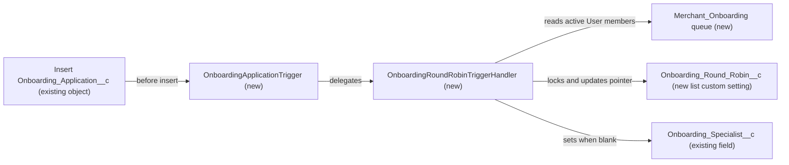

# Implementation spec — Round-robin assignment of new Onboarding Applications

> Assign each new `Onboarding_Application__c` record to the next active member of the Merchant Onboarding queue, in rotation.

_Based on the requirement, the evidence reported by AskCoworker, and read-only org queries where noted. Assumptions and missing evidence are identified below. Specification only — nothing is implemented or deployed._

---

## 1. The requirement

When a new Onboarding Application is created, set its assigned onboarding specialist to the next active member of the Merchant Onboarding queue, rotating through the members in a fixed order. The user clarified that the "onboarding team" is the Merchant Onboarding queue and that inactive users are skipped (*user decision*). The request contained no deploy or data-change instruction.

| # | Responsibility | Trigger | Where it lives |
| --- | --- | --- | --- |
| 1 | Hold the onboarding team roster | Not applicable (configuration) | `Merchant_Onboarding` (Queue, new) |
| 2 | Assign each new application with a blank `Onboarding_Application__c.Onboarding_Specialist__c` to the next active queue member, including in bulk inserts | Before insert of `Onboarding_Application__c` | `OnboardingApplicationTrigger`, `OnboardingRoundRobinTriggerHandler` |
| 3 | Remember the last assigned member across transactions | Written by responsibility 2 | `Onboarding_Round_Robin__c` (list custom setting, new) |
| 4 | Skip inactive users in the rotation | Before insert of `Onboarding_Application__c` | `OnboardingRoundRobinTriggerHandler` |

## 2. Grounding — reuse before building

Target org: `TestWriteSpecDE` (Developer Edition, not a sandbox). API version: `67.0`.

- **`Onboarding_Application__c`** (CustomObject) — label "Onboarding Application", `DurableId` `01Iak00000Dx4JU`; 0 records; internal sharing model `ReadWrite`, external `Private`. _verified by org query_
- **`Onboarding_Application__c.Onboarding_Specialist__c`** (CustomField, Lookup(User)) — description "Onboarding Specialist assigned by the Agent"; `required` false; `deleteConstraint` `SetNull`; no lookup filter. This is the org's field for the assigned specialist, so it is the assignment target. Only reference found: `Onboarding Application Layout` (MetadataComponentDependency). _verified by org query_
- **`Onboarding_Application__c.Status__c`** (CustomField, Picklist) — values `Submitted`, `Under Review`, `Approved`, `Onboarded`. Not used by this design. _verified by org query_
- **`Onboarding_Application__c.OwnerId`** — Lookup(User,Group). Left unchanged. _verified by org query_
- **Automation on `Onboarding_Application__c`** — no Apex triggers (Tooling `ApexTrigger`; the org has no unmanaged triggers at all), no flows (`FlowDefinitionView` by trigger object), no validation rules (Tooling `ValidationRule`), and no unmanaged Apex class body that mentions `Onboarding_Application__c` or `Onboarding_Specialist` (70 unmanaged classes searched). No Agentforce action or topic named for onboarding, assignment, or specialist (Tooling `GenAiFunctionDefinition`, `GenAiPluginDefinition`). _verified by org query_
- **Queues and groups** — the only queues are `Merchant_Messaging_Queue` (supports `MessagingSession`) and `Unqualified_Leads` (supports `Lead`). No queue or public group has "Onboard" in its name or developer name, and `Merchant_Onboarding` does not exist. No role represents an onboarding team (18 roles, all sales, support, or executive). _verified by org query_
- **Assignment rules** — only `Standard` for `Case` and `Lead` exist. _verified by org query_
- **Object access** — `Onboarding_Application__c` CRUD: System Administrator profile and `sfdc_accelerate_dms` permission set (Read, Create, Edit, Delete); Read only: `sfdc_a360_sfcrm_data_extract`, `sfdc_slack`, Analytics Cloud Integration User profile. `Onboarding_Specialist__c` field access: `sfdc_accelerate_dms` (Read, Edit), `sfdc_a360_sfcrm_data_extract` and `sfdc_slack` (Read). _verified by org query_
- **Name checks for new components** — no custom object or setting named like `%Onboard%` other than `Onboarding_Application__c`, none like `%Robin%`; no Apex class named like `%Onboarding%` or `%RoundRobin%`. _verified by org query_
- **Project source** — `force-app/main/default` has no classes, triggers, or objects. _verified by project file_

Candidates examined and rejected: `Region__c.Onboarding_Specialist__c` — a per-region specialist lookup, but `Onboarding_Application__c` has no link to `Region__c` and the user named the queue as the team; `Merchant_Messaging_Queue` and `Unqualified_Leads` — serve other objects and are not the onboarding team; `OwnerId` as the target — the org's own field `Onboarding_Specialist__c` is described as the assigned specialist.

Evidence sources: `sf org display`; `sf sobject list --sobject custom`; `sobject describe` of `Onboarding_Application__c`; Tooling `CustomField`, `FieldDefinition`, `CustomField.Metadata`, `MetadataComponentDependency`, `ApexTrigger`, `ApexClass` bodies, `ValidationRule`, `Layout`, `CustomObject`, `GenAiFunctionDefinition`, `GenAiPluginDefinition`; standard `FlowDefinitionView`, `Group`, `QueueSobject`, `UserRole`, `AssignmentRule`, `ObjectPermissions`, `FieldPermissions`, `EntityDefinition`, `Organization`, `User`, `DataStream`. AskCoworker returned no citedReferences.

## 3. Architecture

Why the pieces are drawn this way:

1. The trigger fires only on insert because the requirement names "new" applications. It sets the field in before-insert context, so no extra DML runs on the application records. _assumption (documented platform behavior)_
2. Apex is used instead of an assignment rule or a flow. Assignment rules exist only for `Lead` and `Case` (and the org has only those two, _verified by org query_), so they cannot serve a custom object. _assumption (documented platform behavior)_ A record-triggered flow is bulkified: in a bulk insert, one Get Records of the pointer serves every record in the batch, so the batch would not rotate; and a flow cannot lock the pointer row, so concurrent inserts could read the same pointer. An Apex before-insert handler loops over `Trigger.new`, advances the pointer per record, and locks the pointer row with `FOR UPDATE`. _assumption (documented platform behavior)_
3. The queue `Merchant_Onboarding` is the roster, because the user named it. The handler reads `GroupMember` rows of the queue whose `UserOrGroupId` is an active `User`, ordered by `UserOrGroupId`. Roles or groups nested in the queue are not expanded. _user decision_ (queue, skip inactive); _assumption_ (ordering, no nesting)
4. The pointer stores the last assigned user Id, not an index, so adding or removing a member does not shift the rotation. The next member is the first active member whose Id sorts after the stored Id, wrapping to the first member. A list custom setting is used because custom metadata records cannot be updated by Apex DML at runtime. _assumption (documented platform behavior)_
5. The handler writes `Onboarding_Specialist__c` only when it is blank, so a value set by the creator (for example the agent the field description mentions, or the `sfdc_accelerate_dms` integration) is kept. `OwnerId` is not changed. _assumption_
6. If the queue has no active User members, the handler leaves the field blank and the insert succeeds. _assumption_

## 4. Metadata changes

**Security**

- **Create `Merchant_Onboarding`** — Queue. Label "Merchant Onboarding". Members: `{MERCHANT_ONBOARDING_MEMBERS}` (named placeholder; the onboarding specialists, as Users). No supported object is added, because records are not owned by the queue. `DoesSendEmailToMembers` false.

**Data model**

- **Create `Onboarding_Round_Robin__c`** — CustomObject (list custom setting, visibility Protected, label "Onboarding Round Robin"). One record, `Name` = `Merchant_Onboarding`, created by the handler on first use. Not placed on any layout; read and written only by Apex.
- **Create `Onboarding_Round_Robin__c.Last_Assigned_User_Id__c`** — CustomField, Text(18), label "Last Assigned User Id". Holds the Id of the last user assigned from the queue. Blank means start from the first member.

**Apex**

- **Create `OnboardingRoundRobinTriggerHandler`** — ApexClass, `without sharing`. Method `assign(List<Onboarding_Application__c> newRecords)`: (1) collect records with blank `Onboarding_Specialist__c`; if none, return; (2) query `Group` by `DeveloperName = 'Merchant_Onboarding'` and `Type = 'Queue'`; (3) query `GroupMember` for that group, keep rows whose `UserOrGroupId` is in `SELECT Id FROM User WHERE IsActive = true`, order by `UserOrGroupId`; if none, return without error; (4) query `Onboarding_Round_Robin__c` where `Name = 'Merchant_Onboarding'` `FOR UPDATE`; (5) for each collected record, pick the first member Id greater than the pointer (wrap to the first), set `Onboarding_Specialist__c`, and move the pointer; (6) upsert the setting record once. Uses 4 SOQL queries and 1 DML statement per trigger invocation, independent of batch size. Lock timeouts are not caught.
- **Create `OnboardingApplicationTrigger`** — ApexTrigger on `Onboarding_Application__c`, event `before insert`. Body calls `OnboardingRoundRobinTriggerHandler.assign(Trigger.new)`.

**Tests**

- **Create `OnboardingRoundRobinTriggerHandlerTest`** — ApexClass (`@IsTest`). Creates test users and queue membership in `@TestSetup` (setup-object DML under `System.runAs` to avoid mixed DML), then covers the cases in Section 7.

## 5. Data 360 (Data Cloud) data involved

Not applicable — this change does not use Data 360. The org has 0 `DataStream` records (_verified by org query_), so nothing ingests `Onboarding_Application__c` today.

## 6. Security considerations

- **Execution context.** The trigger runs in system context and the handler is `without sharing`, so the assignment works for every creator, including the `sfdc_accelerate_dms` integration and System Administrators, without extra grants. Apex DML and SOQL in this handler do not enforce CRUD or FLS, so creators need no access to `Onboarding_Round_Robin__c` and no edit access to `Onboarding_Specialist__c` for the assignment to work. _assumption (documented platform behavior)_
- **Permission sets.** No permission set or profile changes. `Onboarding_Round_Robin__c` is a protected custom setting used only by Apex. The new custom field on the setting gets no profile grants beyond the System Administrator default on deploy.
- **Queue.** Queue membership grants no access to `Onboarding_Application__c`, because the queue owns no records. Assigned specialists see their applications only if they have object Read (today only the System Administrator profile and `sfdc_accelerate_dms` give Create or Edit, _verified by org query_). Record-level access is not a barrier: internal sharing is `ReadWrite`. See Section 8, item 2.
- **Data exposure.** The design writes a User Id into an existing field that `sfdc_a360_sfcrm_data_extract` and `sfdc_slack` can already read. No new data category is exposed.
- **Bypass.** A creator can bypass the rotation by setting `Onboarding_Specialist__c` on insert. That is intended (item 5 of Section 3).

## 7. Testing strategy

All cases are in `OnboardingRoundRobinTriggerHandlerTest`. No test has been run.

| # | Case | Expected result |
| --- | --- | --- |
| 1 | Insert 1 record, blank specialist, 3 active members | Assigned to the member with the lowest Id; pointer = that Id |
| 2 | Insert 6 records one at a time, 3 active members | Members A, B, C, A, B, C in Id order (wrap-around) |
| 3 | Bulk: insert 200 records in one DML, 3 active members | Each member assigned 66 or 67 records, in rotation; one pointer DML |
| 4 | Insert with `Onboarding_Specialist__c` already set | Value unchanged; pointer unchanged |
| 5 | Mixed batch: some records pre-set, some blank | Only blank records assigned; rotation counts only them |
| 6 | Queue has 1 inactive and 2 active members | Inactive member never assigned |
| 7 | Queue has no active members, or the queue is missing | Insert succeeds; field stays blank; no exception |
| 8 | Pointer Id belongs to a member removed from the queue | Next member is the first Id greater than the stored Id; no error |
| 9 | Insert as a user with a permission set granting only `Onboarding_Application__c` Create (no access to `Onboarding_Round_Robin__c`), using `System.runAs` | Assignment still works (verifies the system-context assumption) |
| 10 | Update an existing record with a blank specialist | No assignment (trigger is insert only) |

Recommended verification (manual, after deploy with real members): insert records from the UI and through the `sfdc_accelerate_dms` integration and confirm rotation; confirm that two concurrent inserts do not assign the same member twice in a row (`FOR UPDATE` behavior).

## 8. Open decisions

### Open

1. **Queue members (blocking for delivery).** `{MERCHANT_ONBOARDING_MEMBERS}` in `Merchant_Onboarding` is unknown. With no active members the feature assigns nothing. Recommended: the onboarding lead supplies the list of specialist Users.
2. **Specialists' access to Onboarding Applications (non-blocking).** Only the System Administrator profile and `sfdc_accelerate_dms` grant Create or Edit on `Onboarding_Application__c` (_verified by org query_). If the specialists are not administrators, they cannot open assigned records. Proposal (not in inventory): a dedicated permission set with Read and Edit on `Onboarding_Application__c` and its fields, assigned to queue members.
3. **Deployment sequence (non-blocking).** Deploy `Onboarding_Round_Robin__c` and its field, then the handler, trigger, and test together, then the queue; then add members in Setup (or in the Queue metadata once the list is known). No backfill: the object has 0 records (_verified by org query_).
4. **Load-bearing assumptions.** (a) Before-insert field assignment in a system-context trigger needs no FLS on `Onboarding_Specialist__c` and no access to the custom setting (Section 7, case 9). (b) `FOR UPDATE` on a list custom setting record serializes concurrent inserts (manual verification in Section 7). (c) `GroupMember` rows of inactive users stay in the queue, so the active filter is needed (Section 7, case 6).
5. **Uncovered transitions (non-blocking).** Records whose specialist is cleared later, or whose specialist is deactivated, are not reassigned. The requirement covers new records only. Undelete does not fire an insert trigger, so restored records keep their old value.
6. **Unknown writer of `Onboarding_Specialist__c` (non-blocking).** The field description says an agent assigns it, but no agent action, flow, or Apex that writes it was found (_verified by org query_, partial: managed code and agent instructions were not searched). The blank-only rule keeps any value such a writer sets on insert.

### Resolved

- **Team (user decision).** The onboarding team is the Merchant Onboarding queue; inactive users are skipped. The queue does not exist in the org (_verified by org query_), so it is a Create.
- **Assignment target (assumption).** `Onboarding_Specialist__c`, from its description "Onboarding Specialist assigned by the Agent"; `OwnerId` unchanged. Decided without a question because the org's field description answers it.
- **Overwrite (assumption).** Assign only when the field is blank, so values set by other creators are kept.
- **"New" (assumption).** Means insert, from the requirement wording; `Status__c` is not a filter.
- **Lock timeout (assumption).** Not caught: a failed lock fails the insert loudly and the caller can retry, rather than saving an unassigned record silently.
- **AskCoworker corrections.** (a) D1 said the object had no business fields besides `Status__c`; Tooling `CustomField` shows 8 custom fields, including `Onboarding_Specialist__c`. (b) D2 said all roles have null names; `UserRole` shows 18 named roles. (c) The inventory call claimed `Onboarding_Specialist__c` is absent and proposed creating it; the field exists (Tooling `CustomField` `00Nak00004nK0ThEAK`), so that row was dropped. (d) The inventory call proposed a `Queue_Id__c` and index-based pointer and a queue supported object; replaced by a name-keyed record with `Last_Assigned_User_Id__c` (robust to membership changes) and no supported object (records are not owned by the queue). (e) R and T said creators need Read and Edit on the custom setting; Apex in system context does not enforce CRUD, so no grant was added. (f) R and T said the org has 1 active standard user; the query shows 4. After two wrong claims, every AskCoworker fact kept in this spec was verified by org query or is tagged as documented platform behavior.
- **Dropped AskCoworker proposals.** Try-catch with Platform Event logging on lock timeout, and a cross-transaction pointer test with `SeeAllData`, were dropped as unrequested or covered by cases 2 and 8.

## 9. Change set

| # | Action | Type | API name | Module | Why |
| --- | --- | --- | --- | --- | --- |
| 1 | Create | Queue | `Merchant_Onboarding` | force-app/main/default/queues | Onboarding team roster named by the user; does not exist |
| 2 | Create | CustomObject | `Onboarding_Round_Robin__c` | force-app/main/default/objects | List custom setting holding the rotation pointer |
| 3 | Create | CustomField | `Onboarding_Round_Robin__c.Last_Assigned_User_Id__c` | force-app/main/default/objects/Onboarding_Round_Robin__c/fields | Last assigned user Id |
| 4 | Create | ApexClass | `OnboardingRoundRobinTriggerHandler` | force-app/main/default/classes | Bulk-safe, locked round-robin assignment of `Onboarding_Specialist__c` |
| 5 | Create | ApexTrigger | `OnboardingApplicationTrigger` | force-app/main/default/triggers | Fires the handler before insert |
| 6 | Create | ApexClass | `OnboardingRoundRobinTriggerHandlerTest` | force-app/main/default/classes | Tests rotation, bulk, skip rules, and access |

A before-insert Apex trigger assigns each new application with a blank specialist to the next active member of the new `Merchant_Onboarding` queue, using a locked custom-setting pointer.

Total: 6 · Create: 6 · Update: 0 · Delete: 0
