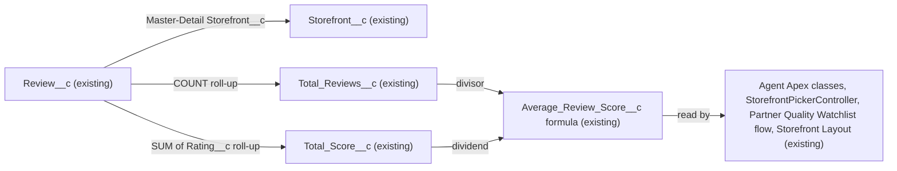

# Implementation spec — Storefront average star rating

> Confirm that each storefront already carries an average star rating that recalculates whenever a review is created, changed, or deleted.

_Based on the requirement, the evidence reported by AskCoworker, and read-only org queries where noted. Assumptions and missing evidence are identified below. Specification only — nothing is implemented or deployed._

---

## 1. The requirement

The requirement asks for an average star rating per storefront that updates whenever a review comes in; the org already meets it with two roll-up summary fields and a formula field on `Storefront__c`, so this spec makes no metadata changes. The request contained no deploy or data-change instruction.

| # | Responsibility | Trigger | Where it lives |
| --- | --- | --- | --- |
| 1 | Hold a star rating on each review | Review creation | `Review__c.Rating__c` (existing) |
| 2 | Count and sum the ratings per storefront | Insert, update, delete, or undelete of a `Review__c` record | `Storefront__c.Total_Reviews__c` and `Storefront__c.Total_Score__c` (existing roll-up summaries) |
| 3 | Show the average rating per storefront | Recalculated at read time from the roll-ups | `Storefront__c.Average_Review_Score__c` (existing formula) |

## 2. Grounding — reuse before building

Target org: `TestWriteSpecDE` (Developer Edition, not a sandbox, org ID `00Dak00001COqNeEAL`). API version: `67.0`.

- **`Review__c.Storefront__c`** (CustomField, Master-Detail) — `referenceTo` is `Storefront__c` and it is not nillable, so every review has a parent storefront and roll-up summaries are possible. _verified by org query_
- **`Review__c.Rating__c`** (CustomField, Number, precision 1, scale 0) — the star value. Its description reads "The numerical rating provided by the customer, typically ranging from 1 (poor) to 5 (excellent)." It is nillable at field level. _verified by org query_
- **`Storefront__c.Total_Reviews__c`** (CustomField, Roll-Up Summary) — `summaryOperation` `count`, `summaryForeignKey` `Review__c.Storefront__c`, `summaryFilterItems` empty (no filter). _verified by org query_
- **`Storefront__c.Total_Score__c`** (CustomField, Roll-Up Summary) — `summaryOperation` `sum`, `summarizedField` `Review__c.Rating__c`, `summaryFilterItems` empty. Description: "The total score of the storefronts reviews, used to calculate the average." _verified by org query_
- **`Storefront__c.Average_Review_Score__c`** (CustomField, Formula Number, precision 18, scale 1) — formula `Total_Score__c / Total_Reviews__c`, `formulaTreatBlanksAs` `BlankAsZero`. _verified by org query_
- **Current data** — 21 `Storefront__c` records; 92 `Review__c` records, all 92 with a non-null `Rating__c` between 1 and 5, and all 92 with a blank `Status__c`. Sample values match the formula (for example `Total_Reviews__c` 4, `Total_Score__c` 18, `Average_Review_Score__c` 4.5). Two storefronts ("The Savory Spot", "Urban Table") have `Total_Reviews__c` 0 and return `Average_Review_Score__c` as null through the API. _verified by org query_
- **Readers of `Storefront__c.Average_Review_Score__c`** — `MetadataComponentDependency` lists `Storefront Layout` (Layout), Apex classes `AgentStorefrontActions`, `AgentGetStorefrontsByAccountActions`, `StorefrontPickerController`, `MerchantRiskScoreAction`, and the flow `Partner Quality Watchlist`. A search of unmanaged Apex bodies found the same four classes. _verified by org query_
- **Review writer `AgentReviewActions`** (ApexClass) — rejects a request with a null rating ("rating is required."), sets `Rating__c`, sets `Status__c = 'Submitted'`, and inserts the review. _verified by org query (class body)_
- **No custom automation on either object** — Tooling `ApexTrigger` with `TableEnumOrId IN ('Review__c','Storefront__c')`: 0 rows; `FlowDefinitionView` with `TriggerObjectOrEventId IN ('Review__c','Storefront__c')`: 0 rows; Tooling `ValidationRule` for both objects' `EntityDefinitionId`: 0 rows. _verified by org query_
- **No other field for the same concept** — Tooling `CustomField` search on `DeveloperName` LIKE `%Rating%`, `%Review%`, `%Star%`, `%Average%` across all objects found only the fields above, managed-package risk ratings (`sc_ext`, `shield_ext`), and Data 360 data model object fields (`9sd…`), none of which represent storefront review ratings. _verified by org query_
- **`AgentSummarizeReviewsActions`** (ApexClass) — computes an in-memory, date-windowed average for summaries and does not write `Storefront__c`. _reported by AskCoworker_

Candidates examined and rejected: a new record-triggered flow or Apex trigger to compute the average — the platform roll-ups already recalculate on every child change, so new automation would duplicate them; `AgentSummarizeReviewsActions` — it returns a windowed, non-persistent average, not a stored per-storefront value.

Evidence sources: `sf sobject describe` on `Storefront__c` and `Review__c`; Tooling `EntityDefinition`, `CustomField` (including `Metadata` for the three aggregate fields), `ApexTrigger`, `ValidationRule`, `ApexClass` bodies, `MetadataComponentDependency`; standard `FlowDefinitionView`, `Organization`, and aggregate SOQL on `Review__c` and `Storefront__c`. AskCoworker returned no citedReferences.

## 3. Architecture

Why the pieces are drawn this way:

1. `Review__c` is the detail of `Storefront__c` through `Review__c.Storefront__c` (_verified by org query_).
2. `Total_Reviews__c` counts every child review and `Total_Score__c` sums `Review__c.Rating__c`, both with no filter (_verified by org query_).
3. The platform recalculates roll-up summary fields when a detail record is inserted, updated, deleted, or undeleted, or when it is reparented (when reparenting is allowed); no custom automation is needed for "update whenever a review comes in" (_assumption (documented platform behavior)_).
4. `Average_Review_Score__c` is a formula, so it is evaluated when read and always reflects the current roll-up values (_verified by org query_ for the formula; _assumption (documented platform behavior)_ for read-time evaluation).
5. The readers in the last node come from `MetadataComponentDependency` and Apex body search (_verified by org query_). They are unchanged.

## 4. Metadata changes

No metadata changes are required.

## 5. Data 360 (Data Cloud) data involved

Not applicable — this change does not use Data 360.

## 6. Security considerations

No access changes. Roll-up summary and formula fields are calculated by the platform regardless of the running user's sharing; who can see `Storefront__c.Average_Review_Score__c` is governed by existing field-level security, which this spec does not change.

## 7. Testing strategy

No tests are added because nothing changes. Recommended verification:

1. Insert a `Review__c` with `Rating__c` 5 on a storefront with known totals; confirm `Total_Reviews__c` increases by 1, `Total_Score__c` by 5, and `Average_Review_Score__c` shows the new average rounded to one decimal place.
2. Change a review's `Rating__c`, then delete and undelete it; confirm the average follows each step (verifies the load-bearing platform assumption in Section 8).
3. Open "The Savory Spot" or "Urban Table" (0 reviews) in the UI and record how `Average_Review_Score__c` is displayed (expected "#Error!" in the UI, null through the API).

## 8. Open decisions

### Open

1. **Display for storefronts with no reviews (non-blocking).** The formula `Total_Score__c / Total_Reviews__c` divides by zero when `Total_Reviews__c` is 0; two storefronts are in that state today (_verified by org query_). The API returns null; the record page is expected to show "#Error!" (_assumption (documented platform behavior)_). Proposal, not in the inventory: change the formula to `IF(Total_Reviews__c = 0, NULL, Total_Score__c / Total_Reviews__c)` with `BlankAsBlank`, which keeps the API result null for readers and shows a blank in the UI.
2. **Reviews without a rating (non-blocking).** `Total_Reviews__c` counts every review, while `Total_Score__c` sums only non-null ratings, so a review with a blank `Rating__c` would lower the average. `Rating__c` is not required at field level, but all 92 reviews have a rating and `AgentReviewActions` rejects a null rating (_verified by org query_). Proposal, not in the inventory: add a roll-up filter `Rating__c` not equal to blank on `Total_Reviews__c`, or make `Rating__c` required.
3. **Load-bearing assumption.** The design relies on the documented behavior that roll-up summary fields recalculate on child insert, update, delete, and undelete. Verification case 2 in Section 7 checks it.

### Resolved

- **Which reviews count (assumption).** `Review__c.Status__c` has values `Submitted` and `Published`, and the roll-ups have no filter (_verified by org query_). The requirement says the rating updates "whenever a review comes in", so every review counts on arrival; no status filter is added.
- **Already met.** The inventory steps (I, R, T) were skipped because verification showed the requirement is met.
- **AskCoworker corrections.** AskCoworker said the `Average_Review_Score__c` formula body and the roll-up filters were not queryable and could not rule out validation rules; Tooling queries read the formula (`Total_Score__c / Total_Reviews__c`), showed both roll-up filters are empty, and found 0 validation rules. AskCoworker's proposals to inspect these in Setup are dropped, as is its unverified remark about `AgentUpdateStorefrontDetailsActions` and `AgentUpdateStorefrontHoursActions`, which do not appear among the readers or writers of the aggregate fields.

## 9. Change set

| # | Action | Type | API name | Module | Why |
| --- | --- | --- | --- | --- | --- |

No metadata changes are required. The existing COUNT and SUM roll-ups on `Storefront__c` feed the `Average_Review_Score__c` formula, which updates whenever a review is added, changed, or removed.

Total: 0 · Create: 0 · Update: 0 · Delete: 0
