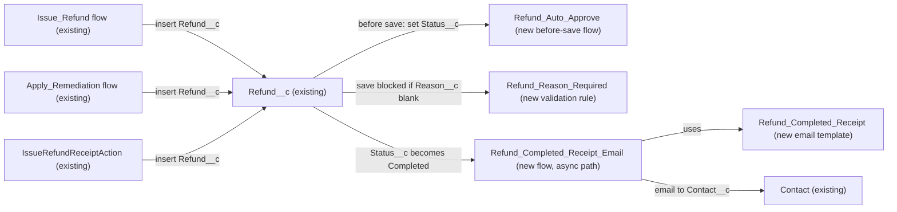

# Implementation spec — Refund overhaul: required reason, auto-approval at $25 or less, completion receipt

> Enforce a reason on every `Refund__c`, auto-approve refunds of $25 or less (others wait as `Pending`), and email the customer a receipt when a refund reaches `Completed`.

_Based on the requirement, the evidence reported by AskCoworker, and read-only org queries where noted. Assumptions and missing evidence are identified below. Specification only — nothing is implemented or deployed._

---

## 1. The requirement

The requirement asks for four refund rules; by *user decision* the "block refunds larger than the original order" rule is dropped because no order amount exists on or is linked to `Refund__c`, and the auto-approval limit is "$25 or less" (`<= 25`), which replaces the original "under $25" wording. No out-of-scope instruction (deploy, data change) was present.

| # | Responsibility | Trigger | Where it lives |
| --- | --- | --- | --- |
| 1 | Every refund has a non-blank reason | `Refund__c` insert and update | `Refund__c.Refund_Reason_Required` (new validation rule) |
| 2 | Refunds of $25 or less are approved automatically; larger ones start as `Pending` | `Refund__c` insert; update of `Amount__c` while `Pending` | `Refund_Auto_Approve` (new before-save flow) |
| 3 | The customer receives a receipt email when the refund is completed | `Refund__c.Status__c` becomes `Completed` (insert or update) | `Refund_Completed_Receipt_Email` (new flow) and `unfiled$public/Refund_Completed_Receipt` (new email template) |
| 4 | Existing tests reflect the new approval rule | Apex test run | `IssueRefundReceiptActionTest` (updated) |
| — | Block refunds larger than the original order | Not applicable | Dropped by *user decision* (see Section 8) |

## 2. Grounding — reuse before building

Target org: `TestWriteSpecDE` (Developer Edition, not a sandbox; *verified by org query*). API version: `67.0` (*verified by project file* `sfdx-project.json`).

- **`Refund__c`** (CustomObject, label "Refund", key prefix `a0E`, no namespace) — the object all four rules act on. `Name` is an auto-number. _verified by org query_
- **`Refund__c.Reason__c`** (textarea, length 32768, `nillable: true`, no default) — the reason field already exists; nothing requires it. _verified by org query_
- **`Refund__c.Amount__c`** (currency, `nillable: true`) — the value compared with the $25 limit. _verified by org query_
- **`Refund__c.Status__c`** (picklist; values `Pending`, `Approved`, `Processing`, `Completed`, `Failed`, `Cancelled`; default `Pending`) — the approval and completion state. _verified by org query_
- **`Refund__c.Contact__c`** (Lookup(Contact), `nillable: true`) — the customer who receives the receipt. _verified by org query_
- **`Refund__c.Issue_Date__c`** (date) — set to today by all three creators; used in the receipt. _verified by org query_
- **`Issue_Refund`** (Flow, autolaunched, active) — creates `Refund__c` with `Status__c` string value `Approved`, `Reason__c` from input `refundReason`, `Payment_Method__c` `Original Payment Method`. _verified by org query_
- **`Apply_Remediation`** (Flow, autolaunched, active) — creates `Refund__c` with `Status__c` `Approved` and `Reason__c` from `refundReason`. _verified by org query_
- **`IssueRefundReceiptAction`** (ApexClass, `with sharing`, invocable, backs GenAiFunction `Issue_Refund_Receipt`) — rejects a blank `refundReason` and a non-positive amount, inserts `Refund__c` with `r.Status__c = 'Approved'`, then re-queries the record and returns its `Status__c` in the receipt. _verified by org query_
- **`IssueRefundReceiptActionTest`** (ApexClass) — `issuesRefundReceipt` inserts a 42.50 refund and asserts `System.assertEquals('Approved', out.receipt.status)`. _verified by org query_
- **Existing automation on `Refund__c`**: 0 Apex triggers, 0 record-triggered flows (`FlowDefinitionView WHERE TriggerObjectOrEventId IN ('Refund__c')`), 0 validation rules, 0 approval processes (`ProcessDefinition`). _verified by org query_
- **Readers and creators of `Refund__c`** (MetadataComponentDependency on the object and on `Amount__c`, `Reason__c`, `Status__c`, plus a search of all 70 non-namespaced Apex class bodies): `IssueRefundReceiptAction`, `IssueRefundReceiptActionTest`, flows `Issue_Refund` and `Apply_Remediation`, layout `Refund__c-Refund Layout`. No FlexiPage exists for `Refund__c`. Reports and list views were not checked. _verified by org query_
- **Email setup**: 0 email templates whose name contains "Refund" or "Receipt", 0 email folders, 0 `OrgWideEmailAddress` records. _verified by org query_
- **Data shape**: 0 `Refund__c` records; 198 contacts have an email address. _verified by org query_
- **Access to `Refund__c`**: Read, Create, Edit, Delete through permission sets `Pronto_Deep_Dive_Workshop`, `Agentforce_Reference_App`, `sfdc_accelerate_dms` and one profile; Read only through `sfdc_a360_sfcrm_data_extract`, `sfdc_slack` and one profile. _verified by org query_
- **Orders**: the standard `Order` object has 0 records and no lookup from `Refund__c`; the Apex comments in `OrderStatusCardAction` and `OrderPickerController` say orders "live in the external Heroku Orders API" and both return sample data; a `Pronto_Orders_API` named credential exists. _verified by org query_

Candidates examined and rejected: `Transaction__c` (description "Stores transactions - sales and (full/partial) refunds", fields `Total_Amount__c`, `Refund_Reason__c`, `Transaction_Type__c` `Sale`/`Refund`) — 0 records, no readers, no link to `Refund__c`; standard `Refund` object — 0 records and unused by any refund creator; standard `Order.TotalAmount` — no records and no relationship; a custom metadata type for the $25 limit — no second reader needs it.

Evidence sources: `sf org display`; custom object list; `Refund__c` and `Transaction__c` describes and Tooling `CustomField`; Tooling `ApexTrigger`, `ValidationRule`, `Flow.Metadata`, `FlowDefinition`, `MetadataComponentDependency`, `ApexClass` bodies, `Layout`, `FlexiPage`, `NamedCredential`, `GenAiFunctionDefinition`; standard `FlowDefinitionView`, `ProcessDefinition`, `EmailTemplate`, `Folder`, `OrgWideEmailAddress`, `ObjectPermissions`, `FieldPermissions`, `Organization`, `DataStream`, record counts. AskCoworker returned no citedReferences.

## 3. Architecture

Why the pieces are drawn this way:

1. The three creators are the only components that insert `Refund__c` (*verified by org query*). They are not changed: the before-save flow is the single place that decides `Status__c` on insert, so their hard-coded `Approved` is overridden for amounts above $25 without editing three components.
2. `Refund_Auto_Approve` is a before-save record-triggered flow, the standard declarative tool for setting a field on the same record. A validation rule cannot set values, and Apex is not needed. On save, before-save flows run before custom validation rules (*assumption (documented platform behavior)*; AskCoworker reported the opposite order, see Section 8).
3. `Refund_Reason_Required` is a validation rule because it applies to every insert and update from every channel (UI, API, flows, Apex). A layout "required" setting would cover only the UI.
4. `Refund_Completed_Receipt_Email` sends the receipt on an asynchronous path so that an email failure does not roll back the save that completed the refund. It uses the flow Send Email action with an email template, recipient `Contact__c`, and related record `Refund__c` (*assumption (documented platform behavior)*).
5. No component checks refund amount against an order: that rule is dropped (*user decision*).

## 4. Metadata changes

**Data model**

- **Create `Refund__c.Refund_Reason_Required`** — ValidationRule on `Refund__c`. Active. Error condition formula: `ISBLANK(Reason__c)`. Error message: "Enter a reason for this refund." Error location: field `Reason__c`. Fires on every insert and update from every caller. It does not fire on delete or undelete (*assumption (documented platform behavior)*). No existing records to clean up (0 records, *verified by org query*).

**Automation**

- **Create `Refund_Auto_Approve`** — Flow, record-triggered on `Refund__c`, "Fast Field Updates" (before save), trigger "A record is created or updated". Entry condition formula: `ISNEW() || (ISCHANGED({!$Record.Amount__c}) && ISPICKVAL({!$Record.Status__c}, 'Pending'))`. Constant `AutoApproveLimit` = 25 (Currency). Decision `Route_Status`: outcome `Not_Intake_Status` when `ISNEW()` and `Status__c` is not blank, `Pending`, or `Approved` (for example a record loaded as `Completed`) → no change; outcome `Auto_Approve` when `NOT(ISBLANK({!$Record.Amount__c})) && {!$Record.Amount__c} <= {!AutoApproveLimit}` → Assignment `Status__c` = `Approved`; default outcome → Assignment `Status__c` = `Pending` (on update this is already the value, so nothing changes). A blank amount is not approved automatically. A record approved manually and then edited does not re-enter the flow.
- **Create `Refund_Completed_Receipt_Email`** — Flow, record-triggered on `Refund__c`, "Actions and Related Records" (after save), trigger "A record is created or updated", condition `Status__c` Equals `Completed`, "Only when a record is updated to meet the condition requirements" (so it fires once on the transition into `Completed`, including a record created as `Completed`). The immediate path is empty. Run Asynchronously path: Decision `Has_Recipient` — `{!$Record.Contact__c}` is not null and `{!$Record.Contact__r.Email}` is not blank; otherwise end without error. Get Records `Get_Receipt_Template` on `EmailTemplate` where `DeveloperName` = `Refund_Completed_Receipt`, first record. Action Send Email: Email Template ID `{!Get_Receipt_Template.Id}`, Recipient ID `{!$Record.Contact__c}`, Related Record ID `{!$Record.Id}`, log email on send true. Fault connector on the action ends the path (the refund save is already committed).

**UX**

- **Create `unfiled$public/Refund_Completed_Receipt`** — EmailTemplate, Classic Text, related entity `Refund__c`, available for use, folder `unfiled$public` (0 email folders exist, *verified by org query*). Subject: "Your refund {!Refund__c.Name} is complete". Body: greeting with `{!Contact.FirstName}`, refund number `{!Refund__c.Name}`, amount `{!Refund__c.Amount__c}`, reason `{!Refund__c.Reason__c}`, issue date `{!Refund__c.Issue_Date__c}`, and a line that the refund has been completed. The reason is included because the existing in-chat receipt from `IssueRefundReceiptAction` already shows it to the customer (*verified by org query*).

**Tests**

- **Update `IssueRefundReceiptActionTest`** — ApexClass. In `issuesRefundReceipt` (42.50 refund) change the assertion to `'Pending'`. Add `approvesRefundAtOrUnderLimit` (amounts 25.00 and 10.00 assert `'Approved'`), `pendsRefundOverLimit` (25.01 asserts `'Pending'`), a bulk method inserting 200 `Refund__c` records with mixed amounts that asserts each status, a method inserting a `Refund__c` with blank `Reason__c` through `Database.insert(record, false)` that asserts a `FIELD_CUSTOM_VALIDATION_EXCEPTION`, and a method that updates a `Pending` 30.00 refund to 20.00 and asserts `Approved`. Retrieve the class before editing (the local `force-app/main/default/classes` folder is empty, *verified by project file*).

## 5. Data 360 (Data Cloud) data involved

Not applicable — this change does not use Data 360. `SELECT COUNT() FROM DataStream` returned 0 (*verified by org query*); `sfdc_a360_sfcrm_data_extract` has Read on `Refund__c` but no data stream ingests it.

## 6. Security considerations

- **Execution context.** The validation rule applies to every user and integration. Both record-triggered flows run in system context without sharing (*assumption (documented platform behavior)*), so no user needs extra access for status changes or the email lookup. The asynchronous path runs as the Automated Process user (*assumption (documented platform behavior)*, load-bearing; see Section 8).
- **CRUD/FLS.** No new fields or objects. No permission set or profile changes. Existing grants on `Refund__c` stay as listed in Section 2 (*verified by org query*).
- **Approval control.** Any user with Edit on `Status__c` (the three edit permission sets listed in Section 2) can still set `Approved` by hand for amounts above $25. The requirement does not ask for an approval process, so none is added (Section 8).
- **Data exposure.** The receipt sends the refund number, amount, reason, and issue date to the email address of `Refund__c.Contact__c`. The reason text is written by agents and flows; it becomes customer-visible by email (it is already customer-visible in the in-chat receipt).
- **Sender.** 0 `OrgWideEmailAddress` records exist (*verified by org query*), so the sender is the running user's address; see Section 8.

## 7. Testing strategy

- **`IssueRefundReceiptActionTest` (Apex, updated)** covers the insert path end to end through DML, which exercises `Refund_Auto_Approve` and `Refund_Reason_Required` together: 42.50 → `Pending`; 25.00 and 10.00 → `Approved` (boundary); 25.01 → `Pending`; 200-record bulk insert with mixed amounts; blank `Reason__c` rejected with `FIELD_CUSTOM_VALIDATION_EXCEPTION`; update of a `Pending` 30.00 refund to 20.00 → `Approved`. It also keeps `validatesInputs`. Tests have not been run.
- **Recommended verification (manual, sandbox or this org):**
  1. Create a refund in the UI with a blank reason: the save is blocked with the message on `Reason__c`. Edit an existing refund and clear the reason: blocked.
  2. Run `Issue_Refund` from Flow Builder debug with amount 20 and then 40: the records show `Approved` and `Pending`. Repeat for `Apply_Remediation` with 40: `Pending`.
  3. Validate the save order assumption: create a refund with a blank reason and amount 10; the validation error appears and no record is saved.
  4. Set a refund with a contact that has an email to `Completed`: one email arrives using the template, and the email is logged as an activity. Save the record again while `Completed`: no second email.
  5. Set a refund with no contact, and one whose contact has no email, to `Completed`: the save succeeds and no email is sent.
  6. Confirm the sender address the customer sees on the asynchronous path (Automated Process user); if the send fails, check the flow error email and create an org-wide address (Section 8).
  7. Create a refund directly with status `Completed` (for example through the API): one receipt email is sent and the status is not changed by `Refund_Auto_Approve`.
- `Refund_Completed_Receipt_Email` has no Flow Test because its only logic runs on an asynchronous path.

## 8. Open decisions

### Open

1. **Email deliverability and sender (blocking for delivery).** Setup > Deliverability must be "All email" for receipts to leave the org; this setting cannot be read with the allowed commands. With 0 `OrgWideEmailAddress` records, the sender on the asynchronous path is the Automated Process user (*assumption (documented platform behavior)*, **load-bearing**). Recommended default: create and verify an org-wide address (for example a refunds address) in Setup and set it as the sender on the Send Email action before go-live.
2. **Callers now see `Pending` for refunds above $25 (non-blocking).** The Agentforce actions `Issue_Refund_Receipt` (`IssueRefundReceiptAction`), `Issue_Refund`, and `Apply_Remediation` currently create every refund as `Approved` (*verified by org query*). After this change, refunds above $25 are `Pending` (*assumption*: the user had no preference; this is the reading of "auto-approve under $25"). `IssueRefundReceiptAction` returns the re-queried status, so its receipt card shows `Pending`, but its invocable description says "Creates an approved refund" and `Apply_Remediation`'s description says "creating an approved Refund__c record". Proposal: update those descriptions (and the `Issue_Refund_Receipt` agent action instructions) so the agent does not tell customers a pending refund is approved.
3. **Who approves `Pending` refunds (non-blocking).** No approval process or approver exists (*verified by org query*: 0 `ProcessDefinition` rows). Users with Edit on `Status__c` approve by editing the field. Proposal: an approval process if a named approver is required.
4. **Zero or negative amounts (non-blocking).** `IssueRefundReceiptAction` rejects amounts `<= 0`; the two flows do not (*verified by org query*). `Refund_Auto_Approve` approves any non-blank amount `<= 25`, including 0 or negative values. Proposal: a validation rule `Amount__c <= 0` if such refunds must be blocked.
5. **Uncovered transition (non-blocking).** A refund approved automatically and then edited to an amount above $25 stays `Approved` (the flow only re-evaluates `Pending` records). Adding the reverse rule was not asked for.
6. **Integration writers (non-blocking).** `sfdc_accelerate_dms` has Create and Edit on `Refund__c` (*verified by org query*); whether it writes refunds without a reason could not be checked. The validation rule blocks such writes.
7. **Reports and list views (non-blocking).** Check reports and list views on `Refund__c` for any that assume every refund is `Approved`.
8. **Deployment sequence (non-blocking).** Deploy in one package: `unfiled$public/Refund_Completed_Receipt` before `Refund_Completed_Receipt_Email`; `Refund_Reason_Required` and `Refund_Auto_Approve` together with the updated `IssueRefundReceiptActionTest` (the old assertion fails once `Refund_Auto_Approve` is active). Activate both flows after deployment. No data step: 0 `Refund__c` records.

### Resolved

- **Original-order check dropped (user decision).** The user said to drop the check "if there's no order amount." `Refund__c` has no order link, standard `Order` has 0 records, `Transaction__c` has 0 records and no link, and orders live in an external API that is stubbed (*verified by org query*). Mapping this answer to "drop" is an *assumption* based on those facts.
- **Threshold is "$25 or less" (user decision).** The user's answer "auto-approve <= $25" replaces the requirement's "under $25".
- **Refunds above $25 start as `Pending` (assumption).** The user had no preference; `Pending` is the picklist default and the only pre-approval value (*verified by org query*).
- **Receipt channel is email to `Refund__c.Contact__c` (assumption).** The user had no preference; `Contact__c` is described in the org as the contact receiving the refund (*reported by AskCoworker*) and is the only customer link on the record (*verified by org query*).
- **"Completed" means `Status__c` = `Completed` (assumption)**, from the picklist value of the same name (*verified by org query*).
- **Threshold stored as a flow constant (assumption).** Only one component reads it; a custom metadata type was proposed by AskCoworker and dropped.
- **Creators left unchanged (assumption).** The before-save flow is the single decision point for status; editing three creators to remove `Approved` would duplicate the rule.
- **AskCoworker corrections.** (a) It reported that validation rules run before before-save flows; documented save order runs before-save flows first (*assumption (documented platform behavior)*). (b) It reported that validation rules fire on undelete; they do not (*assumption (documented platform behavior)*). (c) Its inventory ran the status flow on every update and set `Pending` in the else branch, which would undo manual approvals; corrected to insert plus amount changes while `Pending`. (d) Its inventory limited the receipt flow to updates; corrected to create or update so a record created as `Completed` also gets a receipt. (e) Its open decision that the creators might not pass `Reason__c` is contradicted by the flow and Apex bodies. (f) It left a blank amount at the caller's `Approved`; corrected to `Pending`. After these wrong claims, every AskCoworker fact kept in this spec was checked by org query except the `Contact__c` field description. Dropped AskCoworker proposals: `Order__c` lookup and `Order_Amount__c` field, `Refund_Settings__mdt`, an Apex callout to the orders API.

## 9. Change set

| # | Action | Type | API name | Module | Why |
| --- | --- | --- | --- | --- | --- |
| 1 | Create | ValidationRule | `Refund__c.Refund_Reason_Required` | force-app/main/default/objects/Refund__c/validationRules | Requires a reason on every refund from every channel |
| 2 | Create | Flow | `Refund_Auto_Approve` | force-app/main/default/flows | Sets `Approved` for amounts `<= 25`, otherwise `Pending`, on insert and on amount changes while `Pending` |
| 3 | Create | Flow | `Refund_Completed_Receipt_Email` | force-app/main/default/flows | Emails the customer a receipt when the refund becomes `Completed` |
| 4 | Create | EmailTemplate | `unfiled$public/Refund_Completed_Receipt` | force-app/main/default/email/unfiled$public | Receipt content used by the receipt flow |
| 5 | Update | ApexClass | `IssueRefundReceiptActionTest` | force-app/main/default/classes | Existing assertion expects `Approved` for 42.50; adds boundary, bulk, reason, and update cases |

A validation rule and a before-save flow enforce the reason and approval rules for all refund creators, and an asynchronous record-triggered flow emails the receipt on completion.

Total: 5 · Create: 4 · Update: 1 · Delete: 0
