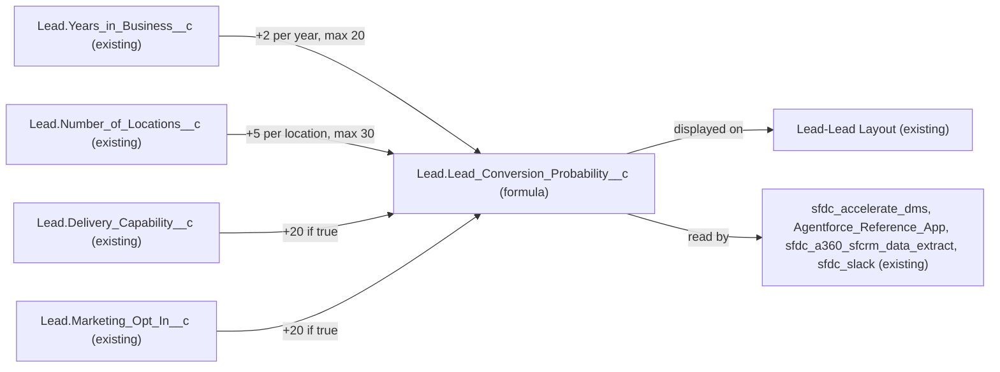

# Implementation spec — Automatic lead conversion probability

> Calculate `Lead.Lead_Conversion_Probability__c` automatically from years in business, number of locations, delivery capability, and marketing opt-in, using a formula field.

_Based on the requirement, the evidence reported by AskCoworker, and read-only org queries where noted. Assumptions and missing evidence are identified below. Specification only — nothing is implemented or deployed._

---

## 1. The requirement

Lead conversion probability must be calculated automatically on every Lead. The user defined the scoring rule (*user decision*): base 10, +20 if Delivery Capability, +5 per location up to 30, +2 per year in business up to 20, +20 if Marketing Opt-in, capped at 100. The user's rule adds Marketing Opt-in, which the original wording did not name; the spec follows the user's latest answer. The request contained no deploy or data-change instruction.

| # | Responsibility | Trigger | Where it lives |
| --- | --- | --- | --- |
| 1 | Calculate the conversion probability score from the four inputs with the user's weights, caps, and 100 maximum | Any read of a Lead (formula evaluates on read, so every insert and every change to an input is reflected) | `Lead.Lead_Conversion_Probability__c` (converted to a formula field) |
| 2 | Show the score to the people and integrations that already read it | Record view, API query | `Lead-Lead Layout` (existing) and existing field permissions (existing) |

## 2. Grounding — reuse before building

Target org: `TestWriteSpecDE` (Developer Edition, `00Dak00001COqNeEAL`, not a sandbox). API version: `67.0`.

- **`Lead.Lead_Conversion_Probability__c`** (CustomField) — the output field already exists. `CustomField.Metadata` shows `type` "Number", `precision` 18, `scale` 2, `formula` null, `description` null, `NamespacePrefix` null (editable). _verified by org query_ (AskCoworker reported Number(16,2); the org query shows 18,2.)
- **Data in the output field** — `COUNT(Lead_Conversion_Probability__c)` = 0 of 5 Leads. No value has been stored. _verified by org query_
- **Readers and writers of the output field** — `MetadataComponentDependency` for field Id `00Nak00004nK0TD` returns only `Layout` "Lead Layout". A search of all 70 non-namespaced Apex class bodies finds no reference to `lead_conversion_probability`. There are 0 Apex triggers on Lead, 1 record-triggered flow on Lead (`ApprovalDispatcher`, `RecordAfterSave`, `Create`, `IsActive` false), and 0 validation rules on Lead. _verified by org query_
- **`Lead.Years_in_Business__c`** (CustomField, Number(3,0), label "Years in Business") — input. _verified by org query_
- **`Lead.Number_of_Locations__c`** (CustomField, Number(5,0), label "Number of Locations") — input. _verified by org query_
- **`Lead.Delivery_Capability__c`** (CustomField, Checkbox, `nillable` false, default false) — input. _verified by org query_
- **`Lead.Marketing_Opt_In__c`** (CustomField, Checkbox) — input added by the user's scoring rule. _verified by org query_
- **Input data shape** — on all 5 Leads, `Years_in_Business__c`, `Number_of_Locations__c`, and `NumberofLocations__c` are null, and `Delivery_Capability__c` and `Marketing_Opt_In__c` are false. _verified by org query_
- **Field permissions on the output field** (complete list from `FieldPermissions WHERE Field = 'Lead.Lead_Conversion_Probability__c'`): `Agentforce_Reference_App` Read+Edit, `sfdc_accelerate_dms` Read+Edit, `sfdc_a360_sfcrm_data_extract` Read, `sfdc_slack` Read. No profile rows. _verified by org query_
- **Data 360** — `SELECT COUNT() FROM DataStream` = 0. _verified by org query_

Candidates examined and rejected:
- `Lead.NumberofLocations__c` (Number(3,0), same label "Number of Locations", on `Lead-Lead (Marketing) Layout` and `Lead-Lead (Sales) Layout`, no `FieldPermissions` rows, null on all Leads) — not used; `Lead.Number_of_Locations__c` is used instead (see Section 8).
- `Lead.Rating` (standard picklist Hot/Warm/Cold) — a different concept; not changed.
- `Opportunity.Probability` — applies after conversion; not in scope.
- Org-wide Tooling `CustomField` search for `%Probab%`, `%Score%`, `%Conversion%`, `%Weight%` found only `Lead_Conversion_Probability` on Lead; the other matches are on managed security-scoring objects.
- Custom objects (full list, 110) contain no lead-scoring or weight object.

Evidence sources: `sf sobject describe Lead`; Tooling `CustomField`, `CustomField.Metadata`, `ApexTrigger`, `ApexClass` bodies, `ValidationRule`, `MetadataComponentDependency`, `FlexiPage`; standard `FlowDefinitionView`, `FieldPermissions`, `Lead` aggregates, `DataStream`, `Organization`; `sf sobject list --sobject custom`. AskCoworker returned no citedReferences.

## 3. Architecture

Why the pieces are drawn this way:

1. The four inputs are existing Lead fields (*verified by org query*). All inputs and the output are on the same record, so a same-object formula field is the platform's standard mechanism. It needs no flow, trigger, test class, or backfill, and it is always consistent with the inputs (*assumption (documented platform behavior)*: formula fields are computed when read and are not stored).
2. The existing output field is changed in place rather than adding a second field. It has never held a value, and its only reference is `Lead-Lead Layout` (*verified by org query*), so the existing readers keep the same API name.
3. The layout and the four permission sets are existing readers; they are not changed.

## 4. Metadata changes

**Scoring**

- **Update `Lead.Lead_Conversion_Probability__c`** — CustomField. Change the field type from Number(18,2) to Formula with return type Number, precision 18, scale 2 (unchanged, so readers see the same shape). Label "Lead Conversion Probability" unchanged. Formula: `MIN(10 + IF(Delivery_Capability__c, 20, 0) + MIN(BLANKVALUE(Number_of_Locations__c, 0) * 5, 30) + MIN(BLANKVALUE(Years_in_Business__c, 0) * 2, 20) + IF(Marketing_Opt_In__c, 20, 0), 100)`. Blank handling: `BlankAsZero` (`formulaTreatBlanksAs`), and `BLANKVALUE` also substitutes 0. Result: blank or zero years and locations with both checkboxes false gives 10; all maximums give 100. The formula is about 180 characters, well under the 3,900-character limit. Impact: the field becomes read-only; 0 of 5 Leads hold a stored value, so no data is lost. Existing Edit grants on `Agentforce_Reference_App` and `sfdc_accelerate_dms` no longer allow writes. Retrieve the current field definition into source control before the change; rollback is redeploying it as Number(18,2).

## 5. Data 360 (Data Cloud) data involved

Not applicable — this change does not use Data 360. The org has 0 data streams (*verified by org query*). `sfdc_a360_sfcrm_data_extract` has Read on the field (*verified by org query*); if a Lead data stream is added later, it reads the calculated value.

## 6. Security considerations

- Execution context: a formula field runs no code and has no sharing context. Users who can see the Lead and have Read on the field see the value (*assumption (documented platform behavior)*).
- CRUD/FLS: no permission set change. Read stays on the four permission sets listed in Section 2 (*verified by org query*). Edit on a formula field has no effect, and a write that includes the field fails (the API returns an error such as `INVALID_FIELD_FOR_INSERT_UPDATE`; AskCoworker reported `FIELD_READONLY`) (*assumption (documented platform behavior)*).
- No profile has an explicit grant on the field (*verified by org query*); users with View All Data still see it. The change adds no new access and no new profile defaults, because the field already exists.
- Data exposure: the score derives from four fields on the same record, so no new data category is exposed.

## 7. Testing strategy

The change is declarative only, so there is no Apex test class and no Flow Test. Recommended verification (manual, after deployment to a test org):

1. Query the 5 existing Leads: each returns 10 (all inputs are blank or false today).
2. Create a Lead with all inputs blank or false: 10.
3. Delivery Capability true only: 30. Marketing Opt-in true only: 30.
4. `Number_of_Locations__c` = 3: 25. `Number_of_Locations__c` = 100: 40 (locations part capped at 30).
5. `Years_in_Business__c` = 4: 18. `Years_in_Business__c` = 50: 30 (years part capped at 20).
6. Delivery true, 6 locations, 10 years, Opt-in true: 100.
7. Explicit zero in `Number_of_Locations__c` and `Years_in_Business__c`: same as blank.
8. Update an input on an existing Lead and reload: the score changes (verifies the "on change" behavior).
9. Bulk: insert 200 Leads with varied inputs by Data Loader in a test org; query and compare to the expected values.
10. Negative/permission: an update call as a user with `sfdc_accelerate_dms` that includes `Lead_Conversion_Probability__c` is rejected (verifies the load-bearing read-only assumption); a user with only `sfdc_slack` can read the value.
11. `Lead-Lead Layout` shows the value as read-only.

## 8. Open decisions

### Open

1. **Integration writes to the field (non-blocking).** `sfdc_accelerate_dms` and `Agentforce_Reference_App` have Edit on the field (*verified by org query*), but no Leads hold a value and no Apex or metadata writes it (*verified by org query*). Integration payloads outside the org cannot be read. Recommended default: confirm with the integration owner that no payload sets `Lead_Conversion_Probability__c` before deploying to production; if one does, remove the field from that payload first, because the write would fail after the change.
2. **Negative inputs (non-blocking).** No validation rule prevents negative `Years_in_Business__c` or `Number_of_Locations__c` (*verified by org query*: 0 Lead validation rules). A negative value lowers the score below 10. Proposal only, not in the inventory: wrap each part in `MAX(0, …)` or add a validation rule.
3. **Inputs not on layouts (non-blocking).** `Number_of_Locations__c`, `Years_in_Business__c`, and `Delivery_Capability__c` have no `MetadataComponentDependency` rows, so they are on no layout (*verified by org query*); `sfdc_accelerate_dms` has Edit on them. The requirement does not ask for manual entry, so no layout change is included. Proposal: add them to `Lead-Lead Layout` if people enter these values by hand.
4. **Reports and list views (non-blocking).** They cannot be read with the allowed commands. Deployment step: check reports and list views that use the field; they keep working because the API name and number type are unchanged.
5. **Deployment sequence (non-blocking).** One step: retrieve the current field into source control, then deploy the formula version. No backfill is needed.

### Resolved

- **Scoring rule** — *user decision*: base 10, +20 Delivery Capability, +5 per location up to 30, +2 per year up to 20, +20 Marketing Opt-in, capped at 100.
- **Which "Number of Locations" field** — the user had no preference. *Assumption*: use `Lead.Number_of_Locations__c` (Number(5,0)), because it has the same permission set grants as the other inputs (`Agentforce_Reference_App`, `sfdc_accelerate_dms`, `sfdc_a360_sfcrm_data_extract`, `sfdc_slack`), while `Lead.NumberofLocations__c` has no grants; both are null on all Leads (*verified by org query*).
- **Formula field instead of a flow or trigger** — *assumption*: the inputs are on the same record, the weights are fixed, and the field has never been written (*verified by org query*), so the standard mechanism is a formula. Automatic calculation means manual values are not kept; nobody has stored one. *Load-bearing*: this assumes no external writer needs the field to stay editable (Open item 1).
- **Convert in place instead of a new field** — *assumption*: keeps the existing API name that the layout and four permission sets already reference.
- **Scale kept at 2** — *assumption*: AskCoworker proposed scale 0; keeping 18,2 avoids changing what existing readers receive.
- **AskCoworker corrections** — it reported precision 16,2 (org query shows 18,2), said blank handling was not applicable (it is set to `BlankAsZero`), said the platform "recalculates all records on deploy" (formula values are computed on read, not stored), and named the write error `FIELD_READONLY` (the documented error is `INVALID_FIELD_FOR_INSERT_UPDATE`). Dropped proposals: Custom Metadata weights, a stored "last calculated" copy, and use of `Current_Delivery_Partners__c` or `Business_Type__c`, none of which the requirement asks for.

## 9. Change set

| # | Action | Type | API name | Module | Why |
| --- | --- | --- | --- | --- | --- |
| 1 | Update | CustomField | `Lead.Lead_Conversion_Probability__c` | force-app/main/default/objects/Lead/fields | Convert the existing unused Number field to a formula that applies the user's scoring rule automatically |

One formula field on Lead computes the score from four existing Lead fields; no automation or code is added.

Total: 1 · Create: 0 · Update: 1 · Delete: 0
