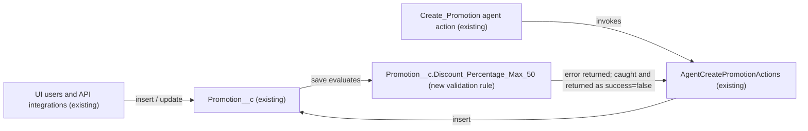

# Implementation spec — Promotion discount percentage cap (50%)

> Block any save of a `Promotion__c` record whose `Promotion__c.Discount_Percentage__c` is over 50%, for every caller.

_Based on the requirement, the evidence reported by AskCoworker, and read-only org queries where noted. Assumptions and missing evidence are identified below. Specification only — nothing is implemented or deployed._

---

## 1. The requirement

Finance wants the discount percentage on a promotion to never exceed 50%; this spec adds one validation rule on `Promotion__c` that rejects values over 50% on insert and update. The request contained no deploy or data-change instruction.

| # | Responsibility | Trigger | Where it lives |
| --- | --- | --- | --- |
| 1 | Reject a promotion whose discount percentage is over 50% (exactly 50% and blank are allowed) | Insert and update of `Promotion__c`, from any caller (UI, API, Apex, agent action) | `Promotion__c.Discount_Percentage_Max_50` (new validation rule) |
| 2 | Surface the rejection to the agent that creates promotions | Invocation of `AgentCreatePromotionActions` | `AgentCreatePromotionActions` (existing; no change) |

## 2. Grounding — reuse before building

Target org: `TestWriteSpecDE` (org ID `00Dak00001COqNeEAL`, Developer Edition instance). API version: `67.0`. The requirement does not name a different environment.

- **`Promotion__c`** (CustomObject) — the "promo" in the requirement; no namespace (`NamespacePrefix` null), `DurableId` `01Iak00000Dx4JZ`. _verified by org query_
- **`Promotion__c.Discount_Percentage__c`** (CustomField, Percent) — label "Discount Percentage", description "The percentage discount applied.", precision 3, scale 0, `required` false, no default value. _verified by org query_
- **Existing data** — 1 `Promotion__c` record; `MAX(Discount_Percentage__c)` = 20; 0 records with a value over 50; 0 with a blank value; 0 below 0. _verified by org query_
- **Existing automation on `Promotion__c`** — 0 validation rules (Tooling `ValidationRule` by `EntityDefinitionId`), 0 Apex triggers (`ApexTrigger.TableEnumOrId = 'Promotion__c'`), 0 record-triggered flows (`FlowDefinitionView` by object Id and by object name). _verified by org query_
- **`AgentCreatePromotionActions`** (ApexClass, `with sharing`, invocable "Create Promotion") — the only Apex class whose body references `Discount_Percentage`, among all 70 non-namespaced classes. It sets `promo.Discount_Percentage__c = req.discountPercentage` with no range check, runs `insert promo` inside `try`, and on `catch (Exception e)` returns `success = false` and `message = e.getMessage()`. _verified by org query_
- **`Create_Promotion`** (GenAiFunction, plus 5 copies with suffixes such as `Create_Promotion_179Kj000000Lak9`) — agent actions whose `InvocationTarget` is `AgentCreatePromotionActions` (`01pak00000VxZBJAA3`). _verified by org query_
- **References to `Promotion__c.Discount_Percentage__c`** (`MetadataComponentDependency`) — `AgentCreatePromotionActions` (ApexClass) and `Storefront_Record_Page` (FlexiPage). Other classes referencing `Promotion__c` (`AgentUpdatePromotionStatusActions`, `MerchantRiskScoreAction`) do not reference the field in their bodies. _verified by org query_
- **Field access** — Edit on the field only in permission set `sfdc_accelerate_dms`; Read only in `sfdc_a360_sfcrm_data_extract`, `sfdc_slack`, `Pronto_Deep_Dive_Workshop`. No profile rows were returned. _verified by org query_

Candidates examined and rejected: standard `Promotion` object — no discount-percent field (only `AreQualItemsExclFromDiscounts`, `DiscountOrder`, `DiscountRestriction`, `IsApproachingDiscountApplicable`) and 0 records _verified by org query_; `PromotionTarget.AdjustmentPercent` — a standard commerce adjustment with 0 records, not the promo discount the requirement describes _verified by org query_; the only other `CustomField` rows matching `%Discount%` belong to `ssot` Data 360 data model objects (`TableEnumOrId` starting `9sd`) and are not writable promo fields _verified by org query_.

Evidence sources: `sf org display`; `sf sobject list` (custom and all); `sobject describe` of `Promotion__c`, `Promotion`, `PromotionTier`, `PromotionLineItemRule`, `PromotionTarget`; Tooling `EntityDefinition`, `CustomField` (incl. `Metadata`), `ValidationRule`, `ApexTrigger`, `ApexClass` bodies, `MetadataComponentDependency`, `GenAiFunctionDefinition`; standard `FlowDefinitionView`, `FieldPermissions`, `DataStream`, aggregate queries on `Promotion__c`. AskCoworker returned no citedReferences.

## 3. Architecture

Why the pieces are drawn this way:

1. A validation rule is the platform's standard mechanism for rejecting an invalid field value, and it runs on every insert and update regardless of caller, so no flow or Apex is needed. _assumption (documented platform behavior)_
2. `AgentCreatePromotionActions` is not changed: its existing `catch (Exception e)` block already returns the validation error text as `message` with `success = false`. _verified by org query_ Adding a duplicate check in the class would be a second copy of the rule.
3. No other automation exists on `Promotion__c` to interact with the rule. _verified by org query_

## 4. Metadata changes

**Enforcement**

- **Create `Promotion__c.Discount_Percentage_Max_50`** — ValidationRule, Active. Error condition formula: `AND(NOT(ISBLANK(Discount_Percentage__c)), Discount_Percentage__c > 0.5)`. A Percent field evaluates as a decimal in formulas (50% = 0.5), so the comparison is against `0.5`. Blank value: rule does not fire. Zero: rule does not fire. Exactly 50%: rule does not fire. Error message: "Discount percentage cannot exceed 50%." Error location: field `Discount_Percentage__c`. Description: "Finance policy: promotion discounts may not exceed 50%." Formula length is well under limits.

## 5. Data 360 (Data Cloud) data involved

Not applicable — this change does not use Data 360. The org has 0 `DataStream` records _verified by org query_; permission set `sfdc_a360_sfcrm_data_extract` has Read on the field, which the rule does not change.

## 6. Security considerations

- The validation rule runs in the save procedure for all users and integrations, independent of sharing, FLS, or permission set. _assumption (documented platform behavior)_
- No CRUD, FLS, or permission set changes. The existing Edit grant in `sfdc_accelerate_dms` stays; callers using it receive `FIELD_CUSTOM_VALIDATION_EXCEPTION` for values over 50%. _verified by org query_ (grant); _assumption (documented platform behavior)_ (error)
- The error message reveals the 50% policy threshold only, no record data.
- The rule has no bypass (for example a custom permission). The requirement says "never", so administrators are also blocked. _assumption_

## 7. Testing strategy

Declarative-only change: no new Apex test class. Recommended manual verification in a sandbox after deployment (no test has been run):

| # | Case | Expected |
| --- | --- | --- |
| M1 | UI: create `Promotion__c` with discount 60% | Blocked; "Discount percentage cannot exceed 50%." shown on `Discount_Percentage__c` |
| M2 | UI: create with discount 51% | Blocked |
| M3 | UI: create with discount exactly 50% | Saves |
| M4 | UI: create with discount blank, and with 0% | Both save |
| M5 | UI: edit the existing record (20%) to 55% | Blocked |
| M6 | UI: edit an unrelated field on the existing record (20%) | Saves |
| M7 | API: insert a list of 200 records mixing 40% and 70% with `allOrNone=false` | 40% rows save; 70% rows fail with `FIELD_CUSTOM_VALIDATION_EXCEPTION` |
| M8 | Agent: run the `Create_Promotion` action (for example in Agent Builder test mode) with `discountPercentage = 75` | Response `success = false`, `message` contains "Discount percentage cannot exceed 50%."; no record created |
| M9 | Agent: same action with `discountPercentage = 50` | `success = true`; record created |
| M10 | API as a user with `sfdc_accelerate_dms`: update a record to 80% | Blocked with `FIELD_CUSTOM_VALIDATION_EXCEPTION` |

M3 and M4 are the checks for the load-bearing formula assumption (Percent evaluates as a decimal); if M3 is blocked or M1 saves, the comparison constant is wrong.

## 8. Open decisions

### Open

1. **`sfdc_accelerate_dms` integration payloads (non-blocking).** This permission set is the only explicit Edit grant on the field _verified by org query_. If that integration sends discounts over 50%, those saves will now fail. Recommended default: tell its owner before production deployment; current data has no values over 20%.
2. **Validation rule and the percent-as-decimal comparison (non-blocking, load-bearing).** The formula relies on a Percent field evaluating as a decimal (50% = 0.5) _assumption (documented platform behavior)_; M1 to M4 in Section 7 confirm it.

### Resolved

- **Which "promo" object.** `Promotion__c` is the only object with a discount percentage field and the standard `Promotion` object has 0 records and no such field _verified by org query_. Decided without asking. _assumption_
- **Boundary.** "Never over 50%" means 50% is allowed; the rule fires on `> 0.5`. _assumption_ (from the requirement's wording)
- **Scope by status.** The cap applies to all `Status__c` values and to insert and update; the requirement says "never" and states no status filter. _assumption_
- **Blank values.** Blank stays allowed; the field is not required and the requirement targets values over 50%. _assumption_
- **Hard block, not silent correction.** A before-save flow that lowers the value to 50% was rejected: it would change user input silently. _assumption_
- **No configurable threshold and no class change.** A custom metadata threshold and a pre-check in `AgentCreatePromotionActions` were not added (not requested; would duplicate the rule).
- **Existing data.** 0 records exceed 50% _verified by org query_, so no data clean-up step is needed.
- **Correction to AskCoworker (formula constant).** AskCoworker's first-round open decision (D1) proposed the condition `Discount_Percentage__c > 50`; in a formula a Percent field evaluates as a decimal, so the rule uses `> 0.5`. _assumption (documented platform behavior)_
- **Correction to AskCoworker (undelete).** AskCoworker's runtime answer said validation rules fire on undelete. Salesforce does not run validation rules on undelete; only triggers fire. Undeleting a record cannot bypass the cap in practice, since no record currently exceeds 50% _verified by org query_. _assumption (documented platform behavior)_
- **Correction to AskCoworker (sources).** AskCoworker tagged several facts "prior session"; each one the design uses was re-checked by org query in this run (field type, rule/trigger/flow counts, data counts, class body, FieldPermissions, DataStream count).
- **Dropped AskCoworker proposals.** The DMS `allOrNone` confirmation, an Apex test for `AgentCreatePromotionActions`, error-message wording review, and anonymous-Apex verification steps were dropped (not needed for this design, or replaced by the agent test-mode checks in Section 7).

## 9. Change set

| # | Action | Type | API name | Module | Why |
| --- | --- | --- | --- | --- | --- |
| 1 | Create | ValidationRule | `Promotion__c.Discount_Percentage_Max_50` | force-app/main/default/objects/Promotion__c/validationRules | Rejects any `Promotion__c` save with a discount over 50%, for every caller |

One active validation rule on `Promotion__c` enforces the 50% cap; the existing agent action surfaces its error without change.

Total: 1 · Create: 1 · Update: 0 · Delete: 0
