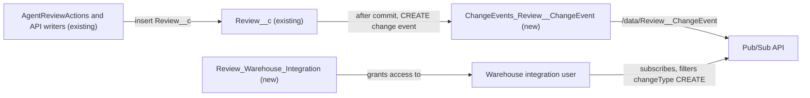

# Implementation spec — Stream new reviews to the data warehouse with Change Data Capture

> Publish a change event for every new `Review__c` record so the data warehouse can consume it in near real time through the Pub/Sub API.

_Based on the requirement, the evidence reported by AskCoworker, and read-only org queries where noted. Assumptions and missing evidence are identified below. Specification only — nothing is implemented or deployed._

---

## 1. The requirement

The data warehouse must receive every new review (`Review__c` record) in near real time. The user chose Change Data Capture (CDC) on `Review__c`, consumed by the warehouse through the Pub/Sub API (_user decision_). The request contained no deploy or data-change instruction.

| # | Responsibility | Trigger | Where it lives |
| --- | --- | --- | --- |
| 1 | Publish a change event for each new review | Insert of a `Review__c` record (any writer) | `ChangeEvents_Review__ChangeEvent` (new CDC channel member) |
| 2 | Let the warehouse integration user subscribe and receive the review fields | Pub/Sub API subscription to `/data/Review__ChangeEvent` | `Review_Warehouse_Integration` (new permission set) |
| 3 | Consume only new reviews | `ChangeEventHeader.changeType = CREATE` | Warehouse subscriber (outside Salesforce) |

## 2. Grounding — reuse before building

Target org: `TestWriteSpecDE` (Developer Edition, not a sandbox). API version: `67.0`. The requirement does not name another environment.

- **`Review__c`** (CustomObject) — the review object. Custom fields: `Review__c.Storefront__c`, `Review__c.Comments__c`, `Review__c.Customer__c`, `Review__c.Order_Date__c`, `Review__c.Rating__c`, `Review__c.Status__c` (the complete Tooling `CustomField` list, 6 rows). There is no `OwnerId` field. _verified by org query_
- **`Review__c.Storefront__c`** (MasterDetail to `Storefront__c`) — `reparentableMasterDetail` = false, `cascadeDelete` = true. _verified by org query_
- **`Review__c.Status__c`** (Picklist) — values `Submitted`, `Published`. All 92 existing records have a blank value. _verified by org query_
- **`Review__ChangeEvent`** (change event entity) — exists with fields `ChangeEventHeader`, `Name`, `CreatedDate`, `CreatedById`, `LastModifiedDate`, `LastModifiedById`, and the 6 custom fields. _verified by org query_
- **CDC selection** — Tooling `PlatformEventChannelMember` returns 0 rows and `PlatformEventChannel` returns 0 rows, so no entity (including `Review__c`) is selected for CDC today. _verified by org query_
- **`AgentReviewActions`** (ApexClass, `with sharing`) — inserts `Review__c`. `AgentSummarizeReviewsActions` reads it. These are the only two `MetadataComponentDependency` rows for `Review__c`, and the only unmanaged Apex classes whose bodies mention `Review__c`. _verified by org query_
- **Existing automation** — no Apex trigger on `Review__c`, `Storefront__c`, or `Review__ChangeEvent`; no flow triggered by `Review__c` or `Review__ChangeEvent`; no `WorkflowOutboundMessage` rows. _verified by org query_
- **Delivery components** — no custom platform event (`__e`) objects exist; `DataStream` count is 0; the only Named Credentials are `Pronto_Pass_Factory` and `Pronto_Orders_API` (unrelated). _verified by org query_
- **Access to `Review__c`** — `Read` is granted to `Pronto_Deep_Dive_Workshop`, `sfdc_a360_sfcrm_data_extract`, `Agentforce_Reference_App`, `sfdc_slack`, `sfdc_accelerate_dms` (also Create), and two profile-owned permission sets. No permission set named for a warehouse or review integration exists. _verified by org query_

Candidates examined and rejected: `sc_ext` / `shield_ext` `Formatter_CDCObjects`, `Formatter_OutboundMessages`, `Formatter_EventBusEncryption` — managed Security Center / Shield package report classes, not a delivery mechanism (_verified by org query_: `NamespacePrefix`); `sfdc_a360_sfcrm_data_extract` — platform-owned Data 360 connector permission set, not the warehouse user and not editable; a custom platform event with an Apex trigger — the user chose CDC; a Data 360 data stream — 0 streams exist and the user chose Pub/Sub API.

Evidence sources: `sf sobject list`, `sf sobject describe` (`Review__c`, `Review__ChangeEvent`), Tooling queries on `PlatformEventChannelMember`, `PlatformEventChannel`, `ApexTrigger`, `ApexClass`, `CustomField` (with `Metadata` for `Storefront__c`), `MetadataComponentDependency`, `NamedCredential`, `ExternalCredential`, `WorkflowOutboundMessage`; standard queries on `FlowDefinitionView`, `ObjectPermissions`, `FieldPermissions`, `PermissionSet`, `DataStream`, `Organization`, and a `Review__c` count by `Status__c`. AskCoworker returned no citedReferences.

## 3. Architecture

Why the pieces are drawn this way:

1. Writers of `Review__c` include `AgentReviewActions` (_verified by org query_) and API callers such as users of `sfdc_accelerate_dms`, which has Create (_verified by org query_). CDC fires for every committed insert, whatever the writer. _assumption (documented platform behavior)_
2. `ChangeEvents_Review__ChangeEvent` selects `Review__ChangeEvent` on the standard `ChangeEvents` channel. This is the standard, declarative mechanism for near-real-time record change delivery, so no trigger, flow, or Apex is needed. Events are published after the transaction commits and do not add work to the save. _assumption (documented platform behavior)_
3. The warehouse subscribes with the Pub/Sub API to `/data/Review__ChangeEvent` (_user decision_). CDC also publishes UPDATE, DELETE, and UNDELETE events for the object; the standard channel cannot be limited to CREATE, so the subscriber keeps only `changeType = CREATE` events. _assumption_
4. The subscriber sees only fields its user can read, so `Review_Warehouse_Integration` gives that user the object and field access. _assumption (documented platform behavior)_

## 4. Metadata changes

**CDC**

- **Create `ChangeEvents_Review__ChangeEvent`** — PlatformEventChannelMember. `eventChannel` = `ChangeEvents`, `selectedEntity` = `Review__ChangeEvent`. Selects `Review__c` for Change Data Capture. File: `force-app/main/default/platformEventChannelMembers/ChangeEvents_Review__ChangeEvent.platformEventChannelMember-meta.xml`. The org currently uses 0 selected entities, so this is within the Developer Edition entity allocation.

**Security**

- **Create `Review_Warehouse_Integration`** — PermissionSet, label "Review Warehouse Integration", for the warehouse integration user only. User permission `ApiEnabled`. Object permissions: `Review__c` Read and View All (CDC delivers events for all records regardless of sharing; View All keeps any follow-up query by the warehouse consistent with the events); `Storefront__c` Read (required master-object access for a detail object). Field Read (no Edit) on `Review__c.Comments__c`, `Review__c.Customer__c`, `Review__c.Order_Date__c`, `Review__c.Rating__c`, `Review__c.Status__c`. `Review__c.Storefront__c` needs no field permission (master-detail). No Create, Edit, or Delete. No Contact access. No license is set, so it can be assigned to a Salesforce Integration user.

## 5. Data 360 (Data Cloud) data involved

Not applicable — this change does not use Data 360. The org has 0 data streams (_verified by org query_), and the user chose Pub/Sub API delivery (_user decision_).

## 6. Security considerations

- **Execution context.** The platform publishes change events itself, after commit. The inserting user's context (for example `AgentReviewActions` running `with sharing`) does not affect publication. _assumption (documented platform behavior)_
- **Sharing.** CDC ignores sharing and publishes events for all `Review__c` records. Any user who can subscribe to `/data/Review__ChangeEvent` with object access sees every review. _assumption (documented platform behavior)_ The new permission set therefore goes only to the warehouse integration user.
- **CRUD/FLS.** `Review_Warehouse_Integration` grants read-only access to `Review__c` (including View All), Read on `Storefront__c`, and field Read on 5 fields. Payload fields the user cannot read are left out of events. _assumption (documented platform behavior)_
- **Existing grants.** No existing permission set or profile changes. Users who already have `Read` on `Review__c` (listed in Section 2) could also subscribe through the Pub/Sub API if they have API access; this is existing access and is not widened. _assumption_
- **Data exposure.** The warehouse receives `Review__c.Comments__c` (Long Text Area, 32,768 characters, free text that may contain personal data) and `Review__c.Customer__c` (a Contact Id, with no Contact fields). _verified by org query_ for the field types; the personal-data content is an _assumption_.
- **Authentication.** The warehouse connector authenticates with OAuth through a connected app or external client app. That setup is outside this inventory (Section 8, item 2).

## 7. Testing strategy

No Apex or flow is added, so there is no Apex test class or Flow Test. All checks are manual; none have been run.

| # | Case | Expected result | Kind |
| --- | --- | --- | --- |
| 1 | After deploy, open Setup > Change Data Capture | `Review` is in Selected Entities | Manual verification |
| 2 | Create one review in the UI, or through `AgentReviewActions` via the agent | Subscriber on `/data/Review__ChangeEvent` receives one event with `changeType` CREATE within seconds, with the 5 custom fields and `Storefront__c` | Manual verification (load-bearing: Section 8, item 1) |
| 3 | Insert 200 reviews in one API call (for example Data Loader or Bulk API) | Subscriber receives CREATE events covering all 200 record Ids (one event can carry several `recordIds`) | Manual verification (bulk) |
| 4 | Edit a review's `Rating__c`; delete a review; undelete it | UPDATE, DELETE, UNDELETE events arrive; the warehouse ignores them | Manual verification (negative) |
| 5 | Delete a `Storefront__c` that has reviews | A DELETE event for each child review; the warehouse ignores them | Manual verification (negative, cascade) |
| 6 | Subscribe as a user without `Review_Warehouse_Integration` and without other `Review__c` access | No `Review__c` events are delivered | Manual verification (permission) |
| 7 | As the warehouse integration user, try to create or edit a `Review__c` via the API | Rejected for insufficient access | Manual verification (permission) |
| 8 | Remove field Read on `Review__c.Comments__c` from a test copy of the permission set | `Comments__c` is absent from the event payload | Manual verification (FLS) |

## 8. Open decisions

### Open

1. **Subscriber permissions and payload FLS (non-blocking, load-bearing).** The design assumes that Read plus View All on `Review__c`, field Read, and `ApiEnabled` are enough to subscribe to `/data/Review__ChangeEvent` and receive the fields. _assumption (documented platform behavior)_ Rows 1 and 2 depend on it. Check with Section 7 cases 2 and 6 before go-live. If the subscription is rejected, add the missing object permission to `Review_Warehouse_Integration`, not to a broad permission set.
2. **Warehouse integration user and OAuth client (blocking for delivery).** No warehouse integration user or permission set is evident in the org (only permission sets were checked; _verified by org query_). Recommended default: in Setup, create a user with the Salesforce Integration user license (API only), assign `Review_Warehouse_Integration`, and create a connected app or external client app for the warehouse connector's OAuth flow, following the connector's requirements. These are Setup actions, not rows.
3. **Subscriber downtime (non-blocking).** Change events are kept for 72 hours. If the subscriber is offline longer, it misses events and must re-sync from `Review__c` by `CreatedDate`. _assumption (documented platform behavior)_ Recommended default: the warehouse team keeps the last `replayId` and runs a catch-up query after long outages.
4. **Personal data in `Review__c.Comments__c` (non-blocking).** Free-text comments go to the warehouse unmasked. Recommended default: the data governance owner confirms warehouse retention and masking rules before go-live. _assumption (external regulation)_
5. **Existing 92 reviews (non-blocking, proposal).** CDC does not publish events for records created before enablement. The requirement covers new reviews only, so no backfill is in scope. If the warehouse also needs history, run a one-time read-only export of `Review__c` before enabling CDC.

Deployment sequence: deploy `Review_Warehouse_Integration` and `ChangeEvents_Review__ChangeEvent` (either order; no dependency). Then complete item 2, start the subscriber, and run Section 7 case 2.

### Resolved

- **Delivery mechanism.** Asked which delivery path the warehouse uses. Answer: CDC on `Review__c`, consumed through the Pub/Sub API. _user decision_
- **Which events count as "new review".** All inserts, whatever `Status__c` is. All 92 existing records have a blank `Status__c`, so a `Published` filter would drop every review. _assumption_ (AskCoworker proposed asking about a status filter; the requirement says "every new review".)
- **Standard channel, not a filtered custom channel.** The standard `ChangeEvents` channel with subscriber-side filtering on `changeType` is simpler and reversible; the warehouse ignores non-CREATE events. _assumption_
- **Corrected AskCoworker claims.** The `Formatter_*` classes it flagged as possibly relevant are managed `sc_ext` / `shield_ext` package classes (_verified by org query_). It listed `OwnerId` in the payload; `Review__c` has no `OwnerId` (_verified by org query_). It said `Agentforce_Reference_App` has Edit on `Review__c`; the query shows Read without Create (_verified by org query_; Edit not checked, not used). It first said no FLS setup is needed, then required field Read; field Read is kept (Section 6). It said cascade-deleted reviews cannot be undeleted; detail records deleted with their master go to the Recycle Bin and are restored when the master is undeleted. _assumption (documented platform behavior)_ It proposed anonymous Apex for manual checks; Section 7 uses UI and API inserts instead.
- **Dropped AskCoworker proposals.** Developer Edition throughput notes and requests for a latency SLA (CDC delivery in seconds meets "near real time"; _assumption_).

## 9. Change set

| # | Action | Type | API name | Module | Why |
| --- | --- | --- | --- | --- | --- |
| 1 | Create | PlatformEventChannelMember | `ChangeEvents_Review__ChangeEvent` | force-app/main/default/platformEventChannelMembers | Selects `Review__c` for CDC so each new review publishes a CREATE change event |
| 2 | Create | PermissionSet | `Review_Warehouse_Integration` | force-app/main/default/permissionsets | Gives the warehouse integration user API access and read access to review events and fields |

Change Data Capture on `Review__c` publishes each new review to the standard `ChangeEvents` channel, and a dedicated read-only permission set lets the warehouse integration user consume it through the Pub/Sub API.

Total: 2 · Create: 2 · Update: 0 · Delete: 0
