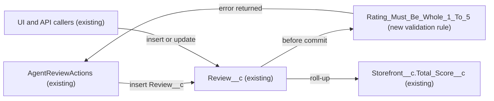

# Implementation spec — Review rating must be a whole number from 1 to 5

> Block any save of a `Review__c` record whose `Rating__c` is blank, below 1, above 5, or not a whole number.

_Based on the requirement, the evidence reported by AskCoworker, and read-only org queries where noted. Assumptions and missing evidence are identified below. Specification only — nothing is implemented or deployed._

---

## 1. The requirement

Every `Review__c.Rating__c` value must be a whole number from 1 to 5; the user decided that the rating is also required and that decimal input is rejected by a validation rule rather than rounded (*user decision*).

| # | Responsibility | Trigger | Where it lives |
| --- | --- | --- | --- |
| 1 | Reject a blank rating | Insert and update of `Review__c` | `Review__c.Rating_Must_Be_Whole_1_To_5` (new validation rule) |
| 2 | Reject a rating below 1 or above 5 | Insert and update of `Review__c` | `Review__c.Rating_Must_Be_Whole_1_To_5` |
| 3 | Reject a decimal rating | Insert and update of `Review__c` | `Review__c.Rating_Must_Be_Whole_1_To_5`, plus `Review__c.Rating__c` only if row 2's condition holds |

## 2. Grounding — reuse before building

Target org: `TestWriteSpecDE` (org ID `00Dak00001COqNeEAL`, connected). API version: `67.0` (`sourceApiVersion` in `sfdx-project.json`, *verified by project file*).

- **`Review__c.Rating__c`** (CustomField) — the only rating field on `Review__c`. Type `Number`, precision `1`, scale `0`, `required: false`, no default, description "The numerical rating provided by the customer, typically ranging from 1 (poor) to 5 (excellent).", help text "1 (poor) to 5 (excellent)". _verified by org query_ (Tooling `CustomField.Metadata`)
- **`Review__c`** validation rules — 0 rules. _verified by org query_ (Tooling `ValidationRule WHERE EntityDefinitionId = '01Iak00000Dx4JW'`)
- **`Review__c`** automation — 0 Apex triggers on `Review__c` or `Storefront__c`, and 0 record-triggered flows on `Review__c`. _verified by org query_
- **Existing data** — 92 `Review__c` records; `MIN(Rating__c)` = 1, `MAX(Rating__c)` = 5; 0 records with a blank rating; 0 records below 1 or above 5. _verified by org query_ No data clean-up is needed.
- **`AgentReviewActions`** (ApexClass, `with sharing`, invocable "Leave Review") — inserts `Review__c` with `r.Rating__c = Decimal.valueOf(req.rating)` where `rating` is an `Integer` input marked required; it has no range check and returns `e.getMessage()` with `success = false` when the insert throws. _verified by org query_ (class body)
- **Readers of `Rating__c`** — `MetadataComponentDependency` lists `AgentReviewActions`, `AgentSummarizeReviewsActions`, and FlexiPage `Storefront_Record_Page`; among non-namespaced Apex classes, only these two classes mention `Review__c`. _verified by org query_ `Storefront__c.Total_Score__c` and `Storefront__c.Total_Reviews__c` are roll-ups over `Review__c`, and `Storefront__c.Average_Review_Score__c` is the formula `Total_Score__c / Total_Reviews__c`. _verified by org query_
- **`Review__c.Storefront__c`** — Master-Detail to `Storefront__c`, `reparentableMasterDetail: false`. _verified by org query_
- **Create/Edit on `Review__c`** — `sfdc_accelerate_dms` (Create, Edit), `Agentforce_Reference_App` (Edit only), and one profile-owned permission set (`X00ex00000018ozh_128_09_04_12_1`, Create, Edit). _verified by org query_ (`ObjectPermissions`, complete for rows with Create or Edit)

Candidates examined and rejected: a trigger or Apex check in `AgentReviewActions` — a validation rule covers every caller, and the class is not the only path with Create or Edit access; changing `Rating__c` to a picklist — `Storefront__c.Total_Score__c` sums it, so it must stay numeric (*assumption (documented platform behavior)*: roll-up SUM needs a number, currency, or percent field); other fields named like `Rating` — the Tooling `CustomField` search found only managed (`sc_ext`, `shield_ext`) and Data 360 (`ssot`) fields, none on `Review__c` (*verified by org query*).

Evidence sources: `sf org display`; `sobject describe` of `Review__c` and `Storefront__c`; `sobject list --sobject custom`; Tooling `EntityDefinition`, `CustomField` (with `Metadata`), `ValidationRule`, `ApexTrigger`, `ApexClass` bodies, `MetadataComponentDependency`, `GenAiFunctionDefinition`; `FlowDefinitionView`; `ObjectPermissions`; aggregate queries on `Review__c`; `DataStream` count. AskCoworker returned no citedReferences.

## 3. Architecture

Why the pieces are drawn this way:

1. `AgentReviewActions` is the only non-namespaced Apex that inserts `Review__c` (*verified by org query*). `sfdc_accelerate_dms` and a profile can also create records through the UI or API (*verified by org query*), so enforcement must sit on the object, not in the class.
2. A validation rule is the platform's standard mechanism for rejecting field values on save and runs for UI, API, Apex, and flow saves (*assumption (documented platform behavior)*). No Apex is needed.
3. When the rule fails, the `insert` in `AgentReviewActions` throws a `DmlException`; the class catches it and returns the error message with `success = false` (*verified by org query* for the catch block). No change to the class is needed.
4. `Storefront__c.Total_Score__c` sums `Rating__c` (*verified by org query*); the rule keeps out-of-range values out of that roll-up.

## 4. Metadata changes

**Enforcement**

- **Create `Review__c.Rating_Must_Be_Whole_1_To_5`** — ValidationRule, active. Error condition formula: `OR(ISBLANK(Rating__c), Rating__c < 1, Rating__c > 5, Rating__c <> FLOOR(Rating__c))`. Error message: "Rating must be a whole number from 1 to 5." Error location: field `Rating__c`. Blank handling: `ISBLANK(Rating__c)` is true when the field is null, so a blank rating is rejected; the later comparisons are not reached for a blank value because `OR` is true already. Result for 0: rejected (`Rating__c < 1`). The formula is well under the 3,900-character limit. Existing data: 0 records would fail (*verified by org query*).

**Data model**

- **Update `Review__c.Rating__c`** — CustomField. Conditional: deploy only if the sandbox check in Section 7 (case M5) shows that a value such as 3.7 is saved as 4 instead of being rejected, meaning the scale-0 field rounds the value before the validation rule evaluates. Change: precision `1` to `3`, scale `0` to `2`, so decimal input reaches the rule unrounded. Keep the label, description, help text, and `required: false`. Stored values 1 to 5 are unchanged; the UI shows them as `3.00`.

## 5. Data 360 (Data Cloud) data involved

Not applicable — this change does not use Data 360. `SELECT COUNT() FROM DataStream` returned 0 (*verified by org query*), so no data stream ingests `Review__c`.

## 6. Security considerations

- Validation rules run for every user and integration regardless of profile, permission set, or sharing (*assumption (documented platform behavior)*). No CRUD, FLS, or permission set changes are needed.
- Callers affected: `AgentReviewActions` (runs `with sharing`; returns the error as `message`), users of `sfdc_accelerate_dms` and `Agentforce_Reference_App`, and users of the profile with Create/Edit (*verified by org query*). An integration that sends a blank or out-of-range rating will receive `FIELD_CUSTOM_VALIDATION_EXCEPTION` after deployment (*assumption (documented platform behavior)*).
- No new data is exposed. The rule reads only `Rating__c` on the record being saved.

## 7. Testing strategy

No new Apex test class: the change is declarative (a validation rule and, conditionally, a field update). No existing Apex test inserts `Review__c`: only `AgentReviewActions` and `AgentSummarizeReviewsActions` mention `Review__c` among non-namespaced classes (*verified by org query*), so existing tests are not expected to break. Tests have not been run.

Recommended manual verification in a sandbox:

| # | Case | Expected result |
| --- | --- | --- |
| M1 | Create a `Review__c` with `Rating__c` = 1, then another with 5 | Both save |
| M2 | Create with `Rating__c` blank | Blocked with the rule's message on `Rating__c` |
| M3 | Create with `Rating__c` = 0, and with 6 | Both blocked |
| M4 | Edit an existing review from 3 to blank, and from 3 to 6 | Both blocked |
| M5 | **Load-bearing check.** Through the API (for example anonymous Apex `insert new Review__c(Storefront__c = <id>, Rating__c = 3.7);`), save a decimal rating | If blocked by the rule, row 2 is not needed. If the record saves with `Rating__c` = 4, deploy row 2 first, then repeat M5 and confirm it is blocked |
| M6 | Invoke `AgentReviewActions.invoke` from anonymous Apex with `rating` = 0, then 3 | 0 returns `success = false` with the rule's message; 3 returns `success = true` |
| M7 | Bulk insert 200 reviews through Data Loader or the API with one blank rating and `allOrNone = false` | 199 save; one fails with the rule's message |
| M8 | Delete and undelete a valid review | No error; `Storefront__c.Total_Score__c` and `Storefront__c.Total_Reviews__c` update |
| M9 | If row 2 was deployed: compare `Storefront__c.Total_Score__c` on several storefronts before and after | Values unchanged |

## 8. Open decisions

### Open

1. **Rounding before the rule, row `Review__c.Rating__c` (non-blocking for deployment, blocking for decimal rejection).** Whether a scale-0 `Number` field rounds a decimal such as 3.7 before validation rules evaluate cannot be tested with a read-only query. This is load-bearing for responsibility 3 only. Recommended default: run case M5 in a sandbox; deploy the conditional `Review__c.Rating__c` update, before the rule, only if the decimal saves as 4. Whichever way it goes, the field never stores a decimal while it has scale 0.
2. **Integration payloads (non-blocking).** `sfdc_accelerate_dms` has Create and Edit on `Review__c` (*verified by org query*). Whether its callers ever send blank or decimal ratings is Not specified. Recommended default: tell the integration owner before deployment that such saves will fail.

### Resolved

- **User decision:** the rating is required, must be 1 to 5, and decimals are rejected (not rounded), enforced by a validation rule.
- **Assumption:** rule name `Rating_Must_Be_Whole_1_To_5`, the error message text, and the field error location.
- **Assumption:** no backfill; the aggregate queries show 0 existing records that break the rule.
- **Correction:** AskCoworker said validation rules are not queryable; the Tooling `ValidationRule` query returned 0 rules on `Review__c`.
- **Correction:** AskCoworker proposed `ISBLANK(TEXT(Rating__c))`; `ISBLANK` works directly on a number field, so the formula uses `ISBLANK(Rating__c)` (*assumption (documented platform behavior)*).
- **Correction:** AskCoworker proposed changing `Rating__c` to `Number(3,2)` unconditionally, on the claim that scale 0 always rounds before the rule. That claim is not documented or testable here, and the change alters how every reader displays the value, so it is a `Conditional:` row that depends on case M5.
- **Correction:** AskCoworker said validation rules fire on undelete; they do not (*assumption (documented platform behavior)*). No undelete case depends on the rule.
- **Dropped AskCoworker items:** the "prior session" `Status__c` values, an unverified `AgentReviewActions` test class (no non-namespaced Apex test mentions `Review__c`, *verified by org query*), and a Data Cloud format concern (0 data streams).
- Deployment sequence: if row 2 is needed, deploy the `Review__c.Rating__c` update before the validation rule, or in the same deployment.

## 9. Change set

| # | Action | Type | API name | Module | Why |
| --- | --- | --- | --- | --- | --- |
| 1 | Create | ValidationRule | `Review__c.Rating_Must_Be_Whole_1_To_5` | force-app/main/default/objects/Review__c/validationRules | Rejects blank, out-of-range, and decimal ratings for every caller |
| 2 | Update | CustomField | `Review__c.Rating__c` | force-app/main/default/objects/Review__c/fields | Conditional: lets the rule see decimal input, only if case M5 shows it is rounded first |

One validation rule on `Review__c` enforces the rating rule for all callers, with a conditional scale change only if the platform rounds decimals before the rule runs.

Total: 2 · Create: 1 · Update: 1 · Delete: 0
