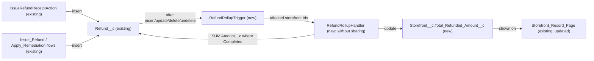

# Implementation spec — Storefront total refunded amount

> Keep a stored total of Completed refund amounts on each `Storefront__c` record so users can see which restaurants cost the business the most in refunds.

_Based on the requirement, the evidence reported by AskCoworker, and read-only org queries where noted. Assumptions and missing evidence are identified below. Specification only — nothing is implemented or deployed._

---

## 1. The requirement

Sum `Refund__c.Amount__c` for refunds with `Status__c` = `Completed` onto each related `Storefront__c`, and show it on the storefront record. The user chose to count only `Completed` refunds (*user decision*). The request contained no deploy or data-change instruction.

| # | Responsibility | Trigger | Where it lives |
| --- | --- | --- | --- |
| 1 | Store the total of `Completed` refund amounts per storefront | Not specified | `Storefront__c.Total_Refunded_Amount__c` |
| 2 | Keep the total correct when refunds are created, edited (status, amount, storefront), deleted, or undeleted | `Refund__c` after insert, after update, after delete, after undelete | `RefundRollupTrigger`, `RefundRollupHandler` |
| 3 | Show the total on the storefront record to the users who work with storefronts | Record page view | `Storefront_Record_Page`, `Agentforce_Reference_App`, `Pronto_Deep_Dive_Workshop` |

## 2. Grounding — reuse before building

Target org: `TestWriteSpecDE` (Developer Edition, not a sandbox, org ID `00Dak00001COqNeEAL`). API version: `67.0`. _verified by org query_

- **`Refund__c`** (CustomObject) — the child object. 0 records exist. _verified by org query_
- **`Refund__c.Amount__c`** (CustomField, Currency, precision 18, scale 2, not required; description "The monetary amount of the refund.") — the value to sum. _verified by org query_
- **`Refund__c.Status__c`** (CustomField, Picklist) — values `Pending` (default), `Approved`, `Processing`, `Completed`, `Failed`, `Cancelled`. _verified by org query_
- **`Refund__c.Storefront__c`** (CustomField, Lookup to `Storefront__c`) — not required, `deleteConstraint` `SetNull`, child relationship `Refunds__r`. Because it is a Lookup and not Master-Detail, a roll-up summary field is not available. _verified by org query_
- **`Storefront__c`** (CustomObject) — the target object. 21 records exist. It already has roll-up summary fields `Menu_Count__c`, `Total_Reviews__c`, and `Total_Score__c` over Master-Detail children, and no field for refunds. _verified by org query_
- **`Storefront_Record_Page`** (FlexiPage, RecordPage) — the `Storefront__c` record page. It uses Dynamic Forms (`flexipage:fieldSection` with field instances) and already shows `Total_Reviews__c`. _verified by org query_
- **`Storefront-Storefront Layout`** (Layout) — the only `Storefront__c` layout; it references `Total_Reviews__c`. Its assignment cannot be read. _verified by org query_
- **Writers of `Refund__c`** — `IssueRefundReceiptAction` (Apex, `with sharing`) and the autolaunched flows `Issue_Refund` and `Apply_Remediation`. All three create refunds with `Status__c` = `Approved`. No other unmanaged Apex class references refunds, and `MetadataComponentDependency` for `Refund__c`, `Amount__c`, `Status__c`, and `Storefront__c` lists only these three plus `Refund Layout`. _verified by org query_
- **Automation on `Refund__c` and `Storefront__c`** — no Apex triggers, no record-triggered flows, and no validation rules on either object. _verified by org query_
- **Access to `Storefront__c`** — `Agentforce_Reference_App` (Read, Edit), `Pronto_Deep_Dive_Workshop` (Read), System Administrator profile (Read, Edit), Analytics Cloud Integration User profile (Read), and the `sfdcInternalInt` namespaced permission sets `sfdc_accelerate_dms`, `sfdc_a360_sfcrm_data_extract`, `sfdc_slack`. This list is complete for `ObjectPermissions` rows. _verified by org query_

Candidates examined and rejected:
- `Transaction__c` — has `Total_Amount__c`, `Refund_Reason__c`, and `Transaction_Type__c`, but none of its six custom fields (`Contact__c`, `Payment_Method__c`, `Refund_Reason__c`, `Total_Amount__c`, `Transaction_Date__c`, `Transaction_Type__c`) links to `Storefront__c`, so it cannot be rolled up per storefront. _verified by org query_
- Fields matching `%Refund%` / `%Refunded%` on other objects (`RefundedAmount`, `IsFullyRefunded`, and similar) are Data 360 data model object fields (`TableEnumOrId` `9sd…`), not on `Storefront__c`. _verified by org query_
- Converting `Refund__c.Storefront__c` to Master-Detail — rejected: it would make the storefront required, break `IssueRefundReceiptAction`, `Issue_Refund`, and `Apply_Remediation` calls that pass no storefront, and change delete behavior from `SetNull` to cascade delete. _assumption (documented platform behavior)_

Evidence sources: `sf org display`; `sf sobject list`; `sobject describe` of `Refund__c`, `Storefront__c`, `Transaction__c`; Tooling `CustomField` (by object and by name, plus `Metadata` for `Amount__c`, `Storefront__c`, `Status__c`); `ApexTrigger`; `FlowDefinitionView`; Tooling `Flow.Metadata` for `Issue_Refund` and `Apply_Remediation`; Tooling `ValidationRule`; Apex bodies of all 70 unmanaged classes; `MetadataComponentDependency`; `ObjectPermissions`; `FieldPermissions`; Tooling `Layout` and `FlexiPage`; record counts; `DataStream` count. AskCoworker returned no citedReferences.

## 3. Architecture

Why the pieces are drawn this way:

1. The three existing writers insert `Refund__c` records. _verified by org query_
2. A roll-up summary field needs Master-Detail; `Refund__c.Storefront__c` is a Lookup. _verified by org query_ A stored field maintained by automation is therefore needed. _assumption (documented platform behavior)_
3. Apex is used instead of a record-triggered flow because record-triggered flows cannot run on undelete, so an undeleted `Completed` refund would leave the total wrong. One trigger also handles insert, update (status, amount, and storefront changes), delete, and undelete in one place with a single aggregate query. _assumption (documented platform behavior)_
4. The handler recalculates from the database (aggregate `SUM`) rather than adding and subtracting deltas, so the total cannot drift. _assumption_
5. The handler writes only `Storefront__c`, which has no triggers, record-triggered flows, or validation rules, so there is no recursion. _verified by org query_

## 4. Metadata changes

**Data model**

- **Create `Storefront__c.Total_Refunded_Amount__c`** — CustomField, Currency(18, 2), label "Total Refunded Amount", default value 0, not required. Description: "Sum of Refund__c.Amount__c where Status__c = Completed. Maintained by RefundRollupTrigger; do not edit." Read-only for all users (no Edit FLS granted).

**Automation**

- **Create `RefundRollupHandler`** — ApexClass, `without sharing` so the total includes refunds the running user cannot see. Method `recalculate(Set<Id> storefrontIds)`: removes nulls; runs `SELECT Storefront__c, SUM(Amount__c) total FROM Refund__c WHERE Storefront__c IN :storefrontIds AND Status__c = 'Completed' GROUP BY Storefront__c`; queries `SELECT Id FROM Storefront__c WHERE Id IN :storefrontIds` so only storefronts that still exist are updated; sets `Total_Refunded_Amount__c` to the sum, or 0 when no `Completed` refund remains; runs one `update` (all-or-none, so failures surface to the caller). Refunds with a blank `Amount__c` add nothing (`SUM` ignores nulls).
- **Create `RefundRollupTrigger`** — ApexTrigger on `Refund__c`, events after insert, after update, after delete, after undelete. Collects `Storefront__c` from `Trigger.new` (insert, update, undelete) and `Trigger.old` (update, delete). On update, it includes a record only when `Status__c`, `Amount__c`, or `Storefront__c` changed, and adds both the old and new storefront so reparenting updates both totals. Calls `RefundRollupHandler.recalculate` once per trigger invocation.

**Tests**

- **Create `RefundRollupHandlerTest`** — ApexClass (`@isTest`), creates its own `Storefront__c` and `Refund__c` data. Covers the cases in Section 7.

**UX**

- **Update `Storefront_Record_Page`** — FlexiPage. Add a read-only field instance for `Storefront__c.Total_Refunded_Amount__c` in the same field section that shows `Total_Reviews__c`. Retrieve the page before editing.

**Security**

- **Update `Agentforce_Reference_App`** — PermissionSet. Add field permission Read (not Edit) on `Storefront__c.Total_Refunded_Amount__c`.
- **Update `Pronto_Deep_Dive_Workshop`** — PermissionSet. Add field permission Read (not Edit) on `Storefront__c.Total_Refunded_Amount__c`.

## 5. Data 360 (Data Cloud) data involved

Not applicable — this change does not use Data 360. `SELECT COUNT() FROM DataStream` returned 0. _verified by org query_

## 6. Security considerations

- **Execution context.** `RefundRollupTrigger` runs in system context. `RefundRollupHandler` is `without sharing`, so the aggregate counts every `Completed` refund on the storefront, whatever the running user's record access. The `update` of `Storefront__c` succeeds even for users without Edit on `Storefront__c` (for example `Pronto_Deep_Dive_Workshop` users, who have Read only on `Storefront__c` and Edit on `Refund__c`). _verified by org query_ for the grants; _assumption (documented platform behavior)_ for the execution context.
- **Data exposure.** The field shows an aggregate of all `Completed` refunds for the storefront to anyone with Read on the field, including refunds that user cannot open. This is intended so the total is the same for every viewer. _assumption_
- **Field access.** Read only: `Agentforce_Reference_App` and `Pronto_Deep_Dive_Workshop` (rows 6 and 7). No permission set gets Edit. The System Administrator profile sees the field through its profile grant on deploy and View All Data. _assumption (documented platform behavior)_ The Analytics Cloud Integration User profile and the `sfdcInternalInt` permission sets (`sfdc_accelerate_dms`, `sfdc_a360_sfcrm_data_extract`, `sfdc_slack`) are not changed; the namespaced ones are platform-managed and cannot be edited. _verified by org query_ (namespace)
- **Callers.** `IssueRefundReceiptAction`, `Issue_Refund`, and `Apply_Remediation` now also update the storefront in the same transaction. Their inserts use `Approved`, so the total does not change on those inserts. _verified by org query_

## 7. Testing strategy

`RefundRollupHandlerTest` (row 4) covers `RefundRollupHandler` and `RefundRollupTrigger`:

| Case | Expected result |
| --- | --- |
| Insert a `Completed` refund of 100 on storefront A | A total = 100 |
| Insert an `Approved` refund (the value all current writers use) | Total unchanged |
| Update `Approved` to `Completed` | Total increases by the amount |
| Update `Completed` to `Cancelled` | Total decreases; 0 when none remain |
| Change `Amount__c` on a `Completed` refund | Total reflects the new amount |
| Move a `Completed` refund from storefront A to B | A decreases, B increases |
| Delete, then undelete, a `Completed` refund | Total decreases, then is restored |
| Refund with blank `Storefront__c` | No error, no storefront updated |
| `Completed` refund with blank `Amount__c` | Adds 0 |
| Bulk: 200 refunds, mixed statuses, across 2 storefronts | Correct totals; one aggregate query and one `update` per trigger invocation |

Recommended verification (manual, after deploy in a test org):
- Run the existing `IssueRefundReceiptActionTest` and confirm it still passes with the trigger active (load-bearing: the trigger adds DML to that action's transaction).
- As a user with `Pronto_Deep_Dive_Workshop` only, mark a refund `Completed` and confirm the storefront total updates although the user cannot edit `Storefront__c`.
- As users with `Agentforce_Reference_App` and with `Pronto_Deep_Dive_Workshop`, open a storefront and confirm the field is visible and read-only on `Storefront_Record_Page`.
- Delete a storefront that has refunds and confirm no error.

## 8. Open decisions

### Open

1. **No process sets `Completed` today (non-blocking).** All three writers (`IssueRefundReceiptAction`, `Issue_Refund`, `Apply_Remediation`) create refunds as `Approved`, and nothing in the org changes `Status__c` afterwards (_verified by org query_: dependencies, Apex bodies, flows). Until someone or an integration sets `Completed`, `Storefront__c.Total_Refunded_Amount__c` stays 0. The user chose `Completed` only; confirm who moves refunds to `Completed`. The design does not change if that is a manual edit or an integration.
2. **Backfill of existing storefronts (non-blocking).** The default of 0 applies only to new storefronts. The 21 existing `Storefront__c` records will show blank until one of their refunds changes. With 0 `Refund__c` records today, blank means 0. Recommended data step after deploy: set `Total_Refunded_Amount__c` = 0 on all existing storefronts with Data Loader (export the Ids first; rollback is clearing the field).
3. **`Storefront-Storefront Layout` not changed (non-blocking).** The record page uses Dynamic Forms, so the field goes on `Storefront_Record_Page`. Layout assignments cannot be read; if the layout is still used (for example in a mobile or classic context), add the field there too.
4. **Reporting (non-blocking).** "See which restaurants are costing us money" is met by sorting a standard `Storefront__c` report or list view by the new field. Whether the object allows reports cannot be read; no report is in the inventory.
5. **Storefront undelete (non-blocking).** When a storefront is deleted, its refunds' `Storefront__c` is cleared (`SetNull`) and not restored on undelete; an undeleted storefront keeps its old stored total. Recommended default: accept; fix the value manually if a storefront is restored.

Deployment sequence: rows 1, then 2 and 3 with 4 (tests run on deploy), then 5, 6, 7.

### Resolved

- **Which statuses count (user decision).** Only `Completed`. Options offered: `Completed` only; `Approved` + `Processing` + `Completed`; all except `Failed` and `Cancelled`; all statuses.
- **Mechanism (assumption).** Apex trigger plus handler, keeping the Lookup; see Section 3 and the Master-Detail rejection in Section 2.
- **Field placement and name (assumption).** `Total_Refunded_Amount__c` on `Storefront_Record_Page` next to `Total_Reviews__c`; no existing field with this meaning (_verified by org query_).
- **Corrections to AskCoworker.** It reported `Amount__c` as Currency(16,2); the org shows precision 18. It reported that `Transaction__c` has no amount field; the org shows `Total_Amount__c` (it still has no storefront link). It named `IssueRefundReceiptAction` as the primary writer and missed the flows `Issue_Refund` and `Apply_Remediation`. Its inventory proposed a `with sharing` handler, which would undercount for users with limited refund access, and `ISPICKVAL` inside SOQL, which is not valid SOQL; both were corrected. It stated that clearing the lookup on storefront delete fires `Refund__c` update triggers; that is not relied on — the handler only updates storefronts that still exist. After these errors, every kept AskCoworker fact was checked against the org.
- **Dropped proposals.** Separate layout row, a status-transition automation, Edit access, and grants to the namespaced integration permission sets (not needed by any responsibility, and not editable).

## 9. Change set

| # | Action | Type | API name | Module | Why |
| --- | --- | --- | --- | --- | --- |
| 1 | Create | CustomField | `Storefront__c.Total_Refunded_Amount__c` | force-app/main/default/objects/Storefront__c/fields | Stores the total of Completed refund amounts per storefront |
| 2 | Create | ApexClass | `RefundRollupHandler` | force-app/main/default/classes | Recalculates the total with one aggregate query, without sharing |
| 3 | Create | ApexTrigger | `RefundRollupTrigger` | force-app/main/default/triggers | Fires on refund insert, update, delete, and undelete; a Lookup allows no roll-up summary and flows cannot run on undelete |
| 4 | Create | ApexClass | `RefundRollupHandlerTest` | force-app/main/default/classes | Tests the handler and trigger, including bulk and reparenting |
| 5 | Update | FlexiPage | `Storefront_Record_Page` | force-app/main/default/flexipages | Shows the total on the storefront record page |
| 6 | Update | PermissionSet | `Agentforce_Reference_App` | force-app/main/default/permissionsets | Read access to the new field |
| 7 | Update | PermissionSet | `Pronto_Deep_Dive_Workshop` | force-app/main/default/permissionsets | Read access to the new field |

An Apex trigger on `Refund__c` keeps a stored Currency total of Completed refunds on each `Storefront__c`, shown on the storefront record page.

Total: 7 · Create: 4 · Update: 3 · Delete: 0
