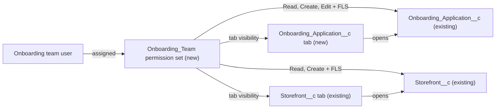

# Implementation spec — Onboarding Team permission set

> Give the onboarding team a dedicated permission set that lets them manage `Onboarding_Application__c` records and create `Storefront__c` records, and grants nothing else.

_Based on the requirement, the evidence reported by AskCoworker, and read-only org queries where noted. Assumptions and missing evidence are identified below. Specification only — nothing is implemented or deployed._

---

## 1. The requirement

Create one new permission set, `Onboarding_Team`, that grants Read, Create, and Edit on `Onboarding_Application__c` and Read and Create on `Storefront__c`, with the field-level security and tab settings those grants need, plus a tab for `Onboarding_Application__c` so the team can reach the object. The request contains no instruction to deploy or assign the permission set; nothing was deployed or assigned. No user questions were needed; every scope fork was decided from the requirement and org evidence (Section 8, "Resolved").

| # | Responsibility | Trigger | Where it lives |
| --- | --- | --- | --- |
| 1 | Onboarding team can view, create, and edit onboarding applications ("manage") | User creates or edits an `Onboarding_Application__c` record | `Onboarding_Team` (object and field permissions) |
| 2 | Onboarding team can reach onboarding applications in the UI | User opens the App Launcher | `Onboarding_Application__c` tab, visibility set in `Onboarding_Team` |
| 3 | Onboarding team can create storefronts, and view them, but not edit or delete them | User creates a `Storefront__c` record | `Onboarding_Team` (object and field permissions); existing `Storefront__c` tab |
| 4 | The permission set grants nothing else | Permission set assignment | `Onboarding_Team` (no other object, system, app, or tab permissions) |

## 2. Grounding — reuse before building

Target org: `TestWriteSpecDE` (Developer Edition, not a sandbox, org ID `00Dak00001COqNeEAL`). API version: `67.0`.

- **`Onboarding_Application__c`** (CustomObject) — the "onboarding applications" in the requirement. Internal sharing `ReadWrite`, external `Private`, no namespace, `Master` record type only, 0 records. _verified by org query_
- **`Onboarding_Application__c` custom fields** (CustomField) — complete list of 8 from Tooling `CustomField`: `Account__c` (Lookup to `Account`, delete constraint SetNull), `Application_Created_Date__c` (DateTime), `Application_Submitted_Date__c` (DateTime), `Business_License_Number__c` (Text), `Merchant_Business_Name__c` (Text), `Onboarding_Specialist__c` (Lookup to `User`, SetNull), `Operational_Procedures__c` (LongTextArea), and `Status__c` (Picklist, required; values Submitted, Under Review, Approved, Onboarded). `Name` is an Auto Number. The running admin's describe and `FieldDefinition` hide the 7 non-required fields because no profile or permission set other than `sfdc_accelerate_dms`, `sfdc_a360_sfcrm_data_extract`, and `sfdc_slack` has field permissions on them. _verified by org query_
- **`Storefront__c`** (CustomObject) — the "storefronts" in the requirement. Internal sharing `ReadWrite`, external `Private`, `Master` record type only, 21 records. It has 8 custom child objects (`Menu__c`, `Review__c`, `Promotion__c`, `Refund__c`, `Gift_Certificate__c`, `Event_Storefront__c`, `Storefront_Hours_of_Operation__c`, `Storefront_Tag__c`); none is in scope. _verified by org query_
- **`Storefront__c` custom fields** (CustomField) — complete list of 15. Createable: `Account__c` (Lookup to `Account`), `Address__c` (compound Address), `Cuisine__c`, `Description__c`, `Image_URL__c`, `Phone__c`, `Primary_Contact__c` (Lookup to `Contact`), `Status__c`, `Type__c`, `Storefront_Overview__c`, `Review_Summary__c`. Not createable (calculated): `Menu_Count__c`, `Total_Reviews__c`, `Total_Score__c`, `Average_Review_Score__c`. None is required. _verified by org query_
- **`Storefront__c`** (CustomTab) — a tab exists (`TabDefinition`). No tab exists for `Onboarding_Application__c`. _verified by org query_
- **`Onboarding Application Layout`** and **`Storefront Layout`** (Layout) — one page layout exists for each object. _verified by org query_
- **Automation** — no Apex triggers, no record-triggered or other flows (`FlowDefinitionView`), and no validation rules on either object. `MetadataComponentDependency` returns no components that reference `Onboarding_Application__c`. _verified by org query_
- **Existing grants on the two objects** (complete list from `ObjectPermissions`): `sfdc_accelerate_dms` full CRUD plus View All and Modify All on both; `Agentforce_Reference_App` full CRUD plus View All and Modify All on `Storefront__c` only; `sfdc_slack` and `sfdc_a360_sfcrm_data_extract` Read and View All on both; `Pronto_Deep_Dive_Workshop` Read and View All on `Storefront__c`; profiles `System Administrator` (full) and `Analytics Cloud Integration User` (Read, View All) on both. None of these is scoped to the onboarding team. _verified by org query_
- **No existing onboarding permission set** — no `PermissionSet` or `PermissionSetGroup` whose name or label contains "Onboard", and no permission set whose name contains "Storefront". _verified by org query_
- **Data 360** — `SELECT COUNT() FROM DataStream` returns 0. _verified by org query_
- **Project source** — `force-app/main/default/permissionsets`, `tabs`, and `objects` are empty in the project, so there is no local source for either object or any permission set. _verified by project file_

Evidence sources: `sf org display`; `sobject describe` of both objects; Tooling `CustomField` (list and per-field `Metadata`), `ValidationRule`, `ApexTrigger`, `Layout`, `CustomTab`, `MetadataComponentDependency`; standard `EntityDefinition`, `FieldDefinition`, `FlowDefinitionView`, `TabDefinition`, `PermissionSet`, `PermissionSetGroup`, `ObjectPermissions`, `FieldPermissions`, `Organization`, record counts, and `DataStream` count. AskCoworker returned no citedReferences.

## 3. Architecture

Why the pieces are drawn this way:

1. `Onboarding_Team` is new because no existing permission set is scoped to the team, and every existing grant on these objects is broader (full CRUD, View All, Modify All) or read-only. _verified by org query_
2. The permission set grants object access and field-level security on the two objects only. No automation, Apex, or other object is involved, because none exists on either object. _verified by org query_
3. The `Onboarding_Application__c` tab is new because the object has no tab; the `Storefront__c` tab already exists and only needs visibility in the permission set. _verified by org query_
4. No code is used. Every change is declarative metadata.

## 4. Metadata changes

**Security**

- **Create `Onboarding_Team`** — New PermissionSet. Label "Onboarding Team"; description "Manage onboarding applications and create storefronts. Grants nothing else."; no license (usable with the Salesforce user license). Contents:
  - Object permissions on `Onboarding_Application__c`: `allowRead` true, `allowCreate` true, `allowEdit` true, `allowDelete` false, `viewAllRecords` false, `modifyAllRecords` false.
  - Object permissions on `Storefront__c`: `allowRead` true, `allowCreate` true, `allowEdit` false, `allowDelete` false, `viewAllRecords` false, `modifyAllRecords` false.
  - Field permissions, Read and Edit, on `Onboarding_Application__c.Account__c`, `Onboarding_Application__c.Application_Created_Date__c`, `Onboarding_Application__c.Application_Submitted_Date__c`, `Onboarding_Application__c.Business_License_Number__c`, `Onboarding_Application__c.Merchant_Business_Name__c`, `Onboarding_Application__c.Onboarding_Specialist__c`, `Onboarding_Application__c.Operational_Procedures__c`. No entry for `Onboarding_Application__c.Status__c`: it is required, so it is always readable and editable and a field permission for it cannot be deployed.
  - Field permissions, Read and Edit, on `Storefront__c.Account__c`, `Storefront__c.Address__c`, `Storefront__c.Cuisine__c`, `Storefront__c.Description__c`, `Storefront__c.Image_URL__c`, `Storefront__c.Phone__c`, `Storefront__c.Primary_Contact__c`, `Storefront__c.Status__c`, `Storefront__c.Type__c`, `Storefront__c.Storefront_Overview__c`, `Storefront__c.Review_Summary__c` (Edit field permission is what lets a user set a field on insert; without object Edit the user still cannot change an existing record).
  - Field permissions, Read only, on `Storefront__c.Menu_Count__c`, `Storefront__c.Total_Reviews__c`, `Storefront__c.Total_Score__c`, `Storefront__c.Average_Review_Score__c`.
  - Tab settings: `Onboarding_Application__c` Visible; `Storefront__c` Visible.
  - No user permissions, app visibilities, Apex class, Visualforce, custom permission, or other object grants.

**UX**

- **Create `Onboarding_Application__c`** — New CustomTab for the `Onboarding_Application__c` custom object (`customObject` true, standard motif chosen at build time). It is not added to any Lightning app; users open it from the App Launcher. Tab visibility is granted by `Onboarding_Team`, so deploy the tab first or in the same deployment.

## 5. Data 360 (Data Cloud) data involved

Not applicable — this change does not use Data 360. The org has no data streams (`DataStream` count 0, _verified by org query_), and the existing `sfdc_a360_sfcrm_data_extract` permission set is not changed.

## 6. Security considerations

- **Execution context.** No Apex, flow, or trigger is added, and none exists on either object (_verified by org query_). All access is enforced by the platform in the user's context.
- **Sharing.** Internal sharing is `ReadWrite` on both objects (_verified by org query_). With this permission set, team members can therefore read and edit every `Onboarding_Application__c` record, and read every `Storefront__c` record (21 today), not only records they own. This matches "manage onboarding applications". _assumption (documented platform behavior)_: object permissions and organization-wide defaults combine; the permission set cannot narrow sharing.
- **CRUD.** `Onboarding_Application__c`: Read, Create, Edit; no Delete, View All, or Modify All. `Storefront__c`: Read and Create only. Read is included on `Storefront__c` because the platform requires Read for Create and because the creator must see the record after saving. _assumption (documented platform behavior)_
- **FLS.** Listed exactly in Section 4. `Onboarding_Application__c.Status__c` is visible and editable to every user with object access because it is required. _verified by org query_ (required) and _assumption (documented platform behavior)_ (required fields bypass FLS).
- **"Nothing else".** A permission set only adds access; it cannot remove access that the users' profile or other permission sets grant. The permission set itself grants nothing beyond Section 4. Whether the team's profile grants more was not checked, because the team's users are not identified (Section 8).
- **Lookups.** `Onboarding_Application__c.Account__c` and `Storefront__c.Account__c` reference `Account`; `Storefront__c.Primary_Contact__c` references `Contact`; `Onboarding_Application__c.Onboarding_Specialist__c` references `User` (_verified by org query_). _assumption (documented platform behavior)_: to set a lookup, the user needs Read access to the referenced record. `Onboarding_Team` does not grant `Account` or `Contact`, so these lookups work only if the users' profile already grants Read on those objects (Section 8).
- **Data exposure.** The team will see `Business_License_Number__c`, `Merchant_Business_Name__c`, and `Operational_Procedures__c` on every application. No data leaves the org through this change.
- **Other grant paths.** `sfdc_accelerate_dms`, `Agentforce_Reference_App`, `sfdc_slack`, `sfdc_a360_sfcrm_data_extract`, `Pronto_Deep_Dive_Workshop`, and two profiles also grant access to these objects (_verified by org query_); they are not changed.
- **Assignment.** The permission set is assigned manually to each team member after deployment. Assignment is a data step and is not part of this spec.

## 7. Testing strategy

The inventory contains no Apex, so there is no Apex test class. All cases below are recommended verification, run as a test user who has a minimum-access profile (for example `Minimum Access - Salesforce`) plus `Onboarding_Team`. The `Minimum Access - Salesforce` profile exists in the org (_verified by org query_).

- **Create application.** Create an `Onboarding_Application__c` with `Status__c` set and every other custom field filled; save succeeds and all 7 non-required fields are visible and editable.
- **Required field.** Save an `Onboarding_Application__c` without `Status__c`; the save is blocked.
- **Edit application.** Edit an application owned by another user; save succeeds (sharing `ReadWrite`).
- **No delete of applications.** The Delete action is missing, and an API delete fails with insufficient access.
- **Create storefront.** Create a `Storefront__c` with the createable fields filled; save succeeds, and the record shows the four calculated fields as read-only.
- **No edit or delete of storefronts.** On an existing `Storefront__c` (including one the test user just created), Edit and Delete are missing, and API update and delete fail.
- **Nothing else.** The test user cannot open `Menu__c`, `Review__c`, `Refund__c`, or other `Storefront__c` child objects, `Account`, or `Contact` through this permission set.
- **Lookups.** Populate `Onboarding_Application__c.Account__c` and `Storefront__c.Primary_Contact__c`; with the minimum-access profile these are expected to fail. Repeat with the team's real profile to settle the Section 8 lookup decision.
- **Tabs.** `Onboarding Applications` and `Storefronts` appear in the App Launcher for the test user and not for a user without the permission set.
- **Bulk.** Insert 200 `Onboarding_Application__c` records through the API as the test user; all succeed, since no automation exists.
- **Deployment check.** Validate the deployment of the tab and permission set together; confirm no field permission for `Onboarding_Application__c.Status__c` is present.

## 8. Open decisions

### Open

1. **Lookup access to `Account` and `Contact` (non-blocking).** `Onboarding_Application__c.Account__c`, `Storefront__c.Account__c`, and `Storefront__c.Primary_Contact__c` can be set only by users who can read the referenced `Account` or `Contact`. "Nothing else" excludes these grants, so the default is to leave them out. If the team's profile does not grant Read on `Account` and `Contact`, these fields stay blank. Recommended default: keep them out; if the business needs these fields set by the team, add Read (no Create, Edit, or Delete) on `Account` and `Contact` to `Onboarding_Team`.
2. **Team's profile not identified (non-blocking).** The onboarding team's users and profile are not known, so the org checks could not confirm what access they already have. "Nothing else" is guaranteed only for this permission set. Recommended default: assign the permission set with a minimum-access profile.
3. **App placement (non-blocking).** The new tab is reached from the App Launcher. Adding it to a Lightning app or creating an onboarding app is not in scope. Recommended default: no app change.
4. **Page layouts (non-blocking).** The existing `Onboarding Application Layout` and `Storefront Layout` are used as they are. Whether they show the 7 `Onboarding_Application__c` fields was not checked (layout contents cannot be read with the allowed commands). If the layout omits a field, the team cannot edit it in the UI. Recommended default: check the layout during manual verification.
5. **Deployment sequence (non-blocking).** Deploy the `Onboarding_Application__c` tab before, or together with, `Onboarding_Team`, because the permission set's tab setting references the tab. Then assign the permission set to team members.

### Resolved

- **"Manage" scope** — _assumption_: Read, Create, Edit on `Onboarding_Application__c`; no Delete, View All, or Modify All. Reason: "manage" covers working applications through their `Status__c` lifecycle; deleting records is hard to undo and is not asked for, and View All/Modify All add nothing under `ReadWrite` sharing except bypassing it for future sharing changes.
- **"Create storefronts" scope** — _assumption_: Read and Create only on `Storefront__c`; no Edit or Delete. Reason: the requirement says "create storefronts, nothing else". Read is required by the platform for Create.
- **Field access on `Storefront__c`** — _assumption_: Read and Edit on all 11 createable fields so the team can fill them on create; Read only on the 4 calculated fields so the team can see the saved record.
- **Tab for `Onboarding_Application__c`** — _assumption_: included. Reason: the object has no tab (_verified by org query_), and the team has no `Account` access, so there is no other UI path to the records; without a tab, responsibility 1 is not delivered in the UI.
- **Correction: `Status__c` field permission.** AskCoworker proposed Read and Edit field permission on `Onboarding_Application__c.Status__c`. The field is required (_verified by org query_), and field permissions on required fields cannot be deployed. The entry was removed.
- **Correction: inventory rows.** AskCoworker listed the permission set as one Create row plus seven Update rows for its contents. They are one deployable component, so they are merged into the single Create of `Onboarding_Team`.
- **Conflict: fields on `Onboarding_Application__c`.** AskCoworker reported that `Status__c` is the only custom business field and that no field links the object to an account. Tooling `CustomField` shows 8 custom fields, including `Account__c` (Lookup to `Account`). The org query wins; the admin's describe hides the other 7 fields because the admin profile has no field permissions on them.
- **Dropped: AskCoworker items not in scope.** A relationship between `Onboarding_Application__c` and `Storefront__c`, a permission set group, a dedicated page layout, and an unrelated "Ghost Kitchen queue" item were proposed or mentioned; none is asked for by the requirement, so none is in the inventory.
- **Rejected reuse.** `sfdc_accelerate_dms` and `Agentforce_Reference_App` grant full CRUD with View All and Modify All (_verified by org query_), so they are broader than the requirement and cannot be narrowed without affecting their current users.

## 9. Change set

| # | Action | Type | API name | Module | Why |
| --- | --- | --- | --- | --- | --- |
| 1 | Create | PermissionSet | `Onboarding_Team` | force-app/main/default/permissionsets | Grants exactly Read/Create/Edit on onboarding applications and Read/Create on storefronts, with FLS and tab visibility, and nothing else |
| 2 | Create | CustomTab | `Onboarding_Application__c` | force-app/main/default/tabs | The object has no tab, so the team has no UI path to manage applications |

One new permission set grants the onboarding team scoped access to two existing objects, and one new tab makes onboarding applications reachable in the UI.

Total: 2 · Create: 2 · Update: 0 · Delete: 0
