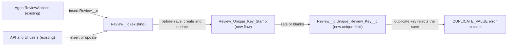

# Implementation spec — One review per customer, storefront, and order date

> Block a customer from saving a second `Review__c` for the same storefront and order date, on create and on edit.

_Based on the requirement, the evidence reported by AskCoworker, and read-only org queries where noted. Assumptions and missing evidence are identified below. Specification only — nothing is implemented or deployed._

---

## 1. The requirement

A `Review__c` whose `Customer__c`, `Storefront__c`, and `Order_Date__c` match an existing review must be rejected with an error (user decision: block with an error). Reviews that have no `Customer__c` or no `Order_Date__c` have no key and are exempt (assumption; the user had no preference). The request contained no deploy, data-change, or credential instructions.

| # | Responsibility | Trigger | Where it lives |
| --- | --- | --- | --- |
| 1 | Compute a composite key from customer, storefront, and order date | `Review__c` create and update | `Review_Unique_Key_Stamp` (new before-save flow) |
| 2 | Reject a second review with the same key, race-safe | `Review__c` save | Unique index on `Review__c.Unique_Review_Key__c` (new field) |
| 3 | Apply the rule to the 92 existing reviews | One-time data step after deploy | Backfill of `Review__c.Unique_Review_Key__c` |

## 2. Grounding — reuse before building

Target org: `TestWriteSpecDE` (`00Dak00001COqNeEAL`, connected). API version: `67.0` (`sourceApiVersion` in `sfdx-project.json`, verified by project file).

- **`Review__c`** (CustomObject, `DurableId` `01Iak00000Dx4JW`) — the object the rule applies to. Custom fields are exactly `Storefront__c`, `Comments__c`, `Customer__c`, `Order_Date__c`, `Rating__c`, `Status__c`. _verified by org query_
- **`Review__c.Storefront__c`** (Master-Detail to `Storefront__c`) — not nillable; `reparentableMasterDetail` = `false`, so the storefront cannot change after insert. _verified by org query_
- **`Review__c.Customer__c`** (Lookup to `Contact`) — nillable; 79 of 92 reviews have a value. _verified by org query_
- **`Review__c.Order_Date__c`** (Date) — nillable; 92 of 92 reviews have a value. _verified by org query_
- **Existing data** — `GROUP BY Customer__c, Storefront__c, Order_Date__c HAVING COUNT(Id) > 1` returned 0 groups, so no existing review breaks the rule. _verified by org query_
- **No existing enforcement on `Review__c`** — 0 Apex triggers, 0 record-triggered flows (`FlowDefinitionView`), 0 validation rules (Tooling `ValidationRule`), and no `DuplicateRule` for `Review__c` (only the inactive `Standard_Account_Duplicate_Rule`, `Standard_Contact_Duplicate_Rule`, `Standard_Lead_Duplicate_Rule`). _verified by org query_
- **`AgentReviewActions`** (ApexClass, `with sharing`, invocable "Leave Review") — the only Apex class that inserts `Review__c` (scan of all 70 non-namespaced Apex class bodies). It sets `Customer__c`, `Storefront__c`, `Rating__c`, `Comments__c`, and `Status__c = 'Submitted'`, but not `Order_Date__c`. It catches exceptions and returns `e.getMessage()`. Its only referencing component is `AgentActionsTest`, which calls it once; no `GenAiFunctionDefinition` targets it. _verified by org query_
- **`AgentSummarizeReviewsActions`** (ApexClass) — reads `Review__c`, including `Order_Date__c`; not affected by a new field. _verified by org query_
- **Writers by permission** — Create on `Review__c`: `sfdc_accelerate_dms` (namespace `sfdcInternalInt`, managed, not editable) and the System Administrator profile permission set; Edit also on `Agentforce_Reference_App`. _verified by org query_
- **Duplicate-name check** — no `CustomField` named `Unique_Review_Key` and no flow `Review_Unique_Key_Stamp` exists. No other custom field in the org represents a review uniqueness key (Tooling `CustomField` search for `Unique`, `Dedup`, `Review_Key`; hits are on other objects and Data 360 objects). _verified by org query_
- The project's `force-app/main/default` folders contain no `Review__c` source. _verified by project file_

Candidates examined and rejected: a Duplicate Rule and Matching Rule on `Review__c` — not race-safe under concurrent saves and depends on matching-rule field support (assumption (documented platform behavior)); an Apex trigger with a duplicate query — not race-safe and adds code where a declarative mechanism works; a validation rule — cannot query other records (assumption (documented platform behavior)); a formula key field — formula fields cannot be unique (assumption (documented platform behavior)).

Evidence sources: `sf org display`, `sf sobject list`, `sf sobject describe Review__c`, Tooling queries on `EntityDefinition`, `CustomField`, `ApexTrigger`, `ValidationRule`, `ApexClass` bodies, `MetadataComponentDependency`, `GenAiFunctionDefinition`, and standard queries on `FlowDefinitionView`, `DuplicateRule`, `ObjectPermissions`, `FieldPermissions`, `PermissionSet`, `DataStream`, and `Review__c` aggregates. AskCoworker returned no citedReferences.

## 3. Architecture

Why the pieces are drawn this way:

1. Every save of `Review__c`, from `AgentReviewActions` or any API or UI user, runs the new before-save flow. No other automation exists on `Review__c` (verified by org query).
2. The flow writes the key into `Review__c.Unique_Review_Key__c`. A before-save flow runs before before-triggers and custom validation, and its field assignments need no extra DML (assumption (documented platform behavior)).
3. The unique index on the field rejects the save when another review already holds the same non-blank key. The database enforces it, so two concurrent saves cannot both pass. Blank values are not checked for uniqueness (assumption (documented platform behavior)).
4. No Apex is added: the standard unique-field mechanism plus a before-save flow covers create, update, and bulk saves.

## 4. Metadata changes

**Data model**

- **Create `Review__c.Unique_Review_Key__c`** — CustomField, Text(64), Unique (case-insensitive), not External ID, not required. Label "Unique Review Key". Description: "System-maintained. Customer Id, Storefront Id, and order date joined by underscores; blank when Customer or Order Date is blank. Enforces one review per customer per storefront per order date." The largest value is 18 + 1 + 18 + 1 + 10 = 48 characters. No permission set or profile grant and no layout placement: only the flow writes it and no user or integration reads it.

**Automation**

- **Create `Review_Unique_Key_Stamp`** — Flow, record-triggered on `Review__c`, "Fast Field Updates" (before-save), runs on "A record is created or updated", entry condition none (every save). Formula resource `KeyValue` (Text): `IF(OR(ISBLANK({!$Record.Customer__c}), ISBLANK({!$Record.Order_Date__c})), "", {!$Record.Customer__c} & "_" & {!$Record.Storefront__c} & "_" & TEXT({!$Record.Order_Date__c}))`. One Assignment element sets `{!$Record.Unique_Review_Key__c}` = `{!KeyValue}`. Lookup values in `$Record` are 18-character Ids, so the case-insensitive index does not collide. `TEXT()` of a Date gives `YYYY-MM-DD`. Blank inputs give a blank key; there are no numeric inputs. The formula is far below the 3,900-character limit.

**Tests**

- **Create `Review_Unique_Key_Stamp_Test`** — FlowTest for `Review_Unique_Key_Stamp`. Assert the key on create with all three fields filled; assert a blank key on create with `Customer__c` blank and with `Order_Date__c` blank; on update, assert the key changes when `Order_Date__c` changes and becomes blank when `Customer__c` is cleared.

## 5. Data 360 (Data Cloud) data involved

Not applicable — this change does not use Data 360. `SELECT COUNT() FROM DataStream` returned 0 (verified by org query), and the new field has no grant to `sfdc_a360_sfcrm_data_extract`.

## 6. Security considerations

- **Execution context:** the before-save flow runs in system context and writes the field regardless of the running user's field-level security (assumption (documented platform behavior)). The unique index applies to every caller, including `sfdc_accelerate_dms` API inserts, `AgentReviewActions` (`with sharing`), and administrators.
- **CRUD/FLS:** no object permission changes. The new field gets no permission set or profile grant. Users with View All Data or Modify All Data (for example System Administrator) can still see it. Because no one has Edit on it, a caller cannot set the key directly, and the flow overwrites any value sent.
- **Permission sets:** none change. `sfdc_accelerate_dms` is managed (`sfdcInternalInt`) and could not be changed anyway (verified by org query).
- **Data exposure:** the duplicate error text from the platform names the field and the Id of the existing review. `AgentReviewActions` returns `e.getMessage()` to its caller, so an agent user would see that text (verified by org query for the catch block). The existing review Id is not personal data beyond what the caller already supplied; a friendlier message is a proposal in Section 8.
- **Bypass:** a user can avoid the rule only by leaving `Customer__c` or `Order_Date__c` blank, which is the accepted exemption (Section 8).

## 7. Testing strategy

- **`Review_Unique_Key_Stamp_Test` (FlowTest):** key set on create; key blank when `Customer__c` is blank; key blank when `Order_Date__c` is blank; key recomputed when `Order_Date__c` changes; key blanked when `Customer__c` is cleared.
- **`AgentActionsTest` (existing):** calls `AgentReviewActions` once without `Order_Date__c`, so the key is blank and the test is unaffected. Run it after deploy as a regression check.
- **Recommended verification (manual, in a sandbox):**
  1. Create a review with customer, storefront, and order date; confirm the key is `{ContactId}_{StorefrontId}_{YYYY-MM-DD}`.
  2. Create a second review with the same three values; confirm the save fails with a duplicate error (the main requirement; verifies the load-bearing unique-index assumption).
  3. Same customer and date, different storefront; same customer and storefront, different date; different customer — each saves.
  4. Edit an existing review's `Order_Date__c` to match another review of the same customer and storefront; confirm the save fails.
  5. Two reviews with a blank `Customer__c` and the same storefront and date both save (exemption).
  6. Bulk insert 200 reviews through the API with `allOrNone = false`, two sharing a key; confirm one row fails and the rest save.
  7. Delete a keyed review, create a replacement with the same key, then undelete the original; confirm the undelete fails with a duplicate error (expected behavior).
  8. After the backfill, confirm 92 of 92 reviews were processed, 79 have a non-blank key, and 13 (blank `Customer__c`) have a blank key.

## 8. Open decisions

### Open

1. **Backfill existing reviews (blocking for delivery).** After deploy, the 92 existing reviews have a blank key, so a customer who already reviewed could add a duplicate for the same storefront and order date. Data step: (a) export `Id`, `Customer__c`, `Storefront__c`, `Order_Date__c` of all `Review__c` rows as a backup; (b) update every row with no field changes (for example a Data Loader update of `Id` only) so `Review_Unique_Key_Stamp` computes the key; (c) confirm 79 non-blank keys. The 0-duplicate query means no row should fail; re-run that query immediately before the backfill. Rollback: set `Review__c.Unique_Review_Key__c` to blank on all rows, or deactivate the flow and delete the field; no other field changes.
2. **Reviews created through `AgentReviewActions` are exempt (non-blocking).** The action never sets `Order_Date__c` (verified by org query), so its reviews get a blank key and the rule does not apply to them. No agent action currently targets the class (verified by org query). Recommended default: leave the class unchanged in this spec. If the agent channel goes live, a follow-up can add an order-date input to `AgentReviewActions` and set `Order_Date__c`.
3. **Friendlier error message (non-blocking, proposal).** The platform duplicate error names the field and the existing record Id. Recommended default: accept it. Alternative: add a Get Records check and a Custom Error element to the flow for a business message, keeping the unique index as the race-safe backstop.
4. **Undelete after replacement (non-blocking).** If a review is deleted, a replacement with the same key is created, and the original is then undeleted, the undelete fails with a duplicate error; this keeps the rule true (assumption (documented platform behavior)).
5. **Deployment sequence.** Deploy `Review__c.Unique_Review_Key__c`, then `Review_Unique_Key_Stamp` (activated), then `Review_Unique_Key_Stamp_Test`; then run the backfill (item 1).

### Resolved

- **Block with an error** on create and update (user decision).
- **Exempt reviews missing `Customer__c` or `Order_Date__c`** (assumption; the user had no preference). The requirement is about customers, and without an order date there is no key. Load-bearing for the exemption only; verification step 5 in Section 7.
- **Mechanism:** unique Text field set by a before-save flow, instead of a Duplicate Rule, trigger, or validation rule (assumption; see Section 2).
- **Unique index enforcement is load-bearing** (assumption (documented platform behavior)); verification step 2 in Section 7.
- **Corrected AskCoworker claims:** validation rules are queryable (Tooling `ValidationRule`, 0 rows), and duplicate rules are queryable (`DuplicateRule`, none for `Review__c`); before-save flows run before before-triggers and custom validation, not after system validation as reported. After these two wrong claims, every kept fact was verified by org query.
- **Dropped AskCoworker proposals:** External ID on the key (not needed for uniqueness), Text(255) (48 characters suffice), and a field grant on `sfdc_accelerate_dms` (managed and not editable, and no reader needs the field).
- **Storefront changes:** `reparentableMasterDetail` is `false` (verified by org query), so the storefront part of the key cannot change after insert; the flow still recomputes the key on every update.

## 9. Change set

| # | Action | Type | API name | Module | Why |
| --- | --- | --- | --- | --- | --- |
| 1 | Create | CustomField | `Review__c.Unique_Review_Key__c` | force-app/main/default/objects/Review__c/fields | Unique index that rejects a second review for the same customer, storefront, and order date |
| 2 | Create | Flow | `Review_Unique_Key_Stamp` | force-app/main/default/flows | Before-save flow that sets or blanks the key on create and update |
| 3 | Create | FlowTest | `Review_Unique_Key_Stamp_Test` | force-app/main/default/flowtests | Asserts the key values the flow writes |

A before-save flow stamps a composite key on every `Review__c` save, and a unique index on that key blocks duplicates.

Total: 3 · Create: 3 · Update: 0 · Delete: 0
