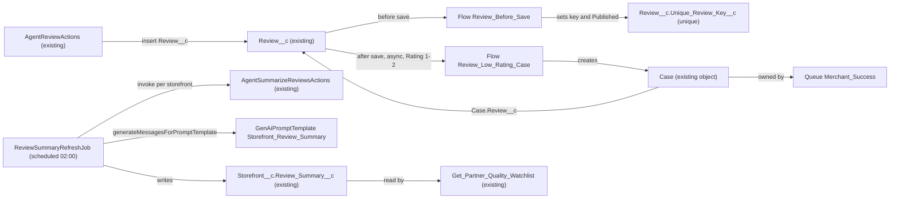

# Implementation spec — Review lifecycle automation and nightly AI review summary

> Block duplicate reviews, publish 4–5 star reviews automatically, open a Merchant Success case for 1–2 star reviews, and regenerate each storefront's AI review summary every night.

_Based on the requirement, the evidence reported by AskCoworker, and read-only org queries where noted. Assumptions and missing evidence are identified below. Specification only — nothing is implemented or deployed._

---

## 1. The requirement

On `Review__c`: reject a second review from the same customer for the same storefront, set `Review__c.Status__c` to `Published` for 4–5 star reviews, open a `Case` routed to a new Merchant Success queue for 1–2 star reviews, and every night regenerate `Storefront__c.Review_Summary__c` with generative AI, reusing the existing `AgentSummarizeReviewsActions` action. The user chose the Merchant Success queue and the reuse of `AgentSummarizeReviewsActions` (*user decision*). The duplicate definition (same `Review__c.Customer__c` and `Review__c.Storefront__c`) is the recommended default the user accepted without a preference (*assumption*). The request contained no deploy, data-change, or credential instruction.

| # | Responsibility | Trigger | Where it lives |
| --- | --- | --- | --- |
| 1 | Block a duplicate review (same customer + same storefront) | `Review__c` insert, and update that changes `Review__c.Customer__c` | `Review__c.Unique_Review_Key__c` (unique) set by flow `Review_Before_Save` |
| 2 | Auto-publish 4–5 star reviews | `Review__c` insert with `Rating__c` 4–5, or update that changes `Rating__c` into 4–5 | Flow `Review_Before_Save` |
| 3 | Open a case for 1–2 star reviews, routed to Merchant Success | `Review__c` insert with `Rating__c` 1–2, or update that changes `Rating__c` into 1–2 | Flow `Review_Low_Rating_Case`, queue `Merchant_Success`, lookup `Case.Review__c` |
| 4 | Refresh each storefront's AI review summary nightly | Scheduled Apex, nightly at 02:00 | `ReviewSummaryRefreshJob` → `AgentSummarizeReviewsActions` (existing) → prompt template `Storefront_Review_Summary` → `Storefront__c.Review_Summary__c` |

## 2. Grounding — reuse before building

Target org: `TestWriteSpecDE` (Developer Edition, `00Dak00001COqNeEAL`). API version: `67.0`.

- **`Review__c`** (CustomObject) — the review record. Fields: `Name` (auto number), `Rating__c` (Number(1,0), nillable, description "typically ranging from 1 (poor) to 5 (excellent)"), `Status__c` (picklist, values `Submitted`, `Published` only), `Customer__c` (Lookup(Contact), nillable), `Storefront__c` (Master-Detail(Storefront__c)), `Order_Date__c` (Date), `Comments__c` (Long Text Area 32768). The Tooling `CustomField` list for the object has exactly these six custom fields; no key or duplicate field exists. _verified by org query_
- **Review data shape** — 92 records. `Status__c` is blank on all 92. `Rating__c`: 52 rated 4–5, 11 rated 3, 29 rated 1–2, 0 blank, 0 outside 1–5. 13 records have no `Customer__c`. 13 `Customer__c` + `Storefront__c` pairs have more than one review (27 records, up to 3 per pair); 0 pairs repeat when `Order_Date__c` is added. `Order_Date__c` ranges from 2026-06-03 to 2026-08-26; 0 reviews fall in the last 30 days and all 92 in the last 365 days. _verified by org query_
- **Automation on `Review__c`, `Storefront__c`, `Case`** — 0 Apex triggers (Tooling `ApexTrigger`), 0 record-triggered flows (`FlowDefinitionView` per object), 0 validation rules (Tooling `ValidationRule` per `EntityDefinitionId`). Duplicate rules exist only for Account, Contact, and Lead (all inactive). The only active Case assignment rule is `Standard` (entries unreadable). _verified by org query_
- **`AgentReviewActions`** (ApexClass, `with sharing`, invocable "Leave Review") — the only Apex creator of `Review__c`; always sets `Status__c = 'Submitted'`, does not set `Order_Date__c`, returns `e.getMessage()` on a DML error. It stays unchanged; the new flow publishes 4–5 star reviews after it inserts them. _verified by org query_
- **`AgentSummarizeReviewsActions`** (ApexClass, `with sharing`, invocable "Summarize Reviews") — reused by the nightly job. It processes only `requests[0]`, requires `accountId` equal to `Storefront__c.Account__c`, defaults `daysBack` to 30 and `reviewLimit` to 20 (max 100), and returns rating counts, `averageRating`, and a review list with `rating`, `comments`, `customerId`, `orderDate`, `status`. It does not generate text and does not write `Review_Summary__c`. `MetadataComponentDependency` on `Review__c` lists only this class and `AgentReviewActions`. _verified by org query_
- **`Storefront__c.Review_Summary__c`** (Long Text Area 1000, description "Concise summary of customer reviews for the storefront.") — the target field; blank on all 21 storefronts. All 21 storefronts have `Account__c`. Read by the autolaunched flow `Get_Partner_Quality_Watchlist` (read-only). No Apex class body references it. _verified by org query_
- **`Case`** — has `Case.Storefront__c` (Lookup(Storefront__c)) and `Case.Business_Account__c` (Lookup(Account)); no Review lookup (no `Case` child relationship on `Review__c`). Active values: `Type` includes `Feedback & Reviews`; `Status` = `New`, `On Hold`, `Escalated`, `Closed`; `Origin` = `Email`, `Phone`, `Web`, `Agentforce`. No Case record types. `Case_Record_Page` (FlexiPage) uses Dynamic Forms (64 `fieldInstance` entries). Case layouts: `Case Layout`, `Case (Support) Layout`, `Case (Sales) Layout`, `Case (Marketing) Layout`. _verified by org query_
- **Queues** — only `Merchant_Messaging_Queue` (MessagingSession) and `Unqualified_Leads` (Lead). No Merchant Success queue or group exists. _verified by org query_
- **Scheduled work** — `CronTrigger` holds five platform jobs, none for reviews or summaries. The only schedule-triggered flow is `Orch`. No Apex class named like `*Summary*`/`*Review*`/`*Schedul*` handles reviews. _verified by org query_
- **Generative AI** — `EinsteinGPTPromptTemplateUser` and `EinsteinGPTPromptTemplateManager` permission sets exist (1 assignment of `EinsteinGPTPromptTemplateUser`); Agentforce planners exist. `GenAiPromptTemplate` is not queryable, so an existing review-summary prompt template cannot be ruled out. _verified by org query_
- **Access** — `Review__c` object grants (permission sets, complete for non-profile sets): Read on `Pronto_Deep_Dive_Workshop`, `sfdc_a360_sfcrm_data_extract`, `sfdc_slack`; Read+Edit on `Agentforce_Reference_App`; Read+Create+Edit on `sfdc_accelerate_dms`. No existing permission set is named for reviews or Merchant Success cases. _verified by org query_
- **Data 360** — `SELECT COUNT() FROM DataStream` returns 0. _verified by org query_

Candidates examined and rejected: `AgentCaseCreateActions` — processes only `requests[0]` and requires a Contact, so it cannot serve bulk record-triggered interviews or reviews without `Customer__c` (_verified by org query_); a Duplicate Rule/Matching Rule on `Review__c` — can be bypassed by API callers that set allow-save headers and needs a custom matching rule; a unique index is enforced for every caller (*assumption (documented platform behavior)*); a validation rule with `VLOOKUP` — `VLOOKUP` matches only a custom object's `Name` field, so it cannot express a Customer + Storefront key (*assumption (documented platform behavior)*); `CaseSummaryCardAction` — a chat-facing card action (*reported by AskCoworker*), not needed.

Evidence sources: `sf org display`; `sf sobject describe` for `Review__c`, `Storefront__c`, `Case`; Tooling `CustomField`, `EntityDefinition`, `ApexTrigger`, `ValidationRule`, `MetadataComponentDependency`, `ApexClass` bodies, `Flow.Metadata`, `FlexiPage`, `Layout`, `GenAiPlannerDefinition`; standard `FlowDefinitionView`, `DuplicateRule`, `AssignmentRule`, `Group`, `QueueSobject`, `RecordType`, `CronTrigger`, `ObjectPermissions`, `FieldPermissions`, `PermissionSetAssignment`, `DataStream`, aggregate queries on `Review__c` and `Storefront__c`. AskCoworker returned no citedReferences.

## 3. Architecture

Why the pieces are drawn this way:

1. `AgentReviewActions` is the only Apex creator of `Review__c` and sets `Status__c = 'Submitted'` (_verified by org query_). Record-triggered automation covers every channel (agent, UI, API), so the agent action does not change.
2. Duplicate blocking uses a unique text field instead of a query-and-error check: the database index rejects duplicates even when two reviews arrive in parallel transactions, and it applies to every caller (*assumption (documented platform behavior)*). The before-save flow fills the key; it holds no query, so it is bulk-safe.
3. Publishing and key-setting are both before-save field assignments on the same object and event, so they live in one before-save flow (design rule: keep same-object, same-event logic together). A before-save flow cannot create other records, so case creation needs a second, after-save flow (*assumption (documented platform behavior)*).
4. Case creation runs on the after-save flow's asynchronous path so a Case failure (for example a missing queue) does not roll back the customer's review; the failure still surfaces through the flow error email and the Failed Flow Interviews list (*assumption (documented platform behavior)*). `Case.Review__c` links the case to its review and lets the flow skip reviews that already have a case.
5. The nightly job is Apex, not a schedule-triggered flow. A schedule-triggered flow bulkifies invocable calls across interviews, and `AgentSummarizeReviewsActions` answers only `requests[0]` (_verified by org query_), so a flow would receive one result for many storefronts. Batch Apex with scope 1 calls the action once per storefront, keeps each prompt-template callout in its own transaction, and needs no change to the shared action.
6. `Get_Partner_Quality_Watchlist` already reads `Review_Summary__c` (_verified by org query_); it gains populated summaries with no change.

## 4. Metadata changes

**Duplicate block**

- **Create `Review__c.Unique_Review_Key__c`** — CustomField, Text(40), Unique (case-insensitive), not External ID, not required, label "Unique Review Key", description "System-managed: Customer__c + '_' + Storefront__c. Enforces one review per customer per storefront. Blank for reviews without a customer." No layout or record-page placement and no FLS grant (system-managed; administrators see it through Modify All Data). Blank values are not checked for uniqueness, so reviews without a customer are never blocked.

**Auto-publish**

- **Create `Review_Before_Save`** — Flow, record-triggered on `Review__c`, "Fast Field Updates" (before save), on create and update. Logic: (a) Key — on create, or on update when `ISCHANGED({!$Record.Customer__c})`: if `{!$Record.Customer__c}` is not blank, set `{!$Record.Unique_Review_Key__c}` = `{!$Record.Customer__c} & '_' & {!$Record.Storefront__c}` (two 18-character Ids plus `_` = 37 characters); otherwise set it to blank. (b) Publish — on create when `{!$Record.Rating__c} >= 4`, or on update when `ISCHANGED({!$Record.Rating__c})` and `{!$Record.Rating__c} >= 4`: set `{!$Record.Status__c}` = `Published`. A blank `Rating__c` never publishes. The flow does not unpublish when a rating drops, and it does not overwrite a status someone sets by hand unless the rating itself changes. A duplicate save fails with the platform's duplicate-value error on `Unique_Review_Key__c`.
- **Create `Review_Before_Save_Publish_Test`** — FlowTest for `Review_Before_Save`: create a `Review__c` with `Rating__c = 5` and a `Customer__c`; assert `Status__c = 'Published'` and `Unique_Review_Key__c` is not blank. A second test path creates `Rating__c = 3` and asserts `Status__c` is unchanged.

**Case creation**

- **Create `Case.Review__c`** — CustomField, Lookup(`Review__c`), label "Review", relationship name `Cases`, delete constraint Set Null, not required. Links a low-rating case to its review and makes the case flow idempotent.
- **Update `Case_Record_Page`** — FlexiPage (Dynamic Forms): add a field instance for `Case.Review__c` (read-only in UI) in the section that already shows `Case.Storefront__c`. Retrieve the page before editing. Adding a field changes the page for everyone who uses it; users without Read on `Case.Review__c` do not see the field.
- **Create `Review_Low_Rating_Case`** — Flow, record-triggered on `Review__c`, "Actions and Related Records" (after save), on create and update. Entry condition: `{!$Record.Rating__c} <= 2` AND `{!$Record.Rating__c}` is not blank, with "Only when a record is updated to meet the condition requirements". All logic runs on a "Run Asynchronously" path: (1) Get Records `Case` where `Review__c = {!$Record.Id}`; if one exists, end. (2) Get Records `Group` where `Type = 'Queue'` and `DeveloperName = 'Merchant_Success'`. (3) Create Records `Case`: `OwnerId` = the queue Id (left unset if the queue is not found), `ContactId` = `{!$Record.Customer__c}` (blank allowed), `Review__c` = `{!$Record.Id}`, `Storefront__c` = `{!$Record.Storefront__c}`, `Business_Account__c` = `{!$Record.Storefront__r.Account__c}`, `Type` = `Feedback & Reviews`, `Status` = `New`, `Subject` = `"Low rating (" & TEXT({!$Record.Rating__c}) & " stars): " & {!$Record.Storefront__r.Name}`, `Description` = `LEFT({!$Record.Comments__c}, 32000)`. `Origin` and `Priority` are not set (no existing value means "review"). No fault handling that hides the error: a failed Create Records fails the async interview, which Salesforce reports to the flow error recipients.

**Case routing**

- **Create `Merchant_Success`** — Queue, label "Merchant Success", supported object `Case`. Members: `{MERCHANT_SUCCESS_MEMBERS}` placeholder (users, roles, or public groups), blocking for delivery. No queue email.

**Nightly summary**

- **Create `Storefront_Review_Summary`** — GenAiPromptTemplate, Flex type. Conditional: Einstein generative AI (Prompt Builder) must be enabled in the org; no read-only query can confirm it, so settle it with a sandbox check in Setup → Prompt Builder, and confirm there that no review-summary template already exists. Inputs: `Storefront` (object `Storefront__c`) and `ReviewData` (free text, JSON). Instructions: summarize the reviews in plain prose of at most 900 characters, covering overall sentiment, recurring praise, and recurring complaints; cite the average rating and review count from `ReviewData`; never include customer names, Ids, or contact details; do not invent facts not in the reviews.
- **Create `ReviewSummaryRefreshJob`** — ApexClass, `public with sharing class ReviewSummaryRefreshJob implements Database.Batchable<SObject>, Database.AllowsCallouts, Schedulable`. Conditional: depends on `Storefront_Review_Summary` (Einstein generative AI enabled). `start`: `SELECT Id, Account__c, Name FROM Storefront__c WHERE Account__c != null`. `execute` (scope 1): build `AgentSummarizeReviewsActions.Request` with `accountId = Account__c`, `storefrontId = Id`, `daysBack = 365`, `reviewLimit = 100`; call `AgentSummarizeReviewsActions.invoke`. If `success` is false, throw an exception with the returned `message` (the chunk fails visibly in `AsyncApexJob`; other storefronts continue). If `reviewCount = 0`, leave `Review_Summary__c` unchanged. Otherwise build `ReviewData` JSON from `reviewCount`, `averageRating`, the five star counts, and each review's `rating`, `comments`, `orderDate` (drop `customerId`); call `ConnectApi.EinsteinLLM.generateMessagesForPromptTemplate('Storefront_Review_Summary', input)` with `Input:Storefront` = the storefront Id and `Input:ReviewData` = the JSON; write `LEFT(text, 1000)` to `Review_Summary__c` and `update` the storefront. The LLM call sits in one private method with a `@TestVisible` static response override so the test can supply text. `execute(SchedulableContext)`: `Database.executeBatch(new ReviewSummaryRefreshJob(), 1)`. Apex is used because `AgentSummarizeReviewsActions` answers only `requests[0]` and a schedule-triggered flow would bulk the calls (Section 3, item 5).
- **Create `ReviewSummaryRefreshJobTest`** — ApexClass (test). Conditional: depends on `ReviewSummaryRefreshJob`. Creates an `Account`, a `Storefront__c` with `Account__c`, and `Review__c` records with `Order_Date__c` inside 365 days; sets the `@TestVisible` response override; runs the batch inside `Test.startTest()`/`Test.stopTest()`; asserts `Review_Summary__c` equals the override text (and at most 1000 characters). Further methods: a storefront with 0 reviews in the window keeps its old summary; `System.schedule` registers a `CronTrigger`; an override longer than 1000 characters is truncated.

**Security**

- **Create `Review_Case_Access`** — PermissionSet, label "Review Case Access", for `Merchant_Success` queue members. Object: `Review__c` Read. FLS Read: `Case.Review__c`, `Review__c.Rating__c`, `Review__c.Comments__c`, `Review__c.Status__c`, `Review__c.Customer__c`, `Review__c.Order_Date__c`. No Edit, Create, or Delete. Existing permission sets (`Agentforce_Reference_App`, `Agentforce_Actions`, `Pronto_Deep_Dive_Workshop`, `sfdc_accelerate_dms`, `sfdc_slack`, `sfdc_a360`, `sfdc_a360_sfcrm_data_extract`, `sfdc_scrt2`) and profiles get no grant on `Case.Review__c` or `Review__c.Unique_Review_Key__c`. Assignment to queue members is a setup step.

## 5. Data 360 (Data Cloud) data involved

Not applicable — this change does not use Data 360. The org has 0 data streams (_verified by org query_), so none of the new fields is ingested today.

## 6. Security considerations

- **Execution context.** Both record-triggered flows run in system context without sharing (the default for record-triggered flows), so any user who can save a `Review__c` gets the key, the published status, and the Case, even without Case Create permission (*assumption (documented platform behavior)*). That is intended: every low-rating review must reach Merchant Success. The flows query only the triggering review's own Case and the queue.
- **Scheduled job.** Scheduled Apex runs as the user who schedules it (*assumption (documented platform behavior)*; AskCoworker said the Automated Process user, which is wrong). `ReviewSummaryRefreshJob` and `AgentSummarizeReviewsActions` are `with sharing`, so the scheduling user must see every `Storefront__c` and `Review__c` (View All or Modify All Data), hold Edit on `Storefront__c.Review_Summary__c`, and have `EinsteinGPTPromptTemplateUser` assigned. Otherwise storefronts are skipped or the callout fails. This is a blocking setup step (Section 8).
- **CRUD/FLS.** `Review__c.Unique_Review_Key__c`: no grants (written only by the flow). `Case.Review__c`: Read through `Review_Case_Access` only. Deploy the fields without the "visible to all profiles" default; profile field access stays off.
- **Data exposure.** The nightly job sends review ratings, comment text, and order dates for one storefront to the Einstein LLM through the Einstein Trust Layer; it strips `customerId`. Comments may contain personal data written by customers; whether that may be sent to the LLM is *assumption (external regulation)* for the privacy owner to confirm (Section 8). The Case `Description` copies the review comment, visible to queue members and anyone with Case access to the record. The AI summary in `Review_Summary__c` is readable by the permission sets that already have Read on it (`Agentforce_Reference_App`, `sfdc_accelerate_dms`, `sfdc_a360_sfcrm_data_extract`, `sfdc_slack`, `Pronto_Deep_Dive_Workshop`; _verified by org query_).
- **Bypass.** A user with Edit on `Review__c` and FLS on `Unique_Review_Key__c` could blank the key; no permission set gets that FLS, so only administrators can.

## 7. Testing strategy

| Test | Type | Behavior covered |
| --- | --- | --- |
| `Review_Before_Save_Publish_Test` | FlowTest | 5-star insert → `Status__c = 'Published'`, key set; 3-star insert → status unchanged |
| `ReviewSummaryRefreshJobTest` | Apex test | Summary written from the override text; 0 reviews keeps old value; truncation to 1000; scheduling registers a job |

Recommended verification (sandbox, manual):

1. Insert a review for customer A at storefront S, then a second one for A at S: the second fails with a duplicate-value error on `Unique_Review_Key__c`. A review for A at another storefront saves.
2. Bulk insert 200 reviews through Data Loader with distinct pairs plus 2 rows that repeat a pair: with partial success, only the repeat row fails; 4–5 star rows are `Published`; each 1–2 star row gets exactly one Case.
3. Insert a review with no `Customer__c` twice for the same storefront: both save; the key stays blank.
4. Insert a 2-star review: after the async path runs, one Case exists with `OwnerId` = `Merchant_Success`, `Review__c`, `Storefront__c`, `Business_Account__c`, `Type = 'Feedback & Reviews'`. Edit its comment: no second Case.
5. Update a 3-star review to 1 star: one Case is created. Update it to 2 stars: no second Case. Update a 1-star review to 5 stars: `Status__c` becomes `Published`; the Case stays open.
6. Update a 5-star review to 2 stars: `Status__c` stays `Published` (no unpublish) and a Case is created.
7. Leave a review through the agent action `AgentReviewActions` with rating 4: the stored and returned status is `Published`, because the class re-queries the record after insert (_verified by org query_: it selects `Status__c` after `insert r`).
8. Delete a review that has a Case: `Case.Review__c` becomes blank. Undelete it: the lookup is restored and the key still blocks a new duplicate.
9. Deactivate or rename the queue in a sandbox, insert a 1-star review: the review saves, and the Case is created without the queue owner.
10. Run `Database.executeBatch(new ReviewSummaryRefreshJob(), 1);` as the designated scheduling user: each storefront with reviews in 365 days gets prose of at most 1000 characters, with no customer names or Ids.
11. As a user with `Review_Case_Access`, open a Merchant Success Case on `Case_Record_Page`: the Review link is visible and the review's rating and comments open.

## 8. Open decisions

### Open

1. **Einstein generative AI enabled (blocking).** `Storefront_Review_Summary`, `ReviewSummaryRefreshJob`, and `ReviewSummaryRefreshJobTest` are Conditional on Prompt Builder being enabled; `GenAiPromptTemplate` cannot be queried. Settle by a sandbox check in Setup → Prompt Builder, and reuse an existing review-summary template if one is found there.
2. **Merchant Success queue members (blocking for delivery).** `{MERCHANT_SUCCESS_MEMBERS}` in `Merchant_Success` must be named before deployment; then assign `Review_Case_Access` to the same users.
3. **Scheduling user (blocking for delivery).** Choose the user who runs `System.schedule('Review Summary Refresh', '0 0 2 * * ?', new ReviewSummaryRefreshJob());` after deployment. That user needs View All on `Storefront__c` and `Review__c`, Edit on `Storefront__c.Review_Summary__c`, and `EinsteinGPTPromptTemplateUser`. Recommended: a dedicated integration user.
4. **Existing duplicates and key backfill (blocking for delivery of responsibility 1 on existing pairs).** Until existing reviews have a key, a customer who already reviewed a storefront can review it again. Data step: export `Id, Customer__c, Storefront__c, CreatedDate`; set `Unique_Review_Key__c` (same formula) on every review with a `Customer__c`, except that in each of the 13 duplicate pairs only the most recent review gets the key (65 records get a key; 14 older duplicates and 13 reviews without a customer stay blank). The flow only recomputes the key when `Customer__c` changes, so the 14 older duplicates stay editable. Rollback: blank the field. Whether to delete or merge the 14 older duplicates is a separate business clean-up (non-blocking).
5. **Status backfill (non-blocking).** Data step: export `Id, Status__c`, then set `Status__c = 'Published'` on the 52 existing reviews rated 4–5 (all are blank today). Rollback: restore blank from the export. The 40 other blank-status reviews stay blank.
6. **No retroactive cases (non-blocking).** The flow does not create Cases for the 29 existing 1–2 star reviews; the backfills above do not change `Rating__c`, so they do not fire the case flow. Creating them would add 29 Cases to the queue at once; ask Merchant Success before doing it.
7. **Review text sent to the LLM (non-blocking).** Confirm with the privacy owner that review comments may be processed by the Einstein LLM (*assumption (external regulation)*).
8. **Friendlier duplicate message (non-blocking proposal).** The platform duplicate-value error names the field and the existing record Id. A Get Records + Custom Error element in `Review_Before_Save` could show "You have already reviewed this storefront", keeping the unique index as the guarantee.
9. **Unpublish and case closure on rating change (non-blocking proposal).** Not requested: a published review that drops below 4 stays published, and a Case stays open when a rating rises. Add only if the business asks.
10. **Deployment order.** Deploy `Review__c.Unique_Review_Key__c`, `Case.Review__c`, `Merchant_Success`, and `Review_Case_Access` first; then `Review_Before_Save` with `Review_Before_Save_Publish_Test`, `Review_Low_Rating_Case`, and `Case_Record_Page`; then `Storefront_Review_Summary`, `ReviewSummaryRefreshJob`, `ReviewSummaryRefreshJobTest`. Run backfills 4 and 5, then schedule the job (item 3). Check reports and list views on `Review__c` for `Status__c` filters that assumed blanks (non-blocking).

### Resolved

- **Duplicate definition** — same `Customer__c` + `Storefront__c`; user had no preference (*assumption*). Evidence: 13 pairs repeat by Customer + Storefront, 0 when `Order_Date__c` is added, and `AgentReviewActions` never sets `Order_Date__c` (_verified by org query_).
- **Case routing** — Merchant Success queue (*user decision*). No such queue exists, so it is created (_verified by org query_).
- **Summary source** — reuse `AgentSummarizeReviewsActions` (*user decision*). `daysBack = 365` and `reviewLimit = 100` are *assumptions*: the default 30-day window returns 0 reviews today (_verified by org query_).
- **Anonymous reviews** — reviews without `Customer__c` are never treated as duplicates, and their Cases have no Contact (*assumption*).
- **Rating 3 and status for 1–2 stars** — unchanged; the requirement names actions only for 4–5 and 1–2 (*assumption*).
- **Case layouts** — `Case_Record_Page` uses Dynamic Forms, so the field goes on the FlexiPage; page layouts are not changed. Which layouts are still assigned could not be read (*assumption*).
- **AskCoworker corrections** (more than two wrong claims, so every kept fact was verified by query): (1) it said validation rules cannot be queried; Tooling `ValidationRule` returned 0 rules; (2) it proposed a `VLOOKUP` validation rule for a two-field key; `VLOOKUP` matches only `Name`, replaced by a unique key field; (3) it said scheduled Apex runs as the Automated Process user; it runs as the scheduling user; (4) it said undelete does not restore a Set Null lookup; Salesforce restores cleared lookups on undelete (*assumption (documented platform behavior)*); (5) it said deploying the unique field fails on existing duplicates; a new field is blank, so the conflict arises only at backfill; (6) its summary design wrote a statistics string instead of AI text; replaced by the prompt template, as the requirement says "AI review summary"; (7) it proposed FLS on the new fields for eight existing permission sets; dropped, because no responsibility needs it; (8) it used `Origin = 'Review'`, which does not exist; `Origin` is left unset.

## 9. Change set

| # | Action | Type | API name | Module | Why |
| --- | --- | --- | --- | --- | --- |
| 1 | Create | CustomField | `Review__c.Unique_Review_Key__c` | force-app/main/default/objects/Review__c/fields | Unique index that blocks a second review per customer per storefront |
| 2 | Create | Flow | `Review_Before_Save` | force-app/main/default/flows | Sets the key and publishes 4–5 star reviews |
| 3 | Create | FlowTest | `Review_Before_Save_Publish_Test` | force-app/main/default/flowtests | Asserts publish and key outcomes of the before-save flow |
| 4 | Create | CustomField | `Case.Review__c` | force-app/main/default/objects/Case/fields | Links a low-rating case to its review; keeps case creation idempotent |
| 5 | Update | FlexiPage | `Case_Record_Page` | force-app/main/default/flexipages | Shows the review link on the Dynamic Forms case page |
| 6 | Create | Flow | `Review_Low_Rating_Case` | force-app/main/default/flows | Opens a Merchant Success case for 1–2 star reviews |
| 7 | Create | Queue | `Merchant_Success` | force-app/main/default/queues | Owner of low-rating cases (user decision) |
| 8 | Create | GenAiPromptTemplate | `Storefront_Review_Summary` | force-app/main/default/genAiPromptTemplates | Conditional: generates the AI review summary text |
| 9 | Create | ApexClass | `ReviewSummaryRefreshJob` | force-app/main/default/classes | Conditional: nightly batch that reuses AgentSummarizeReviewsActions and writes Review_Summary__c |
| 10 | Create | ApexClass | `ReviewSummaryRefreshJobTest` | force-app/main/default/classes | Conditional: tests the nightly job |
| 11 | Create | PermissionSet | `Review_Case_Access` | force-app/main/default/permissionsets | Lets Merchant Success read the linked review |

Two review flows and a unique key enforce publishing, duplicate blocking, and case routing on every save, and a nightly batch reuses the existing summarize action with a prompt template to refresh each storefront's AI summary.

Total: 11 · Create: 10 · Update: 1 · Delete: 0
