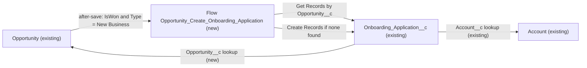

# Implementation spec — Create an onboarding application when a new-merchant opportunity is closed won

> When an `Opportunity` with `Type` = `New Business` becomes won, a record-triggered flow creates one `Onboarding_Application__c` linked to the opportunity and its merchant account.

_Based on the requirement, the evidence reported by AskCoworker, and read-only org queries where noted. Assumptions and missing evidence are identified below. Specification only — nothing is implemented or deployed._

---

## 1. The requirement

When an opportunity for a new merchant is closed won, the org must create an onboarding application for that merchant. "New merchant" is read as `Opportunity.Type` = `New Business` (*assumption*; the user had no preference and accepted the recommended default). The request contained no instruction to deploy or change data.

| # | Responsibility | Trigger | Where it lives |
| --- | --- | --- | --- |
| 1 | Detect that a new-merchant opportunity is won | `Opportunity` created or updated so that `IsWon` = true and `Type` = `New Business` | `Opportunity_Create_Onboarding_Application` (new Flow) |
| 2 | Create one `Onboarding_Application__c` with `Status__c` = `Submitted`, linked to the account and the opportunity | Same event | `Opportunity_Create_Onboarding_Application`; `Onboarding_Application__c.Opportunity__c` (new field); `Onboarding_Application__c.Account__c` (existing) |
| 3 | Do not create a second application for the same opportunity (re-open and re-close) | Same event | Duplicate check in `Opportunity_Create_Onboarding_Application` on `Onboarding_Application__c.Opportunity__c` |
| 4 | Let people see which opportunity an application came from | Record view | `Onboarding_Application__c-Onboarding Application Layout`; `Admin` profile field access |

## 2. Grounding — reuse before building

Target org: `TestWriteSpecDE` (org ID `00Dak00001COqNeEAL`, connected). API version: `67.0` (`sfdx-project.json` `sourceApiVersion` 67.0, *verified by project file*; org `apiVersion` 67.0, *verified by org query*).

- **`Onboarding_Application__c`** (CustomObject) — the onboarding application to create. It exists and is createable; internal sharing model `ReadWrite`, external `Private`. _verified by org query_
- **`Onboarding_Application__c.Status__c`** (Picklist, required) — values `Submitted` (default), `Under Review`, `Approved`, `Onboarded`. _verified by org query_
- **`Onboarding_Application__c.Account__c`** (Lookup to `Account`, relationship name `Onboarding_Applications`, delete constraint `SetNull`, not required) — the existing link to the merchant account; reused. _verified by org query_
- Other custom fields on `Onboarding_Application__c` (complete list from Tooling `CustomField`): `Application_Created_Date__c` (DateTime), `Application_Submitted_Date__c` (DateTime), `Business_License_Number__c` (Text 100), `Merchant_Business_Name__c` (Text 100), `Onboarding_Specialist__c` (Lookup to `User`, description "Onboarding Specialist assigned by the Agent"), `Operational_Procedures__c` (Long Text Area). None links to `Opportunity`. _verified by org query_
- **`Opportunity.StageName`** (Picklist) — includes active value `Closed Won`. _verified by org query_
- **`Opportunity.Type`** (Picklist) — values `Existing Business` and `New Business` only. _verified by org query_
- **`Opportunity.IsWon`** (Boolean) and **`Opportunity.AccountId`** (Lookup to `Account`) — standard fields used by the flow. _verified by org query_
- `Opportunity` has only the `Master` record type. _verified by org query_
- Automation on `Opportunity`, `Account`, and `Onboarding_Application__c`: no Apex triggers (Tooling `ApexTrigger` by `TableEnumOrId`), no flows with these trigger objects (`FlowDefinitionView` by `TriggerObjectOrEventId`, one query per object), and no validation rules on `Opportunity` or `Onboarding_Application__c` (Tooling `ValidationRule`). None of the 70 unmanaged Apex classes contains "onboarding" or "opportunity" in its body. `MetadataComponentDependency` for the object returns only `Onboarding Application Layout`. _verified by org query_
- **`Onboarding_Application__c-Onboarding Application Layout`** (Layout) — the only layout on the object. _verified by org query_
- FlexiPages `Onboarding_Application_Record_Page` and `Onboarding_Application_Record_Page1` both use `force:detailPanel` and no Dynamic Forms field instances, so field placement is driven by the layout. _verified by org query_
- Object access on `Onboarding_Application__c` (complete): `System Administrator` profile (CRUD), `Analytics Cloud Integration User` profile (Read), and the namespaced (`sfdcInternalInt`) permission sets `sfdc_accelerate_dms` (CRUD), `sfdc_slack` (Read), `sfdc_a360_sfcrm_data_extract` (Read). _verified by org query_
- Data shape: 0 `Opportunity` records and 0 `Onboarding_Application__c` records. _verified by org query_

Candidates examined and rejected: `Account.Type` (merchant categories such as `Restaurant Group`, `Food Truck`; it describes the kind of merchant, not whether it is new) — rejected as the "new merchant" test; `Account` record types `Customer Account` and `Partner Account` — no "new" meaning; `Onboarding_Application_Record_Page` and `Onboarding_Application_Record_Page1` — no change needed because they render the layout; `Merchant_Business_Name__c` and `Application_Created_Date__c` population — not asked for (Section 8).

Evidence sources: `sf org display`; `sf sobject list --sobject custom`; `sf sobject describe` of `Onboarding_Application__c`, `Opportunity`, and `Account`; Tooling `EntityDefinition`, `CustomField` (list and per-field `Metadata`), `ApexTrigger`, `ApexClass` bodies, `ValidationRule`, `MetadataComponentDependency`, `Layout`, `FlexiPage` (`Metadata`); standard `FlowDefinitionView`, `ObjectPermissions`, `FieldPermissions`, `PermissionSet`, and record counts. AskCoworker returned no citedReferences.

## 3. Architecture

Why the pieces are drawn this way:

1. `Opportunity` has no triggers or flows today (*verified by org query*), so a new record-triggered flow is the standard declarative mechanism for creating a related record; no Apex is needed.
2. The flow runs after save on create and update, with the condition `IsWon` = true AND `Type` = `New Business` and the option "Only when a record is updated to meet the condition requirements". A record created already meeting the condition also runs the flow; a record re-saved while still matching does not (*assumption (documented platform behavior)*).
3. The flow looks up an existing `Onboarding_Application__c` by the new `Opportunity__c` field and creates one only if none exists. This covers an opportunity that is re-opened and closed won again.
4. The application reuses the existing `Account__c` lookup for the merchant. The new `Opportunity__c` lookup links it back to the source opportunity.

## 4. Metadata changes

**Data model**

- **Create `Onboarding_Application__c.Opportunity__c`** — CustomField. Lookup to `Opportunity`, label "Opportunity", relationship name `Onboarding_Applications` (no child relationship with that name exists on `Opportunity`, *verified by org query*), not required, delete constraint `SetNull` (deleting an opportunity keeps the application). Description: "Opportunity whose Closed Won outcome created this onboarding application." Set by the flow; used as the duplicate-check key.

**Automation**

- **Create `Opportunity_Create_Onboarding_Application`** — Flow (record-triggered, after save). Object `Opportunity`; trigger "A record is created or updated"; condition requirements: `IsWon` Equals `true` AND `Type` Equals `New Business`; "Only when a record is updated to meet the condition requirements". Elements: (1) Get Records `Get_Existing_Application` on `Onboarding_Application__c` where `Opportunity__c` = `{!$Record.Id}`, first record only; (2) Decision `Application_Exists`: if found, end; (3) otherwise Create Records `Create_Onboarding_Application` with `Opportunity__c` = `{!$Record.Id}`, `Account__c` = `{!$Record.AccountId}`, `Status__c` = `Submitted`. Owner defaults to the running user. Runs in system context without sharing. A null `AccountId` leaves `Account__c` blank (the field is not required). Fault path: none that blocks the save beyond the platform default; the requirement does not ask for error handling. Activate on deploy in a sandbox first.

**UX**

- **Update `Onboarding_Application__c-Onboarding Application Layout`** — Layout. Add `Opportunity__c` as read-only next to `Account__c` in the information section. Both FlexiPages render this layout through `force:detailPanel`, so no FlexiPage change is needed.

**Security**

- **Update `Admin`** — Profile (System Administrator). Add field permission Read (not Edit) on `Onboarding_Application__c.Opportunity__c`. This is the only internal profile with object access that people use. The namespaced `sfdc_accelerate_dms`, `sfdc_slack`, and `sfdc_a360_sfcrm_data_extract` permission sets cannot be edited and get no access to the new field. `Analytics Cloud Integration User` gets no access.

## 5. Data 360 (Data Cloud) data involved

Not applicable — this change does not use Data 360. The existing namespaced permission set `sfdc_a360_sfcrm_data_extract` has Read on `Onboarding_Application__c` (*verified by org query*); it gets no access to the new field, so the field is not exposed to that connector.

## 6. Security considerations

- **Execution context.** Record-triggered flows run in system context without sharing. The flow creates the application even when the user who closes the opportunity has no Create permission on `Onboarding_Application__c`; today only `System Administrator` and `sfdc_accelerate_dms` have Create (*verified by org query*). This is intended: the requirement is that the system creates the record. _assumption (documented platform behavior)_
- **Ownership and sharing.** The new application is owned by the user who saved the opportunity. The internal sharing model of `Onboarding_Application__c` is `ReadWrite` (*verified by org query*), so all internal users with object Read can see it. Access is unchanged by this spec.
- **CRUD/FLS.** No object permission changes. `Onboarding_Application__c.Opportunity__c` is granted Read to the `Admin` profile only. The field holds an opportunity record ID, not personal data.
- **Integrations.** If `sfdc_accelerate_dms` updates opportunities to won with `Type` = `New Business`, the flow runs for those saves as well (*assumption*).

## 7. Testing strategy

No test component is in the inventory. The only logic is a flow whose main outcome is a new related record, which a Flow Test cannot assert, and no Apex is needed; so verification is manual, in a sandbox.

Recommended verification (manual):

1. Create an `Opportunity` with `Type` = `New Business` and any open stage, then set `StageName` = `Closed Won`. Expect exactly one `Onboarding_Application__c` with `Opportunity__c` = the opportunity, `Account__c` = its `AccountId`, and `Status__c` = `Submitted`.
2. Edit another field on the same won opportunity. Expect no second application.
3. Re-open the opportunity (set an open stage), then set `Closed Won` again. Expect no second application (duplicate check).
4. Insert an `Opportunity` directly as `Closed Won` with `Type` = `New Business` (for example with Data Loader). Expect one application.
5. Negative: `Type` = `Existing Business` or blank, then `Closed Won`. Expect none. `Type` = `New Business`, then `Closed Lost`. Expect none.
6. Starts matching on update: a won opportunity with `Type` = `Existing Business` changed to `New Business`. Expect one application (load-bearing assumption check for the "new merchant" rule; confirm with the business that this case should create one).
7. Null account: a `New Business` opportunity with no `AccountId` closed won. Expect an application with blank `Account__c` and no error.
8. Bulk: update 200 `New Business` opportunities to `Closed Won` in one Data Loader batch, 5 of which already have an application. Expect 195 new applications and no governor limit error.
9. Permission: a user without Create on `Onboarding_Application__c` closes a `New Business` opportunity. Expect the application to be created.
10. Delete a source opportunity. Expect its application to remain with blank `Opportunity__c`.
11. As a System Administrator, open an application. Expect `Opportunity__c` visible and read-only on the layout.

## 8. Open decisions

### Open

1. **"New merchant" rule (non-blocking).** The spec uses `Opportunity.Type` = `New Business`. The alternative was "the account has no earlier `Onboarding_Application__c`". The user had no preference. Evidence: `Type` has only `New Business` and `Existing Business`. Load-bearing for `Opportunity_Create_Onboarding_Application`; verified by case 6 in Section 7. Recommended default: keep `Type` = `New Business`.
2. **Access to the existing custom fields (non-blocking, proposal).** `FieldPermissions` shows no grant on any existing `Onboarding_Application__c` custom field (for example `Account__c`) to any profile or unmanaged permission set; only the namespaced permission sets have grants (*verified by org query*). People may not see those fields today. Out of scope; recommend a dedicated permission set for onboarding users in a separate change.
3. **Concurrent saves (non-blocking).** Two simultaneous saves of the same opportunity could both pass the duplicate check. With 0 opportunities today (*verified by org query*), accept the risk. A unique constraint would need a Text field, which is not proposed.
4. **Related list on the opportunity (non-blocking, proposal).** Adding the `Onboarding_Applications` related list to an `Opportunity` layout was not asked for and is not in the inventory.
5. **Deployment sequence (non-blocking).** Deploy `Onboarding_Application__c.Opportunity__c` first, then `Admin`, `Onboarding_Application__c-Onboarding Application Layout`, and `Opportunity_Create_Onboarding_Application` (the flow references the field). No backfill: there are 0 opportunities (*verified by org query*).

### Resolved

- **User decision / assumption:** asked how "new merchant" is identified; the user had no preference, so the recommended `Opportunity.Type` = `New Business` was taken (*assumption*).
- **Correction (AskCoworker D1 and D2):** AskCoworker reported that `Onboarding_Application__c` has only `Status__c` and no lookup to `Account`. Tooling `CustomField` shows `Account__c` (Lookup to `Account`) and six more custom fields; `sobject describe` hid them because of FLS. `Account__c` is reused (*verified by org query*).
- **Correction (AskCoworker I):** AskCoworker said record-triggered flows run as the Automated Process user and need a Create grant. They run in system context as the triggering user; no grant is needed (*assumption (documented platform behavior)*). The Create grant open decision was dropped.
- **Correction (AskCoworker R and T):** AskCoworker said 200 flow interviews each run their own SOQL and DML and may exceed limits, and proposed Apex. Record-triggered flows batch Get Records and Create Records across the interviews of one transaction, so the flow is used (*assumption (documented platform behavior)*); bulk case 8 in Section 7 checks it.
- **Correction (AskCoworker I):** AskCoworker proposed updating both FlexiPages. Both use `force:detailPanel` (*verified by org query*), so only the layout changes. Its update-only trigger was widened to create and update so directly inserted won opportunities are covered.
- **Assumption:** after the two wrong AskCoworker claims above, every AskCoworker fact kept in this spec was checked with an org query.
- **Assumption:** `Status__c` is set explicitly to `Submitted` rather than relying on the picklist default.
- **Dropped AskCoworker proposals:** populating `Merchant_Business_Name__c` and `Application_Created_Date__c`, assigning `Onboarding_Specialist__c`, FLS grants to `Agentforce_Reference_App` and `Pronto_Deep_Dive_Workshop` (neither has access to the object, *verified by org query*), and a prior-value `StageName` check — none is needed for the requirement.

## 9. Change set

| # | Action | Type | API name | Module | Why |
| --- | --- | --- | --- | --- | --- |
| 1 | Create | CustomField | `Onboarding_Application__c.Opportunity__c` | force-app/main/default/objects/Onboarding_Application__c/fields | Links the application to its source opportunity; duplicate-check key |
| 2 | Create | Flow | `Opportunity_Create_Onboarding_Application` | force-app/main/default/flows | Creates the application when a New Business opportunity is won |
| 3 | Update | Layout | `Onboarding_Application__c-Onboarding Application Layout` | force-app/main/default/layouts | Shows the new opportunity link |
| 4 | Update | Profile | `Admin` | force-app/main/default/profiles | Read access to the new field for System Administrators |

A new record-triggered flow on `Opportunity` creates one `Onboarding_Application__c` per won New Business opportunity, linked through the existing `Account__c` and a new `Opportunity__c` lookup.

Total: 4 · Create: 2 · Update: 2 · Delete: 0
