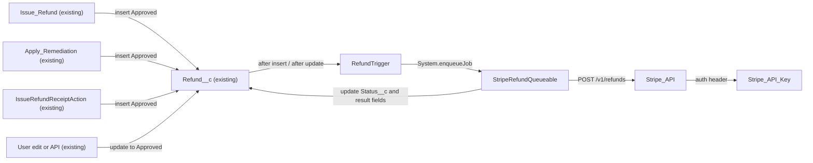

# Implementation spec — Push approved refunds to Stripe

> When a `Refund__c` record becomes Approved, an asynchronous Apex job calls the Stripe Refunds API through a Named Credential and records the result on the refund.

_Based on the requirement, the evidence reported by AskCoworker, and read-only org queries where noted. Assumptions and missing evidence are identified below. Specification only — nothing is implemented or deployed._

---

## 1. The requirement

When a refund is approved, call the payment provider's API to push the money back. The user named Stripe as the provider and asked for an asynchronous callout through a Named Credential, with success moving the refund through Processing to Completed with a processed date, and failure setting Failed with the error logged (_user decision_). The request contained no deploy or data-change instruction.

| # | Responsibility | Trigger | Where it lives |
| --- | --- | --- | --- |
| 1 | Detect a refund that becomes Approved (on insert or on update) and that is a card-type refund | `Refund__c` after insert, after update | `RefundTrigger` |
| 2 | Call the Stripe Refunds API asynchronously and securely | Queueable job enqueued by responsibility 1 | `StripeRefundQueueable`, `Stripe_API`, `Stripe_API_Key` |
| 3 | Record the outcome: Processing or Completed with `Processed_Date__c` on success, Failed with the error text on failure | End of the Queueable job | `StripeRefundQueueable`, `Refund__c.Stripe_Refund_Id__c`, `Refund__c.Callout_Error__c` |
| 4 | Know which Stripe payment to refund | Set by the process that creates the refund | `Refund__c.Stripe_Payment_Intent_Id__c` (population is blocking; see Section 8) |
| 5 | Let the enqueuing users make the callout and let people see the result | Permission set assignment | `Stripe_Refund_Processing`, `Refund__c-Refund Layout` |

## 2. Grounding — reuse before building

Target org: `TestWriteSpecDE` (Developer Edition, ID `00Dak00001COqNeEAL`, not a sandbox). API version: `67.0`. _verified by org query_; `sourceApiVersion` `67.0` and default `target-org` `TestWriteSpecDE` _verified by project file_.

- **`Refund__c`** (CustomObject) — the refund record. Custom fields (complete Tooling `CustomField` list): `Amount`, `Business_Account`, `Case`, `Contact`, `Issue_Date`, `Payment_Method`, `Processed_Date`, `Reason`, `Status`, `Storefront`. None stores a provider payment ID, provider refund ID, or error text. _verified by org query_
- **`Refund__c.Status__c`** (Picklist) — values `Pending`, `Approved`, `Processing`, `Completed`, `Failed`, `Cancelled`. The design reuses `Approved`, `Processing`, `Completed`, and `Failed`; no new values. _verified by org query_
- **`Refund__c.Payment_Method__c`** (Picklist) — values `Original Payment Method`, `Credit Card`, `Gift Certificate`, `Account Credit`, `Check`. _verified by org query_
- **`Refund__c.Amount__c`** (Currency) and **`Refund__c.Processed_Date__c`** (Date) — the amount to refund and the date the job writes on success. _verified by org query_
- **`Issue_Refund`** (Flow, autolaunched, active) — creates `Refund__c` with `Status__c` = `Approved` and `Payment_Method__c` = `Original Payment Method`. _verified by org query_
- **`Apply_Remediation`** (Flow, autolaunched, active) — creates `Refund__c` with `Status__c` = `Approved`; does not set `Payment_Method__c`. _verified by org query_
- **`IssueRefundReceiptAction`** (ApexClass, `with sharing`, invocable `callout=true`, agent action `Issue_Refund_Receipt`) — makes its Pronto Pass Factory callout, then inserts `Refund__c` with `Status__c` = `Approved`; does not set `Payment_Method__c`. _verified by org query_
- **`IssueRefundReceiptActionTest`** (ApexClass) — asserts `out.receipt.status` = `'Approved'`, a value copied into the response inside `invoke` before `Test.stopTest()`. The new asynchronous job does not change it. _verified by org query_
- **Automation on `Refund__c`**: 0 Apex triggers, 0 record-triggered flows (`FlowDefinitionView` for the org's unmanaged flows lists only autolaunched, routing, and screen flows), 0 validation rules. _verified by org query_
- **Named Credentials**: `Pronto_Pass_Factory` and `Pronto_Orders_API` (URL `https://pronto-orders-demo-api-b1a4956442bf.herokuapp.com`, External Credential `Pronto_Orders_API_Key`). **External Credentials**: `Pronto_Orders_API_Key`, `Pronto_Pass_Factory_Key` (both Custom). No Stripe credential exists. _verified by org query_
- **Apex that calls out**: only `ProntoWalletPassService` contains `callout:`; no Apex body references `Pronto_Orders_API`. No class or trigger with `Stripe` in its name exists. _verified by org query_
- **Access to `Refund__c`** (complete `ObjectPermissions` list): Read, Create, Edit — `Agentforce_Reference_App`, `Pronto_Deep_Dive_Workshop`, `sfdc_accelerate_dms` (namespace `sfdcInternalInt`), and two profiles; Read only — `sfdc_slack`, `sfdc_a360_sfcrm_data_extract` (namespace `sfdcInternalInt`), and one profile. _verified by org query_
- **`Refund__c-Refund Layout`** (Layout) — the only layout on `Refund__c`; no FlexiPage has `Refund__c` as its entity. _verified by org query_
- **Data**: 0 `Refund__c` records, so no backfill is needed. _verified by org query_

Candidates examined and rejected: `Pronto_Orders_API` — an orders demo API, not the payment provider the user named; `ProntoWalletPassService` — mints Apple Wallet passes, not a disbursement API; standard Commerce Payments objects (`PaymentGateway`, `PaymentGatewayProvider`, `Payment`, `Refund`) — they exist in the schema but hold 0 records and no creator uses them, so moving to a gateway adapter would replace the `Refund__c` process; `Transaction__c` (fields `Contact`, `Payment_Method`, `Refund_Reason`, `Total_Amount`, `Transaction_Date`, `Transaction_Type`) and `Payment_Methods__c` (card fields) — neither stores a Stripe payment ID, and nothing links them to `Refund__c`; `sc_ext__Error_Log__c` and `shield_ext__Error_Log__c` — managed-package logs owned by other products. _verified by org query_

Evidence sources: `sf org display`; `sf sobject list` (custom and all); describe of `Refund__c`, `Transaction__c`, `Payment_Methods__c`; Tooling `EntityDefinition`, `CustomField`, `ApexClass` bodies, `ApexTrigger`, `ValidationRule`, `Flow.Metadata`, `NamedCredential`, `ExternalCredential`, `MetadataComponentDependency`, `Layout`, `FlexiPage`, `GenAiFunctionDefinition`; standard `FlowDefinitionView`, `ObjectPermissions`, `PermissionSet`, `Organization`, and record counts. AskCoworker returned no citedReferences.

## 3. Architecture

Why the pieces are drawn this way:

1. Three creators insert refunds already in `Approved` (_verified by org query_), so the trigger fires on insert as well as on a change to `Approved` on update (_assumption_).
2. Apex is used instead of a record-triggered flow with an HTTP Callout action. Stripe's API takes `application/x-www-form-urlencoded` request bodies and an `Idempotency-Key` header; Flow HTTP Callout actions are built from a JSON (OpenAPI) schema. _assumption (documented platform behavior)_. Because Apex is needed for the callout, the detection logic stays in one Apex trigger on the same object and event (design rule), not in a flow.
3. A trigger cannot make a synchronous callout, so the trigger enqueues a Queueable that implements `Database.AllowsCallouts`. The Queueable runs in a new transaction as the user whose transaction enqueued it. _assumption (documented platform behavior)_
4. Inside the job the callout happens before any DML, then one `update` writes all results. _assumption (documented platform behavior: no callout after uncommitted DML)_
5. `Stripe_API` uses the current Named Credential model backed by the External Credential `Stripe_API_Key`, matching the org's existing `Pronto_Orders_API` / `Pronto_Orders_API_Key` pair (_verified by org query_). Legacy Named Credentials were rejected (Section 8).

## 4. Metadata changes

**Data model**

- **Create `Refund__c.Stripe_Payment_Intent_Id__c`** — CustomField, Text(255), label "Stripe Payment Intent ID", not required. Holds the Stripe PaymentIntent (`pi_…`) of the original payment; sent as `payment_intent` in the Stripe request. Not required because none of the three existing creators can supply it yet (Section 8, blocking for delivery).
- **Create `Refund__c.Stripe_Refund_Id__c`** — CustomField, Text(255), label "Stripe Refund ID", Unique, External ID. Written by the job with the Stripe refund `id` (`re_…`). The job skips any record where it is already set, so an approved refund is never sent twice.
- **Create `Refund__c.Callout_Error__c`** — CustomField, Long Text Area(32768), label "Callout Error". Written by the job on failure with the HTTP status, the Stripe `error.code`, and `error.message`, or the exception message. Cleared by the job on success. Never contains the Authorization header.

**Integration**

- **Create `Stripe_API_Key`** — ExternalCredential, authentication protocol Custom, one Named Principal `Stripe_Principal`, with an authentication header parameter `Authorization` = `Bearer {!$Credential.Stripe_API_Key.SecretKey}`. The secret key value is entered in Setup after deploy (Section 8); it is never stored in source.
- **Create `Stripe_API`** — NamedCredential, type SecuredEndpoint, URL `https://api.stripe.com`, External Credential `Stripe_API_Key`, "Generate Authorization Header" off, "Allow Formulas in HTTP Header" on. Called as `callout:Stripe_API/v1/refunds`.

**Automation**

- **Create `RefundTrigger`** — ApexTrigger on `Refund__c`, `after insert, after update`. Collects the Ids of records where `Status__c` = `Approved` and (insert, or the old `Status__c` was not `Approved`) and `Payment_Method__c` is blank, `Credit Card`, or `Original Payment Method`. Enqueues one `StripeRefundQueueable` with those Ids when `Limits.getQueueableJobs() < Limits.getLimitQueueableJobs()`. No `before` logic, so callers still see `Approved` on save. No delete or undelete events.
- **Create `StripeRefundQueueable`** — ApexClass, `public with sharing class StripeRefundQueueable implements Queueable, Database.AllowsCallouts`. In `execute`: takes the first 50 Ids and re-queries `Id`, `Amount__c`, `Stripe_Payment_Intent_Id__c`, `Stripe_Refund_Id__c`, `SystemModstamp` for records still `Status__c` = `Approved` with `Stripe_Refund_Id__c` blank. For each record: if `Stripe_Payment_Intent_Id__c` is blank, set `Failed` with `Callout_Error__c` = "Missing Stripe PaymentIntent ID" and make no callout; otherwise POST `payment_intent={id}&amount={Amount__c × 100, as an integer}` with header `Idempotency-Key: {Refund__c.Id}-{SystemModstamp in ms}` and `Content-Type: application/x-www-form-urlencoded`. Response handling: HTTP 200 with `status` = `succeeded` sets `Completed`, `Processed_Date__c` = today, `Stripe_Refund_Id__c`; HTTP 200 with `status` = `pending` or `requires_action` sets `Processing` and `Stripe_Refund_Id__c`; any other status, a non-200 response, or a `CalloutException` sets `Failed` and `Callout_Error__c`. After the loop, one `Database.update` of all processed records. If Ids remain, and not in a test, enqueues a new `StripeRefundQueueable` with the rest.

**Tests**

- **Create `StripeRefundQueueableTest`** — ApexClass, `@isTest`, uses an `HttpCalloutMock` that returns configurable Stripe responses and captures the request. Covers `RefundTrigger` and `StripeRefundQueueable` (Section 7).

**Security**

- **Create `Stripe_Refund_Processing`** — PermissionSet, label "Stripe Refund Processing". Grants External Credential principal access to `Stripe_API_Key` / `Stripe_Principal`, and Read on `Refund__c.Stripe_Payment_Intent_Id__c`, `Refund__c.Stripe_Refund_Id__c`, `Refund__c.Callout_Error__c`. Assigned to every user who creates or approves refunds (Section 8, blocking for delivery). Does not grant object access; users keep their existing `Refund__c` access.

**UX**

- **Update `Refund__c-Refund Layout`** — Layout. Add a "Payment Provider" section with `Refund__c.Stripe_Payment_Intent_Id__c`, `Refund__c.Stripe_Refund_Id__c` (read-only), and `Refund__c.Callout_Error__c` (read-only). Adds fields only; nothing is removed for other users. Retrieve the layout before editing.

## 5. Data 360 (Data Cloud) data involved

Not applicable — this change does not use Data 360. The permission set `sfdc_a360_sfcrm_data_extract` already reads `Refund__c` (_verified by org query_); it is not changed, so the new fields are not exposed to Data 360 ingestion.

## 6. Security considerations

- **Execution context.** `RefundTrigger` runs in system context. `StripeRefundQueueable` is `with sharing` and runs as the user whose transaction enqueued it; that user owns or can already edit the refunds created in that transaction. Its DML runs in system mode, so FLS does not block the status and result updates. _assumption (documented platform behavior)_
- **Callout principal.** A Named Credential backed by an External Credential lets a user call out only when a permission set grants principal access. Every user whose transaction approves a refund (agent users running `Issue_Refund`, `Apply_Remediation`, or `Issue_Refund_Receipt`, and people who edit a refund to `Approved`) needs `Stripe_Refund_Processing`. Without it, the callout fails and the job sets `Failed` with the error. _assumption (documented platform behavior)_
- **Secret storage.** The Stripe secret key is stored only in the External Credential principal in Setup. It is not in source, custom fields, custom metadata, or `Callout_Error__c`. Use a restricted Stripe key limited to refund creation.
- **FLS.** `Stripe_Refund_Processing` grants Read on the three new fields. Existing broad and namespaced permission sets (`Agentforce_Reference_App`, `Pronto_Deep_Dive_Workshop`, `sfdc_accelerate_dms`, `sfdc_slack`, `sfdc_a360_sfcrm_data_extract`) are not widened. On deploy, grant no profile default access to the new fields.
- **Data sent to Stripe.** Only the PaymentIntent ID, the amount in minor units, and the idempotency key. No contact name, email, or reason text leaves Salesforce.
- **Double-refund protection.** The job processes only records still `Approved` with `Stripe_Refund_Id__c` blank, and sends an idempotency key tied to the approval save, so a duplicate enqueue for the same approval does not create a second Stripe refund.

## 7. Testing strategy

`StripeRefundQueueableTest` (Apex, `HttpCalloutMock`; the job runs at `Test.stopTest()`):

| Test method | Behavior | Assertion |
| --- | --- | --- |
| `approvedInsert_succeeded_setsCompleted` | Insert Approved, `Credit Card`, PaymentIntent set; mock `succeeded` | `Completed`, `Processed_Date__c` = today, `Stripe_Refund_Id__c` set, `Callout_Error__c` blank |
| `updateToApproved_enqueues` | Insert `Pending`, then update to `Approved` | Job runs; `Completed` |
| `pending_setsProcessing` | Mock `status` = `pending` | `Processing`, `Processed_Date__c` null, `Stripe_Refund_Id__c` set |
| `stripeError_setsFailed` | Mock HTTP 402 with a Stripe error body | `Failed`, `Callout_Error__c` contains the error code |
| `calloutException_setsFailed` | Mock throws `CalloutException` | `Failed`, `Callout_Error__c` not blank |
| `blankPaymentIntent_setsFailedNoCallout` | Approved with blank PaymentIntent | `Failed`, "Missing Stripe PaymentIntent ID", mock not called |
| `nonCardPaymentMethod_notProcessed` | Approved with `Gift Certificate` | Stays `Approved`, mock not called |
| `blankPaymentMethod_isProcessed` | Approved with blank `Payment_Method__c` | `Completed` |
| `noLongerApproved_skipped` | Record moved to `Cancelled` before the job runs (call `execute` directly) | Stays `Cancelled`, mock not called |
| `resaveApproved_noReenqueue` | Update another field on an Approved record | No job enqueued |
| `ownUpdate_noRecursion` | Job sets `Completed` | `Limits.getQueueableJobs()` shows no second enqueue |
| `requestFormat` | Captured request | Form-encoded body with `payment_intent` and integer `amount`; `Idempotency-Key` present; endpoint `callout:Stripe_API/v1/refunds` |
| `bulk50_allProcessed` | Insert 50 Approved records | All 50 `Completed`, one `update` |
| `bulk51_restLeftApproved` | Insert 51 Approved records | 50 processed; chaining is skipped in tests, so 1 stays `Approved` |

Existing tests: `IssueRefundReceiptActionTest` keeps passing without change because it asserts the in-memory receipt status (_verified by org query_); with a blank PaymentIntent the job sets that record to `Failed` without a callout.

Recommended verification (manual, in a sandbox with a Stripe test-mode key):

1. Create a test PaymentIntent in Stripe test mode, create an Approved `Refund__c` with that `pi_…`, and confirm the Stripe dashboard shows one refund and the record shows `Completed`.
2. Run `Issue_Refund` as the agent user with `Stripe_Refund_Processing` and without it; confirm `Completed` versus `Failed` with a principal-access error.
3. Approve 120 refunds in one transaction and confirm chained jobs process all of them (this Developer Edition org limits chain depth to 5 jobs, about 250 records).
4. Re-approve a `Failed` refund and confirm a new Stripe attempt is made.
5. Confirm a zero-decimal currency PaymentIntent is refused or handled (load-bearing assumption in Section 8).

## 8. Open decisions

### Open

1. **PaymentIntent population (blocking for delivery).** None of `Issue_Refund`, `Apply_Remediation`, or `IssueRefundReceiptAction` knows the Stripe PaymentIntent (_verified by org query_), and nothing in the org stores one. Until each creator (or the person approving) fills `Refund__c.Stripe_Payment_Intent_Id__c`, every approved card refund ends as `Failed` with "Missing Stripe PaymentIntent ID". Recommended default: add a PaymentIntent input to each creator in a follow-up change, which also changes the `Issue_Refund_Receipt` agent action schema; this spec does not change those callers.
2. **Permission set assignment (blocking for delivery).** Assign `Stripe_Refund_Processing` in Setup to every user who creates or approves refunds, including the agent users that run the three creators. Named placeholder: `{refund approver users}`. Without it the callout fails for that user.
3. **Stripe secret key (blocking for delivery).** After deploy, enter a restricted Stripe secret key in Setup on the `Stripe_API_Key` principal `Stripe_Principal`. Owner: Stripe account administrator.
4. **Currency (non-blocking, load-bearing assumption).** The job sends `Amount__c × 100`, which is correct for two-decimal currencies. `Refund__c` has no `CurrencyIsoCode` field (_verified by org query_), and the org default currency could not be read. Stripe refunds in the PaymentIntent's currency. Verification case 5 in Section 7.
5. **Pending refunds (non-blocking).** A refund Stripe reports as `pending` stays `Processing`; moving it to `Completed` later needs a Stripe webhook or a poll, which the requirement does not ask for. Recommended default: out of scope; revisit if pending refunds are common.
6. **Approvals that cannot be enqueued (non-blocking).** If an approval happens where the queueable limit is already used (for example a second trigger chunk inside another asynchronous job), the trigger does not enqueue and the record stays `Approved` with no error. Recommended default: accept; a person can re-save the status to retry.
7. **Undelete (non-blocking).** An `Approved` refund that is deleted and undeleted is not sent. Recommended default: accept.

Deployment sequence: fields, then `Stripe_API_Key`, then `Stripe_API`, then `StripeRefundQueueable`, `RefundTrigger`, and `StripeRefundQueueableTest`, then `Stripe_Refund_Processing` and `Refund__c-Refund Layout`; then Setup steps 2 and 3.

### Resolved

- **Provider** — Stripe Refunds API via a Named Credential (_user decision_).
- **Outcome states** — success moves to Processing then Completed with `Processed_Date__c`, failure to Failed with the error logged (_user decision_). Because a callout cannot follow uncommitted DML, the job writes one final state: `Completed` when Stripe returns `succeeded`, `Processing` when Stripe returns `pending` (_assumption_).
- **Which payment methods** — the user had no preference. Only `Credit Card`, `Original Payment Method`, and blank are sent to Stripe; `Gift Certificate`, `Account Credit`, and `Check` are not card refunds and stay `Approved` (_assumption_). Blank is included because two of the three creators leave `Payment_Method__c` blank (_verified by org query_).
- **Where the charge reference lives** — the user had no preference. A new field on `Refund__c` (_assumption_).
- **"Approved" includes insert** — all three creators insert refunds as `Approved` (_verified by org query_), so the trigger fires on insert and on a change to `Approved` (_assumption_).
- **Error logging** — on the refund record in `Refund__c.Callout_Error__c`, not a separate log object (_assumption_).
- **AskCoworker corrections.** (a) D1 said only `Pronto_Pass_Factory` exists; the org also has `Pronto_Orders_API` and `Pronto_Orders_API_Key` (_verified by org query_). (b) D1/D2 said a trigger on an Approved insert cannot call out and proposed firing on update only; a Queueable enqueued from an after-insert trigger can call out, and update-only would miss all three creators. (c) D2 missed the `Issue_Refund` and `Apply_Remediation` flows that create refunds (_verified by org query_). (d) I and R said the Queueable runs as the Automated Process user, including for flows; it runs as the enqueuing user (_assumption (documented platform behavior)_). (e) I proposed updating `IssueRefundReceiptActionTest`; its assertion reads the in-memory receipt and is unaffected (_verified by org query_). (f) R said a Queueable allows only one callout, and that `System.enqueueJob` is not allowed in batch or future contexts; the limit is 100 callouts per transaction and one enqueue is allowed in those contexts (_assumption (documented platform behavior)_). (g) R said all three creators leave `Payment_Method__c` blank; `Issue_Refund` sets `Original Payment Method` (_verified by org query_). After two wrong claims, every AskCoworker fact kept in this spec was verified by org query.
- **Dropped AskCoworker proposals** — a Legacy Named Credential (legacy named credentials are deprecated; the org already uses the External Credential model); FLS updates to `Agentforce_Reference_App`, `Pronto_Deep_Dive_Workshop`, and the namespaced `sfdc_accelerate_dms`, `sfdc_slack`, `sfdc_a360_sfcrm_data_extract` (do not widen broad sets; namespaced sets are not editable); a Schedulable test; a separate `RefundTriggerTest` (merged into `StripeRefundQueueableTest`).

## 9. Change set

| # | Action | Type | API name | Module | Why |
| --- | --- | --- | --- | --- | --- |
| 1 | Create | CustomField | `Refund__c.Stripe_Payment_Intent_Id__c` | force-app/main/default/objects/Refund__c/fields | Stripe needs the original PaymentIntent to refund |
| 2 | Create | CustomField | `Refund__c.Stripe_Refund_Id__c` | force-app/main/default/objects/Refund__c/fields | Records the Stripe refund and prevents a second send |
| 3 | Create | CustomField | `Refund__c.Callout_Error__c` | force-app/main/default/objects/Refund__c/fields | Logs the failure reason |
| 4 | Create | ExternalCredential | `Stripe_API_Key` | force-app/main/default/externalCredentials | Holds the Stripe secret key and principal |
| 5 | Create | NamedCredential | `Stripe_API` | force-app/main/default/namedCredentials | Stripe endpoint for the callout |
| 6 | Create | ApexTrigger | `RefundTrigger` | force-app/main/default/triggers | Detects refunds that become Approved |
| 7 | Create | ApexClass | `StripeRefundQueueable` | force-app/main/default/classes | Calls Stripe and records the outcome |
| 8 | Create | ApexClass | `StripeRefundQueueableTest` | force-app/main/default/classes | Tests the trigger and the job |
| 9 | Create | PermissionSet | `Stripe_Refund_Processing` | force-app/main/default/permissionsets | Callout principal access and field Read |
| 10 | Update | Layout | `Refund__c-Refund Layout` | force-app/main/default/layouts | Shows the Stripe fields on the refund |

An after-save trigger on `Refund__c` enqueues a callout-enabled Queueable that refunds the Stripe PaymentIntent through `Stripe_API` and writes Completed, Processing, or Failed back to the refund.

Total: 10 · Create: 9 · Update: 1 · Delete: 0
