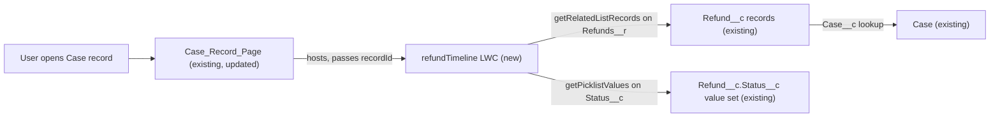

# Implementation spec — Refund timeline on the Case record page

> Show every `Refund__c` linked to a `Case` on the Case record page, each with its `Status__c` drawn as a progress path.

_Based on the requirement, the evidence reported by AskCoworker, and read-only org queries where noted. Assumptions and missing evidence are identified below. Specification only — nothing is implemented or deployed._

---

## 1. The requirement

Add a "Refund timeline" component to the Case record page that lists each refund whose `Refund__c.Case__c` points at the case and renders each refund's `Refund__c.Status__c` as a progress path. No user question was needed; the requirement contained no out-of-scope instruction.

| # | Responsibility | Trigger | Where it lives |
| --- | --- | --- | --- |
| 1 | List every refund for the open case, in timeline order | User opens a Case record page | `refundTimeline` (new LWC), reading `Refunds__r` |
| 2 | Show each refund's status as a progress path (Pending → Approved → Processing → Completed; Failed and Cancelled as terminal states) | Render of each refund | `refundTimeline` |
| 3 | Place the timeline on the case page | Page load | `Case_Record_Page` (existing FlexiPage) |

## 2. Grounding — reuse before building

Target org: `TestWriteSpecDE` (org ID `00Dak00001COqNeEAL`, connected). API version: `67.0` (project `sourceApiVersion` and org). _verified by project file_ and _verified by org query_.

- **`Refund__c`** (CustomObject) — the refund record. Fields: `Name` (auto number), `Case__c`, `Status__c`, `Amount__c` (currency), `Issue_Date__c` (date), `Processed_Date__c` (date), `Payment_Method__c`, `Reason__c`, `Contact__c`, `Business_Account__c`, `Storefront__c`. _verified by org query_ (`sf sobject describe`)
- **`Refund__c.Case__c`** (CustomField, lookup to `Case`, nillable) — the join from refund to case. The Case child relationship name is `Refunds__r`. _verified by org query_ (describe of `Case` `childRelationships`)
- **`Refund__c.Status__c`** (CustomField, picklist) — active values in order: `Pending`, `Approved`, `Processing`, `Completed`, `Failed`, `Cancelled`. _verified by org query_. `Refund__c` has no record types. _verified by org query_ (`RecordType` returned 0 rows)
- **`Case_Record_Page`** (FlexiPage, `RecordPage`, `Case`, no namespace, template `flexipage:recordHomeTemplateDesktop`) — the only FlexiPage for `Case` or `Refund__c`. Its main region is a tabset with a Details tab (`detailTabContent`, field sections "Case Details", "Case Status", "Related Storefront", and others) and a Related tab (`force:relatedListContainer`). _verified by org query_ (Tooling `FlexiPage` and its `Metadata`). It is not in the local project (`force-app/main/default/flexipages` is empty). _verified by project file_. Whether it is activated as the Case default cannot be read. _assumption_
- **`Pronto_Deep_Dive_Workshop`** and **`Agentforce_Reference_App`** (PermissionSet) — grant Read on `Refund__c` and Read FLS on `Case__c`, `Status__c`, `Amount__c`, `Issue_Date__c`, `Processed_Date__c`. Both are assigned to the only active standard human user (profile System Administrator). _verified by org query_ (`ObjectPermissions`, `FieldPermissions`, `PermissionSetAssignment`, `User` grouped by profile)
- **Automation on `Refund__c`**: no Apex triggers on `Case` or `Refund__c`, no record-triggered flows on either, no validation rules on `Refund__c`. _verified by org query_. Not relevant to a read-only component; listed to confirm nothing interferes.
- **Data shape**: 0 `Refund__c` records exist in total, so 0 have `Case__c` populated. _verified by org query_
- **History**: `Refund__c.Status__c` is field-history tracked. _verified by org query_ (`FieldDefinition.IsFieldHistoryTracked`). Not used by this design (see Section 8).

Candidates examined and rejected:
- `refundReceiptRenderer` (LightningComponentBundle) — renders one refund receipt; its only target is `lightning__AgentforceOutput`, so it cannot be placed on a record page and does not list multiple refunds. _verified by org query_ (bundle source)
- `orderStatusRenderer` (LightningComponentBundle) — has a three-step order tracker, but for order stages (`preparing`, `out_for_delivery`, `delivered`) and targets only `lightning__AgentforceOutput`. _verified by org query_
- `IssueRefundReceiptAction` (ApexClass) — the only custom Apex class whose body references `Refund__c`; it inserts refunds for an agent action and does not list refunds by case. _verified by org query_ (Tooling `ApexClass` bodies searched locally)
- Standard Path (`PathAssistant`) — Tooling returned 0 paths; a Path is bound to the host record's own picklist, so it cannot show many child refunds on a Case page. _verified by org query_ (0 rows) and _assumption (documented platform behavior)_
- Standard related list on the Related tab — shows refunds as a table, not a progress path. _assumption (documented platform behavior)_

Evidence sources: `sf org display`; `sf sobject list --sobject custom`; describes of `Refund__c` and `Case`; Tooling `FlexiPage`, `LightningComponentBundle`, `LightningComponentResource`, `AuraDefinitionBundle`, `ApexTrigger`, `ApexClass`, `ValidationRule`, `PathAssistant`, `FieldDefinition`; standard `FlowDefinitionView`, `RecordType`, `ObjectPermissions`, `FieldPermissions`, `PermissionSetAssignment`, `User`, `Refund__c` counts. AskCoworker (D1, D2, I, R, T) returned no citedReferences.

## 3. Architecture

Why the pieces are drawn this way:

1. `Case_Record_Page` is the only Case record page. _verified by org query_. The new component goes on it, in place, instead of a new page (design rule: change in place).
2. `refundTimeline` is a new LWC because no existing component can be placed on a record page and list many refunds. _verified by org query_. A custom component is needed because no standard component renders a progress path for many child records. _assumption (documented platform behavior)_
3. The component reads data only through Lightning Data Service UI API wire adapters: `getRelatedListRecords` (parent `recordId`, `relatedListId` `Refunds__r`) and `getPicklistValues` (`Refund__c.Status__c`, master record type because `Refund__c` has no record types). No Apex controller is needed, so no Apex test class is needed, and sharing, CRUD, and FLS are enforced by the platform. _assumption_ (implementation decision)
4. Each refund renders a `lightning-progress-indicator` with `type="path"`. Steps are the `Status__c` values in value-set order, excluding `Failed` and `Cancelled`; `current-step` is the refund's status. `Failed` and `Cancelled` render as a terminal badge on the refund instead of a step. _assumption_ (implementation decision; the value set order Pending, Approved, Processing, Completed is _verified by org query_)

## 4. Metadata changes

**UX**

- **Create `refundTimeline`** — LightningComponentBundle at `force-app/main/default/lwc/refundTimeline`. Label "Refund Timeline". `isExposed` true; target `lightning__RecordPage` restricted to object `Case`; no design properties; uses `@api recordId`. Wire 1: `getRelatedListRecords` with `parentRecordId` = `recordId`, `relatedListId` = `Refunds__r`, `fields` = `Refund__c.Name`, `Refund__c.Status__c`; `optionalFields` = `Refund__c.Amount__c`, `Refund__c.Issue_Date__c`, `Refund__c.Processed_Date__c` (optional so a user without FLS on them still sees the path); `sortBy` = `Refund__c.Issue_Date__c` ascending, then `Refund__c.CreatedDate`; `pageSize` 200. Wire 2: `getPicklistValues` for `Refund__c.Status__c` with the master record type ID from `getObjectInfo` (`defaultRecordTypeId`). Render one card per refund: `Name`, `Amount__c`, `Issue_Date__c`, `Processed_Date__c`, and a `lightning-progress-indicator` `type="path"` whose steps are the value-set values except `Failed` and `Cancelled`. `Failed` renders an error badge and `Cancelled` a neutral badge, with no path. A blank `Status__c` renders the path with no current step. Empty state: "No refunds for this case." Error state: a message with the UI API error, no data. Includes Jest tests in `__tests__/refundTimeline.test.js` (excluded from deploy by `.forceignore`; run with the existing `sfdx-lwc-jest` setup in `package.json`).
- **Update `Case_Record_Page`** — FlexiPage at `force-app/main/default/flexipages`. Add a component instance `c:refundTimeline` to the Details tab region `detailTabContent`, after the existing field sections. No visibility filter. Retrieve the page into source control before editing (it is not in the project). This changes the page for every user who is assigned it.

## 5. Data 360 (Data Cloud) data involved

Not applicable — this change does not use Data 360. The existing `sfdc_a360_sfcrm_data_extract` Read grant on `Refund__c` is unaffected. _verified by org query_

## 6. Security considerations

- **Execution context and sharing:** Lightning Data Service runs as the viewing user and returns only `Refund__c` records that user can see through sharing. No Apex, so no `with sharing` choice. _assumption (documented platform behavior)_
- **CRUD/FLS:** the user needs Read on `Refund__c`, Read on `Case`, and Read FLS on `Status__c` (required field of Wire 1). `Name` is a standard name field and has no FLS setting. Fields in `optionalFields` are omitted, not errors, when the user lacks FLS. _assumption (documented platform behavior)_. A user without Read on `Refund__c` gets a wire error, and the component shows its error state; this does not affect the rest of the page. _assumption (documented platform behavior)_
- **Grants:** no permission set or profile changes. The only active standard human user already has Read on `Refund__c` and Read FLS on all five fields via `Pronto_Deep_Dive_Workshop` and `Agentforce_Reference_App`. _verified by org query_. Profile-owned permission sets have no `FieldPermissions` rows on `Refund__c`. _verified by org query_
- **Data exposure:** the component shows only fields the user can already read on the refund record. No new data is exposed, and nothing is written.

## 7. Testing strategy

Jest tests in `force-app/main/default/lwc/refundTimeline/__tests__/refundTimeline.test.js` (part of the `refundTimeline` row), with mocked wire adapters:

| Test | Behavior |
| --- | --- |
| Empty list | 0 refunds → empty state, no progress indicator |
| One path per refund | 2 refunds → 2 `lightning-progress-indicator` elements |
| Current step | `Status__c` = `Processing` → `current-step` = `Processing` |
| Step order from value set | steps are Pending, Approved, Processing, Completed, taken from the mocked `getPicklistValues`, with Failed and Cancelled excluded |
| Terminal states | `Failed` → error badge, no path; `Cancelled` → neutral badge, no path |
| Blank values | blank `Status__c` → path with no current step; blank `Amount__c` or `Issue_Date__c` → blank text, no error |
| Missing optional field | record without `Amount__c` in the payload (no FLS) → card renders |
| Wire errors | `getRelatedListRecords` error or `getPicklistValues` error → error state, no exception |

Recommended manual verification (sandbox; test data can be created with anonymous Apex or the UI):

1. **Page activation (load-bearing).** In Lightning App Builder, confirm `Case_Record_Page` is the page users see for Case (org default or app/profile assignment). If it is not active, the component is not visible.
2. Open a Case with no refunds → empty state.
3. Create refunds on one Case with statuses `Pending`, `Processing`, `Completed`, `Failed`, `Cancelled` and different `Issue_Date__c` values → oldest first; paths at the right step; two terminal badges.
4. Change a refund's `Status__c` from the refund record, then return to the Case page and refresh → path shows the new step.
5. Reparent a refund to another Case, delete one, and undelete it → each Case shows the right refunds after a page refresh.
6. Bulk: one Case with more than 200 refunds → the first 200 appear (see Section 8, item 2).
7. Permission: a user without Read on `Refund__c` → component error state; rest of the Case page works.

## 8. Open decisions

### Open

1. **`Case_Record_Page` activation (non-blocking for build, blocking for delivery).** Record page activation cannot be read with the allowed commands. The design assumes `Case_Record_Page` is the page users see for Case. Verify with manual step 1 before release; if it is not active, activate it in Lightning App Builder (Setup action).
2. **Refunds above 200 per case (non-blocking).** The component loads one page of 200 records. The org has 0 refunds today. _verified by org query_. Default: no pagination; add "load more" only if a case can exceed 200 refunds.
3. **Status history (non-blocking, proposal).** `Refund__c.Status__c` is history tracked. _verified by org query_. The requirement asks for each refund's status as a progress path, which the current status delivers; a per-refund list of status change dates from `Refund__History` is not in scope.

### Resolved

- **Mechanism:** a custom LWC with UI API wire adapters, no Apex. The standard Path and related lists cannot render a path for many child records. _assumption_
- **Path steps:** value-set order `Pending`, `Approved`, `Processing`, `Completed`; `Failed` and `Cancelled` are terminal badges. Based on the picklist values. _assumption_ (value set _verified by org query_)
- **Timeline order:** `Issue_Date__c` ascending, then `CreatedDate`. _assumption_
- **Placement:** Details tab of `Case_Record_Page`, after the existing field sections; no visibility filter. _assumption_
- **Access:** no grant changes; the existing user already has the access. _verified by org query_
- **Deployment sequence:** retrieve `Case_Record_Page`; deploy `refundTimeline`; then deploy the updated `Case_Record_Page` (it references the component). Run Jest locally before deploy.
- **Corrections to AskCoworker:** D1 reported the Case → `Refund__c` child relationship name as unknown; the describe shows `Refunds__r`. R and T raised `Refund__c.Name` FLS as blocking; the standard `Name` field has no FLS setting, so that item was dropped. R stated that wire data refreshes automatically on changes in the same session; Lightning Data Service refreshes only for changes it made itself, so manual steps 4 and 5 refresh the page. I proposed hard-coded placement "below Case Details"; kept as an assumption. Dropped AskCoworker items not needed by the design: external systems, other permission sets, `CaseRule` and `CaseCommentRule` classes.

## 9. Change set

| # | Action | Type | API name | Module | Why |
| --- | --- | --- | --- | --- | --- |
| 1 | Create | LightningComponentBundle | `refundTimeline` | force-app/main/default/lwc | Lists the case's refunds and draws each status as a progress path (responsibilities 1 and 2) |
| 2 | Update | FlexiPage | `Case_Record_Page` | force-app/main/default/flexipages | Places the timeline on the Case record page (responsibility 3) |

A new record-page LWC reads the case's refunds through `Refunds__r` with UI API wire adapters and is placed on the existing Case record page.

Total: 2 · Create: 1 · Update: 1 · Delete: 0
