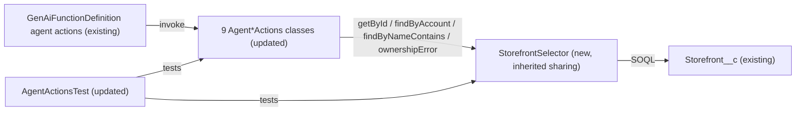

# Implementation spec — Consolidate Storefront__c queries in the Agent*Actions Apex classes

> Move every `Storefront__c` SOQL query and the repeated storefront ownership check out of the Agent*Actions classes into one shared `StorefrontSelector` class, with no change to agent action signatures, responses, or sharing behavior.

_Based on the requirement, the evidence reported by AskCoworker, and read-only org queries where noted. Assumptions and missing evidence are identified below. Specification only — nothing is implemented or deployed._

---

## 1. The requirement

Refactor the Agent*Actions Apex classes so that they stop querying `Storefront__c` separately. The premise is partly true: the org has 20 Agent*Actions classes, but only 9 of them contain `Storefront__c` SOQL (_verified by org query_), so the design covers those 9. This is a behavior-preserving refactor. No deploy or data change was requested, and none was made.

| # | Responsibility | Trigger | Where it lives |
| --- | --- | --- | --- |
| 1 | One shared place for every `Storefront__c` query used by the Agent*Actions classes | Agent action invocation | `StorefrontSelector` (new) |
| 2 | One shared storefront ownership check ("not found" / "access denied") with the existing messages | Agent action invocation with `storefrontId` and `accountId` | `StorefrontSelector.ownershipError` (new), called by 7 classes |
| 3 | Callers keep their invocable signatures, response shapes, messages, and sharing mode | Agent action invocation | The 9 updated Agent*Actions classes |
| 4 | Regression tests for the selector and for each refactored caller | Test run | `AgentActionsTest` |

## 2. Grounding — reuse before building

Target org: `TestWriteSpecDE` (org ID `00Dak00001COqNeEAL`). API version: `67.0` (project `sourceApiVersion` `67.0`, _verified by project file_).

- **20 Agent*Actions classes plus `AgentActionsTest`** (ApexClass) — all unmanaged (`NamespacePrefix` null). _verified by org query_
- **9 classes that contain `FROM Storefront__c` SOQL** (ApexClass) — each has exactly one such query. _verified by org query_ (Apex bodies of all 21 `Agent%` classes):
  - Ownership check, `SELECT Id, Account__c FROM Storefront__c WHERE Id = :req.storefrontId LIMIT 1`, followed by `'No storefront found with the provided Id.'` and `'Access denied. This storefront does not belong to the specified account.'`: `AgentCreateMenuWithItemsActions`, `AgentCreatePromotionActions`, `AgentGetActiveMenusActions`, `AgentGetMenuItemsActions` (on its `storefrontId` path only), `AgentSummarizeReviewsActions`, `AgentUpdateStorefrontHoursActions`.
  - Same ownership check, but selecting `Id, Name, Account__c, Description__c, Phone__c, Status__c, Storefront_Overview__c`, because the record is then updated: `AgentUpdateStorefrontDetailsActions`.
  - List query `SELECT Id, Name, Account__c, Description__c, Cuisine__c, Average_Review_Score__c FROM Storefront__c WHERE Account__c = :accountId ORDER BY Name ASC LIMIT 200`: `AgentGetStorefrontsByAccountActions`.
  - List query with the same fields, `WHERE Name LIKE :('%' + nameQuery + '%') ORDER BY Name ASC LIMIT 200`: `AgentStorefrontActions`.
- **Sharing modes** — `AgentStorefrontActions` is `without sharing`; the other 8 are `with sharing`. _verified by org query_
- **The other 11 action classes have no `Storefront__c` SOQL.** `AgentUpdateMenuActions`, `AgentUpdateMenuItemActions`, `AgentUpdateMenuItemPriceActions`, and `AgentUpdatePromotionStatusActions` check ownership through relationship paths (`Storefront__r.Account__c` or `Menu__r.Storefront__r.Account__c`) in their own object's query; `AgentGetMenuItemsActions` does the same on its `menuId` path. _verified by org query_
- **Each invocable processes only `requests[0]`.** _verified by org query_
- **Callers of the 9 classes** — `GenAiFunctionDefinition` agent actions with `InvocationTarget` equal to each class (for example `Get_Active_Menus`, `Get_Storefronts_By_Name`, `Update_Storefront_Details` and their numbered copies). `MetadataComponentDependency` lists only `AgentActionsTest` as a referencing Apex class (for `AgentStorefrontActions`). No other unmanaged Apex class names an Agent*Actions class. _verified by org query_
- **`Storefront__c`** (CustomObject) — has `Account__c` (lookup to `Account`) and every field the queries select. No required createable fields, no validation rules, no Apex triggers, and no record-triggered flows. _verified by org query_
- **`AgentActionsTest`** (ApexClass) — exercises only `AgentStorefrontActions`, `AgentReviewActions`, `AgentGiftCertificateActions`, and `AgentCaseActions`. `ApexCodeCoverageAggregate` shows 0 covered lines for all 20 Agent*Actions classes. _verified by org query_
- **No shared storefront helper exists.** The full list of unmanaged Apex class names has no selector, service, or utility for `Storefront__c`; `StorefrontSelector` does not exist. _verified by org query_

Candidates examined and rejected: `StorefrontPickerController` and `MerchantRiskScoreAction` — they query `Storefront__c` but are not Agent*Actions classes (listed in Section 8 as proposals); `IssueRefundReceiptAction` — only writes `Storefront__c` as a field value.

Evidence sources: Tooling `ApexClass` names and bodies (searched locally), `GenAiFunctionDefinition`, `MetadataComponentDependency`, `ApexCodeCoverageAggregate`, `ValidationRule`, `ApexTrigger`; standard `FlowDefinitionView`; `sf sobject describe Storefront__c`; `sf sobject list --sobject custom`. AskCoworker returned no citedReferences.

## 3. Architecture

Why the pieces are drawn this way:

1. Agent actions call the 9 classes through `@InvocableMethod`. Signatures do not change, so no `GenAiFunction` metadata changes (_verified by org query_ for the callers).
2. Apex is required: the requirement is about duplicated SOQL inside Apex, and no declarative feature can hold shared Apex query logic (_assumption_).
3. `StorefrontSelector` is declared `inherited sharing`, so its queries run in each caller's mode: `without sharing` from `AgentStorefrontActions` and `with sharing` from the other 8. A `with sharing` selector would change the name search for users who cannot see every storefront; a `without sharing` selector would remove sharing from 8 callers. _assumption (documented platform behavior)_: an `inherited sharing` class runs in the caller's sharing mode, and runs as `with sharing` when it is the entry point.
4. The ownership-check messages are defined once in `StorefrontSelector` and returned by `ownershipError`; callers keep their own early-return code because each fills different response fields on error (_verified by org query_ of the bodies).

## 4. Metadata changes

**Apex**

- **Create `StorefrontSelector`** — ApexClass, `public inherited sharing class`. Members: (a) constants `NOT_FOUND_MESSAGE = 'No storefront found with the provided Id.'` and `ACCESS_DENIED_MESSAGE = 'Access denied. This storefront does not belong to the specified account.'`; (b) `Storefront__c getById(Id storefrontId)` — `SELECT Id, Name, Account__c, Description__c, Phone__c, Status__c, Storefront_Overview__c FROM Storefront__c WHERE Id = :storefrontId LIMIT 1`, returns the record or `null`; (c) `String ownershipError(Storefront__c sf, Id accountId)` — returns `NOT_FOUND_MESSAGE` when `sf` is null, `ACCESS_DENIED_MESSAGE` when `sf.Account__c != accountId`, otherwise `null`; (d) `List<Storefront__c> findByAccount(Id accountId)` — the existing by-account query (`WHERE Account__c = :accountId ORDER BY Name ASC LIMIT 200`); (e) `List<Storefront__c> findByNameContains(String nameQuery)` — the existing name query (`WHERE Name LIKE :('%' + nameQuery + '%') ORDER BY Name ASC LIMIT 200`). (d) and (e) share one field-list constant (`Id, Name, Account__c, Description__c, Cuisine__c, Average_Review_Score__c`). Queries use the same system-mode field access as today (no `WITH USER_MODE`), so behavior does not change.
- **Update `AgentGetActiveMenusActions`** — ApexClass. Replace the inline storefront query and the two checks with `StorefrontSelector.getById(req.storefrontId)` and `StorefrontSelector.ownershipError(...)`; on a non-null error, set `out.message` to it and return exactly as today (including `out.menusJson`). No signature change.
- **Update `AgentCreateMenuWithItemsActions`** — ApexClass. Same substitution; keep `out.createdItemsJson = '[]'` on error.
- **Update `AgentCreatePromotionActions`** — ApexClass. Same substitution.
- **Update `AgentGetMenuItemsActions`** — ApexClass. Same substitution on the `storefrontId` path only; the `menuId` path (`Storefront__r.Account__c` via `Menu__c`) and its message `'Access denied. This menu does not belong to the specified account.'` stay unchanged.
- **Update `AgentSummarizeReviewsActions`** — ApexClass. Same substitution.
- **Update `AgentUpdateStorefrontHoursActions`** — ApexClass. Same substitution.
- **Update `AgentUpdateStorefrontDetailsActions`** — ApexClass. Same substitution; the record returned by `getById` already has `Name`, `Description__c`, `Phone__c`, `Status__c`, and `Storefront_Overview__c`, so the class updates it with no second query.
- **Update `AgentGetStorefrontsByAccountActions`** — ApexClass. Replace the inline list query with `StorefrontSelector.findByAccount(accountId)`. The `StorefrontSummary` mapping and response stay unchanged.
- **Update `AgentStorefrontActions`** — ApexClass. Replace the inline list query with `StorefrontSelector.findByNameContains(nameQuery)`. Keep the class `without sharing` and its existing blank-name guard. The `StorefrontSummary` mapping and response stay unchanged.

**Tests**

- **Update `AgentActionsTest`** — ApexClass (test). Add direct tests of `StorefrontSelector` (all five members) and regression tests for the 8 refactored callers not already tested (success, not found, access denied), keeping the existing `storefrontQuery_returnsDtos` test. See Section 7.

## 5. Data 360 (Data Cloud) data involved

Not applicable — this change does not use Data 360. It changes Apex class bodies only.

## 6. Security considerations

- **Sharing:** unchanged for every caller. `StorefrontSelector` is `inherited sharing` and runs `without sharing` when called from `AgentStorefrontActions` and `with sharing` when called from the other 8 classes (_assumption (documented platform behavior)_). If it is ever called as an entry point, it runs `with sharing`.
- **CRUD/FLS:** unchanged. Sharing keywords do not enforce CRUD or FLS, and none of the current queries enforce them (no `WITH USER_MODE` or `WITH SECURITY_ENFORCED`; _verified by org query_ of the bodies). The selector keeps the same system-mode queries.
- **Data exposure:** `getById` reads five more fields than 6 of the 7 ownership-check callers read today. Those fields stay in memory and are not added to any response. No field is exposed that the classes did not already read (_verified by org query_: every field in the union is already selected by one of the 9 classes).
- **Permission sets and profiles:** no changes. Users and agents that can run the Agent*Actions classes today already need class access to them; a class the caller invokes internally does not need its own Apex class access grant (_assumption (documented platform behavior)_).
- **Existing weakness, not changed:** the ownership check trusts the caller-supplied `accountId`. The refactor keeps this behavior; see Section 8.

## 7. Testing strategy

All tests go in `AgentActionsTest`. `Storefront__c` has no required fields, validation rules, triggers, or record-triggered flows (_verified by org query_), so test data needs only `Name` and, for ownership cases, an inserted `Account` set in `Account__c`. Tests have not been run.

| Test | Behavior | Rows |
| --- | --- | --- |
| `selector_getById_returnsRecord` / `selector_getById_missingReturnsNull` | `getById` returns the record with the full field union, or `null` for a deleted record's Id | `StorefrontSelector` |
| `selector_ownershipError_cases` | `null` record gives `NOT_FOUND_MESSAGE`; other account gives `ACCESS_DENIED_MESSAGE`; matching account gives `null` | `StorefrontSelector` |
| `selector_findByAccount` / `selector_findByNameContains` | Correct rows, ordered by `Name`, empty list when nothing matches | `StorefrontSelector` |
| `<class>_success`, `<class>_notFound`, `<class>_accessDenied` for each of `AgentGetActiveMenusActions`, `AgentCreateMenuWithItemsActions`, `AgentCreatePromotionActions`, `AgentGetMenuItemsActions` (storefront path), `AgentSummarizeReviewsActions`, `AgentUpdateStorefrontHoursActions`, `AgentUpdateStorefrontDetailsActions` | Messages match the existing strings exactly; response JSON fields on error are unchanged | the 7 ownership-check classes |
| `getStorefrontsByAccount_returnsDtos` | Same DTOs as before | `AgentGetStorefrontsByAccountActions` |
| `storefrontQuery_returnsDtos` (existing) | Name search unchanged | `AgentStorefrontActions` |
| `agentGetMenuItems_menuPath` | `menuId` path still works and uses its own message | `AgentGetMenuItemsActions` |

Negative and permission cases: a `with sharing` caller run with `System.runAs` as a user who cannot see a storefront returns `NOT_FOUND_MESSAGE`, while `AgentStorefrontActions` still finds it by name (needs a test user with a license that can own records; if none is available, move this to manual verification). Bulk: each invocable handles only `requests[0]` today, and this refactor does not change that, so no bulk test is added.

Recommended manual verification (sandbox): run `AgentActionsTest` and confirm org coverage stays at or above 75%; search the 9 classes for `FROM Storefront__c` and confirm none remain; invoke `Get_Active_Menus`, `Update_Storefront_Details`, and `Get_Storefronts_By_Name` from the agent in Agentforce Builder and confirm the responses match the pre-refactor responses.

## 8. Open decisions

### Open

1. **Test coverage before production deploy (blocking for delivery).** `ApexCodeCoverageAggregate` shows 0 covered lines for all 20 Agent*Actions classes (_verified by org query_), so current coverage is unknown. A production deploy of the new `StorefrontSelector` and the 9 updated classes needs the `AgentActionsTest` additions and 75% org coverage. Recommended default: run all local tests in a sandbox before deploying.
2. **Ownership check trusts a caller-supplied `accountId` (non-blocking, proposal).** An agent that passes the owning account's Id passes the check. Fixing this (for example deriving the account from the running user) changes behavior for callers and is out of scope for a refactor. Recommended default: a separate security change.
3. **Relationship-path ownership checks (non-blocking, proposal).** `AgentUpdateMenuActions`, `AgentUpdateMenuItemActions`, `AgentUpdateMenuItemPriceActions`, `AgentUpdatePromotionStatusActions`, and the `menuId` path of `AgentGetMenuItemsActions` repeat a similar ownership pattern on other objects but do not query `Storefront__c`. They could later reuse `StorefrontSelector.ACCESS_DENIED_MESSAGE`-style constants; their messages differ ("menu", "menu item", "promotion"), so they are left unchanged.
4. **Duplicate `StorefrontSummary` inner classes (non-blocking, proposal).** `AgentStorefrontActions` and `AgentGetStorefrontsByAccountActions` define identical `StorefrontSummary` DTOs. Merging them changes the Apex-defined type of the `storefronts` invocable variable used by the agent action schemas, so it is not part of this refactor.
5. **Other `Storefront__c` queries outside Agent*Actions (non-blocking, proposal).** `StorefrontPickerController` and `MerchantRiskScoreAction` also query `Storefront__c` (_verified by org query_). They are outside the named class set and could adopt `StorefrontSelector` later.
6. **Single-request handling (non-blocking, proposal).** Every Agent*Actions invocable reads only `requests[0]` (_verified by org query_). Bulk support is a behavior change and is not part of this refactor.

### Resolved

- **Scope is the 9 classes with `Storefront__c` SOQL, not all 20** — the requirement's "they all query storefronts" is partly false; the other 11 have no such query (_verified by org query_). _assumption_ (design for the real gap).
- **List queries are included** (`findByAccount`, `findByNameContains`) so that all `Storefront__c` SOQL in the Agent*Actions classes lives in one class. AskCoworker's inventory left them inline; overridden because the requirement names every separate storefront query. _assumption_
- **`inherited sharing` selector, messages kept verbatim, signatures unchanged, tests added to `AgentActionsTest` instead of a new test class** — _assumption_ (implementation decisions; change in place).
- **Corrections to AskCoworker:** it listed 9 "non-querying" classes and missed `AgentReviewActions` and `AgentUpdatePromotionStatusActions` (_verified by org query_: 21 `Agent%` classes); it said `AgentUpdateStorefrontHoursActions` reads `Name` (its query selects only `Id, Account__c`); it said an entry-point `inherited sharing` class runs `without sharing` and that sharing keywords drive CRUD/FLS (both contradict documented platform behavior); it said each flow interview is a separate transaction for invocable actions (contradicts documented bulkified invocable behavior; not relied on). After these wrong claims, every AskCoworker fact kept in this spec was verified by org query. Unverified AskCoworker items (a Data Cloud connector permission set grant, a DataStream count, `Account.Merchant_Code__c`) were dropped as not needed.
- **Dropped AskCoworker proposals:** a separate `StorefrontSelectorTest` class, two sharing-specific selector classes, a blank-name guard in the selector (the caller already guards), and a null-`accountId` rule (callers already return `'accountId is required.'`).
- **Deployment sequence:** deploy `StorefrontSelector` with the 9 updated classes and `AgentActionsTest` in one deployment, since the updated classes do not compile without the selector.

## 9. Change set

| # | Action | Type | API name | Module | Why |
| --- | --- | --- | --- | --- | --- |
| 1 | Create | ApexClass | `StorefrontSelector` | force-app/main/default/classes | Single home for all `Storefront__c` SOQL and the ownership-check messages |
| 2 | Update | ApexClass | `AgentGetActiveMenusActions` | force-app/main/default/classes | Use shared ownership check |
| 3 | Update | ApexClass | `AgentCreateMenuWithItemsActions` | force-app/main/default/classes | Use shared ownership check |
| 4 | Update | ApexClass | `AgentCreatePromotionActions` | force-app/main/default/classes | Use shared ownership check |
| 5 | Update | ApexClass | `AgentGetMenuItemsActions` | force-app/main/default/classes | Use shared ownership check on the `storefrontId` path |
| 6 | Update | ApexClass | `AgentSummarizeReviewsActions` | force-app/main/default/classes | Use shared ownership check |
| 7 | Update | ApexClass | `AgentUpdateStorefrontHoursActions` | force-app/main/default/classes | Use shared ownership check |
| 8 | Update | ApexClass | `AgentUpdateStorefrontDetailsActions` | force-app/main/default/classes | Use shared ownership check and returned record for the update |
| 9 | Update | ApexClass | `AgentGetStorefrontsByAccountActions` | force-app/main/default/classes | Use shared by-account query |
| 10 | Update | ApexClass | `AgentStorefrontActions` | force-app/main/default/classes | Use shared name query; stays `without sharing` |
| 11 | Update | ApexClass | `AgentActionsTest` | force-app/main/default/classes | Tests for the selector and regression tests for refactored callers |

One new `inherited sharing` selector class holds every `Storefront__c` query that 9 Agent*Actions classes used to run separately, with signatures, messages, and sharing unchanged.

Total: 11 · Create: 1 · Update: 10 · Delete: 0
