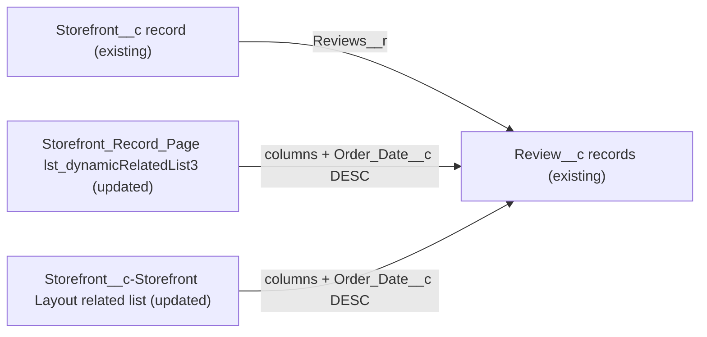

# Implementation spec — Storefront review related list columns and newest-first sort

> Configure the Reviews related list on Storefront records to show rating, customer, date, and status, sorted with the newest review first.

_Based on the requirement, the evidence reported by AskCoworker, and read-only org queries where noted. Assumptions and missing evidence are identified below. Specification only — nothing is implemented or deployed._

---

## 1. The requirement

The Reviews related list on the `Storefront__c` record page must show the review's rating, customer, date, and status, with the newest review first. No user question was needed: the org data settles which field "date" means (see Section 8). The request contained no out-of-scope instructions.

| # | Responsibility | Trigger | Where it lives |
| --- | --- | --- | --- |
| 1 | Show `Rating__c`, `Customer__c`, `Order_Date__c`, and `Status__c` as related list columns | Storefront record page load | `Storefront_Record_Page` component `lst_dynamicRelatedList3`; `Storefront__c-Storefront Layout` related list `Review__c.Storefront__c` |
| 2 | Sort reviews newest first (`Order_Date__c` descending) | Storefront record page load | Same components as row 1 |

## 2. Grounding — reuse before building

Target org: `TestWriteSpecDE` (org ID `00Dak00001COqNeEAL`, connected). API version: `67.0` (org and `sfdx-project.json` `sourceApiVersion`).

- **`Review__c`** (CustomObject) — the review object. Fields: `Name` (auto number, name field), `Storefront__c` (reference to `Storefront__c`, relationship `Storefront__r`), `Rating__c` (double), `Customer__c` (reference to `Contact`), `Order_Date__c` (date), `Status__c` (picklist: `Submitted`, `Published`), `Comments__c` (textarea). Tooling `CustomField` lists exactly these six custom fields. _verified by org query_
- **`Storefront__c`** (CustomObject) — the parent; its child relationship for reviews is `Reviews__r`. _verified by org query_
- **`Storefront_Record_Page`** (FlexiPage, `RecordPage`, no namespace) — the only record page whose `EntityDefinitionId` is `Storefront__c` (`01Iak00000Dx4JV`). Its related-lists tab holds `lst:dynamicRelatedList` `lst_dynamicRelatedList3` with `relatedListApiName` = `Reviews__r`, `relatedListLabel` = `Reviews`, `relatedListFieldAliases` = null, `sortFieldAlias` = `Order_Date__c`, `sortFieldOrder` = `Default`, `maxRecordsToDisplay` = `10`, `relatedListDisplayType` = `ADVGRID`. _verified by org query_
- **`Storefront__c-Storefront Layout`** (Layout, `Standard`, no namespace) — the only layout on `Storefront__c`. Its related list `Review__c.Storefront__c` shows `NAME`, `Comments__c`, `Rating__c`, with `sortField` = null and `sortOrder` = null. _verified by org query_
- **Data shape of `Review__c`** — 92 rows. `Order_Date__c` is filled on 92 of 92 (range 2026-06-03 to 2026-08-26); 27 `Order_Date__c` values are shared by more than one review. `Status__c` is blank on all 92. `Customer__c` is filled on 79. `CreatedDate` is the same value (2026-08-27T19:22:20Z) on all 92 rows. _verified by org query_
- **Access** — `FieldPermissions` Read on `Rating__c`, `Customer__c`, `Order_Date__c`, and `Status__c` exists for permission sets `Agentforce_Reference_App`, `Pronto_Deep_Dive_Workshop`, `sfdc_a360_sfcrm_data_extract`, `sfdc_accelerate_dms`, and `sfdc_slack`; no profile has an explicit grant row. `Review__c` sharing is `ControlledByParent`; `Storefront__c` internal OWD is `ReadWrite`. _verified by org query_
- **Automation** — no active validation rules on `Review__c` (Tooling `ValidationRule` returned 0 rows). No triggers and no record-triggered flows on `Review__c` or `Storefront__c`. _reported by AskCoworker_ (not re-queried; the design adds no automation and does not depend on it).

Candidates examined and rejected: `Review__c.CreatedDate` as the "date" column and sort field — identical on every row, so it cannot order reviews; a new `lst:dynamicRelatedList` component — would duplicate the existing `Reviews__r` list; a custom LWC — the standard component supports the needed columns and sort.

Evidence sources: `sf org display`; `sf sobject list --sobject custom`; `sf sobject describe` of `Review__c`; Tooling `EntityDefinition`, `CustomField`, `FieldDefinition`, `Layout` (with `Metadata`), `FlexiPage` (with `Metadata`), `ValidationRule`, `MetadataComponentDependency`; standard `FieldPermissions`, `EntityDefinition` sharing model, and `Review__c` aggregates. Project folders `force-app/main/default/flexipages` and `force-app/main/default/layouts` exist but are empty (_verified by project file_). AskCoworker returned no citedReferences.

## 3. Architecture

Why the pieces are drawn this way:

1. `Review__c` records reach the Storefront page through the `Reviews__r` child relationship (_verified by org query_).
2. In Lightning Experience, the Reviews list on `Storefront_Record_Page` is rendered by `lst_dynamicRelatedList3`. Its own `relatedListFieldAliases` and `sortFieldAlias`/`sortFieldOrder` properties set the columns and sort (_verified by org query_ for the current values; _assumption (documented platform behavior)_ that component properties control the dynamic related list).
3. The layout related list is used by Salesforce Classic and by any user whose app or profile does not get `Storefront_Record_Page` (_assumption (documented platform behavior)_). Record page activation cannot be read with the allowed commands, so the layout update is `Conditional:` on the layout still being used.
4. No Apex or flow is needed; both changes are declarative UI metadata.

## 4. Metadata changes

**UX**

- **Update `Storefront_Record_Page`** — FlexiPage. On component `lst_dynamicRelatedList3` (`relatedListApiName` `Reviews__r`) only: set `relatedListFieldAliases` to `NAME`, `Rating__c`, `Customer__c`, `Order_Date__c`, `Status__c` (left to right); keep `sortFieldAlias` = `Order_Date__c`; change `sortFieldOrder` from `Default` to `Descending`. Keep every other property (`maxRecordsToDisplay` `10`, `ADVGRID`, `showActionBar`) and every other component unchanged. Retrieve the page before editing, because it is not in source control.
- **Update `Storefront__c-Storefront Layout`** — Layout. Conditional: only if the layout is still used (Salesforce Classic users, or users not assigned `Storefront_Record_Page`). On related list `Review__c.Storefront__c`: set columns to `NAME`, `Rating__c`, `Customer__c`, `Order_Date__c`, `Status__c` (this removes `Comments__c`); set `sortField` = `Order_Date__c` and `sortOrder` = `Desc`. Retrieve the layout before editing.

## 5. Data 360 (Data Cloud) data involved

Not applicable — this change does not use Data 360. It changes only UI column and sort settings; no field, object, or data stream changes.

## 6. Security considerations

- No Apex, no flow, and no sharing context change. The related list queries run as the viewing user, with that user's sharing and FLS (_assumption (documented platform behavior)_).
- `Review__c` sharing is `ControlledByParent` and `Storefront__c` internal OWD is `ReadWrite` (_verified by org query_), so internal users who can open a storefront see its reviews, as today.
- FLS: the five permission sets listed in Section 2 already grant Read on all four column fields (_verified by org query_). No permission set or profile changes are needed. Users with View All Data (for example System Administrator) see the fields regardless. A user without Read FLS on a column field sees that column empty.
- Data exposure: no new access. The Lightning list now shows `Customer__c` (a Contact name) and `Status__c`, which the same users can already read. If the layout row is deployed, `Comments__c` no longer appears in the Classic list; it remains on the Review record.

## 7. Testing strategy

No test components: both changes are declarative UI metadata, so there are no Apex tests or Flow Tests. Recommended manual verification in a sandbox after deploying:

1. Open a Storefront with several reviews in Lightning. The Reviews list shows `Review Number` (`NAME`), Rating, Customer, Order Date, and Status, in that order, and no other columns.
2. The review with the latest `Order_Date__c` is first (load-bearing check of the sort, including that `Descending` is accepted by `lst:dynamicRelatedList`).
3. Reviews that share an `Order_Date__c` (27 dates do) all appear; their relative order is platform-chosen.
4. Create a review with a blank `Order_Date__c` (the field is not required) and confirm where it appears; the expected position is last.
5. With more than 10 reviews, 10 rows show and View All opens the full list in the same sort.
6. A storefront with no reviews shows the empty state without errors.
7. The Status column is blank for existing reviews (all 92 have blank `Status__c`); set a status on one review and confirm it shows.
8. Log in as a user with one of the five permission sets (for example `sfdc_accelerate_dms`) and confirm all columns show values.
9. If the layout row is deployed: open a Storefront in Salesforce Classic, or as a user without `Storefront_Record_Page`, and confirm the same columns and newest-first sort.

## 8. Open decisions

### Open

1. **Layout still in use (non-blocking).** The `Storefront__c-Storefront Layout` update is Conditional: record page activation and Classic usage cannot be read with the allowed commands. Recommended default: deploy it, so every path shows the same columns and sort. If no user reaches the layout related list, drop the row.
2. **Blank `Status__c` data (non-blocking).** `Status__c` is blank on all 92 reviews (_verified by org query_), so the new Status column shows no values until reviews get a status. Backfilling status is a separate data task; the requirement does not ask for it and nothing in the org shows which value each review should have.
3. **Removal of `Comments__c` from the Classic list (non-blocking).** The layout related list currently shows `Comments__c`; the requirement lists only rating, customer, date, and status. Recommended default: remove it so both paths match. Keep it as a sixth column if Classic users rely on it.

### Resolved

- **"Date" and "newest first" mean `Order_Date__c`** (_assumption_). `Order_Date__c` is the only date field on `Review__c`, it is filled on every row, and the existing component already sorts on it. `CreatedDate` is identical on all 92 rows, so it cannot order reviews (_verified by org query_).
- **`NAME` stays as the first column** (_assumption_). It is the record link to open a review; the requirement's four fields follow it in the order the requirement lists them.
- **Sort direction:** change `sortFieldOrder` `Default` to `Descending` rather than rely on `Default` (_assumption_). What `Default` resolves to is not documented as a descending sort.
- **Corrections to AskCoworker.** AskCoworker said Layout and FlexiPage cannot be queried; Tooling queries read both (_verified by org query_). It named a `Reason__c` field on `Review__c`, which does not exist, and a default page size of 6, while the component is set to `10` (_verified by org query_). It first proposed dropping `NAME`; kept as the record link. After two wrong AskCoworker claims, every kept AskCoworker fact was verified, except the trigger and flow absence in Section 2, which the design does not depend on. Its Apex class list (`AgentReviewActions` and others) was dropped because no class reads related list configuration.
- **Deployment sequence:** retrieve `Storefront_Record_Page` and `Storefront__c-Storefront Layout` into `force-app` first, because the project folders are empty; edit only the Reviews list settings; deploy both together.

## 9. Change set

| # | Action | Type | API name | Module | Why |
| --- | --- | --- | --- | --- | --- |
| 1 | Update | FlexiPage | `Storefront_Record_Page` | force-app/main/default/flexipages | Set Reviews list columns and `Order_Date__c` descending sort on `lst_dynamicRelatedList3` for Lightning |
| 2 | Update | Layout | `Storefront__c-Storefront Layout` | force-app/main/default/layouts | Conditional: same columns and sort on the layout related list for Classic and users without the record page |

Two declarative UI updates set the Reviews related list columns and newest-first sort on the Storefront record page and its layout.

Total: 2 · Create: 0 · Update: 2 · Delete: 0
