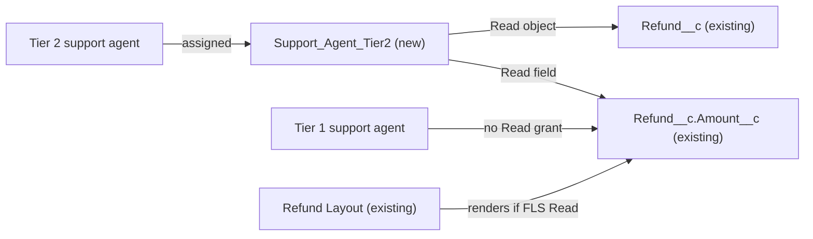

# Implementation spec — Refund amount visible only to Tier 2 support agents

> Hide `Refund__c.Amount__c` from Tier 1 support agents by granting Read on the field only through a new, dedicated Tier 2 permission set.

_Based on the requirement, the evidence reported by AskCoworker, and read-only org queries where noted. Assumptions and missing evidence are identified below. Specification only — nothing is implemented or deployed._

---

## 1. The requirement

Support agents below Tier 2 must not see the refund amount; the user clarified that the amount is hidden from Tier 1 agents and visible to holders of a Tier 2 permission set (*user decision*). The request contained no deploy or data-change instruction.

| # | Responsibility | Trigger | Where it lives |
| --- | --- | --- | --- |
| 1 | Tier 1 support agents cannot read `Refund__c.Amount__c` in the UI or API | Every record view and API request | Field-level security: no Read grant outside the permission sets listed in Section 6 |
| 2 | Tier 2 support agents can read `Refund__c` records and `Refund__c.Amount__c` | Permission set assignment | New permission set `Support_Agent_Tier2` |

## 2. Grounding — reuse before building

Target org: `TestWriteSpecDE` (org ID `00Dak00001COqNeEAL`, connected). API version: `67.0` (`sourceApiVersion` 67.0 in `sfdx-project.json`, target org from `.sf/config.json`). _verified by project file_

- **`Refund__c.Amount__c`** (CustomField, Currency) — the refund amount to hide. `Refund__c` has 10 custom fields: `Amount`, `Business_Account`, `Case`, `Contact`, `Issue_Date`, `Payment_Method`, `Processed_Date`, `Reason`, `Status`, `Storefront`. _verified by org query_
- **Current Read FLS on `Refund__c.Amount__c`** (FieldPermissions, complete list, 5 rows): `Agentforce_Reference_App` (Read, Edit), `Pronto_Deep_Dive_Workshop` (Read, Edit), and the `sfdcInternalInt` session permission sets `sfdc_accelerate_dms` (Read, Edit), `sfdc_a360_sfcrm_data_extract` (Read), `sfdc_slack` (Read). No profile has an explicit grant. _verified by org query_
- **Holders of `Agentforce_Reference_App` and `Pronto_Deep_Dive_Workshop`**: one assignment each, both to a user with the `System Administrator` profile. _verified by org query_
- **Object access on `Refund__c`** (ObjectPermissions, complete list, 7 rows): the five permission sets above plus the `System Administrator` and `Analytics Cloud Integration User` profiles. _verified by org query_
- **No tier concept exists**: no custom field on `User`; no custom field anywhere named like `Tier`, `Level`, or `Support` that represents agent tier (only `Contact.Loyalty_Tier__c` and `Contact.Level__c`, which describe customers); no permission set, permission set group, role, or queue named for a support tier. Roles include `CustomerSupportNorthAmerica` and `CustomerSupportInternational`, but no active user holds any role. _verified by org query_
- **Active users**: 12, of which the standard users have the profiles `System Administrator`, `Einstein Agent User`, `Analytics Cloud Integration User`, and `Analytics Cloud Security User`. No human support-agent users exist yet. _verified by org query_
- **Readers of `Refund__c.Amount__c`** (MetadataComponentDependency plus a search of all 70 non-namespaced Apex class bodies): Layout `Refund__c-Refund Layout`, ApexClass `IssueRefundReceiptAction`, Flows `Issue_Refund` and `Apply_Remediation`. `IssueRefundReceiptAction` is the only Apex class that references `Refund__c`. _verified by org query_
- **`IssueRefundReceiptAction`** (ApexClass) — `public with sharing`; takes `refundAmount` as a required input, inserts `Refund__c` with `Amount__c = req.refundAmount`, re-queries it, and returns `RefundReceiptView.amount = r.Amount__c`. It uses no `USER_MODE` and no `stripInaccessible`. It backs the agent action `Issue_Refund_Receipt` (GenAiFunctionDefinition, target type `apex`). _verified by org query_
- **`Issue_Refund`** and **`Apply_Remediation`** (Flow, active, `AutoLaunchedFlow`, no trigger) — both take `refundAmount` as an input and create `Refund__c` with `Amount__c`; `Issue_Refund` also outputs `returnedRefunds` (SObject). Neither sets `runInMode`. _verified by org query_
- **No `Refund__c` FlexiPage**; one layout, `Refund Layout`. _verified by org query_
- AskCoworker reported no triggers and no record-triggered flows on `Refund__c`. _reported by AskCoworker_

Candidates examined and rejected: `Contact.Loyalty_Tier__c` — customer loyalty tier, not agent tier; `Agentforce_Reference_App` and `Pronto_Deep_Dive_Workshop` as the Tier 2 grant — broad app permission sets that also grant Edit and much else, so widening their audience is not allowed; UserRole `CustomerSupportNorthAmerica` / `CustomerSupportInternational` — roles control record sharing, not field visibility.

Evidence sources: `sf org display`; `sf sobject list --sobject custom`; Tooling `EntityDefinition`, `CustomField`, `MetadataComponentDependency`, `ApexClass` (bodies), `FlowDefinition`, `Flow.Metadata`, `FlexiPage`, `Layout`, `GenAiFunctionDefinition`; standard `FieldPermissions`, `ObjectPermissions`, `PermissionSet`, `PermissionSetGroup`, `PermissionSetAssignment`, `UserRole`, `Group`, `User`, `FlowDefinitionView`. AskCoworker returned no citedReferences.

## 3. Architecture

Why the pieces are drawn this way:

1. Field-level security is the standard platform mechanism for hiding a field from UI and API; a layout change alone does not stop API access. _assumption (documented platform behavior)_
2. FLS is additive: a user sees `Amount__c` only if some profile or permission set grants Read. Today no profile grants it, and the only non-namespaced grants are held by one administrator (Section 2). So a Tier 1 agent who holds neither `Agentforce_Reference_App`, `Pronto_Deep_Dive_Workshop`, nor `Support_Agent_Tier2` cannot read the field. _verified by org query_ (grants) and _assumption (documented platform behavior)_ (additivity).
3. `Refund Layout` needs no change: fields a user cannot read are not rendered. _assumption (documented platform behavior)_
4. `Support_Agent_Tier2` includes Read on `Refund__c` because a field grant has no effect without object Read, and no existing permission set suited to agents grants it. _verified by org query_

## 4. Metadata changes

**Security**

- **Create `Support_Agent_Tier2`** — PermissionSet. Label "Support Agent Tier 2"; description "Grants Tier 2 support agents Read access to Refund__c and Refund__c.Amount__c." License: none (usable with any internal user license). Object permission on `Refund__c`: Read only (no Create, Edit, Delete, View All, Modify All). Field permission on `Refund__c.Amount__c`: Readable true, Editable false. No other object, field, tab, class, or system permissions.

## 5. Data 360 (Data Cloud) data involved

Not applicable — this change does not use Data 360. The Data Cloud connector permission set `sfdc_a360_sfcrm_data_extract` keeps its existing Read on `Refund__c.Amount__c` (_verified by org query_); this change does not affect it.

## 6. Security considerations

- **Who can read `Refund__c.Amount__c` after the change:** holders of `Support_Agent_Tier2` (new), `Agentforce_Reference_App`, `Pronto_Deep_Dive_Workshop`, and the namespaced `sfdcInternalInt` session sets `sfdc_accelerate_dms`, `sfdc_a360_sfcrm_data_extract`, `sfdc_slack` (unchanged, managed, not editable). _verified by org query_ Users whose profile has View All Data or Modify All Data (for example `System Administrator`) also see the field. _assumption (documented platform behavior)_
- **Tier 1 agents** are hidden from the amount only if they hold none of those permission sets. Do not assign `Agentforce_Reference_App` or `Pronto_Deep_Dive_Workshop` to Tier 1 agents (Section 8, item 2).
- **Profile default FLS on deploy:** the change adds no field, so no profile receives new default field access.
- **Existing permission sets are not changed**, so no existing user loses or gains access. _user decision_ (Tier 2 is a new permission set) and _assumption_ (existing sets left as they are).
- **Apex and flow paths:** `IssueRefundReceiptAction` and the autolaunched flows `Issue_Refund` and `Apply_Remediation` do not enforce FLS on `Amount__c` (Apex without `USER_MODE`; flows with no `runInMode`, which run in system context when invoked from an agent action or Apex). _verified by org query_ (code) and _assumption (documented platform behavior)_ (execution context). Each returns only the amount of the refund it just created, which the caller supplied as `refundAmount`. _verified by org query_ They do not let a Tier 1 agent read the amount of any other refund, so they are not a bypass of this requirement. Hardening them is a proposal (Section 8).
- **Sharing:** unchanged. The permission set grants object Read; record visibility still follows the `Refund__c` sharing model.

## 7. Testing strategy

The inventory has no code, so there is no Apex test class. Recommended manual verification in a sandbox:

1. **Tier 2 positive:** create a test user with a standard internal license and no `Refund__c` grants, assign `Support_Agent_Tier2`, open a `Refund__c` record: `Amount__c` is shown and is read-only.
2. **Tier 1 negative (UI):** a second test user with `Refund__c` Read from a temporary sandbox-only permission set but without `Support_Agent_Tier2`: `Refund__c-Refund Layout` renders without `Amount__c`.
3. **Tier 1 negative (API):** as the Tier 1 user, run `SELECT Id, Amount__c FROM Refund__c LIMIT 1` through the API: the query fails with an invalid-field error, and `SELECT Id FROM Refund__c LIMIT 1` succeeds.
4. **Tier 2 API:** as the Tier 2 user, the same `Amount__c` query returns the value.
5. **Revocation:** remove `Support_Agent_Tier2` from the Tier 2 user; the field disappears on the next page load.
6. **No side effects:** confirm `Agentforce_Reference_App` and `Pronto_Deep_Dive_Workshop` still show Read and Edit on `Refund__c.Amount__c`, and `Support_Agent_Tier2` shows only Read on `Refund__c`.
7. **Bulk:** assigning the permission set to many users has no automation; there is no bulk case to test.

## 8. Open decisions

### Open

1. **Assign `Support_Agent_Tier2` to Tier 2 agents (blocking for delivery).** No human support-agent users exist in `TestWriteSpecDE`. Responsibility 2 works only after an administrator assigns the permission set (Setup > Permission Sets > Support Agent Tier 2 > Manage Assignments). The list of Tier 2 users is a named placeholder: `{Tier 2 agent users}`.
2. **Keep broad grants away from Tier 1 agents (non-blocking).** `Agentforce_Reference_App` and `Pronto_Deep_Dive_Workshop` grant Read and Edit on `Amount__c`. If Tier 1 agents are later given either set, they will see the amount. Recommended default: give Tier 1 agents a separate agent permission set that grants `Refund__c` Read without `Amount__c`, created when those agents are onboarded (proposal, not in this inventory).
3. **Proposal: FLS-aware refund actions (non-blocking).** `IssueRefundReceiptAction`, `Issue_Refund`, and `Apply_Remediation` echo back the caller-supplied amount of the refund they create. If the business wants Tier 1 agents to see no amount at all, even for refunds they issue, a follow-up could blank `RefundReceiptView.amount` when `Amount__c` is not readable and run the flows in user context. Not included: the requirement concerns viewing refund amounts, and these paths reveal only what the caller entered.
4. **Reports and list views (non-blocking).** Check reports and list views on `Refund__c` for `Amount__c`; they follow FLS but cannot be read with the allowed commands.

### Resolved

- **Tier 2 representation (user decision).** Asked how "Tier 2" should be represented, since the org has no tier concept. Answer: amount hidden for Tier 1 agents and visible to a Tier 2 permission set.
- **Read only, not Edit (assumption).** The requirement is about visibility. `IssueRefundReceiptAction` and both flows write `Amount__c` without user-mode FLS, so issuing refunds does not need Edit.
- **Object Read included (assumption).** Needed for the field grant to have an effect; no suitable existing agent grant exists.
- **Existing permission sets unchanged (assumption).** Removing `Amount__c` from `Agentforce_Reference_App` or `Pronto_Deep_Dive_Workshop` would change access for their current holder and is not needed.
- **Corrections to AskCoworker:** its inventory listed the field permission as a separate `PermissionSetFieldSecurity` row; field permissions are part of the `PermissionSet` metadata, so it is merged into row 1. It proposed Edit on `Amount__c`; changed to Read only. It rated the Apex action gap as blocking; downgraded to a non-blocking proposal because the action returns only the caller-supplied amount (_verified by org query_). Its test step "Tier 2 user gets `Amount__c` absent from REST" was wrong and is dropped. Its reference to `AgentActionsTest` and "prior session" facts were not traced and are dropped.

## 9. Change set

| # | Action | Type | API name | Module | Why |
| --- | --- | --- | --- | --- | --- |
| 1 | Create | PermissionSet | `Support_Agent_Tier2` | force-app/main/default/permissionsets | Grants Tier 2 agents Read on `Refund__c` and `Refund__c.Amount__c`; Tier 1 agents without it cannot see the amount |

One new permission set is the only grant of refund amount visibility for support agents; field-level security hides the amount from everyone else.

Total: 1 · Create: 1 · Update: 0 · Delete: 0
