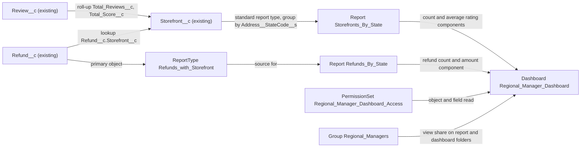

# Implementation spec — Regional manager dashboard (storefronts, rating, refunds by state)

> Give regional managers one dashboard that shows storefront count, average rating, and refunds grouped by region, where region is the state of the storefront address.

_Based on the requirement, the evidence reported by AskCoworker, and read-only org queries where noted. Assumptions and missing evidence are identified below. Specification only — nothing is implemented or deployed._

---

## 1. The requirement

Regional managers need a dashboard that shows storefront count, average rating, and refunds by region. The user decided that region is the state from the storefront address (`Storefront__c.Address__StateCode__s`), so no region field or object is created and the existing `Region__c` object is not used. The request contained no deploy or data-change instruction.

| # | Responsibility | Trigger | Where it lives |
| --- | --- | --- | --- |
| 1 | Show the storefront count per state | Dashboard open or refresh | `Regional_Manager_Reports/Storefronts_By_State` on `Regional_Manager_Dashboards/Regional_Manager_Dashboard` |
| 2 | Show the average rating per state | Dashboard open or refresh | `Regional_Manager_Reports/Storefronts_By_State` (custom summary formula over `Storefront__c.Total_Score__c` and `Storefront__c.Total_Reviews__c`) |
| 3 | Show the refund count and refund amount per state | Dashboard open or refresh | `Regional_Manager_Reports/Refunds_By_State` on report type `Refunds_with_Storefront` |
| 4 | Let regional managers open the dashboard and read the underlying data | Permission set assignment and group membership | `Regional_Manager_Dashboard_Access`, `Regional_Managers` |

## 2. Grounding — reuse before building

Target org: `TestWriteSpecDE` (Developer Edition, `00Dak00001COqNeEAL`). API version: `67.0`.

- **`Storefront__c`** (CustomObject) — the storefront records being counted. 21 records, all `Status__c` = Active, all with `Address__CountryCode__s` = US and `Address__StateCode__s` = TX. _verified by org query_
- **`Storefront__c.Address__c`** (Address compound field) — its `Address__StateCode__s` component is a dependent picklist (controller `Address__CountryCode__s`, 384 values). It is the region dimension. _verified by org query_; region = state is a _user decision_
- **`Storefront__c.Total_Reviews__c`** (roll-up summary, COUNT of `Review__c` over `Review__c.Storefront__c`, no filter) and **`Storefront__c.Total_Score__c`** (roll-up summary, SUM of `Review__c.Rating__c`, no filter) — the inputs to the average rating. Totals across all storefronts: 309 score over 92 reviews. _verified by org query_
- **`Storefront__c.Average_Review_Score__c`** (formula Number, scale 1, `Total_Score__c / Total_Reviews__c`, blanks as zero) — per-storefront average. It is null for the 2 storefronts that have 0 reviews. _verified by org query_
- **`Review__c`** (CustomObject) — 92 records; `Review__c.Storefront__c` is the master-detail parent (sharing ControlledByParent). The dashboard does not read `Review__c` directly. _verified by org query_
- **`Refund__c`** (CustomObject) — `Refund__c.Storefront__c` (nullable Lookup to `Storefront__c`), `Refund__c.Amount__c` (Currency), `Refund__c.Status__c` (Pending, Approved, Processing, Completed, Failed, Cancelled). 0 records today. _verified by org query_
- **`Region__c`** (CustomObject) — exists with only standard fields, 0 records, and no references in `MetadataComponentDependency` or unmanaged Apex bodies. Not used, by _user decision_. _verified by org query_
- **Existing reports and dashboards** — no report name contains Storefront, Refund, Review, Region, or Rating. The 8 dashboards are PRM, Enablement, and managed Shield (`sc_ext`, `shield_ext`) dashboards; 2 of them run as the logged-in user. _verified by org query_
- **`DashboardController`, `DashboardRefreshBatch`, and other `Dashboard*` Apex classes** — managed classes in namespaces `sc_ext` and `shield_ext`, unrelated to storefronts. AskCoworker reported them as possibly relevant. _verified by org query_
- **Automation** — no Apex triggers, record-triggered flows, or validation rules on `Storefront__c`, `Refund__c`, `Review__c`, or `Region__c`. _verified by org query_
- **Sharing** — `Storefront__c` and `Refund__c` internal sharing model is Public Read/Write. _verified by org query_
- **Access to regional managers** — no role, public group (the org has no Regular groups), or permission set for regional managers exists. Roles include `EasternSalesTeam` and `WesternSalesTeam`, which are not tied to storefront states. _verified by org query_
- **Other region fields** — Tooling `CustomField` search for Region, Territory, District, Zone, and Area found only `Lead.Service_Area__c` and managed `ssot` Data 360 fields; `User.Division` is the only match on `Account` or `User`. None applies to storefronts. _verified by org query_

Evidence sources: `sf org display`; `sobject describe` of `Storefront__c`, `Refund__c`, `Review__c`, `Region__c`; Tooling `CustomField`, `CustomObject`, `ApexClass`, `ApexTrigger`, `ValidationRule`, `MetadataComponentDependency`; `FlowDefinitionView`, `EntityDefinition`, `Report`, `Dashboard`, `Folder`, `UserRole`, `Group`, `PermissionSet`, `ObjectPermissions`, `FieldPermissions`, `DataStream`, `Organization`; aggregate queries on `Storefront__c`, `Refund__c`, `Review__c`. AskCoworker returned no citedReferences.

## 3. Architecture

Why the pieces are drawn this way:

1. `Review__c` rolls up to `Storefront__c` through the existing `Total_Reviews__c` and `Total_Score__c` roll-ups. _verified by org query_
2. `Storefronts_By_State` uses the standard report type that Salesforce provides for a custom object with reports allowed. No custom report type is needed for a single object. AskCoworker proposed a custom report type `Storefront_By_State`; it was dropped (Section 8). _assumption (documented platform behavior)_
3. `Refunds_By_State` needs the parent storefront's state. A standard report type for `Refund__c` does not expose fields of a lookup parent, so the custom report type `Refunds_with_Storefront` adds `Storefront__c` fields through the `Refund__c.Storefront__c` lookup. _assumption (documented platform behavior)_
4. The dashboard runs as the logged-in user, so each manager sees data under their own access. `Regional_Manager_Dashboard_Access` grants the object and field read that the reports need. Folder access comes from folder shares to `Regional_Managers`, because permission sets do not grant folder access. _assumption (documented platform behavior)_
5. No automation fires: reports and dashboards only read data, and no triggers or flows exist on these objects. _verified by org query_
6. No Apex is used. Every component is declarative report and access metadata.

## 4. Metadata changes

**Foundation**

- **Create `Regional_Manager_Reports`** — Report folder, label "Regional Manager Reports". Folder share: View access to the public group `Regional_Managers`.
- **Create `Regional_Manager_Dashboards`** — Dashboard folder, label "Regional Manager Dashboards". Folder share: View access to the public group `Regional_Managers`.
- **Create `Refunds_with_Storefront`** — Custom report type, label "Refunds with Storefront", category Other, deployed. Primary object `Refund__c`; related object `Storefront__c` through `Refund__c.Storefront__c`, joined as "A records may or may not have related B records" so refunds with no storefront still appear (with a blank state). Layout fields: `Refund__c.Name`, `Refund__c.Amount__c`, `Refund__c.Status__c`, `Refund__c.Issue_Date__c`, and through the lookup `Storefront__c.Name`, `Storefront__c.Address__StateCode__s`, `Storefront__c.Address__CountryCode__s`.

**Reports**

- **Create `Regional_Manager_Reports/Storefronts_By_State`** — Summary report on the standard `Storefront__c` report type. Group rows by `Storefront__c.Address__StateCode__s`. No filters (all statuses, all states). Measures: record count (storefront count); SUM of `Storefront__c.Total_Score__c`; SUM of `Storefront__c.Total_Reviews__c`; custom summary formula "Average Rating" = `IF(Storefront__c.Total_Reviews__c:SUM = 0, NULL, Storefront__c.Total_Score__c:SUM / Storefront__c.Total_Reviews__c:SUM)`, number, 1 decimal place. This is the review-weighted average per state. Show details off.
- **Create `Regional_Manager_Reports/Refunds_By_State`** — Summary report on `Refunds_with_Storefront`. Group rows by `Storefront__c.Address__StateCode__s`. No status filter (all statuses). Measures: record count (refund count) and SUM of `Refund__c.Amount__c`. Show details off.

**Dashboard**

- **Create `Regional_Manager_Dashboards/Regional_Manager_Dashboard`** — Dashboard titled "Regional Manager Dashboard", running user type LoggedInUser. Components: (1) bar chart "Storefronts by State" from `Storefronts_By_State`, record count by state; (2) bar chart "Average Rating by State" from `Storefronts_By_State`, the "Average Rating" formula by state; (3) bar chart "Refunds by State" from `Refunds_By_State`, record count by state; (4) bar chart "Refund Amount by State" from `Refunds_By_State`, SUM of `Refund__c.Amount__c` by state.

**Access**

- **Create `Regional_Managers`** — Public group, label "Regional Managers", no initial members. Used only for the two folder shares. Membership is an admin step after deployment.
- **Create `Regional_Manager_Dashboard_Access`** — Permission set, label "Regional Manager Dashboard Access". Object permissions: Read on `Storefront__c` and `Refund__c` (no Create, Edit, Delete, View All, or Modify All). Field read: `Storefront__c.Address__c`, `Storefront__c.Status__c`, `Storefront__c.Total_Reviews__c`, `Storefront__c.Total_Score__c`, `Refund__c.Amount__c`, `Refund__c.Status__c`, `Refund__c.Issue_Date__c`, `Refund__c.Storefront__c`. User permission: `RunReports`. No other grants.

## 5. Data 360 (Data Cloud) data involved

Not applicable — this change does not use Data 360. The org has 0 `DataStream` records (_verified by org query_), and reports and dashboards read the core objects directly.

## 6. Security considerations

- **Execution context.** The dashboard runs as the logged-in user, so each component shows only records that the viewer can read. _assumption (documented platform behavior)_ This is the default chosen because the user had no preference on visibility; every manager sees all states. _assumption_
- **Sharing.** `Storefront__c` and `Refund__c` are Public Read/Write internally, so no sharing rule is needed for managers to see all states. _verified by org query_ Per-region restriction is not in scope (Section 8).
- **CRUD/FLS.** `Regional_Manager_Dashboard_Access` grants Read only on `Storefront__c` and `Refund__c` and read on the fields the reports use. `Storefront__c.Total_Reviews__c` and `Storefront__c.Total_Score__c` are roll-ups, so `Review__c` access is not needed. Profiles and other permission sets (for example `sfdc_accelerate_dms`, `Agentforce_Reference_App`, `Pronto_Deep_Dive_Workshop`, `sfdc_slack`, `sfdc_a360_sfcrm_data_extract`) also grant read on these objects (partial list, from `ObjectPermissions` and `FieldPermissions`); the new permission set is not the only grant path. _verified by org query_
- **RunReports.** 19 profiles already grant `RunReports` (_verified by org query_). The permission set includes it so a manager on another profile can still open the dashboard.
- **Folder access.** Folder shares to `Regional_Managers` control who can see the reports and dashboard. Users who have the permission set but are not in the group cannot see the folders. _assumption (documented platform behavior)_
- **Data exposure.** Both reports show aggregates per state with details off. A viewer with report access can still turn on details and see individual `Refund__c.Amount__c` values; this is acceptable because the viewer already has read access to those records. _assumption_

## 7. Testing strategy

No Apex is in the inventory, so no Apex test class applies. All cases below are recommended verification in a sandbox or scratch org after deployment. No test has been run.

1. **Storefront count.** `Storefronts_By_State` shows one row, TX, with a count of 21 (matches the verified data shape).
2. **Weighted average.** The TX "Average Rating" equals 309 / 92 = 3.4 at one decimal place. The per-storefront mean of `Storefront__c.Average_Review_Score__c` is 3.35, so the check confirms the weighted formula is used.
3. **Zero reviews.** The 2 storefronts with 0 reviews add 0 to both sums and do not cause a division error. A state whose storefronts all have 0 reviews shows a blank average, not 0.
4. **Empty refunds.** With 0 `Refund__c` records, the refund components render with no data and no error.
5. **Refund attribution.** In a non-production org, a refund linked to a TX storefront increases the TX refund count by 1 and the amount by its `Refund__c.Amount__c`. A refund with no `Refund__c.Storefront__c` appears under a blank state.
6. **Multiple states.** In a non-production org, a storefront in another state appears as a separate row in both reports.
7. **Permission cases.** A user with `Regional_Manager_Dashboard_Access` and membership in `Regional_Managers` opens the dashboard and sees all components. A user in the group whose profile lacks read on `Storefront__c` or `Refund__c` and who lacks the permission set sees errors or empty components. A user who is not in the group cannot see the folders.
8. **Grouping field.** `Storefront__c.Address__StateCode__s` is available as a grouping in both the standard `Storefront__c` report type and `Refunds_with_Storefront`.

## 8. Open decisions

### Open

1. **Reports allowed on `Storefront__c` and `Refund__c` (non-blocking).** The allowed queries cannot read the objects' "Allow Reports" setting. The design assumes it is enabled. If it is not, both the standard report type and `Refunds_with_Storefront` fail to deploy; the fix is to enable "Allow Reports" on the objects, which would add Update rows. Check during deployment. _assumption_
2. **State as the region grain (non-blocking).** All 21 storefronts are in TX today (_verified by org query_), so every component shows one row until storefronts in other states exist. Grouping by a multi-state region would need a new field or the unused `Region__c` object; this is out of scope by _user decision_.
3. **Per-manager visibility (non-blocking).** The user had no preference. Default: every regional manager sees all states. Restricting each manager to their own state would need a manager-to-state mapping, which nothing in the org provides, and a sharing change. _assumption_
4. **Refund measure (non-blocking).** The user had no preference. Default: refund count and SUM of `Refund__c.Amount__c`, all statuses, including Failed and Cancelled. A status filter is a report detail that does not change the inventory. _assumption_
5. **Dynamic dashboard limit (non-blocking).** The dashboard runs as the logged-in user. 2 existing dashboards already do (_verified by org query_). Developer Edition limits the number of dynamic dashboards; if the limit is reached, run the dashboard as a specified user instead and share it only through the folder. _assumption (documented platform behavior)_
6. **User provisioning (non-blocking).** After deployment an admin must assign `Regional_Manager_Dashboard_Access` and add each regional manager to `Regional_Managers`. No role or group identifies regional managers today (_verified by org query_).
7. **Deployment sequence (non-blocking).** Deploy `Regional_Managers`, `Regional_Manager_Reports`, `Regional_Manager_Dashboards`, and `Refunds_with_Storefront` first; then the two reports; then `Regional_Manager_Dashboard`; then `Regional_Manager_Dashboard_Access`. No data backfill is needed.

### Resolved

- **Region definition.** User decision: region is the state from the storefront address, `Storefront__c.Address__StateCode__s`. AskCoworker's D1 and D2 said no region concept exists and recommended a new `Region__c` field on `Storefront__c`; that is not needed. Org query found an existing `Region__c` object that AskCoworker missed; it is not used by user decision.
- **Dashboard Apex classes.** AskCoworker said `DashboardController`, `DAL_DashboardJobs`, and `DashboardRefreshBatch` might be relevant with hidden bodies. Org query shows they are managed (`sc_ext`, `shield_ext`) and unrelated.
- **Custom report type for storefronts dropped.** AskCoworker's inventory row `Storefront_By_State` (ReportType) said a custom object has no standard report type. Salesforce creates a standard report type for a custom object with reports allowed, so the row was removed (Rule 4). _assumption (documented platform behavior)_
- **Storefront reports merged.** AskCoworker proposed separate `Storefront_Count_By_State` and `Avg_Rating_By_State` reports. Both measures come from the same object and grouping, so one report, `Storefronts_By_State`, feeds both dashboard components.
- **Average rating method.** AskCoworker's inventory proposed AVERAGE of `Storefront__c.Average_Review_Score__c`, which weights every storefront equally and skips the 2 storefronts with no reviews (3.35 across all storefronts, _verified by org query_). The spec uses the review-weighted SUM(`Total_Score__c`) / SUM(`Total_Reviews__c`) (3.36), which matches "avg rating" across a state's reviews. AskCoworker's T answer suggested returning 0 when there are no reviews; the spec returns blank so a state with no reviews does not show a 0 rating. Default chosen by the spec. _assumption_
- **Folder access.** AskCoworker's inventory said the permission set grants folder access. Permission sets do not grant folder access, so the public group `Regional_Managers` was added and the folders are shared to it. _assumption (documented platform behavior)_
- **Review__c access.** AskCoworker's inventory granted Read on `Review__c`. The reports read only roll-ups on `Storefront__c`, so the grant was removed (least access); AskCoworker's R answer agreed.
- **Module paths.** AskCoworker gave `reportFolders` and `dashboardFolders` directories. Source format keeps folder metadata in `force-app/main/default/reports` and `force-app/main/default/dashboards`; the paths were corrected.
- **Data 360.** AskCoworker reported 0 data streams from a prior session; confirmed by org query (`DataStream` count 0).

## 9. Change set

| # | Action | Type | API name | Module | Why |
| --- | --- | --- | --- | --- | --- |
| 1 | Create | ReportFolder | `Regional_Manager_Reports` | force-app/main/default/reports | Holds the two reports; shared View to `Regional_Managers` |
| 2 | Create | DashboardFolder | `Regional_Manager_Dashboards` | force-app/main/default/dashboards | Holds the dashboard; shared View to `Regional_Managers` |
| 3 | Create | ReportType | `Refunds_with_Storefront` | force-app/main/default/reportTypes | Exposes the parent storefront state on refunds |
| 4 | Create | Report | `Regional_Manager_Reports/Storefronts_By_State` | force-app/main/default/reports/Regional_Manager_Reports | Storefront count and weighted average rating per state |
| 5 | Create | Report | `Regional_Manager_Reports/Refunds_By_State` | force-app/main/default/reports/Regional_Manager_Reports | Refund count and amount per state |
| 6 | Create | Dashboard | `Regional_Manager_Dashboards/Regional_Manager_Dashboard` | force-app/main/default/dashboards/Regional_Manager_Dashboards | The regional manager dashboard |
| 7 | Create | Group | `Regional_Managers` | force-app/main/default/groups | Folder sharing target for regional managers |
| 8 | Create | PermissionSet | `Regional_Manager_Dashboard_Access` | force-app/main/default/permissionsets | Read access to report data and RunReports |

Two reports on existing storefront and refund data, grouped by storefront address state, feed one logged-in-user dashboard shared to a new regional manager group.

Total: 8 · Create: 8 · Update: 0 · Delete: 0
