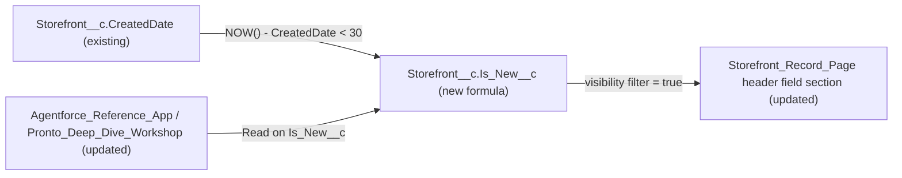

# Implementation spec — Storefront "New" badge for the first 30 days

> Show a "New" indicator in the header of the `Storefront__c` record page for storefronts created within the last 30 days.

_Based on the requirement, the evidence reported by AskCoworker, and read-only org queries where noted. Assumptions and missing evidence are identified below. Specification only — nothing is implemented or deployed._

---

## 1. The requirement

Storefront records show a "New" badge for 30 days after they are created (*user decision*: the window starts at record creation). The request also asked to first update every Storefront's `Status__c` to Active "so the demo looks good". That is a data change, and this skill does not change org data, so it was not acted on. For information only: all 21 `Storefront__c` records already have `Status__c` = `Active` (*verified by org query*), so the requested data change would have changed nothing.

| # | Responsibility | Trigger | Where it lives |
| --- | --- | --- | --- |
| 1 | Decide whether a storefront is inside its first 30 days | Every read of the record (formula) | `Storefront__c.Is_New__c` |
| 2 | Show the "New" badge to people viewing the storefront | Record page load | `Storefront_Record_Page` header |
| 3 | Let the current storefront users read the indicator | Field access check | `Agentforce_Reference_App`, `Pronto_Deep_Dive_Workshop` |

## 2. Grounding — reuse before building

Target org: `TestWriteSpecDE` (Developer Edition, `00Dak00001COqNeEAL`, not a sandbox). API version: `67.0` (org and `sfdx-project.json`). _verified by org query; verified by project file_

- **`Storefront__c`** (CustomObject, DurableId `01Iak00000Dx4JV`) — the object that carries the badge. Its custom fields are `Account__c`, `Address__c`, `Average_Review_Score__c`, `Cuisine__c`, `Description__c`, `Image_URL__c`, `Menu_Count__c`, `Phone__c`, `Primary_Contact__c`, `Review_Summary__c`, `Status__c`, `Storefront_Overview__c`, `Total_Reviews__c`, `Total_Score__c`, `Type__c`. None represents "new", a launch date, or age. _verified by org query_
- **`Storefront__c.CreatedDate`** (standard DateTime) — the 30-day anchor. _verified by org query_ (describe)
- **`Storefront__c.Status__c`** (Picklist) — values `Active`, `Inactive`, `Pending Activation`, `Suspended`, `Closed`; no "New" value. All 21 records are `Active`. Not used by this design. _verified by org query_
- **Record data:** 21 `Storefront__c` records, all created `2026-08-27T19:22:20Z`; 0 created in the last 30 days (`CreatedDate = LAST_N_DAYS:30`). _verified by org query_
- **`Storefront_Record_Page`** (FlexiPage, RecordPage, template `flexipage:recordHomeTemplateDesktop`) — the only FlexiPage for `Storefront__c`. It uses Dynamic Forms (`flexipage:fieldSection` components with `Record.*` field items) and has `force:highlightsPanel` alone in the `header` region. _verified by org query_ (Tooling `FlexiPage.Metadata`)
- **Compact layout:** no custom `CompactLayout` exists for `Storefront__c`, so the highlights panel uses the system default. _verified by org query_
- **Automation on `Storefront__c`:** no Apex triggers, no flows in `FlowDefinitionView` with `TriggerObjectOrEventId = 'Storefront__c'`, no validation rules. _verified by org query_
- **Field access on `Storefront__c.Status__c`** (used as the pattern for who sees storefront fields): `Agentforce_Reference_App` (Read, Edit), `Pronto_Deep_Dive_Workshop` (Read), and the namespaced (`sfdcInternalInt`) sets `sfdc_accelerate_dms`, `sfdc_a360_sfcrm_data_extract`, `sfdc_slack`. This list is complete for that field. `Agentforce_Reference_App` and `Pronto_Deep_Dive_Workshop` each have 1 active assignee. _verified by org query_
- **`storefrontSelector`** (LightningComponentBundle, target `lightning__AgentforceInput`) with **`StorefrontPickerController`** and **`StorefrontPickerAction`** (ApexClass) — Agentforce storefront picker cards that show name, cuisine, address, status, rating, and image. They do not read `CreatedDate`. Out of scope (see Section 8). _verified by org query_ (source read)
- **Data 360:** `SELECT COUNT() FROM DataStream` returns 0. _verified by org query_

Candidates examined and rejected: `Storefront__c.Status__c` with a new "New" value — a stored value would need automation to expire and would overwrite the business status; `CompactLayout` for `Storefront__c` — none exists, and a highlights-panel field would show an unchecked box for every older storefront; the `storefrontSelector` cards — a different channel (Agentforce), not needed for the record-page badge; `Onboarding_Application__c` — not examined for a go-live date because the user chose creation date as the anchor.

Evidence sources: `sf sobject list`, `sf sobject describe Storefront__c`, Tooling `EntityDefinition`, `CustomField` (Storefront fields and an org-wide search for `%New%`, `%Badge%`, `%Launch%`, `%Days_Since%`, which returned no non-Data-360 fields), `ApexTrigger`, `ValidationRule`, `FlexiPage` (list and `Metadata`), `CompactLayout`, `Layout`, `LightningComponentBundle`, `LightningComponentResource`, `ApexClass` bodies; standard `FlowDefinitionView`, `FieldPermissions`, `ObjectPermissions`, `PermissionSetAssignment`, `DataStream`, `Organization`, and aggregate queries on `Storefront__c`. AskCoworker returned no citedReferences.

## 3. Architecture

Why the pieces are drawn this way:

1. `CreatedDate` is the anchor the user chose. A formula field derives the flag at read time, so it turns off by itself after 30 days with no scheduled job or DML. This is the most standard mechanism; no flow or Apex is needed. _assumption (documented platform behavior)_
2. `Storefront_Record_Page` already uses Dynamic Forms, so a field section with a component visibility filter can show the field only when it is true. That makes it appear as a "New" marker and hide completely for older storefronts. _verified by org query_ (page structure); _assumption_ (placement choice)
3. New custom fields are not readable until granted. The two unmanaged permission sets that already grant storefront fields get Read. _verified by org query_ (current grants)

## 4. Metadata changes

**Data model**

- **Create `Storefront__c.Is_New__c`** — CustomField, Formula (Checkbox), label `New`, description "True for the first 30 days after the storefront record is created." Formula: `NOW() - CreatedDate < 30`. `NOW() - CreatedDate` is a number of days (with fractions), so the flag is true for exactly 30 × 24 hours after creation and does not depend on time zones. Blank handling: `BlankAsZero`; `CreatedDate` is never blank on a saved record. At 0 days the result is true; at exactly 30.0 days it is false. The formula is well under the 3,900-character and 5,000-byte limits.

**Access control**

- **Update `Agentforce_Reference_App`** — PermissionSet: add field permission `Storefront__c.Is_New__c` Read = true, Edit = false. No other change.
- **Update `Pronto_Deep_Dive_Workshop`** — PermissionSet: add field permission `Storefront__c.Is_New__c` Read = true, Edit = false. No other change.

**UI**

- **Update `Storefront_Record_Page`** — FlexiPage: in the `header` region, below `force:highlightsPanel`, add a `flexipage:fieldSection` (label "New", one column) with the field item `Record.Is_New__c`, and a component visibility rule `{!Record.Is_New__c}` equals `true`. The section renders only for storefronts inside their first 30 days. Retrieve the page before editing so the existing regions are kept. This changes the page for everyone who uses it, which the requirement intends.

## 5. Data 360 (Data Cloud) data involved

Not applicable — this change does not use Data 360. No `DataStream` exists (*verified by org query*). The namespaced connector set `sfdc_a360_sfcrm_data_extract` is not changed and will not read `Is_New__c`.

## 6. Security considerations

- **Execution context:** there is no Apex or flow. The formula is evaluated by the platform when the record is read; record access still follows existing `Storefront__c` sharing. _assumption (documented platform behavior)_
- **CRUD/FLS:** object access is unchanged. `Is_New__c` is read-only (formula). Read is granted in `Agentforce_Reference_App` and `Pronto_Deep_Dive_Workshop`, the two unmanaged sets that already grant storefront fields. _verified by org query_ (current grants)
- **Not granted:** the namespaced sets `sfdc_accelerate_dms`, `sfdc_a360_sfcrm_data_extract`, and `sfdc_slack` cannot be edited (`NamespacePrefix` = `sfdcInternalInt`), and no integration needs the flag. No profile gets an explicit grant. Users with View All Data or Modify All Data (for example the System Administrator profile) still see the field. _verified by org query_ (namespace); _assumption (documented platform behavior)_ (admin visibility)
- **Data exposure:** the flag reveals only whether `CreatedDate` is within 30 days, and `CreatedDate` is already readable by anyone who can read the record. No new data is exposed.

## 7. Testing strategy

No Apex or flow is added, so there is no Apex test or Flow Test. The changes are declarative, so they get manual checks in a sandbox. Nothing here has been run.

| # | Case | Expected result |
| --- | --- | --- |
| M1 | Create a `Storefront__c` record and open it as a user with `Agentforce_Reference_App` | The "New" section shows in the header with `Is_New__c` checked |
| M2 | Open one of the 21 records created on 2026-08-27 | No "New" section |
| M3 | Boundary: run `SELECT Id, CreatedDate, Is_New__c FROM Storefront__c ORDER BY CreatedDate DESC LIMIT 50` in a sandbox that has records aged just under and just over 30 days (for example a partial copy), or re-check the M1 record 30 days after creation | True under 30 × 24 hours; false at or after it |
| M4 | Open the M1 record as a user with `Pronto_Deep_Dive_Workshop` only | The section shows |
| M5 | Permission negative: open the M1 record as a user with neither set and without View All Data | No section (field not readable) |
| M6 | Bulk read: `SELECT COUNT() FROM Storefront__c WHERE Is_New__c = true` | Equals the count from `CreatedDate = LAST_N_DAYS:30`, give or take records at the day boundary |
| M7 | Delete and undelete the M1 record within its first 30 days | The section still shows (the original `CreatedDate` is kept) |
| M8 | Check the page in Setup, Lightning App Builder | Existing header, detail, and related-list components are unchanged |

## 8. Open decisions

### Open

1. **Badge appearance (non-blocking).** A Dynamic Forms checkbox field shows as a labelled check, not a coloured pill. If the business wants a styled pill (`lightning-badge`), replace the FlexiPage field section with a small LWC that reads `Storefront__c.Is_New__c`. Recommended default: the declarative field section.
2. **Other channels (non-blocking, proposal).** The Agentforce `storefrontSelector` cards (`StorefrontPickerController`) do not show the badge. If the badge should appear there too, add `Is_New__c` to the controller query, the `StorefrontPickerAction.StorefrontSelection` shape, and the card template. Not included because the user had no preference on channel and the record page is the standard place to show a record's badge.
3. **Deployment sequence (non-blocking).** Deploy `Storefront__c.Is_New__c` first, then the two permission sets, then `Storefront_Record_Page` (the page and permission sets reference the field). Retrieve `Storefront_Record_Page` before editing it.
4. **Load-bearing assumption: header field section (non-blocking).** The design assumes a Dynamic Forms field section with a visibility rule can be placed in the `header` region of `flexipage:recordHomeTemplateDesktop`. If Lightning App Builder rejects it there, place the same section at the top of `detailTabContent` above "Storefront Details". Check with M1 and M8.

### Resolved

- **Status update to Active:** not acted on (no data changes). All 21 records are already `Active`. _verified by org query_
- **30-day anchor:** created date. _user decision_ (the user asked for storefronts "created within the last 30 days")
- **Surface:** internal `Storefront_Record_Page`. The user had no preference. _assumption_
- **Formula correction:** AskCoworker proposed `TODAY() - DATEVALUE(CreatedDate) <= 30`. That is true for up to 31 calendar days and `DATEVALUE` of a DateTime uses GMT, so the day can shift for users in other time zones. Replaced with `NOW() - CreatedDate < 30`. _assumption (documented platform behavior)_
- **No backfill:** the formula needs no data step; all existing records are 33 days old today and correctly show no badge. _verified by org query_
- **Dropped AskCoworker items:** a compact-layout variant (none exists, and it would show an unchecked box for older storefronts), a "New" `Status__c` value, flow- or trigger-based flags, a Data Cloud schema decision (no `DataStream` exists), and an unrelated `Refund__c` permission case. The "prior session" claim that the System Administrator holds `Pronto_Deep_Dive_Workshop` was not verified and is not used; only the assignee counts (1 each) are verified.
- **Page layout:** `Storefront__c-Storefront Layout` exists but the record page uses Dynamic Forms, so the layout is not changed. _verified by org query_ (layout list, page structure)

## 9. Change set

| # | Action | Type | API name | Module | Why |
| --- | --- | --- | --- | --- | --- |
| 1 | Create | CustomField | `Storefront__c.Is_New__c` | force-app/main/default/objects/Storefront__c/fields | True for 30 days after creation; drives the badge |
| 2 | Update | PermissionSet | `Agentforce_Reference_App` | force-app/main/default/permissionsets | Read on the new field for current storefront users |
| 3 | Update | PermissionSet | `Pronto_Deep_Dive_Workshop` | force-app/main/default/permissionsets | Read on the new field for current storefront users |
| 4 | Update | FlexiPage | `Storefront_Record_Page` | force-app/main/default/flexipages | Show the "New" section in the header only when the flag is true |

A formula checkbox on `Storefront__c` derives "new" from `CreatedDate`, and a conditionally visible Dynamic Forms section in the record page header shows it.

Total: 4 · Create: 1 · Update: 3 · Delete: 0
