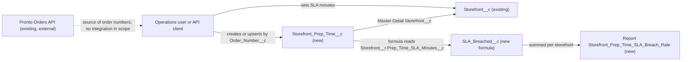

# Implementation spec — Storefront prep-time SLA and actual prep time per order

> Give each storefront a target prep time in minutes, record the actual prep time of each order against its storefront, and report the SLA breach rate per storefront.

_Based on the requirement, the evidence reported by AskCoworker, and read-only org queries where noted. Assumptions and missing evidence are identified below. Specification only — nothing is implemented or deployed._

---

## 1. The requirement

Each `Storefront__c` gets a prep-time SLA in minutes, each food order gets one record of its actual prep time under its storefront, and a report measures the share of orders that exceeded the SLA per storefront. The user decided that the SLA is a target in minutes, that per-order prep times live on a new child object of `Storefront__c` keyed by the external order number (recommended default, accepted), and that measurement is a per-storefront breach-rate report. The request contained no deploy or data-change instruction.

| # | Responsibility | Trigger | Where it lives |
| --- | --- | --- | --- |
| 1 | Store a prep-time SLA (target minutes) per storefront | User edits a storefront | `Storefront__c.Prep_Time_SLA_Minutes__c` |
| 2 | Record the actual prep time of each order | User creates a record from the storefront related list, or an API client upserts by `Order_Number__c` | `Storefront_Prep_Time__c` (`Order_Number__c`, `Actual_Prep_Minutes__c`, `Storefront__c`) |
| 3 | Decide per order whether the SLA was breached | Formula evaluated when the record is read | `Storefront_Prep_Time__c.SLA_Breached__c` |
| 4 | Measure the breach rate per storefront | User runs the report | Report `unfiled$public/Storefront_Prep_Time_SLA_Breach_Rate` |
| 5 | Let the people who maintain SLAs and prep times see and edit them | Permission set assignment | `Storefront_Prep_Time_SLA`, `Storefront__c-Storefront Layout`, `Storefront_Prep_Time__c-Storefront Prep Time Layout` |

## 2. Grounding — reuse before building

Target org: `TestWriteSpecDE` (Developer Edition, not a sandbox, org ID `00Dak00001COqNeEAL`). API version: `67.0`.

- **`Storefront__c`** (CustomObject) — the storefront. 21 records, all `Status__c` = Active. 15 custom fields; none holds a prep time, SLA, or duration. Internal sharing model ReadWrite, external Private. _verified by org query_
- **`Storefront__c-Storefront Layout`** (Layout) — the only layout on `Storefront__c`. `Storefront_Record_Page` (FlexiPage) is its Lightning record page. _verified by org query_
- **No Salesforce object holds food orders.** Standard `Order` has 0 records and no `Storefront__c` field; its only record-triggered flow, `Create_OS`, is inactive. _verified by org query_
- **`Transaction__c`** (CustomObject) — described as "Stores transactions - sales and (full/partial) refunds"; fields `Contact__c`, `Payment_Method__c`, `Refund_Reason__c`, `Total_Amount__c`, `Transaction_Date__c`, `Transaction_Type__c` (Sale, Refund); 0 records; no `Storefront__c` field; no metadata dependencies. Not reused (see Section 8). AskCoworker D1 did not report this object. _verified by org query_
- **`Pronto_Orders_API`** (NamedCredential) — the external orders system. `OrderPickerController` and `OrderStatusCardAction` state in their source that orders live in the external Heroku Orders API and return sample data. _verified by org query_
- **No existing prep-time concept.** A Tooling `CustomField` search on `Prep`, `SLA`, `Order`, `Minute`, `Duration` found only unrelated fields (for example `Account.SLA__c`, `Case.SLAViolation__c`, `Last_Prepped_Date__c` on managed Shield objects, and Data 360 platform fields). No object named like `Prep` exists. No permission set named like `Prep` exists. _verified by org query_
- **Automation on `Storefront__c` and `Transaction__c`**: no Apex triggers, no record-triggered flows, no validation rules. _verified by org query_
- **`AgentUpdateStorefrontDetailsActions`** (ApexClass) — updates `Storefront__c` and references only `Description__c`, `Account__c`, `Phone__c`, `Storefront_Overview__c`, `Status__c`. It is not affected by a new optional field. _verified by org query_
- **Permission sets with Edit on `Storefront__c`**: `Agentforce_Reference_App`, `sfdc_accelerate_dms`, and one profile-owned permission set. _verified by org query_
- **Data 360**: `SELECT COUNT() FROM DataStream` returned 0. _verified by org query_
- The "Prep"-named Apex classes (`BatchPrepProcess` and others) belong to Shield and Data Mask packages and concern data-masking preparation. _reported by AskCoworker_

Evidence sources: `sf org display`; `sobject list` and `sobject describe` for `Storefront__c`, `Transaction__c`, `Refund__c`, `Loyalty_Transaction__c`; Tooling `CustomField`, `CustomObject`, `ApexTrigger`, `ValidationRule`, `ApexClass` bodies, `Layout`, `FlexiPage`, `NamedCredential`, `MetadataComponentDependency`; `FlowDefinitionView`, `ObjectPermissions`, `FieldPermissions`, `EntityDefinition`, `Organization`, `DataStream`, record counts. AskCoworker returned no citedReferences.

## 3. Architecture

Why the pieces are drawn this way:

1. `Storefront__c` holds the SLA because the SLA is one value per storefront. _user decision_
2. `Storefront_Prep_Time__c` is new because no Salesforce object holds food orders; orders live in the external Pronto Orders API. _verified by org query_ Storing one row per order keyed by the external order number was the recommended default the user accepted. _user decision_
3. Master-Detail to `Storefront__c` makes the report group naturally by storefront and makes record access follow the storefront. _assumption_
4. `SLA_Breached__c` is a cross-object formula, so no flow or Apex is needed. It returns 1, 0, or blank so the report can sum it. _assumption_
5. The report uses the report type that the platform creates for a custom object with reports enabled, so no custom report type is needed. _assumption (documented platform behavior)_
6. `Pronto_Orders_API` is drawn dashed because no integration is in scope: records are entered through the UI or upserted by an API client. _assumption_ No Apex is in the inventory.

## 4. Metadata changes

**Data model**

- **Create `Storefront_Prep_Time__c`** — Custom object, label "Storefront Prep Time", plural "Storefront Prep Times". Name field Auto Number `SPT-{00000}`. `enableReports` true, `enableHistory` false, sharing model ControlledByParent. No tab; records are reached from the storefront related list.
- **Create `Storefront_Prep_Time__c.Storefront__c`** — Master-Detail(`Storefront__c`), label "Storefront", relationship name `Storefront_Prep_Times`, `reparentableMasterDetail` false, `writeRequiresMasterRead` false (Read/Write on the storefront record is needed to create a prep-time record).
- **Create `Storefront_Prep_Time__c.Order_Number__c`** — Text(100), required, unique (case-insensitive), External ID. Label "Order Number". Holds the order identifier from the Pronto Orders API and lets an API client upsert.
- **Create `Storefront_Prep_Time__c.Actual_Prep_Minutes__c`** — Number(4, 0), required. Label "Actual Prep Time (Minutes)". Whole minutes from order acceptance to ready, as reported by the storefront or order system.
- **Create `Storefront_Prep_Time__c.SLA_Breached__c`** — Formula (Number, 0 decimals), label "SLA Breached", blank treatment BlankAsBlank. Formula: `IF(OR(ISBLANK(Storefront__r.Prep_Time_SLA_Minutes__c), ISBLANK(Actual_Prep_Minutes__c)), NULL, IF(Actual_Prep_Minutes__c > Storefront__r.Prep_Time_SLA_Minutes__c, 1, 0))`. An order that equals the SLA is not a breach.
- **Create `Storefront__c.Prep_Time_SLA_Minutes__c`** — Number(4, 0), not required. Label "Prep Time SLA (Minutes)". Target prep time for every order of this storefront. Not required so that existing edits (including `AgentUpdateStorefrontDetailsActions`) keep working on the 21 storefronts that have no value yet.

**UX**

- **Create `Storefront_Prep_Time__c-Storefront Prep Time Layout`** — Layout for the new object with `Name`, `Storefront__c`, `Order_Number__c`, `Actual_Prep_Minutes__c`, `SLA_Breached__c` (read-only), `CreatedDate`.
- **Update `Storefront__c-Storefront Layout`** — Add `Prep_Time_SLA_Minutes__c` to the detail section, and add the `Storefront_Prep_Times` related list with columns `Name`, `Order_Number__c`, `Actual_Prep_Minutes__c`, `SLA_Breached__c`, `CreatedDate`.

**Security**

- **Create `Storefront_Prep_Time_SLA`** — Permission set "Storefront Prep Time SLA". Object: `Storefront__c` Read; `Storefront_Prep_Time__c` Read, Create, Edit (no Delete). Fields: `Storefront__c.Prep_Time_SLA_Minutes__c` Read and Edit; `Storefront_Prep_Time__c.Order_Number__c` Read and Edit; `Storefront_Prep_Time__c.Actual_Prep_Minutes__c` Read and Edit; `Storefront_Prep_Time__c.SLA_Breached__c` Read. The Master-Detail field has no field-level security. No user permissions.

**Reporting**

- **Create `unfiled$public/Storefront_Prep_Time_SLA_Breach_Rate`** — Summary report "Storefront Prep Time SLA Breach Rate" on report type `CustomEntity$Storefront_Prep_Time__c`, grouped by `Storefront__c` name. Filter: `SLA_Breached__c` not equal to blank. Columns: `Order_Number__c`, `Actual_Prep_Minutes__c`, `SLA_Breached__c`, `CreatedDate`. Custom summary formula "Breach Rate" (Percent, 1 decimal): `Storefront_Prep_Time__c.SLA_Breached__c:SUM / RowCount`, shown per group and grand total. Date filter on `CreatedDate`, default All Time.

## 5. Data 360 (Data Cloud) data involved

Not applicable — this change does not use Data 360. The org has no data streams (_verified by org query_), and nothing in the inventory is ingested into Data 360.

## 6. Security considerations

- **Execution context.** No Apex and no automation is added. The formula is evaluated when a user or report reads the record. _assumption (documented platform behavior)_
- **Sharing.** `Storefront_Prep_Time__c` is ControlledByParent: a user sees or edits a prep-time record when they can see or edit its storefront. `Storefront__c` is ReadWrite for internal users and Private for external users. _verified by org query_ (sharing model); _assumption (documented platform behavior)_ (Master-Detail inheritance).
- **CRUD/FLS.** New fields are hidden from every existing permission set and profile until granted. `Storefront_Prep_Time_SLA` is the only grant in this spec. `Agentforce_Reference_App`, `sfdc_accelerate_dms`, `sfdc_a360_sfcrm_data_extract`, `sfdc_slack`, and `Pronto_Deep_Dive_Workshop` do not get access. Profiles with Modify All Data or View All Data still see the records; permission sets are not the only grant path. _assumption (documented platform behavior)_
- **Report access.** The report is in Unfiled Public Reports, so any user with Run Reports can open it, but rows still follow record sharing and field-level security. Users need Run Reports from their profile or another permission set; this spec does not grant it. _assumption (documented platform behavior)_
- **Data exposure.** The new data is an external order number, minutes, and a breach flag. No personal or financial data. _assumption_

## 7. Testing strategy

The inventory has no Apex, so no Apex test class is planned. All cases below are recommended verification after deployment to a test org.

- **Breach detection.** Storefront SLA 20: actual 25 gives `SLA_Breached__c` = 1; actual 20 gives 0; actual 10 gives 0.
- **Blank handling.** Storefront with blank SLA: `SLA_Breached__c` is blank and the row is excluded from the report.
- **SLA change.** Change a storefront's SLA from 20 to 30 with an existing 25-minute record: the record changes from 1 to 0 (expected, see Section 8).
- **Required and unique.** Save without `Actual_Prep_Minutes__c` or `Order_Number__c` fails. A second record with the same `Order_Number__c` fails with a duplicate value error. Upsert on `Order_Number__c` updates the existing record.
- **Bulk.** Insert 200 records across several storefronts through the API with mixed breach results; all save and the report totals match a manual count.
- **Report arithmetic.** Storefront with 4 recorded orders, 1 breached: Breach Rate 25.0%. Storefront with no qualifying records does not appear. Grand total equals total breaches divided by total qualifying rows.
- **Permissions.** A user with `Storefront_Prep_Time_SLA` can set the SLA and create and edit prep-time records but cannot delete them. A user without it cannot see the object or the SLA field.
- **Delete and undelete.** Deleting a test storefront deletes its prep-time records; undeleting it restores them.
- **UI.** `Storefront_Record_Page` shows the SLA field and the related list after the layout update.

## 8. Open decisions

### Open

1. **How prep-time records are captured (non-blocking).** The spec provides storage, UI entry through the storefront related list, and an upsert key (`Order_Number__c`). It does not build an integration with `Pronto_Orders_API`, and the org shows no source of actual prep times. Recommended default: manual entry or an external upsert now; an automated feed from the Pronto Orders API is a separate spec if needed.
2. **SLA changes are retroactive (non-blocking).** `SLA_Breached__c` reads the storefront's current SLA, so changing an SLA recalculates past orders. Recommended default: accept. If point-in-time measurement is needed, add a stored SLA snapshot field on `Storefront_Prep_Time__c` set on create.
3. **Existing storefronts have no SLA (non-blocking).** All 21 storefronts will have a blank `Prep_Time_SLA_Minutes__c` after deployment, so their orders are excluded from the report until an SLA is entered. Populating the values is a business data step after deployment, not part of this spec.
4. **Access for other groups (non-blocking).** Agent users (`Agentforce_Reference_App`) and integrations (`sfdc_accelerate_dms`, `sfdc_a360_sfcrm_data_extract`) do not get the new field or object. Grant them only if they must read or set SLAs or prep times.
5. **Report folder (non-blocking).** The report goes to Unfiled Public Reports (no new folder). If breach rates must be restricted, move it to a dedicated folder shared with operations.
6. **Deployment sequence (non-blocking).** Deploy `Storefront__c.Prep_Time_SLA_Minutes__c` and `Storefront_Prep_Time__c` with its fields first, then the two layouts and `Storefront_Prep_Time_SLA`, then the report. Rollback is removing the report, permission set, and layout changes, then deleting the new object and field; no existing data changes.
7. **Placement on `Storefront_Record_Page` (non-blocking).** Whether the Lightning page renders the layout's detail section and related lists could not be read with the allowed commands. If it uses dynamic components, add the field and related list to the page as well.

### Resolved

- **Where to record per-order prep time.** Question asked: new child object of `Storefront__c` keyed by the external order number (recommended), extend `Transaction__c`, or keep it only in the external system. Answer: "No preference; use your recommended default." New object chosen; this is an _assumption_ with evidence: no Salesforce object holds food orders, and `Transaction__c` models sales and refunds with no storefront link.
- **How to measure.** Question asked: per-order breach flag only, or also a per-storefront breach-rate report. Answer: a breach-rate report. _user decision_
- **SLA unit.** Target prep minutes, per the user's answer. _user decision_
- **AskCoworker D1 missed `Transaction__c`.** Found by `sobject list` and reviewed; not reused. _verified by org query_
- **Dropped AskCoworker roll-ups.** AskCoworker proposed `Storefront__c.SLA_Breach_Count__c`, `Storefront__c.Total_Orders_Recorded__c` (roll-up summaries), and `Storefront__c.SLA_Breach_Rate__c` (formula). A roll-up summary filter cannot use a cross-object formula such as `SLA_Breached__c`, and the requirement asks for a report, which computes the rate itself. Removed. _assumption (documented platform behavior)_
- **Dropped custom report type and folder.** AskCoworker proposed `Storefront_Prep_Time_Report_Type` and `Storefront_Performance_Reports`. A custom object with reports enabled gets a standard report type, and Unfiled Public Reports exists in every org. Removed. _assumption (documented platform behavior)_
- **Dropped `Order_Date__c`.** Not asked for; `CreatedDate` supports time filters. Listed as a proposal only.
- **Dropped conditional Apex test class.** AskCoworker listed `StorefrontPrepTimeTest` outside its table; the inventory has no Apex. Removed.
- **Checkbox changed to Number.** AskCoworker proposed `SLA_Breached__c` as a Checkbox. Reports cannot sum checkboxes, so it is a 1/0 Number formula. AskCoworker's claim that a blank SLA yields false is wrong for BlankAsZero treatment (a blank SLA would count as 0 and every order would breach); the formula guards blanks explicitly. _assumption (documented platform behavior)_
- **`Order_Number__c` made required** so the unique key cannot be blank, per AskCoworker's T review.
- **`Prep_Time_SLA_Minutes__c` not required**, so edits to existing storefronts keep working. Minimum-value validation rules for both minute fields are proposals only.
- **Master-Detail cascade delete.** Deleting a storefront deletes its prep-time history. Storefronts have a `Closed` status, so deletion is not the normal way to retire one. Accepted. _assumption_

## 9. Change set

| # | Action | Type | API name | Module | Why |
| --- | --- | --- | --- | --- | --- |
| 1 | Create | CustomObject | `Storefront_Prep_Time__c` | force-app/main/default/objects | One record per order with its actual prep time; no Salesforce order object exists |
| 2 | Create | CustomField | `Storefront_Prep_Time__c.Storefront__c` | force-app/main/default/objects | Links each order's prep time to its storefront |
| 3 | Create | CustomField | `Storefront_Prep_Time__c.Order_Number__c` | force-app/main/default/objects | External order key; unique; upsert target |
| 4 | Create | CustomField | `Storefront_Prep_Time__c.Actual_Prep_Minutes__c` | force-app/main/default/objects | Actual prep time per order |
| 5 | Create | CustomField | `Storefront_Prep_Time__c.SLA_Breached__c` | force-app/main/default/objects | 1/0 breach result against the storefront SLA |
| 6 | Create | CustomField | `Storefront__c.Prep_Time_SLA_Minutes__c` | force-app/main/default/objects | Prep-time SLA per storefront |
| 7 | Create | Layout | `Storefront_Prep_Time__c-Storefront Prep Time Layout` | force-app/main/default/layouts | Record page for prep-time records |
| 8 | Update | Layout | `Storefront__c-Storefront Layout` | force-app/main/default/layouts | Shows the SLA field and the prep-time related list |
| 9 | Create | PermissionSet | `Storefront_Prep_Time_SLA` | force-app/main/default/permissionsets | Least access to the new object and fields |
| 10 | Create | Report | `unfiled$public/Storefront_Prep_Time_SLA_Breach_Rate` | force-app/main/default/reports | Breach rate per storefront |

A new child object of `Storefront__c` stores each order's actual prep time, a cross-object formula compares it with the storefront's SLA minutes, and a summary report computes the breach rate per storefront.

Total: 10 · Create: 9 · Update: 1 · Delete: 0
