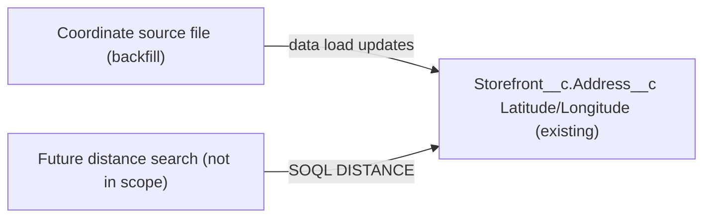

# Implementation spec — Storefront geolocation (latitude and longitude) for distance searches

> Store latitude and longitude on each `Storefront__c` record so that later SOQL `DISTANCE` searches return results.

_Based on the requirement, the evidence reported by AskCoworker, and read-only org queries where noted. Assumptions and missing evidence are identified below. Specification only — nothing is implemented or deployed._

---

## 1. The requirement

Store each storefront's latitude and longitude so distance searches can be built later. The storage already exists: the custom compound address field `Storefront__c.Address__c` has `Storefront__c.Address__Latitude__s` and `Storefront__c.Address__Longitude__s` sub-fields, and SOQL `DISTANCE` accepts `Address__c`. The gap is data: none of the 21 storefronts has coordinates. This spec therefore has no metadata changes and one data step (a backfill). The user answered "Geolocation for storefronts" to the question about how coordinates get onto records; that picks no listed option, so it was mapped to the recommended option, a one-time backfill (*assumption*). Building the distance search itself is out of scope ("later").

| # | Responsibility | Trigger | Where it lives |
| --- | --- | --- | --- |
| 1 | Hold a latitude and longitude per storefront | Not applicable (existing storage) | `Storefront__c.Address__Latitude__s`, `Storefront__c.Address__Longitude__s` (existing sub-fields of `Storefront__c.Address__c`) |
| 2 | Put coordinates on the 21 existing storefronts | One-time data step | Data load (Section 8, deployment sequence) |
| 3 | Make the stored values usable by a future distance search | Not applicable | SOQL `DISTANCE(Address__c, GEOLOCATION(lat, long), 'mi')` on `Storefront__c` |

## 2. Grounding — reuse before building

Target org: `TestWriteSpecDE` (`00Dak00001COqNeEAL`, connected). API version: `67.0` (org and `sfdx-project.json` `sourceApiVersion`, *verified by project file*).

- **`Storefront__c`** (CustomObject) — the storefront object; `DurableId` `01Iak00000Dx4JV`; 21 records. _verified by org query_
- **`Storefront__c.Address__c`** (CustomField, type `address`) — compound address. Its sub-fields per `sobject describe`: `Address__Street__s`, `Address__City__s`, `Address__PostalCode__s`, `Address__StateCode__s`, `Address__CountryCode__s`, `Address__Latitude__s` (double, updateable, nillable), `Address__Longitude__s` (double, updateable, nillable), `Address__GeocodeAccuracy__s` (picklist). _verified by org query_
- **Data shape** — of 21 `Storefront__c` records: 21 have street, city, and postal code; all 21 have `Address__CountryCode__s` = `US`; 0 have `Address__Latitude__s`; 0 have `Address__Longitude__s`; all 21 have a blank `Address__GeocodeAccuracy__s`. _verified by org query_
- **SOQL `DISTANCE` on `Address__c`** — `SELECT COUNT() FROM Storefront__c WHERE DISTANCE(Address__c, GEOLOCATION(37.7749,-122.4194), 'mi') < 50` ran without error (0 rows, as expected with no coordinates), and `ORDER BY DISTANCE(Address__c, …)` also ran without error. _verified by org query_
- **Readers of `Storefront__c.Address__c`** — `MetadataComponentDependency` for field Id `00Nak00004nK0U7EAK` (18- and 15-character forms) returns only `Layout` `Storefront__c-Storefront Layout`. No unmanaged Apex class body references `Address__`, `Latitude`, `Longitude`, `DISTANCE(`, or `GEOLOCATION(` (70 classes searched). _verified by org query_
- **Automation on `Storefront__c`** — 0 Apex triggers (`ApexTrigger WHERE TableEnumOrId = 'Storefront__c'`) and 0 flows (`FlowDefinitionView WHERE TriggerObjectOrEventId = 'Storefront__c'`). _verified by org query_ Validation rules were not queried; the backfill writes only coordinate sub-fields.
- **Field access to `Storefront__c.Address__c`** (explicit grants, complete for this field): Read and Edit — `Agentforce_Reference_App`, `sfdc_accelerate_dms`; Read only — `sfdc_a360_sfcrm_data_extract`, `sfdc_slack`, `Pronto_Deep_Dive_Workshop`. _verified by org query_
- **Named credentials** — only `Pronto_Pass_Factory` and `Pronto_Orders_API` exist; external credentials `Pronto_Orders_API_Key` and `Pronto_Pass_Factory_Key`. None is named for geocoding. _verified by org query_ AskCoworker reported `Pronto_Pass_Factory` is for Apple Wallet passes. _reported by AskCoworker_

Candidates examined and rejected: a new Geolocation-type field `Storefront__c.Geolocation__c` — it would duplicate the existing latitude and longitude sub-fields, which `DISTANCE` already accepts (the org-wide Tooling `CustomField` search for `%Lat%`, `%Long%`, `%Geo%`, `%Location%`, `%Coord%` found no CRM field for storefront coordinates; the only hits outside Data 360 objects were `NumberofLocations`/`Number_of_Locations` on `Account` and `Lead` and unrelated managed fields). `Account.BillingAddress`/`ShippingAddress` through `Storefront__c.Account__c` — describe the merchant account, not each storefront.

Evidence sources: `sf org display`; `sf sobject list --sobject custom`; `sf sobject describe Storefront__c`; aggregate SOQL on `Storefront__c`; two `DISTANCE` SOQL probes; Tooling `CustomField`, `EntityDefinition`, `MetadataComponentDependency`, `ApexTrigger`, `ApexClass` bodies, `NamedCredential`, `ExternalCredential`; `FlowDefinitionView`; `FieldPermissions`. AskCoworker (D1, D2) returned no citedReferences.

## 3. Architecture

Why the pieces are drawn this way:

1. `Storefront__c.Address__c` and its latitude and longitude sub-fields already exist and are updateable (*verified by org query*), so the design reuses them.
2. The backfill is a data step, not metadata. The coordinate source is outside the org; no geocoding named credential exists (*verified by org query*).
3. The future search uses SOQL `DISTANCE` on `Address__c`, which the org accepts (*verified by org query*). It is not built here.

## 4. Metadata changes

No metadata changes are required.

## 5. Data 360 (Data Cloud) data involved

Not applicable — this change does not use Data 360. The permission set `sfdc_a360_sfcrm_data_extract` has Read on `Storefront__c.Address__c` (*verified by org query*); if a Data 360 stream ingests `Storefront__c`, it may pick up the new values, which was not checked.

## 6. Security considerations

- No new fields, so no new FLS. Access to the latitude and longitude sub-fields follows `Storefront__c.Address__c` (*assumption (documented platform behavior)*: compound field sub-fields share the compound field's field-level security).
- The user or integration that runs the backfill needs Edit on `Storefront__c` and on `Storefront__c.Address__c`: a System Administrator, or a user with `Agentforce_Reference_App` or `sfdc_accelerate_dms` (*verified by org query* for the field grants). No grant is added.
- Read-only holders (`sfdc_a360_sfcrm_data_extract`, `sfdc_slack`, `Pronto_Deep_Dive_Workshop`) will be able to read the coordinates once loaded. Storefront coordinates describe business locations, not people (*assumption*).

## 7. Testing strategy

No test components; nothing is deployed. Recommended verification in a sandbox, then production:

1. Before the load: `SELECT COUNT(Id), COUNT(Address__Latitude__s), COUNT(Address__Longitude__s) FROM Storefront__c` returns 21, 0, 0.
2. After the load: the same query returns 21, 21, 21. `Address__Street__s`, `Address__City__s`, `Address__PostalCode__s` are unchanged on every record (compare with the export from step 1 of the data step).
3. Range check: `SELECT COUNT() FROM Storefront__c WHERE Address__Latitude__s < -90 OR Address__Latitude__s > 90 OR Address__Longitude__s < -180 OR Address__Longitude__s > 180` returns 0.
4. Distance check (verifies the load-bearing assumption in Section 8): pick one storefront's loaded coordinates and run `SELECT Name FROM Storefront__c WHERE DISTANCE(Address__c, GEOLOCATION(<lat>, <long>), 'mi') < 1`; it returns that storefront.
5. Spot-check three storefronts on a map against their street address.

## 8. Open decisions

### Open

1. **Coordinate source for the backfill (blocking for delivery).** The 21 coordinate pairs must come from outside the org (a geocoding provider or the storefront team). No geocoding named credential exists. Recommended default: geocode the 21 exported addresses with a provider the business already licenses, and load the results with `Address__GeocodeAccuracy__s` set when the provider reports it.
2. **Coordinates for new or changed storefronts (non-blocking, proposal).** Custom address fields are not geocoded automatically by data integration rules, which cover standard addresses on `Account`, `Contact`, and `Lead` (*assumption (documented platform behavior)*). New storefronts and address edits will have no coordinates, or stale ones, until someone loads them. If distance search needs coverage beyond the 21 existing records, a later spec can add geocoding on address create and change (a callout through a new named credential to a chosen provider). Not built here because the requirement asks only to store coordinates.
3. **Load-bearing assumption (non-blocking).** `DISTANCE(Address__c, …)` returns correct results once the sub-fields are populated. The syntax is accepted (*verified by org query*); correct results are checked by Section 7 step 4.

Deployment sequence (data step):
1. Export `Id`, `Name`, `Address__Street__s`, `Address__City__s`, `Address__StateCode__s`, `Address__PostalCode__s`, `Address__CountryCode__s`, `Address__Latitude__s`, `Address__Longitude__s` for all `Storefront__c` records (backup and geocoding input).
2. Geocode the addresses (Open item 1).
3. Update only `Address__Latitude__s`, `Address__Longitude__s`, and optionally `Address__GeocodeAccuracy__s`, matched by `Id`, in a sandbox first, then production. No trigger or flow runs on `Storefront__c` (*verified by org query*).
4. Rollback: reload the export from step 1 (all three fields are blank today, so rollback sets them back to blank).

### Resolved

- **User decision mapping.** Question: how should coordinates get onto storefronts — (A) one-time backfill, (B) backfill plus automatic geocoding on address change through an external provider, or (C) manual entry? Answer: "Geolocation for storefronts." It picks no option; mapped to (A), the recommended option (*assumption*).
- **Reuse the existing sub-fields instead of a new Geolocation field** (*assumption*): `Storefront__c.Address__Latitude__s` and `Storefront__c.Address__Longitude__s` exist, are updateable, and work with `DISTANCE` (*verified by org query*).
- **Correction to AskCoworker (D1):** it said standard address fields do not support `DISTANCE`. Salesforce documents `DISTANCE` for compound address fields and geolocation fields (*assumption (documented platform behavior)*). Not needed for this design; recorded only as a correction.
- **Correction to AskCoworker (D2):** it said `DISTANCE` support for a custom compound address field was unconfirmed and blocking. The org accepted `DISTANCE(Address__c, …)` in both `WHERE` and `ORDER BY` (*verified by org query*), so this is not blocking.
- **Dropped AskCoworker proposals:** extending `AgentUpdateStorefrontDetailsActions` to edit addresses, and a batch geocoding job — not needed by the requirement (Open item 2 covers the second as a proposal).
- Inventory, runtime, and testing calls (I, R, T) were not sent because verification showed no metadata change is needed.

## 9. Change set

| # | Action | Type | API name | Module | Why |
| --- | --- | --- | --- | --- | --- |

No metadata changes are required. The existing `Storefront__c.Address__c` latitude and longitude sub-fields store the coordinates, and a one-time data load fills them.

Total: 0 · Create: 0 · Update: 0 · Delete: 0
