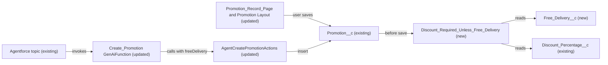

# Implementation spec — Require a promotion discount unless the promotion is a free-delivery offer

> Require `Promotion__c.Discount_Percentage__c` on every promotion except promotions flagged as free-delivery offers, and let merchants flag free-delivery offers in the UI and through the Create Promotion agent action.

_Based on the requirement, the evidence reported by AskCoworker, and read-only org queries where noted. Assumptions and missing evidence are identified below. Specification only — nothing is implemented or deployed._

---

## 1. The requirement

Make the promotion discount required, with one exception: a merchant can create a promotion without a discount when it is a free-delivery offer. The requirement's two parts are reconciled as a conditional rule ("required unless free delivery"), not a field-level required flag, because a field-level required flag would block free-delivery offers (*assumption*). The request contained no deploy, data-change, or credential instruction.

| # | Responsibility | Trigger | Where it lives |
| --- | --- | --- | --- |
| 1 | Mark a promotion as a free-delivery offer | Merchant creates or edits a promotion | `Promotion__c.Free_Delivery__c` (new) |
| 2 | Block saving a promotion that has no discount and is not a free-delivery offer | Insert and update of `Promotion__c`, from any caller | `Promotion__c.Discount_Required_Unless_Free_Delivery` (new validation rule) |
| 3 | Let the agent create free-delivery promotions without a discount | Agentforce "Create Promotion" action | `AgentCreatePromotionActions` (existing, updated) and `Create_Promotion` (existing GenAiFunction, updated) |
| 4 | Let UI users see and set the flag | Promotion record page and new-record form | `Promotion_Record_Page` and `Promotion__c-Promotion Layout` (existing, updated) |

## 2. Grounding — reuse before building

Target org: `TestWriteSpecDE` (ID `00Dak00001COqNeEAL`, connected). API version: `67.0` (org and `sfdx-project.json` `sourceApiVersion`). The `force-app` project contains no `Promotion__c` source; every component below comes from the org.

- **`Promotion__c`** (CustomObject, DurableId `01Iak00000Dx4JZ`, no namespace) — the promotion object. Its custom fields are exactly `Description__c`, `Discount_Percentage__c`, `End_Date__c`, `Promotion_Code__c`, `Start_Date__c`, `Status__c`, `Storefront__c`; one record type, `Master`. _verified by org query_
- **`Promotion__c.Discount_Percentage__c`** (CustomField, Percent, precision 3, scale 0) — the "discount field". Metadata `required: false`, description "The percentage discount applied." _verified by org query_
- **No field marks free delivery.** A Tooling `CustomField` search for `%Delivery%`, `%Promo%`, `%Discount%`, `%Offer%` across all objects returned only `Lead` delivery fields (`Current_Delivery_Partners`, `Delivery_Capability`), `Opportunity.DeliveryInstallationStatus`, `Marketing_Event__c.Promotion`, and the two existing `Promotion__c` fields. None describes a promotion's delivery offer. _verified by org query_
- **Automation on `Promotion__c`:** 0 validation rules (Tooling `ValidationRule` by `EntityDefinitionId`), 0 Apex triggers, 0 record-triggered flows (`FlowDefinitionView`). _verified by org query_
- **Data shape:** 1 `Promotion__c` record (`Status__c` = `Active`, `Discount_Percentage__c` = 20); 0 records with a blank discount; 0 deleted rows in the recycle bin. _verified by org query_
- **`AgentCreatePromotionActions`** (ApexClass, `01pak00000VxZBJAA3`, `with sharing`, invocable "Create Promotion") — the only Apex class that writes `Discount_Percentage__c` (search of all 70 unnamespaced Apex bodies). Input `discountPercentage` is `required=false`; it inserts with plain DML and returns `e.getMessage()` with `success=false` on any exception. _verified by org query_
- **Other readers and writers of `Promotion__c`** (complete for Apex bodies and `MetadataComponentDependency`): `AgentUpdatePromotionStatusActions` (updates `Status__c` only) and `MerchantRiskScoreAction` (reads `Start_Date__c`). `MetadataComponentDependency` on `Discount_Percentage__c` lists `AgentCreatePromotionActions` and FlexiPage `Storefront_Record_Page`. Reports and list views could not be checked. _verified by org query_
- **`Create_Promotion`** (GenAiFunction, `172ak00000kk4RFAAY`, unmanaged) invokes `AgentCreatePromotionActions`; five more unmanaged copies invoke the same class: `Create_Promotion_179Kj000000Lak9`, `Create_Promotion_179Kj000000oapi`, `Create_Promotion_179Kj000000t8j7`, `Create_Promotion_179Kj000000t8jJ`, `Create_Promotion_179Kj000000t8rT`. _verified by org query_
- **`Promotion_Record_Page`** (FlexiPage, `0M0ak00000GBmLgCAL`) — the `Promotion__c` record page; it uses Dynamic Forms (`flexipage:fieldSection`) with `Discount_Percentage__c` in a field section. **`Promotion__c-Promotion Layout`** (Layout) is the object's only layout. _verified by org query_
- **No test class** references `AgentCreatePromotionActions`, and no class named `AgentCreatePromotionActionsTest` exists. _verified by org query_
- **Access to `Promotion__c`** (complete `ObjectPermissions` list): `System Administrator` profile Read/Create/Edit; `Analytics Cloud Integration User` profile Read; `sfdc_accelerate_dms` Read/Create/Edit; `Pronto_Deep_Dive_Workshop`, `sfdc_a360_sfcrm_data_extract`, `sfdc_slack` Read. `sfdc_accelerate_dms`, `sfdc_a360_sfcrm_data_extract`, `sfdc_slack` have namespace `sfdcInternalInt` and cannot be edited. `FieldPermissions` on `Discount_Percentage__c`: `sfdc_accelerate_dms` Read/Edit; `sfdc_a360_sfcrm_data_extract`, `sfdc_slack`, `Pronto_Deep_Dive_Workshop` Read. _verified by org query_

Candidates examined and rejected: field-level `required` on `Discount_Percentage__c` — blocks free-delivery offers; inferring free delivery from `Description__c` text — not reliable enough for a validation rule; picklist `Promotion_Type__c` — the requirement names only one exception, so a checkbox is smaller (see Section 8); standard B2B Commerce `Promotion` object — AskCoworker reported it is unrelated to `Promotion__c`, and the design does not use it.

Evidence sources: `sf org display`; `sf sobject list --sobject custom`; `sobject describe Promotion__c`; Tooling `EntityDefinition`, `CustomField` (with `Metadata` by Id), `ValidationRule`, `ApexTrigger`, `ApexClass` bodies, `MetadataComponentDependency`, `Layout`, `FlexiPage` (with `Metadata`), `GenAiFunctionDefinition`, `GenAiPluginDefinition`; standard `FlowDefinitionView`, `ObjectPermissions`, `FieldPermissions`, `PermissionSet`, `PermissionSetAssignment`, and `Promotion__c` aggregates. AskCoworker returned no citedReferences.

## 3. Architecture

Why the pieces are drawn this way:

1. The validation rule is the standard mechanism for a conditional required value. It enforces the rule for every caller (UI, agent action, API, and `sfdc_accelerate_dms`) in one place, so the Apex class does not repeat the check (*assumption*; `Promotion__c` has no existing validation rule, trigger, or flow, *verified by org query*).
2. `Free_Delivery__c` is the flag the rule reads; a checkbox with default `false` keeps the existing record valid (*verified by org query*: its discount is 20).
3. `AgentCreatePromotionActions` is updated in place because it is the agent's only way to create promotions, and without a free-delivery input the agent could never create a promotion without a discount (*verified by org query*: it has no such input). No Apex logic is added beyond mapping the new input.
4. `Create_Promotion` is updated because its input schema is derived from the invocable signature (*assumption (documented platform behavior)*).
5. The record page and layout are updated so UI users can set the flag (*verified by org query*: both exist; the record page uses Dynamic Forms).

## 4. Metadata changes

**Data model**

- **Create `Promotion__c.Free_Delivery__c`** — CustomField, Checkbox, label "Free Delivery", default `false`, description "Checked when the promotion is a free-delivery offer. Free-delivery promotions do not need a discount percentage." Inline help: "Check this for a free-delivery offer that has no percentage discount."

**Validation**

- **Create `Promotion__c.Discount_Required_Unless_Free_Delivery`** — ValidationRule, active. Error condition formula: `AND(ISBLANK(Discount_Percentage__c), NOT(Free_Delivery__c))`. Error location: field `Discount_Percentage__c`. Error message: "Enter a discount percentage, or check Free Delivery if this is a free-delivery offer." Evaluates on insert and update from every caller. A discount of 0 is not blank and passes (see Section 8).

**Apex**

- **Update `AgentCreatePromotionActions`** — ApexClass. Add to `Request`: `@InvocableVariable(label='Free Delivery' description='Set to true for a free-delivery offer that has no discount (Promotion__c.Free_Delivery__c). When false or blank, discountPercentage is required.' required=false) public Boolean freeDelivery;`. Before `insert promo`, set `promo.Free_Delivery__c = (req.freeDelivery == true);`. Update the `discountPercentage` description to "Required unless freeDelivery is true." No other logic changes; the validation rule's error returns through the existing `catch` as `success=false` with the message.

**Tests**

- **Create `AgentCreatePromotionActionsTest`** — ApexClass (`@IsTest`). Covers the new input and the validation rule through the action; see Section 7.

**Agent**

- **Update `Create_Promotion`** — GenAiFunction. Refresh the input schema so it includes `freeDelivery` (Boolean, not required), and state in the input description that the agent sets `freeDelivery` to true for free-delivery offers and otherwise asks for a discount percentage. Retrieve the current metadata before editing.

**UX**

- **Update `Promotion_Record_Page`** — FlexiPage. Add a `Record.Free_Delivery__c` field instance next to `Record.Discount_Percentage__c` in the same Dynamic Forms field section. Changes the page for everyone who uses it (adds one field).
- **Update `Promotion__c-Promotion Layout`** — Layout. Add `Free_Delivery__c` next to `Discount_Percentage__c`, so the field appears on surfaces that still use the layout (for example the new-record form).

**Security**

- **Update `Pronto_Deep_Dive_Workshop`** — PermissionSet. Add Read (not Edit) field permission on `Promotion__c.Free_Delivery__c`, mirroring its Read on `Discount_Percentage__c`; the set has Read-only object access to `Promotion__c`.

## 5. Data 360 (Data Cloud) data involved

Not applicable — this change does not use Data 360. The namespaced connector permission set `sfdc_a360_sfcrm_data_extract` has Read on `Promotion__c` (*verified by org query*) and cannot be edited, so it will not get the new field; no responsibility needs it.

## 6. Security considerations

- **Execution context.** `AgentCreatePromotionActions` is `with sharing` and uses plain DML, so it enforces record sharing but not FLS; it can write `Free_Delivery__c` whatever the running user's field permissions are (*verified by org query* for the class; *assumption (documented platform behavior)* for FLS). No FLS grant is needed for the agent path.
- **Validation rule.** Validation rules run for every caller, including system-mode Apex and integrations; they do not run on delete or undelete (*assumption (documented platform behavior)*).
- **Field access.** On deploy, `System Administrator` gets Read/Edit on `Free_Delivery__c` through the profile's field-level security in the deployment (*assumption*). `Pronto_Deep_Dive_Workshop` gets Read (row 8). No Edit grant goes to any permission set: no editable permission set has Create or Edit on `Promotion__c` (*verified by org query*). The namespaced `sfdc_accelerate_dms`, `sfdc_a360_sfcrm_data_extract`, `sfdc_slack` and the `Analytics Cloud Integration User` profile get no access; no responsibility needs it.
- **Data exposure.** The new checkbox holds non-sensitive offer data. No new sharing or object access is granted.

## 7. Testing strategy

`AgentCreatePromotionActionsTest` (Apex, row 4). `@TestSetup` inserts an `Account` and a `Storefront__c` with `Account__c` set to it (the action checks this ownership, *verified by org query*).

| Test method | Behavior |
| --- | --- |
| `createWithDiscount` | `discountPercentage=20`, `freeDelivery` blank: `success=true`, `Discount_Percentage__c=20`, `Free_Delivery__c=false`. |
| `createFreeDeliveryWithoutDiscount` | `discountPercentage` blank, `freeDelivery=true`: `success=true`, `Free_Delivery__c=true`, discount blank. |
| `createWithoutDiscountOrFreeDelivery_fails` | both blank: `success=false`, message contains the validation error text; no `Promotion__c` inserted. |
| `createWithZeroDiscount` | `discountPercentage=0`, `freeDelivery=false`: `success=true` (0 is not blank). |
| `directInsertBulk` | 200 `Promotion__c` inserted directly: 100 with a discount, 100 with `Free_Delivery__c=true` and no discount succeed; a second `Database.insert(list, false)` of 200 with neither returns 200 validation errors. |
| `directUpdateClearsDiscount_fails` | Clearing `Discount_Percentage__c` on a record with `Free_Delivery__c=false` fails; unchecking `Free_Delivery__c` on a free-delivery record with no discount fails. |

Recommended verification (manual, in a sandbox):

1. In the UI, create a promotion with no discount and Free Delivery unchecked: blocked with the message on `Discount_Percentage__c`. Check Free Delivery: saves.
2. Confirm `Free_Delivery__c` shows on `Promotion_Record_Page` and on the new-record form.
3. In Agentforce, ask to create a free-delivery promotion with no discount: the agent passes `freeDelivery=true` and the promotion saves. Ask for a normal promotion without giving a discount: the agent asks for one, or the action returns the validation message.
4. As a `Pronto_Deep_Dive_Workshop` user, open a promotion: `Free_Delivery__c` is visible and read-only.
5. After deploy, query `SELECT Discount_Percentage__c, Free_Delivery__c FROM Promotion__c`: the existing record shows 20 and `false`.
6. Check reports and list views on `Promotion__c` if the new field should appear in them (non-blocking).

## 8. Open decisions

### Open

1. **Planner copies of the Create Promotion action (non-blocking).** Five unmanaged GenAiFunction copies (`Create_Promotion_179Kj000000Lak9`, `Create_Promotion_179Kj000000oapi`, `Create_Promotion_179Kj000000t8j7`, `Create_Promotion_179Kj000000t8jJ`, `Create_Promotion_179Kj000000t8rT`) invoke the same class. The new input is optional, so they keep working, but agents that use them will not offer `freeDelivery` until their action is refreshed. Recommended default: refresh the action in each active agent version after deploy.
2. **`sfdc_accelerate_dms` inserts (non-blocking).** This namespaced integration permission set has Create/Edit on `Promotion__c` and one assignment (*verified by org query*). If that integration inserts promotions without a discount, the new rule blocks them. That is what the requirement asks for; confirm with the integration owner before deploy.
3. **Zero discount (non-blocking).** A discount of 0 passes the rule. Recommended default: allow it, because the requirement asks for a value, not a positive value.

### Resolved

- **Conditional rule instead of a required field.** A field-level required flag would block free-delivery offers, so the requirement is met with a validation rule that exempts free-delivery offers (*assumption*).
- **Checkbox instead of a picklist.** `Free_Delivery__c` (Checkbox) marks the only exception the requirement names. Replacing it with a `Promotion_Type__c` picklist later is possible if more offer types appear (*assumption*).
- **No mutual exclusion.** A free-delivery promotion may still carry a discount; the requirement does not forbid it (*assumption*).
- **No backfill.** The only record has discount 20 and no deleted rows exist, so no data step is needed (*verified by org query*).
- **Correction: validation rules are queryable.** AskCoworker reported that validation rules on `Promotion__c` are "not queryable via SOQL"; Tooling `ValidationRule` returned 0 rules.
- **Correction: FLS and the agent action.** AskCoworker proposed Read/Edit on `Free_Delivery__c` for `Pronto_Deep_Dive_Workshop` so the action could write the field. Plain Apex DML does not enforce FLS, and that permission set has Read-only object access (*verified by org query*), so it gets Read only.
- **Correction: GenAiFunction is deployable.** AskCoworker said the action description is "not a deployable metadata component"; GenAiFunction is a metadata type, so it is row 5 (*assumption (documented platform behavior)*).
- **Correction: permission set grants.** AskCoworker reported no permission set has field permissions on `Discount_Percentage__c`; `FieldPermissions` shows four (*verified by org query*).
- **Correction: validation rules and prior values.** AskCoworker said a validation rule cannot check prior values; `PRIORVALUE` and `ISCHANGED` exist. The design does not need them (*assumption (documented platform behavior)*).
- **Correction: bulk through the action.** AskCoworker's bulk case for the action assumed 200 records per call; the action handles only `requests[0]` (*verified by org query*), so bulk is tested with direct inserts.
- **Formula.** AskCoworker proposed `ISNULL`; `ISBLANK` is used, the recommended function for new formulas; both treat a blank Percent value the same way (*assumption (documented platform behavior)*).
- **Dropped AskCoworker proposals:** adding a `Draft` value to `Status__c` (the class defaults `Status__c` to `Draft`, which is not in the unrestricted picklist's values `Active`, `Expired`, `Canceled`; a pre-existing issue outside this requirement, listed here as a proposal only); an undelete trigger (0 deleted rows); Read grants for the `Analytics Cloud Integration User` profile and the Data 360 connector (no responsibility needs them).
- **Deployment sequence.** Deploy row 1 with rows 2, 6, 7, 8 (the rule and UI need the field), then rows 3 and 4 together, then row 5. Refresh the agent planner copies afterwards (Open item 1).

## 9. Change set

| # | Action | Type | API name | Module | Why |
| --- | --- | --- | --- | --- | --- |
| 1 | Create | CustomField | `Promotion__c.Free_Delivery__c` | force-app/main/default/objects/Promotion__c/fields | Marks free-delivery offers, the exception to the discount requirement |
| 2 | Create | ValidationRule | `Promotion__c.Discount_Required_Unless_Free_Delivery` | force-app/main/default/objects/Promotion__c/validationRules | Requires a discount unless the promotion is a free-delivery offer |
| 3 | Update | ApexClass | `AgentCreatePromotionActions` | force-app/main/default/classes | Lets the agent action create free-delivery promotions without a discount |
| 4 | Create | ApexClass | `AgentCreatePromotionActionsTest` | force-app/main/default/classes | Tests the new input and the validation rule; the class has no test today |
| 5 | Update | GenAiFunction | `Create_Promotion` | force-app/main/default/genAiFunctions | Exposes the new freeDelivery input to the agent |
| 6 | Update | FlexiPage | `Promotion_Record_Page` | force-app/main/default/flexipages | Shows the flag on the Dynamic Forms record page |
| 7 | Update | Layout | `Promotion__c-Promotion Layout` | force-app/main/default/layouts | Shows the flag on surfaces that use the layout, such as the new-record form |
| 8 | Update | PermissionSet | `Pronto_Deep_Dive_Workshop` | force-app/main/default/permissionsets | Read on the new field, mirroring its Read on the discount field |

A validation rule on `Promotion__c` requires `Discount_Percentage__c` unless the new `Free_Delivery__c` flag is checked, and the agent action, agent function, record page, and layout expose the flag.

Total: 8 · Create: 3 · Update: 5 · Delete: 0
