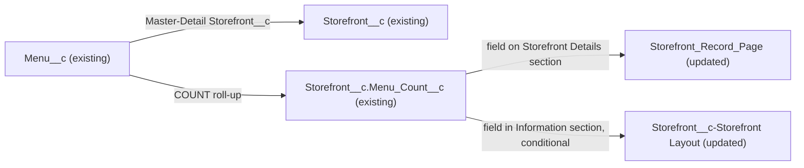

# Implementation spec — Show the menu count on the Storefront record page

> Surface the existing `Storefront__c.Menu_Count__c` roll-up on the Storefront record page so users can see how many menus each storefront has.

_Based on the requirement, the evidence reported by AskCoworker, and read-only org queries where noted. Assumptions and missing evidence are identified below. Specification only — nothing is implemented or deployed._

---

## 1. The requirement

Users want to see, on each storefront, how many menus it has. The field that stores this count already exists (`Storefront__c.Menu_Count__c`), so the only gap is that it is not shown on the Storefront record page or page layout. No field is created. The request contained no out-of-scope instructions.

| # | Responsibility | Trigger | Where it lives |
| --- | --- | --- | --- |
| 1 | Keep a count of the menus that belong to each storefront | Insert, delete, or undelete of a `Menu__c` record | `Storefront__c.Menu_Count__c` (existing roll-up summary) |
| 2 | Show the count to users on the storefront record | Viewing a `Storefront__c` record | `Storefront_Record_Page` (FlexiPage, Dynamic Forms); `Storefront__c-Storefront Layout` if still used |

## 2. Grounding — reuse before building

Target org: `TestWriteSpecDE` (org ID `00Dak00001COqNeEAL`, connected). API version: `67.0` (`sourceApiVersion` in `sfdx-project.json`, _verified by project file_).

- **`Storefront__c.Menu_Count__c`** (CustomField, roll-up summary) — label "Menu Count", `summaryOperation` = `count`, `summaryForeignKey` = `Menu__c.Storefront__c`, `summaryFilterItems` empty (no filter). This already delivers responsibility 1. _verified by org query_
- **`Menu__c.Storefront__c`** (CustomField, Master-Detail to `Storefront__c`) — relationship name `Menus`, `reparentableMasterDetail` = false, so a menu cannot be moved to another storefront. _verified by org query_
- **Data shape** — 21 `Storefront__c` records; `SUM(Menu_Count__c)` = 23; `Menu__c` grouped by `Active__c` returns one group, `true` = 23. The roll-up matches the child count today. _verified by org query_
- **`Storefront_Record_Page`** (FlexiPage, `RecordPage`, the only FlexiPage whose name contains "Storefront") — uses Dynamic Forms (`flexipage:fieldSection` components). Its field sections are "Storefront Details" (`Name`, `Account__c`, `Image_URL__c` | `Type__c`, `Status__c`), a second "Storefront Details" (`Cuisine__c`, `Description__c`), "Contact Details" (`Primary_Contact__c`), "Reviews" (`Total_Reviews__c` | `Average_Review_Score__c`), "Location" (`Address__c`), and System Information. `Menu_Count__c` is not on the page. _verified by org query_
- **`Storefront__c-Storefront Layout`** (Layout, the only layout on the object) — "Information" section holds `Name`, `Address__c`, `Total_Reviews__c`, `Total_Score__c`, `Average_Review_Score__c`, `Image_URL__c`, `OwnerId`; `Menu_Count__c` is not on it. It has the `Menu__c.Storefront__c` related list. _verified by org query_
- **Field access** — `FieldPermissions` rows with Read on `Storefront__c.Menu_Count__c` (complete list): `Agentforce_Reference_App`, `Pronto_Deep_Dive_Workshop`, `sfdc_accelerate_dms`, `sfdc_a360_sfcrm_data_extract`, `sfdc_slack`. No profile has a row. The one active System Administrator user holds `Agentforce_Reference_App` and `Pronto_Deep_Dive_Workshop`. _verified by org query_
- **Automation and readers** — no Apex triggers on `Storefront__c` or `Menu__c`; no flows triggered by either object (`FlowDefinitionView`); no `MetadataComponentDependency` rows for `Menu_Count__c`; no unmanaged Apex class body contains `Menu_Count__c`. _verified by org query_
- AskCoworker also listed Apex classes that read or write `Menu__c` and `Storefront__c` (for example `AgentCreateMenuWithItemsActions`, `MenuBrowserController`). They are not affected by a UI-only change and are not relied on. _reported by AskCoworker_

Candidates examined and rejected: a new count field on `Storefront__c` — `Menu_Count__c` already exists with the needed definition; `Storefront__c.Total_Reviews__c` — counts reviews, not menus; the Tooling `CustomField` search for `%Menu%` found no other menu-count field (only `Lead.Menu_Pricing__c`, `Menu_Item__c.Menu_Category__c`, `Menu_Item__c.Menu__c`, `Menu__c.Menu_Display_Name__c`).

Evidence sources: `sf org display`; `sf sobject list --sobject custom`; `EntityDefinition`; Tooling `CustomField` (by object and by name) and `CustomField.Metadata` by Id; `sobject describe Storefront__c`; aggregate queries on `Storefront__c` and `Menu__c`; `FieldPermissions`, `ObjectPermissions`, `PermissionSetAssignment`; Tooling `FlexiPage` and `Layout` with `Metadata`; Tooling `ApexTrigger`, `ApexClass` bodies, `MetadataComponentDependency`; `FlowDefinitionView`. AskCoworker returned no citedReferences.

## 3. Architecture

Why the pieces are drawn this way:

1. `Menu__c` is the detail of `Storefront__c`, and `Menu_Count__c` is a COUNT roll-up over that relationship with no filter. _verified by org query_ The platform keeps it current on child insert, delete, and undelete. _assumption (documented platform behavior)_
2. `Storefront_Record_Page` uses Dynamic Forms, so field placement on the Lightning record page is controlled by the FlexiPage, not the layout. The field is added there. _verified by org query_ for the Dynamic Forms sections.
3. The layout is updated only if it is still used (for example, by a profile or app that does not get the FlexiPage). Page layout and record page assignments cannot be read with the allowed commands.
4. No automation or code is needed: the standard roll-up already computes the value.

## 4. Metadata changes

**UX**

- **Update `Storefront_Record_Page`** — FlexiPage. In the first "Storefront Details" field section (facet `Facet-080faff7-bcb6-4b52-a3f6-c241ae642ad8`, the right column holding `Record.Type__c` and `Record.Status__c`), add a `fieldInstance` with `fieldItem` `Record.Menu_Count__c` after `Record.Status__c`, with `uiBehavior` `readonly` and no visibility rule. No other change to the page.
- **Update `Storefront__c-Storefront Layout`** — Layout. Conditional: only if the layout is still assigned to profiles or used where `Storefront_Record_Page` is not the active record page. Add `Menu_Count__c` as a `Readonly` item in the "Information" section, next to `Total_Reviews__c`. Retrieve the layout before editing.

## 5. Data 360 (Data Cloud) data involved

Not applicable — this change does not use Data 360. `sfdc_a360_sfcrm_data_extract` already has Read on `Menu_Count__c` (_verified by org query_); a page placement does not change what the connector can read.

## 6. Security considerations

- No permission set, profile, or field-level security changes. The field is already readable through `Agentforce_Reference_App`, `Pronto_Deep_Dive_Workshop`, `sfdc_accelerate_dms`, `sfdc_a360_sfcrm_data_extract`, and `sfdc_slack`. _verified by org query_
- Record pages render fields through Lightning Data Service in the viewing user's context, so users without Read on `Menu_Count__c` do not see it even after placement. View All Data and Modify All Data do not override field-level security. _assumption (documented platform behavior)_
- The only active System Administrator user gets Read through `Agentforce_Reference_App`; the System Administrator profile itself has no `FieldPermissions` row on `Storefront__c` fields. _verified by org query_
- Roll-up summary fields are read-only; no Edit access applies. _assumption (documented platform behavior)_
- Data exposure: the value (a count of menus) was already readable through the API by the same users; placement adds no new audience.

## 7. Testing strategy

No test components are in the inventory. Both changes are declarative UI placement, so they get manual checks in a sandbox:

1. As a user with `Agentforce_Reference_App`, open a `Storefront__c` record. `Menu Count` shows in the first "Storefront Details" section under `Status`, read-only, with the number of that storefront's menus.
2. Create a `Menu__c` record for that storefront and reload; the count rises by 1. Delete it; the count falls by 1. Undelete it from the Recycle Bin; the count rises by 1.
3. Open a storefront with no menus; the field shows `0`.
4. Bulk (recommended verification): insert 200 `Menu__c` records for one storefront through Data Loader or anonymous Apex; the count rises by 200.
5. Permission negative: as a user who has Read on `Storefront__c` but none of the five permission sets above, open a storefront; the field does not appear.
6. If row 2 is deployed, open a storefront in a context that uses `Storefront__c-Storefront Layout`; the field shows in the "Information" section.
7. Run `SELECT SUM(Menu_Count__c) FROM Storefront__c` and compare with `SELECT COUNT() FROM Menu__c`; they match.

## 8. Open decisions

### Open

1. **`Storefront__c-Storefront Layout` still in use (non-blocking).** The Conditional update of `Storefront__c-Storefront Layout` applies only if the layout is still assigned and shown anywhere that `Storefront_Record_Page` is not the active record page. Page layout assignments and FlexiPage activation cannot be read with the allowed commands. Recommended default: check Setup > Object Manager > Storefront > Page Layouts > Page Layout Assignment and Lightning Record Pages activation; deploy the layout change if the layout is assigned, since it already carries the other roll-ups (`Total_Reviews__c`, `Total_Score__c`).
2. **Check reports and list views (non-blocking).** Reports and list views cannot be read; no change is made to them. If users want the count in list views, that is a separate request.

### Resolved

- **All menus, not only active ones** — _assumption_. The requirement says "how many menus they have", which matches the existing unfiltered COUNT. `Menu__c.Active__c` exists, and all 23 menus are active today (_verified by org query_), so an active-only count would give the same values now. A filtered roll-up was not added; it is a separate request if needed later.
- **Reuse `Menu_Count__c` instead of creating a field** — _assumption_ (design rule: reuse first). The field already has the exact definition the requirement describes (_verified by org query_).
- **Placement** — _assumption_. The first "Storefront Details" section, right column after `Status__c`, because it describes the storefront itself; the "Reviews" section is limited to review metrics.
- **FlexiPage structure** — AskCoworker said the FlexiPage XML was not retrieved and made its structure a blocking open decision. The Tooling `FlexiPage.Metadata` query read the full region and facet structure, so this is settled. _verified by org query_
- **AskCoworker platform claims corrected** — (1) It said System Administrators bypass FLS through View All Data; documented behavior is that View All Data does not override field-level security. _assumption (documented platform behavior)_ (2) It described reparenting menus between storefronts; `reparentableMasterDetail` is false, so reparenting is not possible. _verified by org query_ After these two wrong claims, every AskCoworker fact kept in this spec was verified by org query.
- **Dropped AskCoworker proposals** — a compact layout change and a mobile-specific open decision; neither is needed to show the field on the record.

## 9. Change set

| # | Action | Type | API name | Module | Why |
| --- | --- | --- | --- | --- | --- |
| 1 | Update | FlexiPage | `Storefront_Record_Page` | force-app/main/default/flexipages | Show the existing `Menu_Count__c` roll-up on the Dynamic Forms record page |
| 2 | Update | Layout | `Storefront__c-Storefront Layout` | force-app/main/default/layouts | Conditional: show `Menu_Count__c` where the page layout is still used |

The existing COUNT roll-up `Storefront__c.Menu_Count__c` is placed on the Storefront record page, and on the page layout if that layout is still used.

Total: 2 · Create: 0 · Update: 2 · Delete: 0
