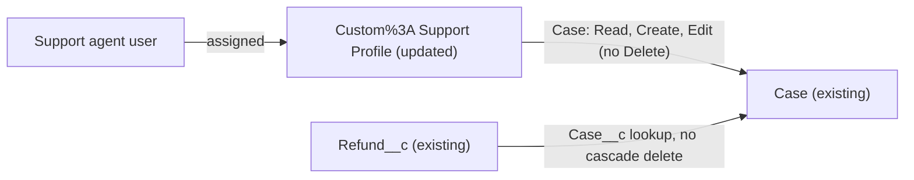

# Implementation spec — Support agents cannot delete Cases or Refunds

> Remove the only support-agent Delete grant on `Case` and confirm that no support-agent profile or permission set can delete `Case` or `Refund__c`.

_Based on the requirement, the evidence reported by AskCoworker, and read-only org queries where noted. Assumptions and missing evidence are identified below. Specification only — nothing is implemented or deployed._

---

## 1. The requirement

Support agents must not be able to delete `Case` or `Refund__c` records. The user clarified the scope as "Remove Delete on Case and Refund from agent profiles/perm sets", so the design is a permission removal only, with no before-delete guard (*user decision*). The request contained no deploy, data-change, or credential instruction.

| # | Responsibility | Trigger | Where it lives |
| --- | --- | --- | --- |
| 1 | Support agents cannot delete `Case` records (UI, list view, merge, API) | Any delete attempt by a user on the support-agent profile | `Custom%3A Support Profile` object permissions on `Case` |
| 2 | Support agents cannot delete `Refund__c` records | Any delete attempt by a user on the support-agent profile | Already met: `Custom%3A Support Profile` has no `Refund__c` object permissions |
| 3 | No support-agent permission set grants Delete on `Case` or `Refund__c` | Not specified | Already met: no such permission set exists |

## 2. Grounding — reuse before building

Target org: `TestWriteSpecDE` (Developer Edition, `00Dak00001COqNeEAL`, not a sandbox). API version: `67.0`.

- **`Custom%3A Support Profile`** (Profile, label `Custom: Support Profile`, Salesforce license, `IsCustom = true`, no namespace) — the only internal profile named for support. Its `Case` object permissions are Read, Create, Edit, and Delete = `true`, Modify All = `false`. It has no `ObjectPermissions` row for `Refund__c`, so it has no access to `Refund__c`. It has `PermissionsModifyAllData = false` and `PermissionsViewAllData = false`. It currently has 0 users (active or inactive). _verified by org query_
- **Delete grants on `Case` and `Refund__c` (complete list).** The only parents with `PermissionsDelete = true` or `PermissionsModifyAllRecords = true` on either object are: `System Administrator` profile (both objects), `Agentforce_Reference_App` (both), `Pronto_Deep_Dive_Workshop` (both), `sfdc_accelerate_dms` (both; namespace `sfdcInternalInt`, type `Session`), and `Custom%3A Support Profile` (`Case` only). _verified by org query_
- **Assignments of those permission sets.** `Agentforce_Reference_App` and `Pronto_Deep_Dive_Workshop` are assigned only to the System Administrator user `epic.2b9dd11f2b2a@orgfarm.salesforce.com`. `sfdc_accelerate_dms` is assigned only to the cloud integration user `cloud@00dak00001coqneeal`. None is a support agent. _verified by org query_
- **Other support-named profiles.** `Customer Support Profile`, `Merchant Support Profile`, and `ESW_Merchant_Service_Agent_1737676393072 Profile` are Guest User License profiles; `Einstein Agent User` is the Agentforce service agent profile. None has any `ObjectPermissions` row on `Case` or `Refund__c`. _verified by org query_
- **Support roles.** `Customer Support, North America`, `Customer Support, International`, and `SVP, Customer Service & Support` exist; no user has any role. _verified by org query_
- **`Refund__c.Case__c`** (Lookup to `Case`, `cascadeDelete = false`). Deleting a `Case` does not delete its refunds. _verified by org query_
- **Automation.** No Apex triggers and no record-triggered flows on `Case` or `Refund__c`. None of the 70 unmanaged Apex classes contains a delete statement on `Case` or `Refund__c`. The two flows that reference `Refund__c` (`Issue_Refund`, `Apply_Remediation`) only create `Refund__c` records and have no record deletes. _verified by org query_

Candidates examined and rejected: `Agentforce_Reference_App`, `Pronto_Deep_Dive_Workshop` — assigned only to the System Administrator, not to support agents; `sfdc_accelerate_dms` — namespaced platform integration permission set, not editable and not a support agent; the guest support profiles and `Einstein Agent User` — no `Case` or `Refund__c` access to remove; `AgentforceServiceAgentSecureBase`, `Agentforce_Actions` — no Delete row on `Case` or `Refund__c`; a before-delete trigger or flow — declined by the user.

Evidence sources: `sf org display`; `sf sobject list`; `sf sobject describe Refund__c`; `ObjectPermissions` (all parents with Delete or Modify All on `Case`/`Refund__c`, and all rows for the support-named profiles); `PermissionSet` system permissions; `PermissionSetAssignment`; `Profile`, `UserRole`, `User` counts; Tooling `ApexTrigger`, `CustomField`, `MetadataComponentDependency`, `ApexClass` bodies, `Flow.Metadata`; `FlowDefinitionView`. AskCoworker returned no citedReferences.

## 3. Architecture

Why the pieces are drawn this way:

1. Support agents are users on `Custom%3A Support Profile`; it is the only internal support profile, and no role or support permission set exists with users (*verified by org query*; the mapping of "support agents" to this profile is an *assumption*, see Section 8).
2. The profile keeps Read, Create, and Edit on `Case` and loses Delete (*user decision*).
3. The profile has no edge to `Refund__c` because it has no `Refund__c` access today (*verified by org query*).
4. The object permission is the standard platform mechanism for this rule; no flow or Apex is needed (*user decision*, design rule "standard mechanism first").

## 4. Metadata changes

**Security**

- **Update `Custom%3A Support Profile`** — Profile. In the `objectPermissions` entry for `Case`, set `allowDelete` to `false`. Keep `allowRead`, `allowCreate`, and `allowEdit` as `true`, and `modifyAllRecords` and `viewAllRecords` as `false`. Do not add a `Refund__c` entry. Retrieve the profile with `CustomObject:Case` in the manifest before editing, so the deploy carries only the `Case` object permission. File: `force-app/main/default/profiles/Custom%3A Support Profile.profile-meta.xml`.

## 5. Data 360 (Data Cloud) data involved

Not applicable — this change does not use Data 360.

## 6. Security considerations

- **CRUD.** After the change, `Custom%3A Support Profile` has `Case` Read, Create, and Edit, and no Delete. It still has no access to `Refund__c`. No field-level security changes. _user decision / verified by org query (current state)_
- **Enforcement scope (documented platform behavior).** Object Delete permission is enforced for the user's own actions in the UI (record Delete, list view mass delete), in Case merge (merge deletes the losing records and requires Delete), and in the REST, SOAP, and Bulk APIs. Apex and flows that run in system context do not check object permissions, so they could delete records for these users. Apex `with sharing` enforces record sharing, not CRUD. No such code exists today (*verified by org query*). _assumption (documented platform behavior)_
- **Permission sets.** No permission set is created or changed. A future permission set that grants Delete on `Case` or `Refund__c` and is assigned to a support agent would re-open the gap, because permissions are additive. _assumption (documented platform behavior)_
- **Other holders of Delete.** The System Administrator profile, `Agentforce_Reference_App`, `Pronto_Deep_Dive_Workshop`, and `sfdc_accelerate_dms` keep Delete. None is held by a support agent. _verified by org query_
- **Data exposure.** The change removes access and grants nothing.

## 7. Testing strategy

No test component is in the inventory: the change is a declarative profile permission, so it gets manual checks, not Apex tests.

Recommended verification (manual, in a sandbox):

1. **Post-deploy permission check.** Query `SELECT PermissionsRead, PermissionsCreate, PermissionsEdit, PermissionsDelete FROM ObjectPermissions WHERE SobjectType = 'Case' AND Parent.Profile.Name = 'Custom: Support Profile'`. Expect one row with Delete = `false` and Read, Create, Edit = `true`.
2. **No support-agent Delete grant remains.** Re-run `SELECT SobjectType, Parent.Name, Parent.Profile.Name FROM ObjectPermissions WHERE SobjectType IN ('Case','Refund__c') AND (PermissionsDelete = true OR PermissionsModifyAllRecords = true)`. Expect only `System Administrator`, `Agentforce_Reference_App`, `Pronto_Deep_Dive_Workshop`, and `sfdc_accelerate_dms`.
3. **Negative UI case.** As a test user on `Custom%3A Support Profile`, open a `Case`: the Delete action is absent. In a `Case` list view, mass delete is unavailable. Case merge is unavailable.
4. **Negative API case.** As that user, send a REST `DELETE` for a `Case` Id: the call fails with an insufficient-access error and the record remains.
5. **Refund case.** As that user, try to open or delete a `Refund__c` record: there is no access.
6. **Positive case.** As the System Administrator, delete and undelete a test `Case`: it succeeds (the change does not affect administrators).
7. **Load-bearing assumption check.** Before deploy, confirm with the service lead which profile support agents use (Section 8, item 1).

## 8. Open decisions

### Open

1. **Which profile support agents use (non-blocking, load-bearing).** `Custom%3A Support Profile` is the only internal support profile and has 0 users; no user holds a support role. The design assumes future support agents are provisioned on this profile. If they are provisioned on another profile or through a permission set with `Case` Delete, remove Delete there too. Recommended default: provision support agents only on `Custom%3A Support Profile`. Verification: Section 7, step 7.
2. **"Ever" relies on permission governance (non-blocking).** The user chose permission removal only. An administrator can re-enable Delete, and system-context automation can delete records. Recommended default: keep as is; treat any future Delete grant to support agents as a change needing review. A before-delete record-triggered flow or trigger remains an alternative if hard enforcement is wanted later.
3. **Case merge (non-blocking).** Removing Delete also removes Case merge for support agents (documented platform behavior). This follows from the requirement; if agents need to merge duplicates, an administrator performs merges.

### Resolved

- **User decision:** asked "Which users are 'support agents', and should 'Ever' be met by removing Delete from their profiles and permission sets, or also by a before-delete guard that blocks deletes even if Delete is granted later?" The user answered "Remove Delete on Case and Refund from agent profiles/perm sets." Recorded as: permission removal only, on the support-agent profiles and permission sets.
- **Mapping "support agents" to `Custom%3A Support Profile`** (*assumption*): the answer named "agent profiles/perm sets" without choosing among the candidates; the evidence favors the only internal support profile. The guest support profiles and `Einstein Agent User` have no `Case` or `Refund__c` permissions to remove (*verified by org query*).
- **`Refund__c` is already met** (*verified by org query*): no support-agent profile or permission set has any `Refund__c` permission, so no `Refund__c` row is added.
- **AskCoworker corrections.** AskCoworker reported that `Custom: Support Profile` has `PermissionsDelete = false` on `Case`; the org query shows `true`. AskCoworker reported Case Delete on `ActorCASCPermSet` and the `C2C*` permission sets; the complete Delete-grant query returns no rows for them. AskCoworker said other support profiles were not queried; they were, with no rows. AskCoworker also claimed `with sharing` Apex enforces object Delete and that undelete does not need Delete; both contradict documented platform behavior and were dropped. After two wrong claims, every AskCoworker fact kept in this spec was re-verified by org query.
- **Dropped AskCoworker proposals:** a before-delete Apex trigger (declined by the user) and removing Delete from `Agentforce_Reference_App`, `Pronto_Deep_Dive_Workshop`, or `sfdc_accelerate_dms` (not held by support agents; the last is namespaced).
- **Deployment and rollback.** Retrieve `Custom%3A Support Profile` with `CustomObject:Case` into source control first (backup). Deploy the single profile change. Rollback: redeploy the retrieved version with `allowDelete` = `true`. No data step is needed.

## 9. Change set

| # | Action | Type | API name | Module | Why |
| --- | --- | --- | --- | --- | --- |
| 1 | Update | Profile | `Custom%3A Support Profile` | force-app/main/default/profiles | Remove the only support-agent Delete grant on `Case` |

One profile object-permission change removes support agents' Delete on `Case`; `Refund__c` is already not deletable by them.

Total: 1 · Create: 0 · Update: 1 · Delete: 0
