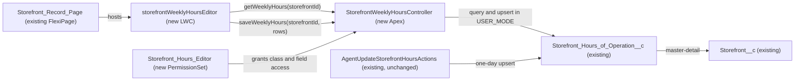

# Implementation spec — Storefront weekly hours editor

> Give merchants one grid on the Storefront record page where they edit the opening and closing times for Monday to Sunday and save all seven days in one action.

_Based on the requirement, the evidence reported by AskCoworker, and read-only org queries where noted. Assumptions and missing evidence are identified below. Specification only — nothing is implemented or deployed._

---

## 1. The requirement

Merchants want a weekly-hours editor: a Monday-to-Sunday grid of open and close times that they edit and save in one go. The user decided that the editor is a Lightning Web Component on the Storefront record page, backed by `Storefront_Hours_of_Operation__c` records, that creates any missing day and saves all rows at once (*user decision*). The request contained no deploy, data-change, or credential instruction.

| # | Responsibility | Trigger | Where it lives |
| --- | --- | --- | --- |
| 1 | Show one row per day (Monday to Sunday, fixed order) with the current `Opening_Time__c` and `Closing_Time__c` of the storefront | Storefront record page load | `storefrontWeeklyHoursEditor` on `Storefront_Record_Page`, reading through `StorefrontWeeklyHoursController` |
| 2 | Let the merchant edit the open and close time of any day in the grid | Inline edit in the grid | `storefrontWeeklyHoursEditor` |
| 3 | Save all seven days in one all-or-nothing transaction, creating the rows for days that have no record | Save button | `StorefrontWeeklyHoursController.saveWeeklyHours` |
| 4 | Reject the whole save when a time is not in the stored `hh:mm AM/PM` format or a day has two records | Save button | `StorefrontWeeklyHoursController.saveWeeklyHours` |
| 5 | Give merchant users access to the editor and the fields it edits | Permission set assignment | `Storefront_Hours_Editor` |

## 2. Grounding — reuse before building

Target org: `TestWriteSpecDE` (Developer Edition, `00Dak00001COqNeEAL`, not a sandbox). API version: `67.0`.

- **`Storefront_Hours_of_Operation__c`** (CustomObject) — one record per storefront and day; label "Storefront Hours of Operation"; description "tracks the detailed operating schedule for each storefront". Sharing is `ControlledByParent` (internal and external). _verified by org query_
- **`Storefront_Hours_of_Operation__c.Storefront__c`** (CustomField, master-detail to `Storefront__c`, `cascadeDelete` true; child relationship name on the parent is `Storefronts__r`). _verified by org query_
- **`Storefront_Hours_of_Operation__c.Day_of_Week__c`** (CustomField, picklist, not restricted) — values `Monday`, `Tuesday`, `Wednesday`, `Thursday`, `Friday`, `Saturday`, `Sunday`. _verified by org query_
- **`Storefront_Hours_of_Operation__c.Opening_Time__c`** and **`Storefront_Hours_of_Operation__c.Closing_Time__c`** (CustomField, Text(255), nillable). _verified by org query_
- **`Storefront_Hours_of_Operation__c.Notes__c`** (CustomField, Text Area(255)) — not part of the grid. `Name` is an auto-number. _verified by org query_
- **Data shape:** 21 `Storefront__c` records and 147 hours records; each of the 7 days has 21 records, and the top storefronts by count each have exactly 7. All stored times use the 12-hour form, for example `08:00 AM`/`10:00 PM` (70 rows), `09:00 AM`/`11:00 PM` (17 rows), and one variant without a leading zero, `5:00 PM`/`10:00 PM` (21 rows). _verified by org query_
- **No automation on the hours object:** no Apex triggers on `Storefront_Hours_of_Operation__c` or `Storefront__c`, no record-triggered flows on either object (`FlowDefinitionView`), and no validation rules on `Storefront_Hours_of_Operation__c`. _verified by org query_
- **Readers and writers of the hours object (complete for unmanaged Apex, dependencies, and flows):** `MetadataComponentDependency` on the object and its four fields lists only `AgentUpdateStorefrontHoursActions` (ApexClass) and `Storefront_Record_Page` (FlexiPage); a search of all 70 unmanaged Apex class bodies for `Storefront_Hours` finds only `AgentUpdateStorefrontHoursActions`. _verified by org query_
- **`AgentUpdateStorefrontHoursActions`** (ApexClass, `with sharing`, invocable "Update Storefront Hours") — upserts one day per call (`requests[0]` only), requires `accountId` and checks it against `Storefront__c.Account__c`, and returns errors as `success = false` instead of throwing. Its input descriptions say "HH:MM format (24-hour)", which contradicts the stored data. It is the target of five agent actions (`Update_Storefront_Hours`, `Update_Storefront_Hours_179Kj000000LakZ`, `Update_Storefront_Hours_179Kj000000t8j4`, `Update_Storefront_Hours_179Kj000000t8jE`, `Update_Storefront_Hours_179Kj000000t8rR`), each linked to a `Storefront_Management` topic. _verified by org query_
- **`Storefront_Record_Page`** (FlexiPage, RecordPage for `Storefront__c`) — already references the hours fields (a dependency on `Storefront__c`, `Day_of_Week__c`, `Opening_Time__c`, `Closing_Time__c`). Its activation and body cannot be read with the allowed commands. _verified by org query_
- **Access today:** object Read, Create, Edit, Delete on `Storefront_Hours_of_Operation__c` is granted by the System Administrator profile, `Agentforce_Reference_App` (unmanaged, Regular), and `sfdc_accelerate_dms` (namespace `sfdcInternalInt`, Cloud Integration User license); Read only by `sfdc_a360_sfcrm_data_extract`, `sfdc_slack`, and the Analytics Cloud Integration User profile. `Agentforce_Reference_App` and `sfdc_accelerate_dms` already have Read and Edit on all four business fields. _verified by org query_
- **`Storefront__c` sharing:** internal `ReadWrite`, external `Private`. _verified by org query_
- **Active users by license:** Salesforce 1, Einstein Agent 1, Analytics Cloud Integration User 2, Chatter Free 1, Guest User License 3. _verified by org query_

Candidates examined and rejected:
- `AgentUpdateStorefrontHoursActions` as the save backend — it handles one day per call, requires an `accountId` that a record page does not supply, and reports failures as `success = false`; seven calls could not be one all-or-nothing save. Changing it to a bulk contract would change the behavior of five agent actions. _verified by org query_
- `storefrontSelector` (LWC), `StorefrontPickerController`, `StorefrontPickerAction` — they pick a storefront for an agent conversation; they do not read or write hours. _verified by org query_
- `Merchant_Management_Agent_Access`, `Merchant_Account_Manager_Agent_Access`, `Merchant_Support_Agent_Permissions` (PermissionSet) — named for agent access; widening them for a record-page editor is not reused (design rule: prefer a new dedicated permission set). _verified by org query_ (their contents were not read)
- `Agentforce_Reference_App` (PermissionSet) — already grants the needed object and field access, so no change is needed; it is a broad app permission set and is not widened with the new class. _verified by org query_
- Standard platform concepts (`OperatingHours` fields) appear only on Data 360 data model object fields (`TableEnumOrId` starting `9sd`); no other custom field in the org represents store hours. _verified by org query_

Evidence sources: `sf org display`; `sf sobject list --sobject custom`; `sobject describe` of `Storefront_Hours_of_Operation__c` and `Storefront__c`; Tooling `EntityDefinition`, `CustomField` (both objects and an org-wide name search), `ApexTrigger`, `ValidationRule`, `ApexClass` (names and bodies), `LightningComponentBundle`, `AuraDefinitionBundle`, `FlexiPage`, `MetadataComponentDependency`, `GenAiFunctionDefinition`, `GenAiPluginFunctionDef`, `GenAiPluginDefinition`; standard `FlowDefinitionView`, `ObjectPermissions`, `FieldPermissions`, `PermissionSet`, `User`, `Network`, `BotDefinition`, `DataStream`, `Organization`, and aggregate queries on the hours records. AskCoworker returned no citedReferences.

## 3. Architecture

Why the pieces are drawn this way:

1. `Storefront_Record_Page` is the existing record page for `Storefront__c` (*verified by org query*); the user chose this placement (*user decision*).
2. `storefrontWeeklyHoursEditor` is new because no LWC or Aura bundle in the org edits hours (*verified by org query*). It uses the standard `lightning-datatable` base component with inline editing, so no custom table markup is needed (*assumption*).
3. Apex is used instead of a flow or Lightning Data Service because the requirement needs one all-or-nothing save of up to seven records, some new and some existing. Lightning Data Service `createRecord` and `updateRecord` save one record per call and cannot roll back the others when one fails, and a screen flow has no native editable grid (*assumption (documented platform behavior)*).
4. The controller does not call `AgentUpdateStorefrontHoursActions`, for the reasons in Section 2; the agent action keeps working unchanged against the same records (*verified by org query*).
5. No trigger, flow, validation rule, or roll-up fires on hours DML, so the save has no downstream automation (*verified by org query*).

## 4. Metadata changes

**Backend**

- **Create `StorefrontWeeklyHoursController`** — ApexClass, `public with sharing`. `@AuraEnabled(cacheable=true) getWeeklyHours(Id storefrontId)` queries `Id, Day_of_Week__c, Opening_Time__c, Closing_Time__c` from `Storefront_Hours_of_Operation__c WHERE Storefront__c = :storefrontId` `WITH USER_MODE` and returns seven DTOs in fixed order Monday to Sunday; a day with no record returns a DTO with a null `Id` and blank times. `@AuraEnabled saveWeeklyHours(Id storefrontId, List<DayHours> rows)`: (1) requires a non-null `storefrontId` and exactly one row per `Day_of_Week__c` value, each value one of the seven picklist values; (2) trims and uppercases each non-blank time and requires it to match `^(0?[1-9]|1[0-2]):[0-5][0-9] (AM|PM)$` (the stored 12-hour form, including the existing `5:00 PM` variant); blank stays blank; (3) re-queries the existing records for the storefront and throws an `AuraHandledException` naming the day if a day has more than one record (fail loud instead of picking one); (4) builds one list — existing records matched by day get the new `Opening_Time__c` and `Closing_Time__c`, missing days become new records with `Storefront__c` and `Day_of_Week__c` set — and performs a single `Database.upsert(list, true, AccessLevel.USER_MODE)` so the save is all-or-nothing; (5) any validation or DML failure is rethrown as an `AuraHandledException` with the per-row message. `Notes__c` is never read or written. The client-supplied row `Id` is ignored; matching is always by the server-side query for `storefrontId`.
- **Create `StorefrontWeeklyHoursControllerTest`** — ApexClass, `@isTest`. Cases listed in Section 7. Test data: one `Storefront__c` with seven hours rows, one with three, one with none.

**UI**

- **Create `storefrontWeeklyHoursEditor`** — LightningComponentBundle. `js-meta.xml`: `isExposed` true, target `lightning__RecordPage` restricted to object `Storefront__c`, label "Weekly Hours". Wires `getWeeklyHours` with `recordId`; renders a `lightning-datatable` with columns Day (read-only), Opening Time, and Closing Time (editable text); the datatable's Save sends all seven rows (edited values merged over the loaded values) to `saveWeeklyHours` in one call; on success shows a success toast and calls `refreshApex`; on error shows the server message and keeps the draft values. Includes Jest tests in `__tests__` (Section 7).
- **Update `Storefront_Record_Page`** — FlexiPage. Conditional: `Storefront_Record_Page` is the record page activated for the merchant users (activation cannot be read). Add a `storefrontWeeklyHoursEditor` component instance to the main region. Keep the existing hours references (for example a related list) in place; this page is shared, so the new component appears for every user of the page. Retrieve the page before editing.

**Security**

- **Create `Storefront_Hours_Editor`** — PermissionSet, label "Storefront Hours Editor", no license. Apex class access: `StorefrontWeeklyHoursController`. Object access: `Storefront_Hours_of_Operation__c` Read, Create, Edit (no Delete); `Storefront__c` Read. Field access: `Storefront_Hours_of_Operation__c.Day_of_Week__c`, `Storefront_Hours_of_Operation__c.Opening_Time__c`, `Storefront_Hours_of_Operation__c.Closing_Time__c` Read and Edit. The master-detail field `Storefront_Hours_of_Operation__c.Storefront__c` is not listed because master-detail fields have no field-level security. No existing permission set or profile is changed.

## 5. Data 360 (Data Cloud) data involved

Not applicable — this change does not use Data 360. The org has no data streams (`SELECT COUNT() FROM DataStream` returned 0, *verified by org query*). The Data 360 connector permission set `sfdc_a360_sfcrm_data_extract` has Read on the hours object (*verified by org query*), and nothing in this change alters it.

## 6. Security considerations

- **Execution context and sharing:** the controller is `with sharing`, and every query and DML runs in `USER_MODE`, so object permissions, field-level security, and sharing are enforced for the running user (*assumption (documented platform behavior)*). Hours records are `ControlledByParent`, so access follows the user's access to the parent `Storefront__c`; the master-detail field's sharing setting decides whether Read or Read/Write on the parent is needed to create or edit the child (the setting cannot be read; *assumption (documented platform behavior)*). `Storefront__c` internal sharing is `ReadWrite`, so every internal user who holds the permission set can edit the hours of every storefront (*verified by org query*).
- **Caller-supplied `storefrontId`:** a user can call the `@AuraEnabled` method with any Id. Sharing in user mode limits the query and upsert to storefronts the user can access; with internal `ReadWrite` that is all storefronts. This matches the access the same user already has through the standard UI, so the editor adds no new exposure (*assumption*). The client-supplied record `Id` is ignored, so a user cannot redirect an update to a record of another storefront.
- **CRUD/FLS:** granted only through the new `Storefront_Hours_Editor` permission set (Section 4). The System Administrator profile already has full access to the object (*verified by org query*) and access to the new class. Deploying a new permission set gives no profile any default access.
- **Who gets the permission set:** the org has one active user with a Salesforce license; the users who are "merchants" are not identified. Assigning `Storefront_Hours_Editor` to them is a setup step, blocking for delivery (Section 8).
- **Data exposure:** the grid shows only day and times; `Notes__c` is not exposed. No PII is involved (*assumption*).
- **Other writers:** `AgentUpdateStorefrontHoursActions` (through five agent actions) and the integration permission set `sfdc_accelerate_dms` can also write hours; saves are last-write-wins, with no locking (*assumption (documented platform behavior)*).

## 7. Testing strategy

**`StorefrontWeeklyHoursControllerTest` (Apex)**

| Behavior | Test |
| --- | --- |
| Read returns seven rows in Monday-to-Sunday order, with blanks for missing days | `getWeeklyHours_returnsSevenOrderedRows` (storefront with three rows) |
| Save updates all seven existing rows | `saveWeeklyHours_updatesExistingDays` |
| Save creates the missing days and updates the rest in one call | `saveWeeklyHours_createsMissingDays` (three existing, four created; assert seven rows, each day once) |
| Save on a storefront with no rows creates seven | `saveWeeklyHours_createsAllDays` |
| Accepted formats | `saveWeeklyHours_acceptsStoredFormats` (`08:00 AM`, `5:00 PM`, `12:00 AM`, lowercase `09:30 pm` stored as `09:30 PM`, blank) |
| Invalid time rejects the whole save | `saveWeeklyHours_rejectsInvalidTime` (`13:00 PM`, `9am`, `21:00`; assert `AuraHandledException` and no record changed or created) |
| Missing, duplicate, or unknown day in the input is rejected | `saveWeeklyHours_rejectsBadDaySet` |
| Two existing records for one day fail loud | `saveWeeklyHours_failsOnDuplicateStoredDay` |
| `Notes__c` is not changed | assert in `saveWeeklyHours_updatesExistingDays` |
| Client-supplied Id is ignored | `saveWeeklyHours_ignoresForeignRecordId` (row Id from another storefront; assert that record is unchanged) |
| Permission: user without the permission set | `saveWeeklyHours_withoutPermission_throws` (`System.runAs` a Standard User with no grant; assert exception) |
| Permission: user with the permission set | `saveWeeklyHours_withPermissionSet_succeeds` (`System.runAs` a Standard User assigned `Storefront_Hours_Editor`) |

A save is at most seven records, so there is no bulk path beyond seven rows; `createsAllDays` is the largest case.

**`storefrontWeeklyHoursEditor` (Jest)** — renders seven rows in fixed order from mocked `getWeeklyHours` data; Save calls `saveWeeklyHours` once with all seven rows merged with the draft values; success shows a toast and refreshes; a rejected promise shows the error and keeps the draft values.

**Recommended verification (manual, in a sandbox)**

1. Confirm `Storefront_Record_Page` is the page activated for the merchant users' app and profile (load-bearing for the `Storefront_Record_Page` row).
2. As a user with only `Storefront_Hours_Editor`, open a storefront, edit several days, save, and reload; all changes persist.
3. Enter `9am` in one row and save; nothing is changed.
4. Check that an agent conversation that updates hours through `Update_Storefront_Hours` still works, and that the grid shows the value it wrote.

No test has been run.

## 8. Open decisions

### Open

1. **Merchant users to assign (blocking for delivery).** The org shows one active Salesforce-licensed user and no identified merchant users. Assign `Storefront_Hours_Editor` in Setup (Permission Sets > Storefront Hours Editor > Manage Assignments) to the users who edit hours. Without it, non-admin users cannot use the editor.
2. **`Storefront_Record_Page` activation (non-blocking; load-bearing).** The `Storefront_Record_Page` row is `Conditional:` on this page being the one activated for merchant users; activation cannot be read. Retrieve the page before editing. If another page is active, place the component there instead.
3. **Closed days (non-blocking).** No field marks a day as closed; the requirement lists only open and close times, so blank times are allowed and a "closed" flag is not added. Proposal: a separate `Is_Closed__c` checkbox if the business needs it.
4. **Overnight hours (non-blocking).** The controller validates the format only; it does not require the close time to be after the open time, so hours past midnight can be saved. No data shows such a case.

**Deployment sequence:** `StorefrontWeeklyHoursController` and `StorefrontWeeklyHoursControllerTest`, then `storefrontWeeklyHoursEditor`, then `Storefront_Hours_Editor`, then the `Storefront_Record_Page` update; then the permission set assignment (Open item 1).

### Resolved

- **Placement and behavior (user decision):** asked which surface the merchants use (Storefront record page, the Merchant Support agent, or the Merchant Support Experience site). Answer: an LWC on the Storefront page, a seven-row editable grid backed by `Storefront_Hours_of_Operation__c`, creating missing days and saving all at once.
- **Time format (assumption):** all 147 stored values use `hh:mm AM/PM` (*verified by org query*), while the `AgentUpdateStorefrontHoursActions` input descriptions say 24-hour `HH:MM`. The editor keeps the stored 12-hour format. Correcting the agent action's descriptions is a proposal outside this change.
- **Apex instead of Lightning Data Service or a flow (assumption):** needed for a single all-or-nothing save of up to seven mixed insert and update rows (Section 3).
- **No reuse of `AgentUpdateStorefrontHoursActions` (assumption):** its single-day, `accountId`-based, soft-error contract cannot give one atomic save, and changing it would change five agent actions. The day-matching logic is now in two classes; proposal: later have the agent action call the new controller's upsert logic, as a separate change.
- **Names (assumption):** `StorefrontWeeklyHoursController`, `StorefrontWeeklyHoursControllerTest`, `storefrontWeeklyHoursEditor`, `Storefront_Hours_Editor`; none exists in the org (*verified by org query*).
- **Grid columns (assumption):** Day, Opening Time, Closing Time only; `Notes__c` was proposed by AskCoworker and dropped because the requirement lists only open and close times.
- **Duplicate day records (assumption):** each storefront has seven records today, but no rule makes the day unique, so the controller fails loud instead of choosing one.
- **AskCoworker corrections:** its proposed Update of `Agentforce_Reference_App` to add field access was dropped, because the permission set already has Read and Edit on all four fields (*verified by org query*). Its claim that Data Cloud ingests the hours object is contradicted by zero data streams (*verified by org query*). Its field-access table gave the master-detail field `Storefront__c` a Read grant; master-detail fields have no field-level security (*assumption (documented platform behavior)*). D2 listed `Agentforce_Reference_App` as Read, Create, Edit; it also has Delete (*verified by org query*). Its separate "class access" and "LWC targets" rows are folded into the permission set and LWC rows. Its concurrency, validation-rule, and 200-storefront bulk-test proposals were dropped as outside the requirement.

## 9. Change set

| # | Action | Type | API name | Module | Why |
| --- | --- | --- | --- | --- | --- |
| 1 | Create | ApexClass | `StorefrontWeeklyHoursController` | force-app/main/default/classes | Reads seven days and saves them in one all-or-nothing upsert, creating missing days |
| 2 | Create | ApexClass | `StorefrontWeeklyHoursControllerTest` | force-app/main/default/classes | Tests read, save, create, validation, and permission behavior |
| 3 | Create | LightningComponentBundle | `storefrontWeeklyHoursEditor` | force-app/main/default/lwc | Monday-to-Sunday editable grid with one Save |
| 4 | Update | FlexiPage | `Storefront_Record_Page` | force-app/main/default/flexipages | Conditional: places the editor on the active Storefront record page |
| 5 | Create | PermissionSet | `Storefront_Hours_Editor` | force-app/main/default/permissionsets | Gives merchant users class, object, and field access for the editor |

A new record-page LWC calls a new user-mode Apex controller that upserts all seven `Storefront_Hours_of_Operation__c` rows of a storefront in one transaction.

Total: 5 · Create: 4 · Update: 1 · Delete: 0
