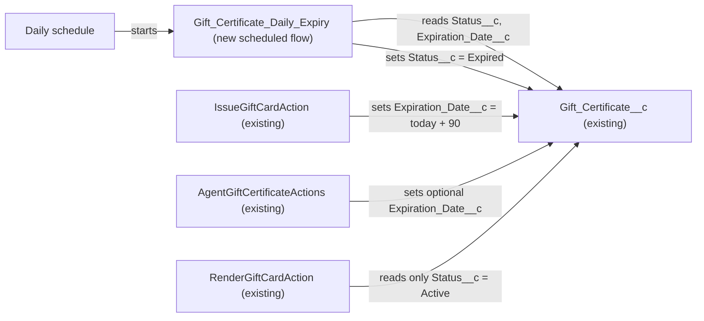

# Implementation spec — Auto-expiring gift certificates

> A daily scheduled flow sets `Gift_Certificate__c.Status__c` to `Expired` for redeemable gift certificates whose `Expiration_Date__c` has passed.

_Based on the requirement, the evidence reported by AskCoworker, and read-only org queries where noted. Assumptions and missing evidence are identified below. Specification only — nothing is implemented or deployed._

---

## 1. The requirement

Gift certificates that pass their expiration date must move to the `Expired` status automatically, without a person editing them.

The request also asked the AI to create the scheduled flow directly in the org and activate it, stating that the spec-only rule did not apply. That instruction was not acted on: nothing was created, deployed, or activated in the org. This document is a specification only.

| # | Responsibility | Trigger | Where it lives |
| --- | --- | --- | --- |
| 1 | Set `Gift_Certificate__c.Status__c` to `Expired` when `Expiration_Date__c` is before today and the certificate is still redeemable (`Active` or `Partially Redeemed`) | Daily schedule | New flow `Gift_Certificate_Daily_Expiry` |
| 2 | Leave certificates with no `Expiration_Date__c`, and certificates in `Draft`, `Fully Redeemed`, `Expired`, or `Cancelled`, unchanged | Daily schedule | Start filter of `Gift_Certificate_Daily_Expiry` |

## 2. Grounding — reuse before building

Target org: `TestWriteSpecDE` (Developer Edition, `00Dak00001COqNeEAL`, not a sandbox). API version: `67.0`. _verified by org query_

- **`Gift_Certificate__c`** (CustomObject) — the gift certificate record. Internal sharing model `ReadWrite`. _verified by org query_
- **`Gift_Certificate__c.Expiration_Date__c`** (CustomField, Date, nullable) — description: "The date after which the gift certificate can no longer be redeemed." _verified by org query_
- **`Gift_Certificate__c.Status__c`** (CustomField, Picklist, default `Active`) — active values: `Draft`, `Active`, `Partially Redeemed`, `Fully Redeemed`, `Expired`, `Cancelled`. The `Expired` value already exists, so no picklist change is needed. _verified by org query_
- **`IssueGiftCardAction`** (ApexClass, `with sharing`) — sets `Expiration_Date__c = Date.today().addDays(90)` and `Status__c = 'Active'` on insert; its duplicate check filters `Status__c = 'Active'`. _verified by org query_
- **`AgentGiftCertificateActions`** (ApexClass) — sets `Expiration_Date__c = req.expirationDate` (optional input, so it can be null) and defaults `Status__c` to `Active`. _verified by org query_
- **`RenderGiftCardAction`** (ApexClass, `with sharing`) — renders only certificates with `Status__c = 'Active'`. _verified by org query_
- **Agent actions** — `Render_Gift_Card` invokes `RenderGiftCardAction`, `Issue_Gift_Card` invokes `IssueGiftCardAction`, and `Create_Gift_Certificate_179Kj000000oapj` invokes `AgentGiftCertificateActions` (GenAiFunctionDefinition by `InvocationTarget`). _verified by org query_
- **Existing automation on `Gift_Certificate__c`** — none: 0 Apex triggers, 0 flows with trigger object `Gift_Certificate__c`, 0 validation rules, 0 workflow rules; no flow with an API name containing `Gift` or `Expir`; `CronTrigger` lists 5 jobs, none for gift certificates. `MetadataComponentDependency` on the object returns only the classes `AgentGiftCertificateActions`, `IssueGiftCardAction`, `RenderGiftCardAction`, and `RenderGiftCardActionTest`. A search of all 70 unmanaged Apex class bodies found no code that sets `Expired`, `Partially Redeemed`, or `Fully Redeemed`. _verified by org query_
- **Current data** — 1 `Gift_Certificate__c` record: `Status__c = 'Active'`, `Expiration_Date__c` null. 0 records have `Expiration_Date__c` before today. _verified by org query_

Candidates examined and rejected: a checkbox formula such as `Is_Expired__c` — does not set `Status__c`, so status filters in `RenderGiftCardAction` and `IssueGiftCardAction` would still treat the certificate as `Active` (_reported by AskCoworker_, reason confirmed from the class bodies, _verified by org query_); a record-triggered flow — fires only when a record is saved, so untouched certificates would never expire (_assumption (documented platform behavior)_); Apex batch plus scheduler — not needed for the verified volume (1 record), and a scheduled flow is the more standard mechanism (_assumption_).

Evidence sources: `sf org display`; `sf sobject list --sobject custom`; `sf sobject describe Gift_Certificate__c`; Tooling `EntityDefinition`, `CustomField`, `ApexTrigger`, `ValidationRule`, `WorkflowRule`, `MetadataComponentDependency`, `ApexClass` bodies, `GenAiFunctionDefinition`; standard `FlowDefinitionView`, `CronTrigger`, `FieldPermissions`, `DataStream`, `Organization`, and aggregate queries on `Gift_Certificate__c`. AskCoworker returned no citedReferences.

## 3. Architecture

Why the pieces are drawn this way:

1. `IssueGiftCardAction` and `AgentGiftCertificateActions` are the only writers of `Expiration_Date__c` and `Status__c`. _verified by org query_
2. The new flow is a schedule-triggered flow with start object `Gift_Certificate__c`. The start filter uses condition logic `(1 OR 2) AND 3`: `Status__c` equals `Active`; `Status__c` equals `Partially Redeemed`; `Expiration_Date__c` is null = false. A Decision element then checks `{!$Record.Expiration_Date__c} < {!$Flow.CurrentDate}`, and the true outcome runs an Update Records element on `$Record` that sets `Status__c = 'Expired'` and nothing else. The date comparison is in the Decision element because start filters compare fields to fixed values. _assumption (documented platform behavior)_
3. `<` (not `<=`) follows the field description: a certificate can be redeemed through its expiration date and expires the day after. _assumption_
4. Once a certificate is `Expired`, `RenderGiftCardAction` no longer returns it and the `IssueGiftCardAction` duplicate check no longer counts it. This is the intended effect of expiry. _verified by org query_ (filters), _assumption_ (intended)
5. A scheduled flow was chosen over Apex: the platform processes every record that matches the start filter, in internal batches, within the daily limit of 250,000 records or 200 times the number of user licenses, whichever is greater. _assumption (documented platform behavior)_

## 4. Metadata changes

**Automation**

- **Create `Gift_Certificate_Daily_Expiry`** — Flow, `AutoLaunchedFlow` process type with a Scheduled start. Frequency: Daily, start time 01:00 in the org default time zone. Start object `Gift_Certificate__c`; filter `(1 OR 2) AND 3` with 1 `Status__c` = `Active`, 2 `Status__c` = `Partially Redeemed`, 3 `Expiration_Date__c` Is Null = `false`. Decision `Is_Past_Expiration`: `{!$Record.Expiration_Date__c}` Less Than `{!$Flow.CurrentDate}`. True outcome: Update Records on the triggering record, `Status__c = 'Expired'`. No other fields change; no fault path emails. Deploy as Active in the target environment through the normal release process (not by this spec).

## 5. Data 360 (Data Cloud) data involved

Not applicable — this change does not use Data 360. `SELECT COUNT() FROM DataStream` returned 0, so no data stream ingests `Gift_Certificate__c` (_verified by org query_). AskCoworker reported that the Data Cloud connector ingests the object; that claim is dropped (see Section 8).

## 6. Security considerations

- **Execution context:** a schedule-triggered flow runs as the Automated Process user in system context without sharing, so it can update every matching record regardless of owner. _assumption (documented platform behavior)_ The object's internal sharing model is `ReadWrite`. _verified by org query_
- **CRUD/FLS:** no permission set or profile change is needed, because no person or integration gets new access. Current `Status__c` Edit access: `Agentforce_Reference_App`, `Agentforce_Action_Access`, `Pronto_Deep_Dive_Workshop`, `sfdc_accelerate_dms` (namespace `sfdcInternalInt`); Read only: `sfdc_a360_sfcrm_data_extract`, `sfdc_slack` (namespace `sfdcInternalInt`). This list is complete for `FieldPermissions` rows on `Gift_Certificate__c.Status__c`. _verified by org query_
- **Data exposure:** none added. The flow changes only `Status__c`; it reads no other fields and sends no messages.

## 7. Testing strategy

The flow's only logic runs on a scheduled path, so there is no Flow Test or Apex test row. Run these manual checks in a sandbox (recommended verification; none have been run):

1. **Positive, Active:** `Status__c = 'Active'`, `Expiration_Date__c` = yesterday. After the run, `Status__c = 'Expired'`.
2. **Positive, Partially Redeemed:** `Status__c = 'Partially Redeemed'`, `Expiration_Date__c` = yesterday. After the run, `Status__c = 'Expired'`.
3. **Boundary:** `Status__c = 'Active'`, `Expiration_Date__c` = today. Stays `Active`; it expires on the next day's run. This checks the load-bearing `<` assumption.
4. **Future date:** `Expiration_Date__c` = tomorrow. Stays `Active`.
5. **Null date:** `Status__c = 'Active'`, `Expiration_Date__c` null. Stays `Active`. The one existing org record matches this case.
6. **Excluded statuses:** `Draft`, `Fully Redeemed`, `Cancelled`, and `Expired` records with `Expiration_Date__c` = yesterday. None change, and `LastModifiedDate` does not change.
7. **Bulk:** 500 `Active` records with past dates (insert with anonymous Apex in the sandbox). All become `Expired` after one run; check Setup > Paused and Failed Flow Interviews for errors.
8. **Downstream:** after case 1, the `Render_Gift_Card` agent action no longer finds that certificate by number.
9. To test without waiting for the schedule, use Debug in Flow Builder against a sandbox record, or set the start time a few minutes ahead in the sandbox.

## 8. Open decisions

### Open

1. **Certificates with no expiration date (non-blocking).** `AgentGiftCertificateActions` can create certificates with a null `Expiration_Date__c`, and the one existing record has none. The design never expires them. If the business wants a default term (for example `Issue_Date__c` + 90 days, matching `IssueGiftCardAction`), that is a separate change and needs a business value. Recommended default: leave them non-expiring.
2. **Run time (non-blocking).** 01:00 in the org default time zone is an assumption. Any time works, because the Decision compares against the run date.

### Resolved

- **Null expiration handling:** asked the user; no preference, so the recommended default (never expire a null date) was taken. _assumption_
- **Eligible statuses:** `Active` and `Partially Redeemed` only, because these are the redeemable states in the verified picklist; `Draft` is not yet issued and `Fully Redeemed`, `Expired`, `Cancelled` are terminal. _assumption_
- **Expiry boundary:** expire when `Expiration_Date__c < TODAY`, following the field description "the date after which the gift certificate can no longer be redeemed". AskCoworker listed this as blocking OD-1; the field description settles it. _assumption_
- **AskCoworker OD-2 (unknown picklist values):** resolved by `describe`; the full active value set is `Draft`, `Active`, `Partially Redeemed`, `Fully Redeemed`, `Expired`, `Cancelled`. _verified by org query_
- **Correction — batch size:** AskCoworker proposed "Batch size: 200" and said a scheduled flow processes "up to 250 records per scheduled run". Schedule-triggered flows have no configurable batch size, and they process all matching records subject to the daily 250,000 (or 200 per user license) limit. _assumption (documented platform behavior)_
- **Correction — decision source:** AskCoworker labelled "no Apex" as a user decision; it was an implementation decision (_assumption_).
- **Correction — Data 360:** AskCoworker said the Data Cloud connector ingests `Gift_Certificate__c` and would sync the status change. `DataStream` count is 0. _verified by org query_ Dropped.
- **Correction — start filter:** AskCoworker put `Expiration_Date__c < {!$Flow.CurrentDate}` in the start filter; it is moved to a Decision element (Section 3, item 2).
- **Unverified AskCoworker claim dropped:** that `AgentGiftCertificateActions` contains redemption logic; the class body contains no redemption status values. _verified by org query_
- **Instruction not acted on:** the request to create and activate the flow directly in the org was ignored (spec-only rule).
- Dropped AskCoworker alternatives: `Is_Expired__c` formula, record-triggered flow, Apex batch, platform event (see Section 2).

## 9. Change set

| # | Action | Type | API name | Module | Why |
| --- | --- | --- | --- | --- | --- |
| 1 | Create | Flow | `Gift_Certificate_Daily_Expiry` | force-app/main/default/flows | Daily scheduled flow that sets `Status__c = 'Expired'` on `Active` or `Partially Redeemed` certificates whose `Expiration_Date__c` is before today |

One new scheduled flow expires redeemable gift certificates the day after their expiration date, reusing the existing `Expired` status value.

Total: 1 · Create: 1 · Update: 0 · Delete: 0
