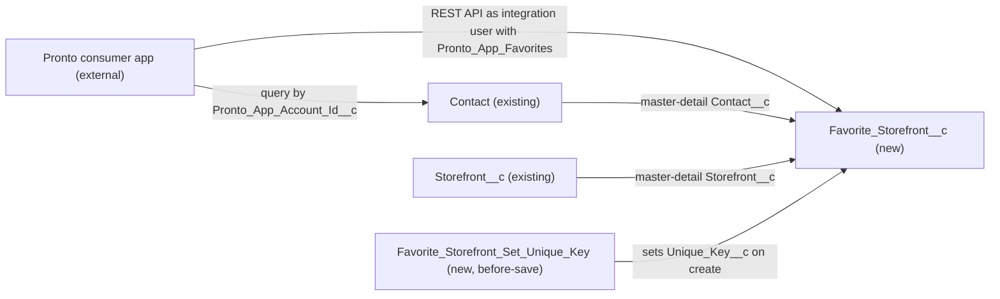

# Implementation spec — Customer favourite storefronts

> Let a customer (a `Contact`) save and remove favourite `Storefront__c` records from the Pronto consumer app, with at most one favourite per customer and storefront.

_Based on the requirement, the evidence reported by AskCoworker, and read-only org queries where noted. Assumptions and missing evidence are identified below. Specification only — nothing is implemented or deployed._

---

## 1. The requirement

Customers can save favourite storefronts in the app. The user decided that customers are `Contact` records and that each favourite is a Favorite Storefront junction record between `Contact` and `Storefront__c`, one per pair (*user decision*). The request contained no deploy, data-change, or credential instruction.

| # | Responsibility | Trigger | Where it lives |
| --- | --- | --- | --- |
| 1 | Store a customer's favourite storefront | App creates a record through the standard REST API | `Favorite_Storefront__c` with `Contact__c` and `Storefront__c` |
| 2 | Allow only one favourite per customer and storefront | Record create | `Favorite_Storefront__c.Unique_Key__c` (unique), set by `Favorite_Storefront_Set_Unique_Key` |
| 3 | List and remove a customer's favourites | App query and delete through the standard REST API | `Favorite_Storefront__c` |
| 4 | Give the app's integration user access | Permission set assignment | `Pronto_App_Favorites` |

## 2. Grounding — reuse before building

Target org: `TestWriteSpecDE` (Developer Edition, `00Dak00001COqNeEAL`, not a sandbox). API version: `67.0`. _verified by org query; `sourceApiVersion` 67.0 verified by project file_

- **`Storefront__c`** (CustomObject) — the thing being favourited. 21 records. Internal sharing `ReadWrite`, external sharing `Private`. Custom fields: `Account__c`, `Address__c`, `Cuisine__c`, `Description__c`, `Image_URL__c`, `Phone__c`, `Primary_Contact__c`, `Status__c`, `Type__c`, `Menu_Count__c`, `Total_Reviews__c`, `Total_Score__c`, `Average_Review_Score__c`, `Storefront_Overview__c`, `Review_Summary__c`; none represents a favourite. _verified by org query_
- **`Contact`** (standard object) — the customer. Internal sharing `ReadWrite`, external `Private`. `Review__c.Customer__c` is a lookup to `Contact` and `Loyalty_Transaction__c.Contact__c` is a master-detail to `Contact`, so the org already models customers as Contacts. _verified by org query_
- **`Contact.Pronto_App_Account_Id__c`** (CustomField) — Text(20), external ID, unique; description "External identifier for the Pronto consumer mobile/web app customer account. Used to join app-side order/activity data to CRM Contact records." Populated on 198 of 198 Contacts. The app uses it to find the signed-in customer's `Contact` Id. `MetadataComponentDependency` returned no references to it. _verified by org query_
- **`Contact.Favorite_Cuisine__c`** (CustomField) — restricted picklist of cuisines. A different concept (cuisine, not storefront); it sets the org's spelling "Favorite", which the new names follow. _verified by org query_
- Automation on the parents: no Apex trigger on `Storefront__c`, `Contact`, or `Review__c`; no record-triggered flow on `Storefront__c` or `Contact` (`FlowDefinitionView`). _verified by org query_
- Existing readers of `Storefront__c` (`MetadataComponentDependency`, partial because it can miss Apex references): 20 Apex classes (for example `AgentStorefrontActions`, `AgentGetStorefrontsByAccountActions`, `StorefrontPickerController`), the flows `Issue Refund`, `Apply Remediation`, and `Partner Quality Watchlist`, and the FlexiPage `Storefront_Record_Page`. None is changed; a new child object does not alter them. _verified by org query_
- App surface: no `@RestResource`-style class name matches (`ApexClass` names with `Rest`, `Api`, `Favo`, `Storefront`), no custom connected application (only 8 standard ones such as `Workbench` and `Dataloader Bulk`), 0 active users linked to a Contact, and the three Experience Cloud sites (`Customer Support`, `Merchant Support`, `ESW_Merchant_Service_Agent_1737676393072`) are all `UnderConstruction`. The Pronto consumer app is therefore external and not yet connected to Salesforce. _verified by org query_

Candidates examined and rejected:
- `Storefront_Tag__c` — fields are only `Name` and `Storefront__c` (lookup); it has no customer link. _verified by org query_
- `Review__c` — links `Customer__c` (Contact) to `Storefront__c` (master-detail), but a review is not a preference; reusing it would mix meanings. _verified by org query_
- `Pronto_ECP_Access` (PermissionSet) — grants no object permissions, 0 field permissions, and is assigned only to the `Automated Process` user; adding favourites access to it would grant that user access nobody asked for. _verified by org query_
- Data 360 wishlist fields (`ShoppingWishlistEngagementId` on a data model object) — `SELECT ... FROM DataStream` returned 0 data streams, so no app data flows into Data 360. _verified by org query_

Evidence sources: `sf sobject list`, `EntityDefinition` sharing models, Tooling `CustomField` searches for `%Favo%`, `%Saved%`, `%Wish%`, `%Bookmark%` (all objects), field lists for `Storefront__c`, `Review__c`, `Contact`, `ApexTrigger`, `FlowDefinitionView`, `LightningComponentBundle`, `FlexiPage`, `ConnectedApplication`, `Network`, `NamedCredential`, `ExternalCredential`, `PermissionSet`/`ObjectPermissions`/`PermissionSetAssignment`, `User`, `DataStream`, and `MetadataComponentDependency`. AskCoworker returned no citedReferences.

## 3. Architecture

Why the pieces are drawn this way:

1. The Pronto consumer app is external: `Contact.Pronto_App_Account_Id__c` describes it as the "Pronto consumer mobile/web app", and no site user or custom connected app exists. _verified by org query_ It calls the standard REST API; no custom Apex endpoint is needed because create, query, and delete of one object are standard API operations. _assumption (documented platform behavior)_
2. `Favorite_Storefront__c` is a junction with two master-detail parents, as the user asked (*user decision*). Master-detail gives required parents and removes favourites when a Contact or Storefront is deleted, without automation. _assumption (documented platform behavior)_
3. Uniqueness uses a unique Text field, because the database rejects a second record with the same value even under concurrent inserts, and a formula field cannot be unique. _assumption (documented platform behavior)_ A before-save flow sets the key: the standard mechanism for a field value derived on save, with no Apex. _assumption_
4. `Contact` is the primary master (`Contact__c` is created first) because the favourite belongs to the customer. _assumption_

## 4. Metadata changes

**Data model**

- **Create `Favorite_Storefront__c`** — CustomObject. Label "Favorite Storefront", plural "Favorite Storefronts". Name field: Auto Number `FS-{000000}`. Sharing model `ControlledByParent` (required for master-detail). No tab, no reports enabled by default. Description: "A customer's (Contact) saved favourite storefront. One record per Contact and Storefront pair."
- **Create `Favorite_Storefront__c.Contact__c`** — CustomField, Master-Detail(`Contact`), label "Customer", relationship name `Favorite_Storefronts`, primary master, `reparentableMasterDetail` false, `writeRequiresMasterRead` true (Read access on the Contact is enough to create or delete a favourite).
- **Create `Favorite_Storefront__c.Storefront__c`** — CustomField, Master-Detail(`Storefront__c`), label "Storefront", relationship name `Favorite_Storefronts`, `reparentableMasterDetail` false, `writeRequiresMasterRead` true.
- **Create `Favorite_Storefront__c.Unique_Key__c`** — CustomField, Text(40), Unique (case-insensitive), External ID, label "Unique Key". Holds the 18-character `Contact__c` Id, `_`, and the 18-character `Storefront__c` Id (37 characters). Set only by the flow; not placed on a layout.

**Automation**

- **Create `Favorite_Storefront_Set_Unique_Key`** — Flow, record-triggered, before-save (Fast Field Updates), object `Favorite_Storefront__c`, runs when a record is created, no entry conditions. One Assignment: `$Record.Unique_Key__c` = `{!$Record.Contact__c} & "_" & {!$Record.Storefront__c}`. Both parents are required, so neither input is blank. Update is not covered because neither master-detail field can be reparented, so the key can never go stale.

**Security**

- **Create `Pronto_App_Favorites`** — PermissionSet, label "Pronto App Favorites", for the Pronto app's integration user. Object permissions: `Favorite_Storefront__c` Read, Create, Edit, Delete (Delete requires Read and Edit); `Contact` Read; `Storefront__c` Read. Field permissions: Read on `Favorite_Storefront__c.Unique_Key__c` and `Contact.Pronto_App_Account_Id__c`. Master-detail fields have no separate field-level security. No View All or Modify All. No profile gets access through this deployment.

## 5. Data 360 (Data Cloud) data involved

Not applicable — this change does not use Data 360. The org has 0 data streams (_verified by org query_); ingesting favourites into Data 360 is not asked for.

## 6. Security considerations

- **Execution context.** The app acts as one integration user, so every call runs with that user's permissions and sharing. The before-save flow runs in system context and sets `Unique_Key__c` regardless of the caller's field access. _assumption (documented platform behavior)_
- **Sharing.** `Favorite_Storefront__c` uses `ControlledByParent`; a user needs access to both the `Contact` and the `Storefront__c` to see a favourite. _assumption (documented platform behavior)_ Both parents are internal `ReadWrite` (_verified by org query_), so every internal user with object access, including the integration user, can see every customer's favourites.
- **Data exposure.** Salesforce cannot tell which app customer is signed in when all calls use one integration user. The app must filter every query and create by the signed-in customer's `Contact` Id, resolved from `Contact.Pronto_App_Account_Id__c`. This is load-bearing and listed in Section 8. _assumption_
- **CRUD/FLS.** Only `Pronto_App_Favorites` grants access to the new object; no existing permission set or profile is changed. Metadata API deployment grants no field access to profiles unless profiles are included, and none are. System administrators see the object through View All Data / Modify All Data. _assumption (documented platform behavior)_
- **External users.** Both parents are external `Private` and 0 active users are linked to a Contact (_verified by org query_); no site guest or community profile gets access.
- **Credentials.** No credential is stored in metadata. The integration user and its OAuth client are Setup steps (Section 8).

## 7. Testing strategy

There is no Apex in the inventory, so no Apex test class is needed for deployment coverage. A `FlowTest` is not added: its initial record would need org-specific `Contact` and `Storefront__c` Ids, so it cannot be deployed portably; the flow's outcome is checked manually. Run these in a sandbox as the integration user with `Pronto_App_Favorites` (recommended verification):

1. **Create (responsibilities 1, 2).** Create a `Favorite_Storefront__c` for an existing Contact and Storefront. Expect success and `Unique_Key__c` = `<ContactId>_<StorefrontId>` with 18-character Ids.
2. **Duplicate (responsibility 2).** Create the same pair again. Expect `DUPLICATE_VALUE` on `Unique_Key__c` and still one record.
3. **Bulk.** Create 200 records for different pairs in one request (`allOrNone` false), including one repeated pair. Expect 199 successes, one `DUPLICATE_VALUE`, and a key on every created record.
4. **Negative.** Create with a blank `Contact__c` or blank `Storefront__c`. Expect a required-field error.
5. **Reparenting.** Try to change `Contact__c` or `Storefront__c` on an existing record. Expect the platform to reject it.
6. **List and remove (responsibility 3).** Query `Favorite_Storefront__c WHERE Contact__c = '<ContactId>'`, delete one record, then create the same pair again. Expect the delete and the new create to succeed.
7. **Parent delete and undelete.** Delete a test Contact that has favourites; expect its favourites to be deleted with it. Undelete the Contact from the Recycle Bin; expect the favourites to return with their original `Unique_Key__c`. Repeat with a test `Storefront__c`.
8. **Permission (responsibility 4).** As a user without `Pronto_App_Favorites`, try to create a favourite. Expect an insufficient-access error.
9. **Contact lookup.** As the integration user, query `Contact WHERE Pronto_App_Account_Id__c = '<id>'`. Expect exactly one Contact.
10. **App scoping (load-bearing assumption).** In the app, sign in as customer A and try to list or create favourites for customer B's Contact. Expect the app to refuse; Salesforce will allow it.

## 8. Open decisions

### Open

1. **Integration user and OAuth client for the Pronto app (blocking for delivery).** No custom connected app or app integration user exists (_verified by org query_). Without them the app cannot call Salesforce, so responsibilities 1 to 3 fail. Recommended default: in Setup, create an External Client App (or Connected App) using the OAuth 2.0 client credentials flow, and an integration user with the Salesforce Integration license; assign `Pronto_App_Favorites` to that user. The Pronto app team owns the client secret; it is not part of this spec.
2. **App-side customer scoping (blocking for delivery).** Load-bearing: with one integration user, only the app can stop customer A from reading or writing customer B's favourites (Section 6; check 10 in Section 7). Recommended default: the app resolves the `Contact` Id from the signed-in account's `Pronto_App_Account_Id__c` server-side and never accepts a Contact Id from the client.
3. **Duplicate handling in the app (non-blocking).** A second save of the same pair returns `DUPLICATE_VALUE`. Recommended default: the app treats that error as "already saved".
4. **Contact related list (non-blocking, proposal).** Service users may want to see a customer's favourites on `Customer_Contact_Record_Page` or `Business_Contact_Record_Page`. Not added, because the requirement is app-only and changing a shared record page changes it for everyone.

### Resolved

- **Customer identity and data shape** — *user decision*: customers are `Contact`; favourites are a Favorite Storefront junction between `Contact` and `Storefront__c`, one per pair. Question asked: "Which app and customer record is meant?" Options offered: Pronto consumer app with Contacts (recommended), `Customer Support` Experience Cloud site, or internal users recording favourites.
- **App connection** — the simulated user had no preference on how the app connects; standard REST API as an integration user is an *assumption*.
- **Naming** — "Favorite" (American spelling) follows `Contact.Favorite_Cuisine__c`; *assumption*.
- **Removing favourites** — "save" is read to include un-saving, delivered by delete; no status field or history; *assumption*.
- **No favourite-count roll-up and no limit per customer** — not asked for; dropped (AskCoworker proposals).
- **AskCoworker corrections** (five wrong claims, so every AskCoworker fact kept was re-verified by org query):
  - D2 said `Contact.Favorite_Cuisine__c` does not appear to exist; Tooling `CustomField` shows it exists.
  - I proposed OWD `Private` for the junction; a master-detail child must use `ControlledByParent`.
  - I said the integration user needs a sharing rule on `Storefront__c` because external sharing is `Private`; the integration user is internal and internal sharing is `ReadWrite` (_verified by org query_), so no sharing rule is needed.
  - I proposed Read, Create, Delete without Edit; Delete requires Edit, so Edit is granted.
  - R and T said cascade-deleted favourites are hard-deleted with no Recycle Bin entry; they go to the Recycle Bin with their parent and are restored when the parent is undeleted (documented platform behavior), and R also contradicted itself on this point.
- **Dropped AskCoworker proposals** — an Apex test class for coverage (no Apex exists, so no coverage is needed), REST upsert by external ID and Edit access on `Unique_Key__c` (the app uses create and delete), the Data Cloud connector permission set (not needed), and the claim that sharing follows "the more restrictive parent" (replaced by the documented rule: access to both parents).
- **R call** timed out once; it was retried as two narrower calls (runtime, security), which both returned.

**Deployment sequence:** deploy rows 1 to 6 together (the object and both master-detail fields must deploy together); then do Open item 1 in Setup; then run the Section 7 checks.

## 9. Change set

| # | Action | Type | API name | Module | Why |
| --- | --- | --- | --- | --- | --- |
| 1 | Create | CustomObject | `Favorite_Storefront__c` | force-app/main/default/objects | Junction record for a customer's favourite storefront |
| 2 | Create | CustomField | `Favorite_Storefront__c.Contact__c` | force-app/main/default/objects | Links the favourite to the customer; cascade delete |
| 3 | Create | CustomField | `Favorite_Storefront__c.Storefront__c` | force-app/main/default/objects | Links the favourite to the storefront; cascade delete |
| 4 | Create | CustomField | `Favorite_Storefront__c.Unique_Key__c` | force-app/main/default/objects | Database-enforced one favourite per pair |
| 5 | Create | Flow | `Favorite_Storefront_Set_Unique_Key` | force-app/main/default/flows | Sets the unique key on create |
| 6 | Create | PermissionSet | `Pronto_App_Favorites` | force-app/main/default/permissionsets | Access for the Pronto app integration user |

A new Contact-Storefront junction object with a flow-set unique key, used by the external Pronto app through the standard API under a dedicated permission set.

Total: 6 · Create: 6 · Update: 0 · Delete: 0
