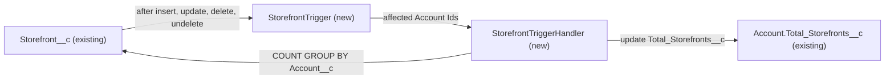

# Implementation spec — Account storefront count roll-up

> Keep `Account.Total_Storefronts__c` equal to the number of `Storefront__c` records related to each account through `Storefront__c.Account__c`.

_Based on the requirement, the evidence reported by AskCoworker, and read-only org queries where noted. Assumptions and missing evidence are identified below. Specification only — nothing is implemented or deployed._

---

## 1. The requirement

Maintain a count of storefronts on each account automatically, reusing the existing field `Account.Total_Storefronts__c`. No user questions were needed; the scope follows the requirement's wording. The request contained no deploy, data-change, or credential instructions.

| # | Responsibility | Trigger | Where it lives |
| --- | --- | --- | --- |
| 1 | Recount the storefronts of the account when a storefront is created | `Storefront__c` after insert | `StorefrontTrigger`, `StorefrontTriggerHandler` |
| 2 | Recount both the old and the new account when a storefront's `Account__c` changes (including set to or from blank) | `Storefront__c` after update, only when `Account__c` changed | `StorefrontTrigger`, `StorefrontTriggerHandler` |
| 3 | Recount the account when a storefront is deleted or restored from the Recycle Bin | `Storefront__c` after delete, after undelete | `StorefrontTrigger`, `StorefrontTriggerHandler` |
| 4 | Store the count (0 when the account has no storefronts) | Same as rows 1–3 | `Account.Total_Storefronts__c` (existing) |

## 2. Grounding — reuse before building

Target org: `TestWriteSpecDE` (Developer Edition, not a sandbox, org ID `00Dak00001COqNeEAL`). API version: `67.0`. _verified by org query_; `sourceApiVersion` `67.0` and `target-org` `TestWriteSpecDE` _verified by project file_. The project's `force-app/main/default` folders are empty; no local source references `Storefront__c`. _verified by project file_

- **`Storefront__c.Account__c`** (CustomField, Lookup to `Account`) — the parent link to count on. `type` `Lookup`, `required` false, `deleteConstraint` `SetNull`, `relationshipName` `Accounts` (child relationship `Accounts__r` on `Account`), description "The related account to the storefront". _verified by org query_
- Because the relationship is a Lookup and not Master-Detail, a native roll-up summary field on `Account` is not available. _assumption (documented platform behavior)_
- **`Account.Total_Storefronts__c`** (CustomField, Number(18,0), label "Total Storefronts", no description, not calculated) — the target field. It has no rows in `MetadataComponentDependency` (checked with 18- and 15-character IDs) and no unmanaged Apex class body mentions it, so no layout, FlexiPage, flow, LWC, or unmanaged Apex reads or writes it. Its current values equal the actual storefront count on all 10 accounts that have storefronts (1, 3, 1, 3, 1, 1, 3, 4, 1, 3); the other 190 accounts have a blank value. Field history is not tracked. _verified by org query_
- **Field access on `Account.Total_Storefronts__c`** (complete list): Read and Edit — `sfdc_accelerate_dms`; Read only — `sfdc_a360_sfcrm_data_extract`, `sfdc_slack`, `Agentforce_Reference_App`, `Pronto_Deep_Dive_Workshop`; no profile has any access. `sfdc_accelerate_dms`, `Agentforce_Reference_App`, and `Pronto_Deep_Dive_Workshop` each have 1 active assignee. _verified by org query_
- **`Storefront__c`** (CustomObject) — 21 records, all with `Account__c` set, on 10 distinct accounts; all have `Status__c` = `Active`; all were created at `2026-08-27T19:22:20Z`. Create, Edit, and Delete on the object (complete list): `Agentforce_Reference_App`, `sfdc_accelerate_dms`, and the System Administrator profile. _verified by org query_
- **Existing automation (none that conflicts):** no Apex triggers on `Storefront__c` or `Account` (the only triggers in the org are managed ones on `BatchApexErrorEvent`, `sc_ext__Compliance_Categorization__c`, `shield_ext__Compliance_Categorization__c`, and `DataMaskCustomValueLibrary`); no `FlowDefinitionView` rows triggered on `Storefront__c` or `Account`; no validation rules on either object; none of the 5 scheduled jobs (`Program Milestone Computation Cron Job`, `Program Status Update Cron Job`, `Metalytics Data Loader Job for Org : 00Dak00001COqNe`, `Retention Usage`, `Privacy Center Audit`) relates to storefronts by name. _verified by org query_
- No unmanaged Apex class named `StorefrontTrigger`, `StorefrontTriggerHandler`, or `StorefrontTriggerHandlerTest`, and no trigger named `StorefrontTrigger`, exists. No unmanaged trigger-handler or test-data-factory class exists to reuse. _verified by org query_

Candidates examined and rejected:
- `Account.NumberofLocations__c` (Number(3,0), label "Number of Locations") — its values currently equal `Total_Storefronts__c`, but it is on the `Account Layout`, `Account (Marketing) Layout`, `Account (Support) Layout`, and `Account (Sales) Layout` layouts and in LWC `prontoProfileCard`, a matching `Lead.NumberofLocations__c` exists, and 46 profile-owned permission sets and `sfdc_accelerate_dms` can edit it. Writing to it would overwrite a value people can edit by hand, and its label does not name storefronts. _verified by org query_ Rejected; it is left unchanged. _assumption_
- A native roll-up summary after converting `Storefront__c.Account__c` to Master-Detail — the conversion removes `OwnerId`-based ownership and sharing on `Storefront__c` and replaces `SetNull` with cascade delete, which changes behavior for other users. _assumption (documented platform behavior)_
- Record-triggered flows — they cannot run when a record is undeleted, so a restored storefront would leave the count wrong. _assumption (documented platform behavior)_

Evidence sources: `sf org display`; `sf sobject list`; `sf sobject describe` of `Storefront__c` and `Account`; Tooling `CustomField` (names, `Metadata` of `Storefront__c.Account__c`), `MetadataComponentDependency`, `ApexTrigger`, `ApexClass` bodies, `ValidationRule`; `FlowDefinitionView`; `FieldPermissions`; `ObjectPermissions`; `PermissionSetAssignment`; `FieldDefinition`; `CronTrigger`; `DataStream`; aggregate record counts. AskCoworker returned no citedReferences.

## 3. Architecture

Why the pieces are drawn this way:

1. `Storefront__c` links to `Account` through the Lookup `Storefront__c.Account__c`. _verified by org query_ A roll-up summary needs Master-Detail, so the standard mechanism is not available without the rejected conversion in Section 2. _assumption (documented platform behavior)_
2. Apex is used instead of a flow because flows cannot run on undelete, and one trigger keeps all four events for this object in one component instead of splitting the logic across two flows and a trigger. _assumption (documented platform behavior)_
3. The handler recounts with an aggregate query instead of adding or subtracting 1, so the stored value is always the true count and self-corrects on any touched account.
4. `Account.Total_Storefronts__c` is reused in place: it already holds the correct counts and nothing else reads or writes it through metadata. _verified by org query_

## 4. Metadata changes

**Automation**

- **Create `StorefrontTrigger`** — ApexTrigger on `Storefront__c`, events `after insert, after update, after delete, after undelete`. Collects Account Ids: `Trigger.new` `Account__c` on insert and undelete; `Trigger.old` `Account__c` on delete; on update, only for records where `Account__c` changed, both the old and the new value. Ignores blank Ids. Calls `StorefrontTriggerHandler.recalculateStorefrontCounts(accountIds)` once per trigger invocation when the set is not empty. No logic in the trigger body.
- **Create `StorefrontTriggerHandler`** — ApexClass, `public without sharing class`, so the count includes storefronts the running user cannot see. Method `public static void recalculateStorefrontCounts(Set<Id> accountIds)`: removes null; runs `SELECT Account__c, COUNT(Id) n FROM Storefront__c WHERE Account__c IN :accountIds GROUP BY Account__c`; builds one `Account` per Id with `Total_Storefronts__c` = the count, or 0 when the Id is not in the result; issues one all-or-none `update` in default system mode (no `WITH USER_MODE`), so users without Edit on the field still trigger a correct update. One query and one DML statement per invocation. Counts all statuses of `Storefront__c`.

**Tests**

- **Create `StorefrontTriggerHandlerTest`** — ApexClass, `@isTest`. Covers insert, update (reparent, set blank, set from blank, unrelated field change), delete, undelete, bulk (200 records), and a run-as user with only `Agentforce_Reference_App` access; see Section 7.

## 5. Data 360 (Data Cloud) data involved

Not applicable — this change does not use Data 360. `SELECT COUNT() FROM DataStream` returns 0, so no data stream ingests `Account` today, although the `sfdc_a360_sfcrm_data_extract` permission set has Read on `Account.Total_Storefronts__c`. _verified by org query_

## 6. Security considerations

- **Execution context:** the trigger runs in the transaction of the user or integration that changes the storefront. `StorefrontTriggerHandler` is `without sharing`, so the aggregate query counts every storefront of the account, and the `Account` update is not blocked by the running user's record access. Apex DML in default system mode does not enforce object or field-level security. _assumption (documented platform behavior)_
- **CRUD/FLS:** no permission set or profile change is needed for the trigger to work. The users who can create, edit, or delete storefronts (`Agentforce_Reference_App`, `sfdc_accelerate_dms`, System Administrator profile) mostly lack Edit on `Account.Total_Storefronts__c`, which is why the handler must not use user-mode DML. _verified by org query_ (grants); _assumption_ (design choice).
- **Visibility:** read access to `Account.Total_Storefronts__c` stays as it is (the five permission sets listed in Section 2; no profiles). No new field is created, so no default profile access is granted on deploy. See Section 8, item 2.
- **Data exposure:** the field holds a count only. A user who can read the account's `Total_Storefronts__c` can learn how many storefronts exist even if sharing hides some of them. _assumption_
- **Other writer:** `sfdc_accelerate_dms` has Edit on the field and could overwrite the count; see Section 8, item 3.

## 7. Testing strategy

`StorefrontTriggerHandlerTest` (Apex, creates its own `Account` and `Storefront__c` data; never claims to have run):

| Behavior | Test case |
| --- | --- |
| Insert (responsibility 1) | Insert 1 storefront on account A → `Total_Storefronts__c` = 1. Insert with blank `Account__c` → no exception, no account changed. |
| Reparent (responsibility 2) | Move a storefront from A to B → A = 0, B = 1. Set `Account__c` to blank → old account decremented. Set from blank to A → A incremented. |
| Unrelated update | Change `Status__c` only → count unchanged, and no extra recount (assert with `Limits.getDmlStatements()` inside `Test.startTest()`/`stopTest()`). |
| Delete and undelete (responsibility 3) | Delete a storefront → count drops; `undelete` it → count restored. Deleting the last storefront → 0, not blank. |
| Bulk | Insert 200 storefronts spread over 10 accounts → each count is correct; reparent all 200 from A to B → A = 0, B = 200; delete all 200 → 0. |
| Existing stale value | Account with `Total_Storefronts__c` = 99 and 2 storefronts; insert a third → 3 (proves recount, not increment). |
| Permission | Create a user with the Standard User profile, assign `Agentforce_Reference_App` (Read only on the field), `System.runAs` insert a storefront on an account that user owns → count updated. |

Recommended verification (manual, in a sandbox):
1. Create, reparent, delete, and restore a storefront in the UI and check the count on both accounts.
2. Load 500 storefronts with Data Loader and compare `SELECT Account__c, COUNT(Id) FROM Storefront__c GROUP BY Account__c` with `Total_Storefronts__c`.
3. Merge two accounts that both have storefronts and check the surviving account's count (expected to be stale; see Section 8, item 1).

## 8. Open decisions

### Open

1. **Account merge (non-blocking).** When accounts are merged, the losing account's storefronts are reparented to the winner without firing triggers on the child records, so the winner's `Total_Storefronts__c` stays too low until one of its storefronts changes. _assumption (documented platform behavior)_ Recommended default: after a merge, touch one storefront of the winner (or re-save its storefronts) to force a recount. Proposal (not in inventory): an `Account` after-delete trigger that uses `MasterRecordId` on the deleted losers to call `StorefrontTriggerHandler.recalculateStorefrontCounts` for the winner.
2. **Visibility and placement of the count (non-blocking).** `Account.Total_Storefronts__c` is on no layout or FlexiPage and no profile can read it; only the five permission sets in Section 2 can. _verified by org query_ The requirement does not say who should see it. Recommended default: no change in this spec. Proposal: add the field as read-only to `Business_Account_Record_Page` or the Account layouts and grant Read through a new dedicated permission set.
3. **Other writer `sfdc_accelerate_dms` (non-blocking).** This platform-managed permission set has Edit on the field; whether its integration writes it is not visible to the allowed queries. _verified by org query_ (grant); _assumption_ (no writes). If it writes, its value is replaced on the next recount of that account.
4. **Blank counts on accounts with no storefronts (non-blocking data step).** 190 accounts have a blank `Total_Storefronts__c` and no storefronts; the trigger writes 0 only when an account loses its last storefront. _verified by org query_ Recommended default: after deployment, a one-time data step sets `Total_Storefronts__c` = 0 where it is blank and the account has no storefronts. Back up with an export of `Id, Total_Storefronts__c` first; roll back by re-importing the export. No backfill is needed for the 10 accounts with storefronts because their values already match.

Deployment sequence: deploy `StorefrontTriggerHandler` and `StorefrontTriggerHandlerTest` together with `StorefrontTrigger` (one deployment, tests run); then re-run the comparison query from Section 7, step 2; then the optional data step in item 4.

### Resolved

- **Target field:** `Account.Total_Storefronts__c`, because its label names storefronts, nothing else reads or writes it, and no profile can edit it by hand. `Account.NumberofLocations__c` is not changed. _assumption_ (decided from the requirement's wording and org evidence; no question asked).
- **Which storefronts count:** all `Storefront__c` records regardless of `Status__c`; the requirement says "the number of storefronts". Today all 21 are `Active`, so the choice does not change current values. _assumption_
- **Mechanism:** Apex trigger plus handler instead of a flow (undelete) and instead of Master-Detail conversion (behavior change for other users). _assumption (documented platform behavior)_
- **Update filter:** the trigger recounts on update only when `Account__c` changed, which removes the no-op account update AskCoworker raised. _assumption_
- **Correction — sharing:** AskCoworker proposed `with sharing` for the handler; that would count only the storefronts the running user can see. Changed to `without sharing`.
- **Correction — FLS:** AskCoworker said the handler needs Edit on the field and that System Administrator has field access by default. Org queries show no profile rows for the field; default system-mode DML does not enforce FLS, so no grant is needed. _verified by org query_
- **Correction — delete and SetNull:** AskCoworker said `SetNull` clears `Account__c` when a storefront is deleted and that account deletion fires update triggers on storefronts. `SetNull` applies when the parent account is deleted, and that clearing does not fire triggers on the child records; deleting a storefront keeps `Account__c` in `Trigger.old`. _assumption (documented platform behavior)_ The proposed deleted-account test and filter were dropped; when an account is deleted, its count goes with it.
- **Correction — merge:** AskCoworker first said merge fires update triggers on reparented storefronts, then the opposite, and proposed a flow on `MasterRecordId` on the winner. `MasterRecordId` is set on the deleted losing records, not on the winner; see Open item 1.
- **Correction — limits:** AskCoworker cited "150 DML rows"; the limit is 150 DML statements and 10,000 rows per transaction. The handler uses one statement per invocation. _assumption (documented platform behavior)_
- After more than two wrong AskCoworker claims, every AskCoworker fact kept in this spec was re-verified by org query. Dropped AskCoworker items: `AccountRule` managed classes (not relevant), `Database.update(..., false)` partial success (hides failures), the invalid-Account-Id and forced-rollback negative tests (no reachable failure path), and the claim that `with sharing` matches existing classes (not verified).

## 9. Change set

| # | Action | Type | API name | Module | Why |
| --- | --- | --- | --- | --- | --- |
| 1 | Create | ApexTrigger | `StorefrontTrigger` | force-app/main/default/triggers | Fires the recount on insert, reparenting update, delete, and undelete of `Storefront__c` |
| 2 | Create | ApexClass | `StorefrontTriggerHandler` | force-app/main/default/classes | Recounts storefronts per account and writes `Account.Total_Storefronts__c` |
| 3 | Create | ApexClass | `StorefrontTriggerHandlerTest` | force-app/main/default/classes | Tests single, bulk, reparent, delete, undelete, and permission cases |

A trigger on `Storefront__c` calls a `without sharing` handler that recounts storefronts per affected account and writes the count to the existing `Account.Total_Storefronts__c`.

Total: 3 · Create: 3 · Update: 0 · Delete: 0
