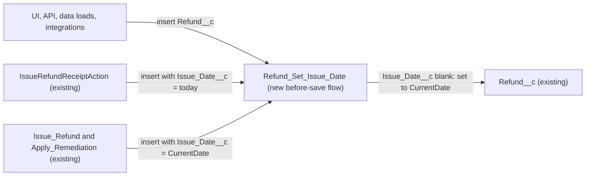

# Implementation spec — Default refund Issue Date to today on create

> Fill `Refund__c.Issue_Date__c` with today's date when a refund is created without one, for every creation path.

_Based on the requirement, the evidence reported by AskCoworker, and read-only org queries where noted. Assumptions and missing evidence are identified below. Specification only — nothing is implemented or deployed._

---

## 1. The requirement

When a `Refund__c` record is inserted with a blank `Issue_Date__c`, set `Issue_Date__c` to today; a date supplied by the caller is kept. The request contained no deploy, data-change, or credential instructions.

| # | Responsibility | Trigger | Where it lives |
| --- | --- | --- | --- |
| 1 | Set `Refund__c.Issue_Date__c` to today when it is blank | `Refund__c` insert (all creation paths) | New before-save flow `Refund_Set_Issue_Date` |
| 2 | Keep a caller-supplied `Issue_Date__c` unchanged | `Refund__c` insert | Entry condition of `Refund_Set_Issue_Date` |

## 2. Grounding — reuse before building

Target org: `TestWriteSpecDE` (Developer Edition, `00Dak00001COqNeEAL`, not a sandbox, time zone `America/Los_Angeles`). API version: `67.0`. _verified by org query_; `sourceApiVersion` `67.0` _verified by project file_.

- **`Refund__c`** (CustomObject) — the refund object; the only custom object whose name contains "refund" among the 110 custom objects listed. It has 0 records. _verified by org query_
- **`Refund__c.Issue_Date__c`** (CustomField, Date, label "Issue Date") — the target field. It is nillable, not calculated, and has no default value (`defaultValueFormula` is null). _verified by org query_ AskCoworker reports its description as "The date the refund was issued". _reported by AskCoworker_
- **`Refund__c.Processed_Date__c`** (CustomField, Date) — a different date (processing), not in scope. _verified by org query_
- **Automation on `Refund__c`:** no Apex trigger (Tooling `ApexTrigger WHERE TableEnumOrId = 'Refund__c'`: 0 rows; no trigger body in the org's 5 triggers mentions `Refund`), no record-triggered flow (`FlowDefinitionView` by object name and by `DurableId` `01Iak00000Dx4KP`: 0 rows), no validation rule (Tooling `ValidationRule`: 0 rows), and no workflow rule (Tooling `WorkflowRule`: 0 rows). _verified by org query_
- **Writers of `Refund__c.Issue_Date__c`** — complete for unmanaged Apex and for `MetadataComponentDependency`, which lists `IssueRefundReceiptAction`, the flows `Issue_Refund` and `Apply_Remediation`, and `Refund Layout`. _verified by org query_
  - **`IssueRefundReceiptAction`** (ApexClass) — line 90 sets `r.Issue_Date__c = Date.today();` before `insert r;` (line 100). It is the only unmanaged Apex class whose body contains `Refund__c`. _verified by org query_
  - **`Issue_Refund`** (Flow, active, AutoLaunchedFlow) — its `Create_Refund` element assigns `Issue_Date__c` from `$Flow.CurrentDate`. _verified by org query_
  - **`Apply_Remediation`** (Flow, active, AutoLaunchedFlow) — its `Create_Refund` element assigns `Issue_Date__c` from `$Flow.CurrentDate`. _verified by org query_
  - **`Refund__c-Refund Layout`** (Layout) — the only layout on `Refund__c`; it references the field, so users can create refunds in the UI with the field blank. _verified by org query_
- **`Refund_XSF_OS`** (Flow, managed namespace `runtime_commerce_oms`, PlatformEvent-triggered, inactive) — not a current writer. _verified by org query_
- **Field access to `Refund__c.Issue_Date__c`:** Read and Edit for `Agentforce_Reference_App`, `Pronto_Deep_Dive_Workshop`, and `sfdc_accelerate_dms`; Read only for `sfdc_a360_sfcrm_data_extract` and `sfdc_slack`; no profile rows. _verified by org query_ Callers with Edit (for example the `sfdc_accelerate_dms` integration), the UI, and data loads can insert refunds without the field; nothing sets it on those paths today. _verified by org query_ (no default, trigger, or record-triggered flow)

Candidates examined and rejected: a field default value on `Refund__c.Issue_Date__c` (see Section 3); an Apex trigger (a flow is sufficient); changing the three existing writers (they already set the date and do not cover other paths); `Gift_Certificate__c.Issue_Date__c`, reported by AskCoworker as the same concept on another object, is out of scope and was not examined further.

Evidence sources: Tooling `EntityDefinition`, `CustomField`, `ApexTrigger`, `ApexClass` bodies, `FlowDefinition`, `Flow.Metadata`, `ValidationRule`, `WorkflowRule`, `MetadataComponentDependency`, `Layout`, `FlowTest`; standard `FlowDefinitionView`, `FieldPermissions`, `Organization`, `DataStream`, and `Refund__c` counts; `sf sobject describe Refund__c`. AskCoworker returned no citedReferences.

## 3. Architecture

Why the pieces are drawn this way:

1. Every insert of `Refund__c` runs the new before-save flow, whatever the source. The entry condition `Issue_Date__c` Is Null = true means the flow only acts on records inserted without a date. _assumption (documented platform behavior)_
2. `IssueRefundReceiptAction`, `Issue_Refund`, and `Apply_Remediation` already supply the date, so the flow's entry condition is false for them and their behavior does not change. _verified by org query_ (their assignments); _assumption (documented platform behavior)_ (entry-condition evaluation)
3. A record-triggered before-save flow is used instead of the standard field default value because a default value (`TODAY()`) is applied only when the field is not supplied: a user can clear the pre-filled value on the new-record form, and an API caller can send an explicit null, and both would save a blank date. The before-save flow evaluates the value actually being saved. _assumption (documented platform behavior)_
4. Apex is not needed: the logic is one assignment on the triggering record. _assumption_

## 4. Metadata changes

**Automation**

- **Create `Refund_Set_Issue_Date`** — Flow. Record-triggered flow on `Refund__c`, `triggerType` `RecordBeforeSave`, `recordTriggerType` `Create`. Entry condition: `Issue_Date__c` Is Null = `true` (condition requirement "Run the flow for created records that meet the condition"). One Assignment element: `{!$Record.Issue_Date__c}` Equals `{!$Flow.CurrentDate}`. No other elements, no DML. Label "Refund: Set Issue Date". Status Active.

**Tests**

- **Create `Refund_Set_Issue_Date_Blank_Sets_Today`** — FlowTest for `Refund_Set_Issue_Date`. Initial `$Record`: a `Refund__c` with `Amount__c` 10 and `Issue_Date__c` blank; trigger type Create. Assertion: `{!$Record.Issue_Date__c}` equals `{!$Flow.CurrentDate}`.

## 5. Data 360 (Data Cloud) data involved

Not applicable — this change does not use Data 360. The org has 0 `DataStream` records. _verified by org query_ The `sfdc_a360_sfcrm_data_extract` permission set can read `Refund__c.Issue_Date__c`, but no data stream uses it. _verified by org query_

## 6. Security considerations

- **Execution context:** a before-save flow runs in system context without sharing and updates only the in-memory triggering record; it performs no DML and needs no CRUD or FLS grant. _assumption (documented platform behavior)_
- **Callers:** callers still need Create on `Refund__c`. A caller without Edit on `Refund__c.Issue_Date__c` (for example users of `sfdc_slack` or `sfdc_a360_sfcrm_data_extract`, which have Read only) still gets the date set, because the flow sets it. _verified by org query_ (grants); _assumption (documented platform behavior)_ (system context)
- **Permission sets and profiles:** no change. No new field is created, so no default field access is granted on deploy. _assumption_
- **Data exposure:** none; the flow writes today's date into an existing field that the same permission sets can already read. _verified by org query_ (grants)

## 7. Testing strategy

- **`Refund_Set_Issue_Date_Blank_Sets_Today`** (FlowTest) — insert with blank `Issue_Date__c` sets it to `$Flow.CurrentDate` (Responsibility 1).
- Recommended verification (manual, in a sandbox):
  1. Create a refund in the UI with Issue Date cleared; confirm Issue Date is today (Responsibility 1).
  2. Create a refund in the UI with a past Issue Date; confirm it is unchanged (Responsibility 2).
  3. Insert through the REST API without `Issue_Date__c`, and once with `"Issue_Date__c": null`; confirm both get today.
  4. Bulk: insert 200 `Refund__c` records through anonymous Apex or Data Loader, half without a date and half with a past date; confirm the blank ones get today and the supplied dates are unchanged.
  5. Edit an existing refund and clear Issue Date; confirm it stays blank (the requirement covers create only).
  6. Run `Issue_Refund` and the `IssueRefundReceiptAction` agent action in a sandbox; confirm Issue Date is today and no error occurs (regression).
  7. Load-bearing check (Section 8, Open 1): at 23:30 Pacific time, create a refund as a user in a later time zone and confirm the date matches the expected business date.
- `IssueRefundReceiptActionTest` exists and does not assert `Issue_Date__c`; it needs no change. _verified by org query_
- No test has been run.

## 8. Open decisions

### Open

1. **Which "today" (non-blocking, load-bearing for users outside the org time zone).** `$Flow.CurrentDate` is assumed to resolve in the running user's time zone, like Apex `Date.today()` used by `IssueRefundReceiptAction`. The org time zone is `America/Los_Angeles`. _verified by org query_ (time zone); _assumption (documented platform behavior)_ (resolution). Recommended default: accept; verify with Section 7 step 7.

### Resolved

- No question was asked of the user: the requirement names the object, field, event, value, and blank-only condition, and the design does not change any existing writer. _assumption_
- Scope is insert only; clearing the date on update is not covered, as the requirement says "created". _assumption_
- Mechanism: before-save flow chosen over a field default value and over an Apex trigger (Section 3). _assumption_
- Flow and FlowTest API names chosen; no existing flow or FlowTest with a similar name exists. _verified by org query_
- No backfill: `Refund__c` has 0 records, and 0 with a blank `Issue_Date__c`. _verified by org query_
- The existing unconditional assignments in `IssueRefundReceiptAction`, `Issue_Refund`, and `Apply_Remediation` are left as they are; removing them is not needed and would change existing components. _assumption_
- Correction: AskCoworker said `ValidationRule` cannot be queried; a Tooling query returned 0 rules on `Refund__c`. _verified by org query_
- Correction: AskCoworker said the bodies of `Issue_Refund` and `Apply_Remediation` could not be read and whether they set `Issue_Date__c` was unknown; Tooling `Flow.Metadata` shows both set it from `$Flow.CurrentDate`. _verified by org query_
- Correction: AskCoworker rejected a field default because `TODAY()` is not allowed as a Date default; that is wrong, `TODAY()` is a valid default formula. The default was rejected for the reason in Section 3 instead. _assumption (documented platform behavior)_ After this second wrong claim, every AskCoworker fact kept in this spec was verified by org query, except the field description.
- Correction: AskCoworker said Data Cloud will ingest `Issue_Date__c`; the org has 0 `DataStream` records. _verified by org query_
- Correction: AskCoworker's test plan listed Apex-style test methods inside the FlowTest; a FlowTest holds one scenario, so the other cases are manual checks in Section 7.
- The R call timed out once; a narrower retry covered security and Data 360. Runtime order (before-save flows run before before triggers, validation, and the save; they do not run on undelete) is stated from documented platform behavior. _assumption (documented platform behavior)_
- Dropped AskCoworker content not needed by the design: the `Gift_Certificate__c.Issue_Date__c` pattern, `Validate_Remediation`, `refundReceiptRenderer`, and `ProntoWalletPassService` details.
- A `DuplicateRule` query failed (wrong column name) and was not retried; it does not affect the design.

## 9. Change set

| # | Action | Type | API name | Module | Why |
| --- | --- | --- | --- | --- | --- |
| 1 | Create | Flow | `Refund_Set_Issue_Date` | force-app/main/default/flows | Sets `Issue_Date__c` to today on insert when blank, for every creation path |
| 2 | Create | FlowTest | `Refund_Set_Issue_Date_Blank_Sets_Today` | force-app/main/default/flowtests | Asserts the blank-date insert gets today's date |

One before-save record-triggered flow on `Refund__c` fills a blank `Issue_Date__c` on insert, with a Flow Test for its main outcome.

Total: 2 · Create: 2 · Update: 0 · Delete: 0
