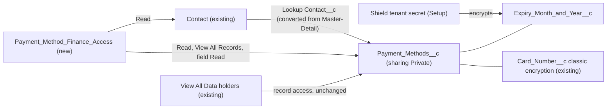

# Implementation spec — Payment Methods PII lock-down and encryption

> Make `Payment_Methods__c` records private, grant them only through a dedicated finance permission set, and apply Shield Platform Encryption to the sensitive text field that is not yet encrypted.

_Based on the requirement, the evidence reported by AskCoworker, and read-only org queries where noted. Assumptions and missing evidence are identified below. Specification only — nothing is implemented or deployed._

---

## 1. The requirement

Treat stored payment methods as PII: only the finance team can see them, and they are encrypted. The user scoped this to the `Payment_Methods__c` object (not the `Payment_Method__c` picklists on `Refund__c` and `Transaction__c`), asked for a Private organization-wide default with access only through a finance permission set, and asked for Shield Platform Encryption on the sensitive fields (_user decision_).

| # | Responsibility | Trigger | Where it lives |
| --- | --- | --- | --- |
| 1 | Records are private: users without an explicit grant cannot see `Payment_Methods__c` records | Record access at any time | `Payment_Methods__c` sharing model (after `Payment_Methods__c.Contact__c` becomes a Lookup) |
| 2 | The finance team can see all payment method records and their fields | Permission set assignment | `Payment_Method_Finance_Access` |
| 3 | Sensitive fields are encrypted at rest | Every write to the field | `Payment_Methods__c.Card_Number__c` (existing classic encryption), `Payment_Methods__c.Expiry_Month_and_Year__c` (Shield) |

## 2. Grounding — reuse before building

Target org: `TestWriteSpecDE` (Developer Edition, not a sandbox, `00Dak00001COqNeEAL`). API version: `67.0`. The project's `force-app` does not contain `Payment_Methods__c` source, so the object and its fields must be retrieved before editing (_verified by project file_).

- **`Payment_Methods__c`** (CustomObject, label "Payment Method") — the object the requirement protects. Internal and external sharing model `ControlledByParent`. 0 records. _verified by org query_
- **`Payment_Methods__c.Contact__c`** (CustomField, MasterDetail to `Contact`, relationship `Payment_Methods`, `reparentableMasterDetail` false, description "Customer"). The master-detail is why the object's sharing is `ControlledByParent`. _verified by org query_
- **`Payment_Methods__c.Card_Number__c`** (CustomField, `EncryptedText`, length 16, `maskType` `creditCard`, `maskChar` `X`, description "Credit card number") — already encrypted with classic encryption. _verified by org query_
- **`Payment_Methods__c.Expiry_Month_and_Year__c`** (CustomField, `Text`, length 5, description "Expiry month and year for the credit card: MM/YY") — plain text today. _verified by org query_
- **`Payment_Methods__c.Card_Type__c`** (Picklist, restricted: `Debit`, `Credit`), **`Payment_Methods__c.Payment_Method_Type__c`** (Picklist, restricted: `Visa`, `Mastercard`, `Amex`), **`Payment_Methods__c.Default_Payment_Method__c`** (Checkbox). _verified by org query_
- **`Contact`** — internal sharing model `ReadWrite`, external `Private`. _verified by org query_
- **Object access to `Payment_Methods__c`** (complete list from `ObjectPermissions`): System Administrator profile (CRUD, View All, Modify All); Analytics Cloud Integration User profile (Read, View All); managed permission sets `sfdc_a360_sfcrm_data_extract` "Data Cloud Salesforce Connector" (Read, View All), `sfdc_slack` "Slack Integration User" (Read, View All), `sfdc_accelerate_dms` "DMS Internal Only" (CRUD, View All, Modify All). _verified by org query_
- **Field access on the five fields** (complete list from `FieldPermissions`): only `sfdc_accelerate_dms` (Read and Edit), `sfdc_a360_sfcrm_data_extract` (Read), and `sfdc_slack` (Read). No profile, including System Administrator, has field access. _verified by org query_
- **The three managed permission sets** have namespace `sfdcInternalInt`, `Type` `Session`, one assignment each, and View All Data; they cannot be edited. The System Administrator and Analytics Cloud Integration User profiles also have View All Data. _verified by org query_
- **View Encrypted Data** is granted by no permission set or profile. _verified by org query_
- **Shield state**: `TenantSecret` returns 0 rows. The Shield Platform Encryption license cannot be confirmed with the allowed commands. _verified by org query_
- **References**: `MetadataComponentDependency` shows only `Payment Method Layout` referencing the five fields and nothing referencing the object; no unmanaged Apex class (70 scanned), Apex trigger (0 exist), or LWC source (58 resources scanned) mentions `Payment_Methods__c` or its fields; no flow is triggered on `Payment_Methods__c`, `Refund__c`, or `Transaction__c`; no validation rule exists on `Payment_Methods__c`. _verified by org query_
- **Data 360**: `SELECT COUNT() FROM DataStream` returns 0. _verified by org query_
- **Finance identity**: no permission set, permission set group, public group, or profile has a finance-related name; the role `CFO` exists with 0 active users; no active user has a Department value. `Payment_Method_Finance_Access` does not exist. _verified by org query_

Candidates examined and rejected: `Refund__c.Payment_Method__c` (Picklist: `Original Payment Method`, `Credit Card`, `Gift Certificate`, `Account Credit`, `Check`) and `Transaction__c.Payment_Method__c` (Picklist: `Credit Card`, `Gift Card`, `Credited Back to Original Card`, `Credited to a Gift Card`) — out of scope by user decision; `SubscriptionManagementBillingOperations`, `SubscriptionManagementPaymentOperations`, `SubscriptionManagementPaymentAdministrator`, `SubscriptionManagementBillingAdmin` (permission sets of `Type` `Group`, owned by permission set groups) and `PaymentsAdministrator` (namespace `force`, `Type` `Standard`) — platform-owned, not a finance-team identity for this object; `runtime_payments__GeneratePaymentLink` (flow, namespace `runtime_payments`) — managed Salesforce Payments flow with no reference to this object; a sharing rule for integrations (AskCoworker proposal) — not needed because those users have View All Data. _verified by org query_

Evidence sources: Tooling `CustomField`, `EntityDefinition`, `MetadataComponentDependency`, `ApexClass`, `ApexTrigger`, `LightningComponentResource`, `ValidationRule`, `Layout`, `FlexiPage` queries; standard-API `ObjectPermissions`, `FieldPermissions`, `PermissionSet`, `PermissionSetGroup`, `Group`, `UserRole`, `Profile`, `User`, `Organization`, `TenantSecret`, `DataStream`, `FlowDefinitionView` queries; `sobject describe` and `sobject list`. AskCoworker returned no citedReferences.

## 3. Architecture

Why the pieces are drawn this way:

1. `Payment_Methods__c` inherits sharing from `Contact` because `Contact__c` is a master-detail (_verified by org query_). A detail object cannot have its own organization-wide default, so `Contact__c` must become a Lookup before the sharing model can be `Private` (_assumption (documented platform behavior)_).
2. `Payment_Method_Finance_Access` is a new, dedicated permission set, because no finance identity exists and the design rules forbid widening broad sets (_verified by org query_). View All Records is needed because, under `Private`, finance users would otherwise see only records they own.
3. Shield Platform Encryption is applied per field through `encryptionScheme`; it needs an active Data tenant secret, created in Setup, not deployed (_assumption (documented platform behavior)_). `Card_Number__c` already uses classic encryption and cannot also take Shield encryption; the picklists and the checkbox are not field types Shield encrypts (_assumption (documented platform behavior)_).
4. View All Data holders keep record access under any sharing model (_assumption (documented platform behavior)_); the design cannot change the managed permission sets (_verified by org query_).
5. Everything is declarative. No Apex is needed.

## 4. Metadata changes

**Data model**

- **Update `Payment_Methods__c.Contact__c`** — CustomField. Change type from `MasterDetail` to `Lookup` (to `Contact`), keep the field required, set `deleteConstraint` to `Restrict`, keep label and relationship name `Payment_Methods`. Deployed on its own, before the sharing change. Retrieve the field before editing (not in `force-app`).
- **Update `Payment_Methods__c`** — CustomObject. Set `sharingModel` to `Private` and `externalSharingModel` to `Private`. Depends on the `Payment_Methods__c.Contact__c` conversion. Retrieve the object before editing.

**Encryption**

- **Update `Payment_Methods__c.Expiry_Month_and_Year__c`** — CustomField. Conditional: Shield Platform Encryption is licensed and an active Data tenant secret exists (0 `TenantSecret` rows today). Add `encryptionScheme` `ProbabilisticEncryption`; type stays `Text(5)`. The field is not filtered anywhere in the org, so probabilistic (stronger) encryption is enough.

**Security**

- **Create `Payment_Method_Finance_Access`** — PermissionSet, label "Payment Method Finance Access", description "Finance team access to customer payment methods (PII)". Object permissions: `Payment_Methods__c` Read and View All Records (no Create, Edit, Delete, or Modify All); `Contact` Read. Field permissions (Read only): `Payment_Methods__c.Card_Number__c`, `Payment_Methods__c.Expiry_Month_and_Year__c`, `Payment_Methods__c.Card_Type__c`, `Payment_Methods__c.Payment_Method_Type__c`, `Payment_Methods__c.Default_Payment_Method__c`. No View Encrypted Data. No profile gets field access.

## 5. Data 360 (Data Cloud) data involved

Not applicable — this change does not use Data 360. The Data Cloud connector permission set `sfdc_a360_sfcrm_data_extract` can read the object, but the org has 0 data streams (_verified by org query_).

## 6. Security considerations

- **Record access after the change.** With sharing `Private`, a user sees a `Payment_Methods__c` record only as its owner, through `Payment_Method_Finance_Access` (View All Records), or through View All Data (_assumption (documented platform behavior)_). Today only the two profiles and three managed permission sets listed in Section 2 have object access at all (_verified by org query_), so no other current user loses access.
- **Record ownership.** After the conversion the object gets an `OwnerId`; the creator owns each new record (_assumption (documented platform behavior)_). There are 0 records, so no ownership backfill is needed (_verified by org query_). An owner who is not in finance keeps access to their own record; see Section 8.
- **Field access.** New fields are not being added, so deployment gives no profile default access. After the change, field values are readable by `Payment_Method_Finance_Access` holders and by the three managed integration permission sets (_verified by org query_). System Administrator and Analytics Cloud Integration User profiles see records but none of the five fields (_verified by org query_); an administrator can still grant themselves access, which no design can prevent.
- **Encryption.** `Card_Number__c` is encrypted with classic encryption and shown masked (`creditCard`, `X`) to every user without View Encrypted Data; nobody has that permission (_verified by org query_), so finance users see the last four digits only. Shield encryption of `Expiry_Month_and_Year__c` protects the data at rest and is transparent to users with field Read, including finance users (_assumption (documented platform behavior)_). `Card_Type__c`, `Payment_Method_Type__c`, and `Default_Payment_Method__c` are protected by field-level security and sharing only.
- **Residual exposure.** The managed permission sets `sfdc_a360_sfcrm_data_extract`, `sfdc_slack`, and `sfdc_accelerate_dms` keep View All Data and field Read (plus Edit for `sfdc_accelerate_dms`) and cannot be changed by deployment (_verified by org query_). See Section 8.
- **Contact deletion.** With `deleteConstraint` `Restrict`, deleting a Contact that has payment methods fails until they are deleted; merge still reparents them to the surviving Contact (_assumption (documented platform behavior)_).
- **Reparenting.** After the conversion, users with Edit on the record can change `Contact__c` (_assumption (documented platform behavior)_). Finance users get no Edit. The object Edit holders are the System Administrator profile and `sfdc_accelerate_dms` (_verified by org query_).

## 7. Testing strategy

All changes are declarative, so there are no Apex or Flow tests. Run these manual checks in a sandbox (never claim they ran):

1. **Conversion (load-bearing, see Section 8).** Deploy the `Payment_Methods__c.Contact__c` change; confirm the field is a required Lookup to `Contact` with `Restrict` and that `Payment_Methods__c` now has an Owner field.
2. **Private sharing.** As a user with object Read through a test permission set but without View All Records, confirm that records owned by another user are not visible in list views, reports, or the Contact related list.
3. **Finance access.** Assign `Payment_Method_Finance_Access` to a test user; confirm they see every `Payment_Methods__c` record and all five fields, that `Card_Number__c` shows the `X` mask with the last four digits, and that New, Edit, and Delete are not available.
4. **Negative.** As a standard user with no grant, confirm a SOQL query on `Payment_Methods__c` fails with no object access and that the Contact page shows no Payment Methods related list.
5. **Shield (after the Setup steps).** Insert a record with `Expiry_Month_and_Year__c` = `12/27`; confirm the finance user reads `12/27`, and Setup > Encryption Statistics shows the field encrypted.
6. **Encryptable types.** In Setup > Encryption Policy > Encrypt Fields, confirm that `Card_Type__c`, `Payment_Method_Type__c`, and `Default_Payment_Method__c` are not offered for encryption.
7. **Contact delete.** Try to delete a Contact that has a payment method: expect a delete-restriction error. Merge two Contacts that each have a payment method: expect both records on the survivor.
8. **Bulk.** Insert 200 `Payment_Methods__c` records with Data Loader as an integration-style user; confirm all save and the finance user sees all 200.

## 8. Open decisions

### Open

1. **Shield license and tenant secret (blocking for delivery).** `Payment_Methods__c.Expiry_Month_and_Year__c` is Conditional: the org has 0 `TenantSecret` rows and the license cannot be read. Before deploying it: confirm the Shield Platform Encryption license, assign Manage Encryption Keys to a key administrator, and generate a Data tenant secret in Setup > Encryption Settings (setup steps, not metadata). If Shield is not licensed, the only alternative is classic encryption (change the field to `EncryptedText`), which needs no license.
2. **Master-detail conversion (blocking prerequisite, load-bearing).** The `Payment_Methods__c` sharing change depends on converting `Payment_Methods__c.Contact__c` to a Lookup. Verify case 1 in Section 7 in a sandbox first. Recommended default: `Restrict` on delete, which blocks Contact deletion while payment methods exist (the current behavior cascades the delete). If Contacts must stay deletable, ask Salesforce Support to enable cascade delete for lookups and use `Cascade`.
3. **Finance team members (blocking for delivery).** No finance group, role member, or department exists in the org. Setup step after deployment: assign `Payment_Method_Finance_Access` to the named finance users (placeholder: `{FINANCE_USERS}`).
4. **Managed integration access (non-blocking).** `sfdc_a360_sfcrm_data_extract` (Data Cloud connector), `sfdc_slack` (Slack integration), and `sfdc_accelerate_dms` (DMS) keep View All Data and field Read on all five fields; they are managed and cannot be edited. User had no preference. Recommended default: keep them (removing them breaks those integrations for all objects) and have the security owner review; if they must lose access, remove their permission set assignments in Setup.
5. **Finance write access (non-blocking).** The requirement says "see", so the permission set is read-only. Nothing in the org creates `Payment_Methods__c` records except users with CRUD (System Administrator, `sfdc_accelerate_dms`). If finance must create or correct payment methods, add Create and Edit.
6. **Non-finance record owners (non-blocking).** Under `Private`, whoever creates a record owns and sees it. If creators outside finance must not keep access, transfer ownership to a finance user or queue on create (a follow-on proposal, not in this inventory).
7. **`Card_Number__c` on Shield (non-blocking, proposal).** It is already encrypted at rest with classic encryption. Moving it to Shield means changing it to `Text` and losing the `creditCard` mask, which would show full numbers to finance; not recommended.
8. **Name field (non-blocking).** The standard `Name` (Text 80) holds free text; make sure no card data is entered there.

### Resolved

- **Scope** (_user decision_): "Scope is the `Payment_Methods__c` object only" — the `Refund__c` and `Transaction__c` picklists are out of scope.
- **Sharing and access model** (_user decision_): OWD `Private` with access through a finance permission set.
- **Encryption mechanism** (_user decision_): Shield Platform Encryption on sensitive fields; applied to `Expiry_Month_and_Year__c`, the only plain-text field of an encryptable type (_assumption (documented platform behavior)_).
- **Integration access** (_assumption_, user had no preference): keep the managed integration permission sets; see Open item 4.
- **Encryption scheme** (_assumption_): `ProbabilisticEncryption`, because no filter, report, or code uses the field.
- **View Encrypted Data** (_assumption_): not granted; finance sees the masked card number.
- **AskCoworker corrections** (_verified by org query_): D1 said `Refund__c` was the only object with payment method data and missed `Payment_Methods__c`; said `Transaction__c` had no payment fields (it has `Transaction__c.Payment_Method__c`); and said `Refund__c.Payment_Method__c` had one value (it has five). D2 said `sfdc_accelerate_dms` has Read, Create, Edit (it also has Delete, View All, and Modify All). R said the two profiles have field access (they have none), that Shield-encrypted values show as ciphertext without View Encrypted Data, and that Data Cloud is involved (0 data streams); these were corrected from documented behavior and queries. Dropped proposals: sharing rules for integrations, Shield changing the field type to `EncryptedText`, Apex tests, and a validation rule blocking reparenting.
- **Deployment sequence**: (1) retrieve `Payment_Methods__c`; (2) deploy `Payment_Methods__c.Contact__c` alone; (3) deploy `Payment_Methods__c` sharing and `Payment_Method_Finance_Access`; (4) assign the permission set; (5) Shield Setup steps, then deploy `Payment_Methods__c.Expiry_Month_and_Year__c`. Rollback: redeploy the retrieved metadata (the Lookup-to-Master-Detail reversal requires every record to have a Contact, which the required Lookup guarantees).

## 9. Change set

| # | Action | Type | API name | Module | Why |
| --- | --- | --- | --- | --- | --- |
| 1 | Update | CustomField | `Payment_Methods__c.Contact__c` | force-app/main/default/objects/Payment_Methods__c/fields | Master-detail to required Lookup so the object can have its own sharing model |
| 2 | Update | CustomObject | `Payment_Methods__c` | force-app/main/default/objects/Payment_Methods__c | Sharing model Private so only granted users see records |
| 3 | Update | CustomField | `Payment_Methods__c.Expiry_Month_and_Year__c` | force-app/main/default/objects/Payment_Methods__c/fields | Conditional on Shield: encrypt the plain-text expiry at rest |
| 4 | Create | PermissionSet | `Payment_Method_Finance_Access` | force-app/main/default/permissionsets | Finance-only read access to all payment method records and fields |

The object becomes independently shared and private, finance gets a dedicated read-only permission set with View All Records, and Shield encrypts the only remaining plain-text sensitive field.

Total: 4 · Create: 1 · Update: 3 · Delete: 0
