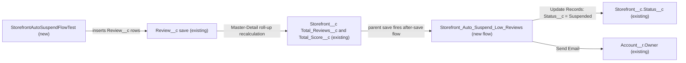

# Implementation spec — Auto-suspend Active storefronts with a low average review score

> When a review change leaves an Active storefront with at least 10 reviews and an average score below 2.5, set `Storefront__c.Status__c` to `Suspended` and email the owner of the storefront's Account.

_Based on the requirement, the evidence reported by AskCoworker, and read-only org queries where noted. Assumptions and missing evidence are identified below. Specification only — nothing is implemented or deployed._

---

## 1. The requirement

Automatically suspend a storefront whose average review score drops below 2.5 once it has at least 10 reviews. The user decided that only Active storefronts are suspended, that the related Account's owner is emailed, and that the rule is evaluated whenever a review is saved (*user decision*). The request contained no instruction to deploy or change data.

| # | Responsibility | Trigger | Where it lives |
| --- | --- | --- | --- |
| 1 | Set `Storefront__c.Status__c` from `Active` to `Suspended` when `Total_Reviews__c` >= 10 and the average score < 2.5 | A `Review__c` insert, update, delete, or undelete that recalculates the `Storefront__c` roll-ups | `Storefront_Auto_Suspend_Low_Reviews` (new record-triggered flow on `Storefront__c`) |
| 2 | Email the owner of `Storefront__c.Account__c` when a storefront is auto-suspended | Same save, after the status update | `Storefront_Auto_Suspend_Low_Reviews` (Send Email action) |
| 3 | Leave storefronts that are not `Active` unchanged | Same save | Entry condition of `Storefront_Auto_Suspend_Low_Reviews` |

## 2. Grounding — reuse before building

Target org: `TestWriteSpecDE` (Developer Edition, `00Dak00001COqNeEAL`, not a sandbox). API version: `67.0`.

- **`Storefront__c`** (CustomObject, `DurableId` `01Iak00000Dx4JV`, no namespace) — the object whose status changes. 21 records, all with `Status__c` = `Active`. _verified by org query_
- **`Storefront__c.Status__c`** (Picklist) — values `Active`, `Inactive`, `Pending Activation`, `Suspended`, `Closed`. `Suspended` already exists, so no picklist change is needed. _verified by org query_
- **`Review__c`** (CustomObject, `DurableId` `01Iak00000Dx4JW`) — `Review__c.Storefront__c` is a Master-Detail to `Storefront__c`. `Review__c.Rating__c` is a nullable Number(1, 0). `Review__c.Status__c` has values `Submitted`, `Published`; all 92 existing reviews have a blank `Status__c`, and 0 have a blank `Rating__c`. _verified by org query_
- **`Storefront__c.Total_Reviews__c`** (Roll-Up Summary) — `count` over `Review__c.Storefront__c`, no filter items. _verified by org query_
- **`Storefront__c.Total_Score__c`** (Roll-Up Summary) — `sum` of `Review__c.Rating__c`, no filter items. _verified by org query_
- **`Storefront__c.Average_Review_Score__c`** (Formula Number, precision 18, scale 1, `BlankAsZero`) — formula `Total_Score__c / Total_Reviews__c`. This is the org's existing "average review score". The new flow reuses its two inputs directly (see Section 3, item 3). _verified by org query_
- **`Storefront__c.Account__c`** (Lookup to `Account`, nullable) — populated on all 21 storefronts. It is the path to the email recipient (`Account__r.Owner`). No storefront's Account owner is an inactive user. _verified by org query_
- **Existing automation on both objects** — no unmanaged or managed Apex triggers on `Storefront__c` or `Review__c` (all 5 triggers in the org are on namespaced or platform objects); no record-triggered flows (`FlowDefinitionView` by `TriggerObjectOrEventId`, 0 rows); no validation rules (Tooling `ValidationRule`, 0 rows each). _verified by org query_
- **Writers of `Storefront__c.Status__c`** — `AgentUpdateStorefrontDetailsActions` (with sharing) sets `Status__c` from agent input. It is the only unmanaged Apex class that assigns the field (search of all 70 unmanaged Apex bodies). Flows could not be searched element by element; `MetadataComponentDependency` lists `Partner Quality Watchlist` (read-only lookup) and `StorefrontPickerController` (reads) as the other references. _verified by org query_
- **Writers of `Review__c`** — `AgentReviewActions` inserts `Review__c` with `Status__c` = `Submitted` (Apex body search, partial: flows not searched element by element). _verified by org query_
- **`Get_Partner_Quality_Watchlist`** (AutoLaunchedFlow, active) — reads `Status__c`, `Total_Reviews__c`, and `Average_Review_Score__c`, and returns only storefronts with `Status__c` = `Active`. Auto-suspended storefronts will drop out of this watchlist. _verified by org query_
- **Data shape** — the highest `Total_Reviews__c` today is 8, so no storefront meets the rule now and no backfill is needed. _verified by org query_
- **Email setup** — no `OrgWideEmailAddress` exists; no `EmailTemplate` with "Storefront" or "Suspen" in its `DeveloperName`. _verified by org query_
- **Name check** — no flow with "Suspen" in its `ApiName`; no Apex class named `StorefrontAutoSuspendFlowTest`. _verified by org query_

Candidates examined and rejected: a record-triggered flow on `Review__c` — roll-ups are recalculated after the child's after-save flows, so it would read stale totals (*assumption (documented platform behavior)*); an `EmailTemplate` component (proposed by AskCoworker) — a flow text template is enough for one plain notification; changing the roll-ups to count only `Published` reviews — the org's existing average counts all reviews and has other readers.

Evidence sources: `sf org display`; `sf sobject list --sobject custom`; `sobject describe` of `Storefront__c` and `Review__c`; Tooling `EntityDefinition`, `CustomField` (with `Metadata` by Id), `ApexTrigger`, `ValidationRule`, `MetadataComponentDependency`, `ApexClass` bodies, `Flow.Metadata` for `Get_Partner_Quality_Watchlist`, `CustomNotificationType`; standard `FlowDefinitionView`, `ObjectPermissions`, `FieldPermissions`, `OrgWideEmailAddress`, `EmailTemplate`, `DataStream`, `Organization`, and aggregate record counts. AskCoworker returned no citedReferences.

## 3. Architecture

Why the pieces are drawn this way:

1. A `Review__c` insert, update, delete, or undelete recalculates the unfiltered roll-ups on its master `Storefront__c`, and the parent record then goes through its own save, which runs record-triggered flows on `Storefront__c` (*assumption (documented platform behavior)*, order of execution). The roll-ups are *verified by org query*.
2. The automation lives on `Storefront__c`, not `Review__c`, because the child's after-save flows run before the roll-up recalculation (*assumption (documented platform behavior)*). A flow is chosen over Apex because the logic is one condition, one update, and one email; no Apex trigger exists on the object to extend (*verified by org query*).
3. The entry condition compares `Total_Score__c < 2.5 * Total_Reviews__c` instead of `Average_Review_Score__c < 2.5`. The formula has scale 1 (*verified by org query*), so a true average such as 32/13 = 2.46 would round to 2.5 and miss suspension (*assumption (documented platform behavior)*). With `Total_Reviews__c >= 10` there is no division and no blank or zero case.
4. The `ISCHANGED` guard on the two roll-ups means only review-driven score changes are evaluated (*user decision*: "evaluate whenever a review is saved"). A person who manually sets a suspended storefront back to `Active` is not overridden until the next review change (*assumption*).
5. The Send Email action is on the same path after the status update, and has a fault path so an email failure never rolls back the review save or the suspension (*assumption*, from design rule "missing targets do not block the main transaction").
6. The Apex test drives the flow through real `Review__c` DML, because the flow is driven by roll-up recalculation (spec-format testing rule).

## 4. Metadata changes

**Automation**

- **Create `Storefront_Auto_Suspend_Low_Reviews`** — Flow (record-triggered, after-save, `Storefront__c`, trigger "A record is updated", run "Every time a record is updated and meets the condition requirements"), delivered Active. Entry condition (formula): `ISPICKVAL({!$Record.Status__c}, "Active") && {!$Record.Total_Reviews__c} >= 10 && {!$Record.Total_Score__c} < 2.5 * {!$Record.Total_Reviews__c} && (ISCHANGED({!$Record.Total_Reviews__c}) || ISCHANGED({!$Record.Total_Score__c}))`. Elements: (1) Update Records on `$Record`: `Status__c` = `Suspended`. (2) Decision `Has_Owner_Email`: `{!$Record.Account__r.Owner.Email}` is not blank. (3) Send Email (core action `emailSimple`) to `{!$Record.Account__r.Owner.Email}`; subject "Storefront {!$Record.Name} has been suspended"; plain-text body from a flow text template with the storefront name, `Total_Reviews__c`, the average (`Total_Score__c / Total_Reviews__c`), and the record URL (`{!$Api.Partner_Server_URL_600}` host plus `$Record.Id` is acceptable; exact link format is the builder's choice). (4) Fault connector on the Send Email action to the end of the flow, so an email failure does not fail the transaction. Blank handling: roll-ups are never blank once `Total_Reviews__c >= 10`; the entry condition fails for fewer reviews. Module `force-app/main/default/flows`.

**Tests**

- **Create `StorefrontAutoSuspendFlowTest`** — ApexClass (`@IsTest`). Each method inserts an `Account` and a `Storefront__c` (`Status__c` = `Active`, `Account__c` set) inline, like `MerchantRiskScoreActionTest`, then inserts `Review__c` rows. Methods: 10 reviews with `Rating__c` = 1 suspends; 10 reviews with total 25 (exactly 2.5) stays `Active`; 9 reviews with `Rating__c` = 1 stays `Active`; an `Inactive` storefront with 10 low reviews stays `Inactive`; 13 reviews with total 32 (true average 2.46, displayed 2.5) suspends; deleting high-rated reviews so the rule becomes true suspends; bulk: 200 reviews across 10 storefronts (5 low, 5 high) suspends only the 5 low ones; a suspended storefront manually set back to `Active` without a review change stays `Active`. Module `force-app/main/default/classes`.

## 5. Data 360 (Data Cloud) data involved

Not applicable — this change does not use Data 360. The org has 0 `DataStream` records (*verified by org query*). The `sfdc_a360_sfcrm_data_extract` permission set has Read on `Storefront__c.Status__c` (*verified by org query*), but no stream ingests it today.

## 6. Security considerations

- **Execution context.** Record-triggered flows run in system context without sharing, so the status update succeeds whatever access the user who saved the review has (*assumption (documented platform behavior)*). Reviews are inserted through `AgentReviewActions` (with sharing) and by users with Create on `Review__c`: the `sfdc_accelerate_dms` permission set and the `System Administrator` profile (complete list, *verified by org query*).
- **CRUD/FLS.** No permission set or profile changes. The flow needs no user grants. Edit on `Storefront__c.Status__c` is held by `Agentforce_Reference_App` and `sfdc_accelerate_dms`; Read only by `sfdc_a360_sfcrm_data_extract`, `sfdc_slack`, and `Pronto_Deep_Dive_Workshop` (permission sets with `FieldPermissions` rows, *verified by org query*). These are unchanged.
- **Sender.** The Send Email action sends as the running user, which is the user whose save caused the recalculation, because no `OrgWideEmailAddress` exists (*verified by org query* for the address; *assumption (documented platform behavior)* for the sender). Emails sent to an address count against the org's daily single-email limit (*assumption (documented platform behavior)*).
- **Data exposure.** The email goes only to the Account owner, an internal user, and contains the storefront name, review count, average, and record link. It contains no customer (`Review__c.Customer__c`) or review comment data.
- **Downstream readers.** Suspended storefronts disappear from `Get_Partner_Quality_Watchlist` results, which are filtered to `Active` (*verified by org query*). This follows from the requirement and needs no change.

## 7. Testing strategy

| Behavior | Test | Kind |
| --- | --- | --- |
| Suspends at >= 10 reviews and average < 2.5 | `StorefrontAutoSuspendFlowTest` low-rating method | Apex DML test |
| Boundary: average exactly 2.5 and 9 reviews do not suspend | `StorefrontAutoSuspendFlowTest` boundary methods | Apex DML test |
| Rounding: 32/13 suspends although `Average_Review_Score__c` shows 2.5 | `StorefrontAutoSuspendFlowTest` rounding method | Apex DML test |
| Only `Active` storefronts change | `StorefrontAutoSuspendFlowTest` `Inactive` method | Apex DML test |
| Review delete makes the rule true | `StorefrontAutoSuspendFlowTest` delete method | Apex DML test |
| Bulk, mixed storefronts | `StorefrontAutoSuspendFlowTest` bulk method (200 reviews) | Apex DML test |
| Manual reinstatement not overridden without a review change | `StorefrontAutoSuspendFlowTest` reinstatement method | Apex DML test |

Recommended verification (manual, in a sandbox):

1. Create 10 reviews rated 1 on an Active storefront through the UI or the review agent action; confirm `Status__c` = `Suspended` and that the Account owner receives the email.
2. Confirm the email's sender, subject, body, and link.
3. Force the email fault path by temporarily setting Setup > Deliverability to "System email only" in the sandbox; confirm the review still saves and the storefront is still suspended.
4. Undelete a deleted low review from the Recycle Bin and confirm the storefront is re-evaluated.
5. Confirm Setup > Deliverability > Access level is "All email" in the target org.

Tests are proposed, not run.

## 8. Open decisions

### Open

1. **Email deliverability (blocking for delivery of responsibility 2).** The deliverability access level cannot be read with the allowed commands. If it is not "All email", the notification is not sent (the suspension still happens). Check Setup > Deliverability before go-live.
2. **Blank ratings count as reviews (non-blocking).** `Total_Reviews__c` counts reviews with a blank `Rating__c`, and `Total_Score__c` adds 0 for them, so they lower the average. Today 0 reviews have a blank rating (*verified by org query*). This matches the org's existing `Average_Review_Score__c`. Proposal, not in inventory: make `Review__c.Rating__c` required, or add `Rating__c` not-blank filters to both roll-ups (this would change `Average_Review_Score__c` for all its readers).
3. **Unpublished reviews count (non-blocking).** The roll-ups count `Submitted` and `Published` reviews alike, and `AgentReviewActions` inserts reviews as `Submitted`. Kept because the requirement's "average review score" matches the existing field (*assumption*). Proposal: filter the roll-ups on `Published` if moderation should come first.
4. **No automatic reinstatement (non-blocking).** The requirement asks only for suspension; a storefront whose score recovers stays `Suspended` until someone changes it (*assumption*, design rule: no opposite-direction behavior unless needed).
5. **Branded sender (non-blocking).** No `OrgWideEmailAddress` exists. Proposal: add one later and set it on the Send Email action.

### Resolved

- **Eligible statuses:** only `Active` storefronts are suspended (*user decision*).
- **Notification:** email the owner of `Storefront__c.Account__c` (*user decision*). The design-rule default of a notification to the record owner is replaced by this choice.
- **Trigger point:** evaluate whenever a review is saved (*user decision*); delivered through the roll-up-driven parent save with an `ISCHANGED` guard (*assumption*).
- **Rounding:** compare `Total_Score__c` to `2.5 * Total_Reviews__c` instead of the scale-1 formula (*assumption*).
- **Backfill:** not needed; the highest `Total_Reviews__c` is 8 (*verified by org query*).
- **AskCoworker corrections (record of conflicts):** (a) the inventory call claimed roll-ups are recalculated before a `Review__c` after-save flow runs and that roll-up updates do not fire flows on the parent; both contradict the documented order of execution, and they contradict AskCoworker's own discovery answer, so the flow was moved to `Storefront__c`. (b) The security call claimed the email is sent by the Automated Process user; a record-triggered flow sends as the running user (*assumption (documented platform behavior)*). (c) It claimed Data Cloud ingests `Status__c`; the org has 0 data streams (*verified by org query*). (d) It listed only `sfdc_accelerate_dms` with Create on `Review__c`; the `System Administrator` profile also has it (*verified by org query*). After two wrong claims, every AskCoworker fact kept in this spec was re-verified by org query.
- **Dropped AskCoworker proposals:** the `Storefront_Suspension_Notice` `EmailTemplate`, a `Review__c`-triggered flow, adding Create on `Review__c` to `Agentforce_Reference_App` (not needed by this requirement), and a shared test data factory.
- **Deployment sequence:** deploy `Storefront_Auto_Suspend_Low_Reviews` and `StorefrontAutoSuspendFlowTest` together; run the test class; then do the deliverability check in Open item 1. Check reports and list views that filter on `Status__c` = `Active` (non-blocking).

## 9. Change set

| # | Action | Type | API name | Module | Why |
| --- | --- | --- | --- | --- | --- |
| 1 | Create | Flow | `Storefront_Auto_Suspend_Low_Reviews` | force-app/main/default/flows | Suspends Active storefronts with >= 10 reviews and average < 2.5 after a review change, and emails the Account owner |
| 2 | Create | ApexClass | `StorefrontAutoSuspendFlowTest` | force-app/main/default/classes | Exercises the flow through `Review__c` DML, including boundaries, rounding, delete, and bulk |

One new after-save flow on `Storefront__c`, fired by roll-up recalculation from review saves, delivers the rule and the notification, with one Apex test class.

Total: 2 · Create: 2 · Update: 0 · Delete: 0
