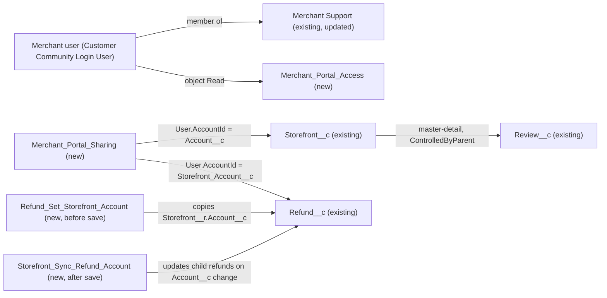

# Implementation spec — Merchant portal record visibility

> Merchant users in the `Merchant Support` Experience Cloud site see only the storefronts of their own account, and the reviews and refunds of those storefronts.

_Based on the requirement, the evidence reported by AskCoworker, and read-only org queries where noted. Assumptions and missing evidence are identified below. Specification only — nothing is implemented or deployed._

---

## 1. The requirement

External merchant users see `Storefront__c` records whose `Account__c` is their own account, and the `Review__c` and `Refund__c` records of those storefronts. The user decided that refund ownership follows `Refund__c.Storefront__c`, not `Refund__c.Business_Account__c` (*user decision*). Access is read-only, because the requirement says "see" (*assumption*). The Merchant Support Agent channel is out of scope (*assumption*; the user had no preference); see Section 8.

| # | Responsibility | Trigger | Where it lives |
| --- | --- | --- | --- |
| 1 | Merchant users see only storefronts where `Storefront__c.Account__c` is their account | Record access at query time | `Merchant_Portal_Sharing` (SharingSet), external OWD Private (existing) |
| 2 | Merchant users see only reviews of those storefronts | Record access at query time | `Review__c.Storefront__c` master-detail, ControlledByParent (existing) |
| 3 | Merchant users see only refunds of those storefronts | Refund create or `Storefront__c` change; storefront `Account__c` change | `Refund__c.Storefront_Account__c`, `Refund_Set_Storefront_Account`, `Storefront_Sync_Refund_Account`, `Merchant_Portal_Sharing` |
| 4 | Merchant users can reach the objects and the site | Login | `Merchant_Portal_Access` (PermissionSet), `Merchant Support` (Network) |

## 2. Grounding — reuse before building

Target org: `TestWriteSpecDE` (Developer Edition, `00Dak00001COqNeEAL`, not a sandbox). API version: `67.0`. _verified by org query_; `sourceApiVersion` `67.0` _verified by project file_.

- **`Storefront__c`**, **`Review__c`**, **`Refund__c`** (CustomObject) — external sharing model `Private`, `ControlledByParent`, `Private`; internal `ReadWrite`, `ControlledByParent`, `ReadWrite`. _verified by org query_ (EntityDefinition)
- **`Storefront__c.Account__c`** (Lookup to `Account`) — the merchant link. 21 storefronts, 0 with a blank `Account__c`. _verified by org query_
- **`Review__c.Storefront__c`** (Master-Detail to `Storefront__c`, relationship order 0) — reviews inherit storefront access. `Review__c` has no Account lookup; `Review__c.Customer__c` is the reviewer Contact. _verified by org query_
- **`Refund__c.Storefront__c`** (Lookup to `Storefront__c`, `deleteConstraint` `SetNull`, not required) and **`Refund__c.Business_Account__c`** (Lookup to `Account`, `deleteConstraint` `SetNull`, relationship name `Refunds`, description "The merchant or restaurant business account associated with this refund."). `Refund__c` has 0 records. _verified by org query_
- **Refund writers** (complete for unmanaged Apex bodies and the two flows that create `Refund__c`): `IssueRefundReceiptAction` (`with sharing`) sets `Storefront__c` when given but never `Business_Account__c`; flow `Apply_Remediation` sets `Storefront__c` but not `Business_Account__c`; flow `Issue_Refund` sets both. _verified by org query_ (Apex bodies, Tooling `Flow.Metadata`)
- **Automation on the three objects:** 0 Apex triggers and 0 record-triggered flows. _verified by org query_
- **Sharing sets:** 0 exist (standard-API `SharingSet` query). _verified by org query_
- **`Merchant Support`** (Network `0DBak000004izDaGAI`) — status `UnderConstruction`, path `merchantsvforcesite`. Its only member group is the `System Administrator` profile; the same is true of `Customer Support` and `ESW_Merchant_Service_Agent_1737676393072`. _verified by org query_
- **External users:** 0 active users with a `ContactId`; active user types are Guest (3), AutomatedProcess (3), Standard (4), CloudIntegrationUser (1), CsnOnly (1). _verified by org query_
- **`Customer Community Login User`** (Profile `00eak00000Q2rOAAAZ`, license `Customer Community Login`) exists. No profile or permission set of an external license grants any object permission on the three objects. _verified by org query_ (ObjectPermissions)
- **View All holders** on all three objects: permission sets `Agentforce_Reference_App`, `Pronto_Deep_Dive_Workshop`, `sfdc_accelerate_dms`, `sfdc_a360_sfcrm_data_extract`, `sfdc_slack`, and profiles `System Administrator` and `Analytics Cloud Integration User`. _verified by org query_ (ObjectPermissions, complete list)
- **`AgentStorefrontActions`** (ApexClass, `without sharing`) searches all `Storefront__c` by name and backs GenAiFunction `Get_Storefronts_By_Name` and three versioned copies, used in topics of planners `Merchant_Support_Agent_v1`, `Merchant_Support_Agent_AS_v1`, `Merchant_Support_Agent_AS_v2`. Bots `Merchant_Support_Agent` and `Merchant_Support_Agent_AS` are type `ExternalCopilot`. _verified by org query_
- **`StorefrontPickerController`** (ApexClass, `with sharing`, `@AuraEnabled`) serves LWC `storefrontSelector`; it respects the sharing set. _verified by org query_ (class body); LWC link _reported by AskCoworker_

Candidates examined and rejected: `Refund__c.Business_Account__c` as the refund sharing key — the user chose storefront ownership, and two of three writers never set it; `Merchant Support Profile` and `ESW_Merchant_Service_Agent_1737676393072 Profile` — Guest profiles (`Guest User License`), not authenticated merchant profiles (_verified by org query_); permission sets `Merchant_Management_Agent_Access`, `Merchant_Account_Manager_Agent_Access`, `Merchant_Support_Agent_Permissions` — agent access sets, not portal sets (_verified by org query_ by name and license).

Evidence sources: `sf org display`; `sf sobject list`; `sf sobject describe` on the three objects; Tooling `EntityDefinition`, `CustomField` (with `Metadata` by Id), `ApexTrigger`, `ApexClass` bodies, `Flow.Metadata`, `GenAiFunctionDefinition`, `GenAiPluginFunctionDef`, `GenAiPlannerFunctionDef`; standard `Network`, `NetworkMemberGroup`, `Profile`, `PermissionSet`, `ObjectPermissions`, `User`, `SharingSet`, `FlowDefinitionView`, `BotDefinition`, record counts. AskCoworker returned no citedReferences.

## 3. Architecture

Why the pieces are drawn this way:

1. External OWD is already `Private` for `Storefront__c` and `Refund__c` and `ControlledByParent` for `Review__c` (_verified by org query_), so the "only" part is already in place. The gap is a grant of the merchant's own records.
2. A sharing set is the standard mechanism for giving Customer Community Login users access to records that match their account. It can match only a lookup to `Account` or `Contact` on the target object itself (_assumption (documented platform behavior)_). `Storefront__c.Account__c` qualifies directly.
3. `Review__c` needs no mapping: master-detail children inherit access from the parent `Storefront__c` (_assumption (documented platform behavior)_).
4. `Refund__c` has no Account lookup that means "the storefront's merchant". A formula cannot be used in a sharing set (_assumption (documented platform behavior)_), so a new lookup `Refund__c.Storefront_Account__c` is kept in sync by a before-save flow on `Refund__c` and by an after-save flow on `Storefront__c` when the storefront changes merchant. Flows are chosen over Apex because the logic is a single field copy.
5. `Refund__c.Business_Account__c` is not overwritten: `Issue_Refund` and people set it, and changing its meaning would alter other callers (design rule: change in place only when no reader needs the old meaning).
6. The site had no external member; the `Merchant Support` Network gets the merchant profile as a member.

## 4. Metadata changes

**Data model**

- **Create `Refund__c.Storefront_Account__c`** — CustomField, Lookup(`Account`), label "Storefront Account", relationship name `Storefront_Refunds` (the name `Refunds` is already used by `Refund__c.Business_Account__c`), `deleteConstraint` `SetNull`, not required, description "Account of the refund's storefront. Set by automation; used for merchant portal sharing." Not placed on any layout; field access only through the permission set below (read-only) and for System Administrator.

**Automation**

- **Create `Refund_Set_Storefront_Account`** — Flow, record-triggered, before save, object `Refund__c`, on create and update. Entry: `ISNEW()` or `ISCHANGED({!$Record.Storefront__c})`. One Assignment: `{!$Record.Storefront_Account__c}` = `{!$Record.Storefront__r.Account__c}`; when `Storefront__c` is blank the result is blank, so a refund whose storefront is removed stops matching. No DML element.
- **Create `Storefront_Sync_Refund_Account`** — Flow, record-triggered, after save, object `Storefront__c`, on update only. Entry: `ISCHANGED({!$Record.Account__c})`. Get Records `Refund__c` where `Storefront__c` = `{!$Record.Id}`; loop assigns `Storefront_Account__c` = `{!$Record.Account__c}`; one Update Records on the collection. Runs in system context without sharing.

**Security**

- **Create `Merchant_Portal_Sharing`** — SharingSet, label "Merchant Portal Sharing", profiles: `Customer Community Login User`. Access mappings: `Storefront__c` — `User.AccountId` = `Storefront__c.Account__c`, Read Only; `Refund__c` — `User.AccountId` = `Refund__c.Storefront_Account__c`, Read Only. No `Review__c` mapping (ControlledByParent).
- **Create `Merchant_Portal_Access`** — PermissionSet, no license restriction, label "Merchant Portal Access". Object Read (no Create, Edit, Delete, View All, Modify All) on `Storefront__c`, `Review__c`, `Refund__c`. Field Read on the custom fields of `Storefront__c` (`Account__c`, `Address__c`, `Cuisine__c`, `Description__c`, `Image_URL__c`, `Phone__c`, `Primary_Contact__c`, `Status__c`, `Type__c`, `Menu_Count__c`, `Total_Reviews__c`, `Total_Score__c`, `Average_Review_Score__c`, `Storefront_Overview__c`, `Review_Summary__c`), `Review__c` (`Comments__c`, `Customer__c`, `Order_Date__c`, `Rating__c`, `Status__c`) and `Refund__c` (`Amount__c`, `Business_Account__c`, `Case__c`, `Contact__c`, `Issue_Date__c`, `Payment_Method__c`, `Processed_Date__c`, `Reason__c`, `Status__c`, `Storefront__c`). No field access on `Refund__c.Storefront_Account__c`.

**Other**

- **Update `Merchant Support`** — Network. Add profile `Customer Community Login User` to the site's member groups (current member: `System Administrator` only). Retrieve the Network before editing; no other site settings change.

**Tests**

- **Create `Refund_Set_Storefront_Account_Test`** — FlowTest for `Refund_Set_Storefront_Account`: (a) create with `Storefront__c` set asserts `Storefront_Account__c` equals the storefront's `Account__c`; (b) create with blank `Storefront__c` asserts blank; (c) update that changes `Storefront__c` asserts the new account; (d) update that clears `Storefront__c` asserts blank. Uses an existing `Storefront__c` record in the target sandbox.

## 5. Data 360 (Data Cloud) data involved

Not applicable — this change does not use Data 360.

## 6. Security considerations

- **Record access.** External OWD stays `Private` / `ControlledByParent` (_verified by org query_). The only grant to merchant users is `Merchant_Portal_Sharing`, Read Only. Reviews follow the parent storefront. Refunds with no storefront, or whose storefront has no account, are visible to no merchant.
- **Object and field access.** `Merchant_Portal_Access` grants Read only. Merchant users hold no object permission on these objects today (_verified by org query_). The new field `Refund__c.Storefront_Account__c` gets no field access in this permission set; deploying it grants no access to profiles outside the deployment (_assumption (documented platform behavior)_). Merchants see refund `Amount__c` and `Reason__c`, which the requirement implies ("see their refunds").
- **Profile scope of the sharing set.** The sharing set applies to every user of `Customer Community Login User`, in any site. No such users exist today (_verified by org query_). Without `Merchant_Portal_Access` such users still have no object access, so nothing is exposed to non-merchants.
- **View All bypass.** Seven permission sets and profiles grant View All on the three objects (Section 2). Assigning any of them to a merchant user would defeat the rule. Do not assign them to external users; this is a deployment guard, not a metadata change.
- **Flows** run in system context; merchants never write `Storefront_Account__c` directly because they have no Edit access.
- **Pre-existing exposure outside the portal.** `AgentStorefrontActions` is `without sharing` and returns any storefront by name through `Get_Storefronts_By_Name` in the external Merchant Support Agent planners. External agents run as the bot user (`BotUserId` `005ak00000gViHdAAK`, _verified by org query_), so the sharing set does not govern that path. See Section 8.

## 7. Testing strategy

- **`Refund_Set_Storefront_Account_Test`** (FlowTest) covers the four cases in Section 4. Flow Tests run one record, so bulk behavior is a manual check.
- **`Storefront_Sync_Refund_Account`**: its main outcome is updates to related records, so it gets manual checks, not a Flow Test.
- **Recommended verification (sandbox, manual):**
  1. Create two merchant Accounts, A and B, each with a Contact and a `Customer Community Login User` user holding `Merchant_Portal_Access`; activate `Merchant Support`.
  2. Create storefronts, reviews and refunds (with `Storefront__c`) for A and for B. Log in as A: A sees only A's storefronts, reviews and refunds; SOQL through the API as A returns the same. Repeat as B.
  3. Negative: a refund with `Business_Account__c` = A but `Storefront__c` of B is visible to B, not A (user decision on ownership).
  4. A refund with no `Storefront__c` is visible to neither merchant.
  5. Change a storefront's `Account__c` from A to B with 200 child refunds (Data Loader or anonymous Apex): all refunds move to B, with no limit errors; A loses access to the storefront, its reviews, and its refunds.
  6. Change a refund's `Storefront__c` from A's storefront to B's, then clear it: access moves to B, then to neither.
  7. Permissions: merchant users cannot create, edit, or delete any of the three objects, and cannot see `Refund__c.Storefront_Account__c`.
  8. Undelete a deleted refund: it keeps its `Storefront_Account__c` and the same merchant sees it again.

## 8. Open decisions

### Open

1. **Merchant users and site activation (blocking for delivery).** No external users exist and `Merchant Support` is `UnderConstruction` (_verified by org query_). Setup steps: create merchant Contacts under their Accounts, enable them as `Customer Community Login User` users, assign `Merchant_Portal_Access`, and activate the site. Without these no merchant sees anything.
2. **Merchant profile (non-blocking).** `Customer Community Login User` is a default (_assumption_; the user had no preference). It is load-bearing for `Merchant_Portal_Sharing` and `Merchant Support`: if merchants get another license (Customer Community Plus or Partner Community), change the profile in both rows. Verification case: Section 7 step 1.
3. **Merchant Support Agent path (non-blocking).** `Get_Storefronts_By_Name` (`AgentStorefrontActions`, `without sharing`) lets anyone who can chat with the external agent read any storefront by name. Whether the `Merchant Support` site embeds that agent cannot be read with the allowed commands. The user had no preference, so it stays out of scope (_assumption_). Recommended follow-up: before embedding the agent in the portal, scope that action to the verified merchant's account.
4. **Storefront deletion (non-blocking).** Deleting a storefront clears `Refund__c.Storefront__c` (`SetNull`, _verified by org query_) without firing refund automation (_assumption (documented platform behavior)_), so `Storefront_Account__c` keeps the former merchant and that merchant still sees those refunds. Proposal: a before-delete flow on `Storefront__c` that clears child `Storefront_Account__c`, if former-merchant access is unwanted.
5. **Page placement (non-blocking).** Portal pages and tabs for these objects were not checked; this spec delivers record visibility only. Exposing the objects on site pages is a separate change.

### Resolved

- **Refund ownership** follows `Refund__c.Storefront__c` (_user decision_).
- **Portal** is `Merchant Support`, the site named for merchants; the other merchant-named site, `ESW_Merchant_Service_Agent_1737676393072`, is an embedded-service site with a Guest profile (_assumption_, from the org's names).
- **Read-only access** (_assumption_), because the requirement says "see".
- **AskCoworker corrections:** it called `Merchant Support Profile` a portal profile; it is a Guest profile (_verified by org query_). It proposed updating the standard `Customer Community Login User` profile's object permissions; standard profiles' object permissions cannot be edited and design rules prefer a dedicated permission set, so `Merchant_Portal_Access` is used (_assumption (documented platform behavior)_). Its no-op `Review__c` sharing set row and separate sharing-set rows were merged into one `Merchant_Portal_Sharing`. Its `Conditional:` rows were settled by the user decision. Its before-save entry condition `Storefront__c != null` was changed so that clearing the storefront clears the account. Its claim that the View All permission sets cannot be assigned to external users is untraceable and is not relied on (Section 6 guard). After these two wrong claims, every kept AskCoworker fact was checked by org query except the `storefrontSelector` link.
- **Sharing rules and Apex managed sharing** were rejected: Customer Community Login users have no roles, so sharing rules and share rows cannot target them (_assumption (documented platform behavior)_).
- **Converting `Refund__c.Storefront__c` to master-detail** was rejected: it makes the storefront required, which breaks `IssueRefundReceiptAction` (storefront optional), and adds cascade delete.
- **Deployment sequence:** `Refund__c.Storefront_Account__c`, then `Refund_Set_Storefront_Account` and `Storefront_Sync_Refund_Account`, then `Merchant_Portal_Access` and `Merchant_Portal_Sharing`, then `Merchant Support`, then `Refund_Set_Storefront_Account_Test`. No backfill is needed: `Refund__c` has 0 records (_verified by org query_).

## 9. Change set

| # | Action | Type | API name | Module | Why |
| --- | --- | --- | --- | --- | --- |
| 1 | Create | CustomField | `Refund__c.Storefront_Account__c` | force-app/main/default/objects/Refund__c/fields | Account lookup a sharing set can match for storefront-owned refunds |
| 2 | Create | Flow | `Refund_Set_Storefront_Account` | force-app/main/default/flows | Keeps the refund's storefront account current on create and storefront change |
| 3 | Create | Flow | `Storefront_Sync_Refund_Account` | force-app/main/default/flows | Moves refund access when a storefront changes merchant |
| 4 | Create | SharingSet | `Merchant_Portal_Sharing` | force-app/main/default/sharingSets | Grants merchants Read on their own storefronts and refunds |
| 5 | Create | PermissionSet | `Merchant_Portal_Access` | force-app/main/default/permissionsets | Read object and field access for merchant users |
| 6 | Update | Network | `Merchant Support` | force-app/main/default/networks | Adds the merchant profile as a site member |
| 7 | Create | FlowTest | `Refund_Set_Storefront_Account_Test` | force-app/main/default/flowtests | Asserts the storefront account copy and clear |

A sharing set grants merchants their own storefronts directly and their refunds through a flow-maintained Account lookup, while reviews inherit access from the storefront.

Total: 7 · Create: 6 · Update: 1 · Delete: 0
