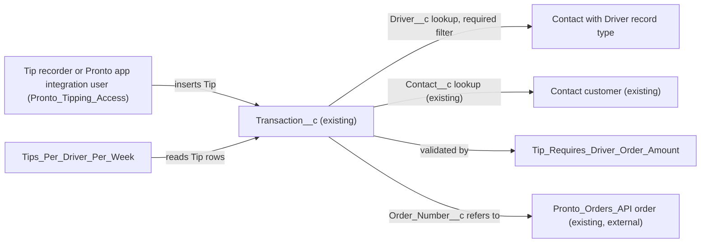

# Implementation spec — Driver tipping and weekly tips-per-driver report

> Record each customer tip against its external order and the driver who receives it, and report tip totals per driver per calendar week.

_Based on the requirement, the evidence reported by AskCoworker, and read-only org queries where noted. Assumptions and missing evidence are identified below. Specification only — nothing is implemented or deployed._

---

## 1. The requirement

Customers tip drivers, and the business needs a report of tips per driver per week. The user decided that each tip is recorded against the specific order it was given on (orders live in the external Pronto Orders API) and attributed to a driver (*user decision*). The request contained no deploy, data-change, or credential instruction.

| # | Responsibility | Trigger | Where it lives |
| --- | --- | --- | --- |
| 1 | Identify drivers as records a tip can point to | Driver onboarding (manual data step) | `Contact` with new record type `Contact.Driver` |
| 2 | Record a tip: amount, date, order number, driver, and tipping customer | Insert or update of a `Transaction__c` record with `Transaction_Type__c` = `Tip` | `Transaction__c` (existing) with new fields `Transaction__c.Driver__c` and `Transaction__c.Order_Number__c` |
| 3 | Reject tips without a driver, an order number, or a positive amount | Every save of a `Transaction__c` record | `Transaction__c.Tip_Requires_Driver_Order_Amount` |
| 4 | Report tips per driver per week | User runs the report | `Tipping_Reports/Tips_Per_Driver_Per_Week` |
| 5 | Give tip recorders and report viewers access | Permission set assignment | `Pronto_Tipping_Access` |

## 2. Grounding — reuse before building

Target org: `TestWriteSpecDE` (Developer Edition, `00Dak00001COqNeEAL`, not a sandbox). API version: `67.0`. _verified by org query_; `sourceApiVersion` `67.0` _verified by project file_.

- **`Transaction__c`** (CustomObject) — the existing payment ledger; reused to store tips. 0 records. Tooling `CustomField` lists 6 custom fields: `Contact__c`, `Payment_Method__c`, `Refund_Reason__c`, `Total_Amount__c`, `Transaction_Date__c`, `Transaction_Type__c`. `sobject describe` hides them from the running user (FLS). _verified by org query_
- **`Transaction__c.Contact__c`** (CustomField) — Lookup(`Contact`), label "Customer", relationship name `Transactions`, delete constraint `SetNull`. Holds the tipping customer. _verified by org query_
- **`Transaction__c.Total_Amount__c`** (CustomField) — Currency(7,2). Holds the tip amount. _verified by org query_
- **`Transaction__c.Transaction_Date__c`** (CustomField) — Date, description "Date of the transaction". Drives the weekly grouping. _verified by org query_
- **`Transaction__c.Transaction_Type__c`** (CustomField) — restricted Picklist with values exactly `Sale`, `Refund`. _verified by org query_
- **`Transaction__c-Transaction Layout`** (Layout) — the only layout on `Transaction__c`; it references all 6 custom fields (partial list of readers from `MetadataComponentDependency`: this layout only). _verified by org query_
- **Automation on `Transaction__c`**: no unmanaged Apex trigger (Tooling `ApexTrigger` returned 0 unmanaged triggers org-wide), no record-triggered flow (`FlowDefinitionView` on `01Iak00000Dx4KO`: 0), no validation rule (0). No unmanaged Apex class body mentions `Transaction__c`, "driver", "tip", "gratuity", or "courier". _verified by org query_
- **`Transaction__c` access today** (complete `ObjectPermissions` list): `System Administrator` profile (Read, Create, Edit, Delete); `Analytics Cloud Integration User` profile (Read); namespaced `sfdcInternalInt` permission sets `sfdc_accelerate_dms` (Read, Create, Edit, Delete), `sfdc_a360_sfcrm_data_extract` (Read), `sfdc_slack` (Read). No unmanaged permission set grants `Transaction__c`. _verified by org query_
- **Sharing**: `Transaction__c` and `Contact` internal sharing model `ReadWrite`, external `Private` (Tooling `EntityDefinition`). _verified by org query_
- **`Contact` record types**: `Customer_Contact` (187 records) and `Business_Contact` (11 records); no driver record type. `Contact` has 9 custom fields, none about drivers. No record-triggered flow or validation rule on `Contact`. _verified by org query_
- **`Pronto_Orders_API`** (NamedCredential) with `Pronto_Orders_API_Key` (ExternalCredential) — orders live in this external API. `OrderPickerController` states "orders live in an external system (the Heroku Orders API ...) not in a Salesforce Order object" and returns sample orders keyed by an `orderNumber` string. _verified by org query_
- **No driver or tip concept anywhere**: Tooling `CustomField` name search for Tip, Driver, Gratuit, Courier, Deliver, Dasher found only `Lead` fields `Current_Delivery_Partners` and `Delivery_Capability` (merchant onboarding) and Data 360 `ssot` fields. Standard `Order`, `WorkOrder`, and `ServiceResource` have 0 records. No report folder named like "Tip". `SELECT COUNT() FROM DataStream` = 0. _verified by org query_

Candidates examined and rejected: `Loyalty_Transaction__c` — loyalty points, not money (_reported by AskCoworker_); `Payment_Methods__c` — payment instrument, not an event (_reported by AskCoworker_); standard `Order` — 0 records, orders are external; `ServiceResource` — 0 records and needs Field Service setup for a reporting-only need; a new `Tip__c` object — `Transaction__c` already holds amount, date, customer, and type; `Contact.Pronto_App_Account_Id__c` — describes consumer accounts, not drivers (_reported by AskCoworker_); `Lead.Current_Delivery_Partners__c` — merchant onboarding data.

Evidence sources: `sf org display`; `sf sobject list` (custom and all); Tooling `CustomField` (by name and by object, `Metadata` by Id), `ApexClass` bodies, `ApexTrigger`, `ValidationRule`, `MetadataComponentDependency`, `Layout`, `FlexiPage`, `NamedCredential`, `ExternalCredential`, `EntityDefinition`; standard `RecordType`, `FlowDefinitionView`, `ObjectPermissions`, `FieldPermissions`, `PermissionSet`, `Report`, `Folder`, `TabDefinition`, `DataStream`, `Organization`, record counts. AskCoworker returned no citedReferences.

## 3. Architecture

Why the pieces are drawn this way:

1. `Transaction__c` is reused: it already has the amount, date, customer, and a type picklist, has 0 records, and no automation (_verified by org query_). A tip becomes a new `Transaction_Type__c` value `Tip` instead of a parallel object (design rule: change in place).
2. Drivers become `Contact` records with a new `Driver` record type, following the existing `Customer_Contact` / `Business_Contact` pattern (_verified by org query_). Drivers are not Salesforce users today: the only active standard users are admin and integration users (_verified by org query_). Choice of `Contact` over `User` or `ServiceResource` is an *assumption*.
3. The order is stored as text (`Order_Number__c`) because orders are not Salesforce records (_verified by org query_). No callout is added; the requirement only needs the reference.
4. Rules are declarative: one validation rule and a required lookup filter. No Apex or flow is needed.
5. The report uses the standard report type for `Transaction__c`, which includes lookup parent fields, so `Driver__c` can be a grouping (*assumption (documented platform behavior)*).

## 4. Metadata changes

**Data model**

- **Create `Contact.Driver`** — RecordType on `Contact`. Label "Driver", DeveloperName `Driver`, active, description "Delivery driver who receives customer tips." Include all current values of `Contact` picklists in the record type so Driver contacts are not restricted. Business process: none (Contact has none).
- **Update `Transaction__c.Transaction_Type__c`** — CustomField (restricted Picklist). Add the value `Tip` (label "Tip") after `Refund`. Keep `Sale` and `Refund` unchanged. No record type exists on `Transaction__c`, so no record-type picklist assignment is needed.
- **Create `Transaction__c.Driver__c`** — CustomField, Lookup(`Contact`). Label "Driver", relationship name `Driver_Tips`, relationship label "Driver Tips", not required at field level, delete constraint `Restrict` (a driver with tips cannot be deleted). Required lookup filter: Contact `Record Type` equals `Driver`, error message "Driver must be a Contact with the Driver record type." Help text "The driver who received this tip."
- **Create `Transaction__c.Order_Number__c`** — CustomField, Text(50). Label "Order Number", not unique, not required at field level. Description "Order number in the Pronto Orders API that this transaction relates to." Help text "Pronto order number the tip was given on."
- **Create `Transaction__c.Tip_Requires_Driver_Order_Amount`** — ValidationRule, active. Formula: `ISPICKVAL(Transaction_Type__c, "Tip") && (ISBLANK(Driver__c) || ISBLANK(Order_Number__c) || ISBLANK(Total_Amount__c) || Total_Amount__c <= 0)`. Error message: "A tip needs a driver, an order number, and an amount greater than zero." Error location: top of page. Blank handling: `ISBLANK(Total_Amount__c)` catches a blank amount before the comparison; a `0` amount fails the `<= 0` test. Non-Tip rows are never affected.

**UX**

- **Update `Transaction__c-Transaction Layout`** — Layout. Add `Driver__c` and `Order_Number__c` to the existing information section, next to `Transaction_Type__c`. No other field moves. This layout is shared by every user of `Transaction__c`; the change is additive only.

**Security**

- **Create `Pronto_Tipping_Access`** — PermissionSet, label "Pronto Tipping Access", no license. Object: `Transaction__c` Read, Create, Edit (no Delete, View All, or Modify All); `Contact` Read. Field access: Read and Edit on `Transaction__c.Transaction_Type__c`, `Transaction__c.Total_Amount__c`, `Transaction__c.Transaction_Date__c`, `Transaction__c.Contact__c`, `Transaction__c.Driver__c`, `Transaction__c.Order_Number__c`. Record type visibility: `Contact.Driver` visible (not default). Not granted: `Transaction__c.Payment_Method__c`, `Transaction__c.Refund_Reason__c`.

**Reporting**

- **Create `Tipping_Reports`** — ReportFolder, label "Tipping Reports". Shared as Viewer with All Internal Users; record and field visibility stays controlled by `Pronto_Tipping_Access`.
- **Create `Tipping_Reports/Tips_Per_Driver_Per_Week`** — Report, Summary format, standard report type for `Transaction__c` (`CustomEntity$Transaction__c`). Filter: `Transaction_Type__c` equals `Tip`. Groupings: first `Transaction__c.Driver__c` (driver name), then `Transaction__c.Transaction_Date__c` with date granularity Calendar Week. Aggregates: Sum of `Total_Amount__c` ("Total Tips") and record count ("Tip Count"). Detail columns: `Transaction_Date__c`, `Order_Number__c`, `Contact__c`, `Total_Amount__c`. Standard date filter on `Transaction_Date__c`, All Time.

## 5. Data 360 (Data Cloud) data involved

Not applicable — this change does not use Data 360. The namespaced `sfdc_a360_sfcrm_data_extract` permission set can read `Transaction__c` and its 6 existing fields, but `SELECT COUNT() FROM DataStream` returns 0, so nothing ingests `Transaction__c` today (_verified by org query_).

## 6. Security considerations

- **Execution context**: no Apex runs. Saves run as the user or integration user; the validation rule and the required lookup filter apply to UI and API saves (*assumption (documented platform behavior)*).
- **Sharing**: `Transaction__c` internal sharing is `ReadWrite` (_verified by org query_). Every internal user with object Read on `Transaction__c` can see every tip row. That is the existing model; no sharing change is made.
- **CRUD/FLS**: `Pronto_Tipping_Access` is the only grant this spec adds. Assign it to tip recorders (including any Pronto app integration user that writes tips) and to report viewers. Deploying the new fields gives no field access to any profile or permission set outside the deployment, including `System Administrator` (*assumption (documented platform behavior)*); admins who run the report also need `Pronto_Tipping_Access`.
- **Existing exposure, unchanged**: `sfdc_accelerate_dms`, `sfdc_a360_sfcrm_data_extract`, and `sfdc_slack` (namespace `sfdcInternalInt`, not editable) and the `Analytics Cloud Integration User` profile can read `Transaction__c`; the three permission sets also read `Total_Amount__c` and `Transaction_Type__c` (_verified by org query_). After this change they can see tip amounts, but not `Driver__c` or `Order_Number__c`, because nothing grants them those fields.
- **Data exposure**: tips per driver are driver earnings. Only holders of `Pronto_Tipping_Access` see `Driver__c`. The report folder is visible to all internal users, but a user without the field grants sees no driver grouping values.
- **Delete**: `Driver__c` uses delete constraint `Restrict`, so tip history cannot lose its driver. `Pronto_Tipping_Access` grants no Delete on `Transaction__c`.

## 7. Testing strategy

All changes are declarative; there are no Apex or Flow Tests. Recommended verification, run by a person in a sandbox with `Pronto_Tipping_Access` assigned:

1. **Driver record type**: create a `Contact` with record type `Driver`; confirm Driver contacts show all expected picklist values.
2. **Happy path**: insert a `Transaction__c` with `Transaction_Type__c` = `Tip`, a Driver contact in `Driver__c`, `Order_Number__c` = `10293`, `Total_Amount__c` = 5.00, and a customer in `Contact__c`; confirm it saves.
3. **Negative (validation rule)**: a Tip with blank `Driver__c`, blank `Order_Number__c`, blank `Total_Amount__c`, `Total_Amount__c` = 0, or `Total_Amount__c` = -1 is rejected with the rule's message. A `Sale` with all three blank saves.
4. **Start and stop matching**: update a `Sale` with blank `Driver__c` to `Tip`; confirm rejection. Update a valid Tip to `Sale`; confirm it saves and leaves the report.
5. **Lookup filter**: set `Driver__c` to a `Customer_Contact` record through the UI and through the API (for example Data Loader or anonymous Apex); confirm both are rejected.
6. **Delete**: delete a Driver contact that has a tip; confirm the delete is blocked. Delete a Driver contact with no tips; confirm it succeeds.
7. **Bulk**: load 200 valid Tip rows with Data Loader; confirm all save. Load 200 rows with blank `Driver__c`; confirm each fails with the rule's message.
8. **Report**: with tips for two drivers across two weeks (including a Saturday and the following Sunday), run `Tips_Per_Driver_Per_Week`; confirm one group per driver, one sub-group per calendar week, sums equal the loaded amounts, and `Sale` and `Refund` rows are excluded. Confirm the week start day for a user with locale `en_US` (load-bearing check for Section 8, item 3).
9. **Permissions**: a user without `Pronto_Tipping_Access` (and without another grant) cannot create a `Transaction__c` and sees no `Driver__c` values in the report. A holder cannot delete a `Transaction__c`.
10. **Report availability**: confirm `Transaction__c` appears as a report type in the report builder (load-bearing check for Section 8, item 1).

## 8. Open decisions

### Open

1. **Reports allowed on `Transaction__c` (blocking).** The report needs the object setting Allow Reports on `Transaction__c`; this setting cannot be read with the allowed commands (*assumption*). `Tipping_Reports/Tips_Per_Driver_Per_Week` depends on it. Check in Setup, Object Manager, Transaction, Edit, before deploying; if it is off, add an Update of the `Transaction__c` CustomObject with `enableReports` = true.
2. **Who records tips (blocking for delivery).** The requirement does not say whether tips arrive from the Pronto app (through the standard REST API using an integration user) or are entered by staff. The data model works for both. Recommended default: assign `Pronto_Tipping_Access` to whichever user writes tips; if it is an integration user, the external app owner configures it (setup step, not a row). No tips reach the report until a writer exists.
3. **Week definition (non-blocking).** Calendar Week grouping starts on the day defined by the running user's locale; for `en_US` (the org default locale, _verified by org query_) that is Sunday (*assumption (documented platform behavior)*). Recommended default: accept. If payroll weeks start on Monday, add a Date formula field for the week start and group on it.
4. **Driver onboarding (blocking for delivery).** No driver records exist (_verified by org query_). Data step: create one `Contact` per driver with record type `Driver`. Without them, no tip can pass the lookup filter.
5. **Duplicate tips per order (non-blocking).** `Order_Number__c` is not unique, so a customer can tip twice on one order and both are counted. Recommended default: allow (a second tip is real money). Proposal if needed: a uniqueness check on order number plus driver.
6. **Driver record type picklist values and layout (non-blocking).** The Driver record type uses the profile's default `Contact` page layout and the org default Contact record page (*assumption*). Confirm after deploy in Setup, Record Types, Page Layout Assignment.

Deployment sequence: `Contact.Driver` → `Transaction__c.Transaction_Type__c`, `Transaction__c.Driver__c`, `Transaction__c.Order_Number__c` → `Transaction__c.Tip_Requires_Driver_Order_Amount` → `Transaction__c-Transaction Layout` → `Pronto_Tipping_Access` → `Tipping_Reports` → `Tipping_Reports/Tips_Per_Driver_Per_Week`; then assign the permission set and create driver contacts. Rollback: remove the report, folder, permission set, validation rule, and new fields (no data exists today), remove the `Tip` value, and deactivate the record type.

### Resolved

- **Tips are tied to orders** (*user decision*): each tip stores the external order number and a driver.
- **Reuse `Transaction__c` with a `Tip` type instead of a new object** (*assumption*): it already holds amount, date, and customer; 0 records and no automation (_verified by org query_).
- **Drivers as `Contact` with a `Driver` record type** (*assumption*): matches the existing record-type pattern; drivers are not users today (_verified by org query_).
- **Required lookup filter and `Restrict` delete on `Driver__c`, amount must be greater than zero** (*assumption*): keeps weekly totals attributable. AskCoworker called the filter advisory by default; the spec defines it as required.
- **Correction: `Transaction__c` fields.** AskCoworker D1 called `Transaction__c` "a shell with no business fields", and the data-model inventory call said it has "0 custom fields" and proposed creating `Contact__c`, `Total_Amount__c`, `Transaction_Date__c`, and `Transaction_Type__c`. Tooling `CustomField` lists all six fields (they are hidden from describe by FLS) (_verified by org query_). Those Creates were dropped, and `Transaction_Type__c` became an Update. After this second wrong claim, every AskCoworker fact kept in this spec was re-checked by query or tagged.
- **Correction: access claims.** AskCoworker said `Agentforce_Reference_App` grants `Transaction__c` access; `ObjectPermissions` has no such row (_verified by org query_). It said new fields are granted automatically to `System Administrator` and `Analytics Cloud Integration User`; deploying a field grants no access outside the deployment (*assumption (documented platform behavior)*). It proposed sharing the report folder with permission set holders; folders are shared with users, groups, or roles, so the folder is shared with All Internal Users and data is gated by field access (*assumption (documented platform behavior)*).
- **Correction: report type.** AskCoworker suggested two Contact lookups may need a custom report type; the standard report type for a custom object includes each lookup's parent fields separately (*assumption (documented platform behavior)*), so none is added.
- **Dropped AskCoworker proposals**: a record-type filter on `Contact__c`, moving refund fields into a collapsed section of the shared layout, a unique External ID on the order number, a week-start formula field, a `Transaction__c` tab, a dashboard, and Data Cloud field grants (no data streams exist).

## 9. Change set

| # | Action | Type | API name | Module | Why |
| --- | --- | --- | --- | --- | --- |
| 1 | Create | RecordType | `Contact.Driver` | force-app/main/default/objects/Contact/recordTypes | Identify drivers a tip can point to |
| 2 | Update | CustomField | `Transaction__c.Transaction_Type__c` | force-app/main/default/objects/Transaction__c/fields | Add the `Tip` type to the existing ledger |
| 3 | Create | CustomField | `Transaction__c.Driver__c` | force-app/main/default/objects/Transaction__c/fields | Attribute each tip to a driver |
| 4 | Create | CustomField | `Transaction__c.Order_Number__c` | force-app/main/default/objects/Transaction__c/fields | Tie each tip to its external order |
| 5 | Create | ValidationRule | `Transaction__c.Tip_Requires_Driver_Order_Amount` | force-app/main/default/objects/Transaction__c/validationRules | Keep every tip reportable per driver |
| 6 | Update | Layout | `Transaction__c-Transaction Layout` | force-app/main/default/layouts | Let users enter driver and order number |
| 7 | Create | PermissionSet | `Pronto_Tipping_Access` | force-app/main/default/permissionsets | Access for tip recorders and report viewers |
| 8 | Create | ReportFolder | `Tipping_Reports` | force-app/main/default/reports | Shared home for the report |
| 9 | Create | Report | `Tipping_Reports/Tips_Per_Driver_Per_Week` | force-app/main/default/reports/Tipping_Reports | Tips per driver per week |

Tips are `Transaction__c` rows of type `Tip` linked to a Driver contact and an external order number, summarized by a weekly summary report.

Total: 9 · Create: 7 · Update: 2 · Delete: 0
