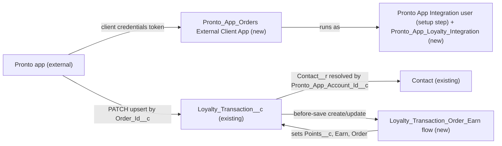

# Implementation spec — Loyalty points from Pronto app orders

> Let the Pronto consumer app send each order to Salesforce, and create one Earn loyalty transaction for the matching customer, calculated from the order total and never duplicated for the same order.

_Based on the requirement, the evidence reported by AskCoworker, and read-only org queries where noted. Assumptions and missing evidence are identified below. Specification only — nothing is implemented or deployed._

---

## 1. The requirement

When the Pronto app sends an order (`appAccountId`, `orderTotal`, `orderId`), Salesforce finds the Contact by `Contact.Pronto_App_Account_Id__c` and creates an Earn `Loyalty_Transaction__c` whose points come from the order total; a resend of the same `orderId` must not create a second transaction. The payload, the points basis (order total), and idempotency on `orderId` are *user decisions* from the clarifying answer; the points rate was not given and is a blocking placeholder.

| # | Responsibility | Trigger | Where it lives |
| --- | --- | --- | --- |
| 1 | Accept an order call from the Pronto app with an authenticated, least-privilege identity | Pronto app calls the Salesforce REST API | `Pronto_App_Orders` (External Client App, client credentials) and `Pronto_App_Loyalty_Integration` (permission set) |
| 2 | Match the customer by app account ID | Upsert request body references `Contact__r` by `Pronto_App_Account_Id__c` | Standard REST upsert; `Contact.Pronto_App_Account_Id__c` (existing) |
| 3 | Store the order reference and total, one transaction per order | Upsert by external ID `Loyalty_Transaction__c.Order_Id__c` | `Loyalty_Transaction__c.Order_Id__c`, `Loyalty_Transaction__c.Order_Total__c` |
| 4 | Calculate the points and mark the transaction as Earn from Order | Before-save on create, and on update when `Order_Total__c` changes | `Loyalty_Transaction_Order_Earn` (record-triggered flow) |

## 2. Grounding — reuse before building

Target org: `TestWriteSpecDE` (org ID `00Dak00001COqNeEAL`, connected). API version: `67.0` (`sourceApiVersion` in `sfdx-project.json`, *verified by project file*).

- **`Loyalty_Transaction__c`** (CustomObject) — the loyalty points ledger; reused. Fields: `Contact__c` Master-Detail(Contact), not reparentable, `writeRequiresMasterRead` false; `Points__c` Number(18, 0), description "The number of loyalty points involved in the transaction."; `Transaction_Type__c` picklist with active values `Earn`, `Redeem`; `Transaction_Source__c` picklist with active values `Order`, `Promotion`, `Manual Adjustment`; `Name` is an Auto Number. The Tooling `CustomField` list for the object has exactly these four custom fields, so it has no order ID or amount field. The object has 0 records. OWD is `ControlledByParent` (internal and external). _verified by org query_
- **`Contact.Pronto_App_Account_Id__c`** (CustomField) — Text(20), External ID, Unique; described as the identifier "Used to join app-side order/activity data to CRM Contact records". 198 of 198 Contacts have a value. It is the customer match key. _verified by org query_ (description first _reported by AskCoworker_, then confirmed by describe.)
- **`Contact`** — OWD internal `ReadWrite`, external `Private`. No Apex triggers and no record-triggered flows on `Contact` or `Loyalty_Transaction__c`. _verified by org query_
- **Automation and code on `Loyalty_Transaction__c`** — no Apex triggers, no flows (`FlowDefinitionView` by trigger object), no validation rules (Tooling `ValidationRule` by `EntityDefinitionId`). `MetadataComponentDependency` on the object and its four fields returns only `Loyalty Transaction Layout` and `Contact Layout`. A search of all 70 unmanaged Apex class bodies finds no reference to `Loyalty_Transaction`, `Pronto_App_Account_Id`, or `@RestResource`. So nothing creates loyalty transactions today and there is no inbound endpoint. _verified by org query_
- **Access today** — `ObjectPermissions` on `Loyalty_Transaction__c` (complete list): Create is granted only by `Agentforce_Reference_App`, the namespaced `sfdc_accelerate_dms`, and one profile; `sfdc_a360_sfcrm_data_extract`, `sfdc_slack`, and one profile have Read only. _verified by org query_
- **Integration identity** — the `Salesforce Integration` user license has 1 license, 0 used; the `Minimum Access - API Only Integrations` profile exists on that license. The only active `CloudIntegrationUser` is `Platform Integration User`. _verified by org query_
- **OAuth clients** — `ConnectedApplication` shows only standard tools (Dataloader, Workbench, and similar); Tooling `ExternalClientApplication` shows `Pronto_MCP_Access` and `Claude_Code_Access`. None is for the Pronto consumer app. _verified by org query_

Candidates examined and rejected:
- `Transaction__c` — has `Contact__c`, `Total_Amount__c` (Currency), `Transaction_Type__c` (values `Sale`, `Refund`), `Payment_Method__c`, `Refund_Reason__c`; 0 records. It is a payment record, and the requirement asks only for loyalty points, so the design does not store the order there. _verified by org query_
- Standard `Order` — 0 records; storing the order in Salesforce is not asked for. _verified by org query_
- Loyalty Management objects — none in the org's custom object list or reported. _verified by org query_ / _reported by AskCoworker_
- `Pronto_MCP_Access` — an existing External Client App for MCP access, not the consumer app; reusing it would share credentials across unrelated callers. _verified by org query_ (purpose is an *assumption* from its name)
- `Platform Integration User` — a platform-provided integration user shared by platform features; the app gets its own user instead (see Section 6). _verified by org query_
- `Agentforce_Reference_App` — already grants Create on the object, but it is a broad app permission set; design rules forbid widening it for an integration. _verified by org query_
- Named credentials `Pronto_Orders_API` and `Pronto_Pass_Factory` — outbound only; not used for an inbound call. _verified by org query_

Evidence sources: `sf org display`; `sf sobject list --sobject custom`; describes of `Loyalty_Transaction__c`, `Transaction__c`, `Contact`; Tooling `EntityDefinition`, `CustomField` (list and `Metadata`), `ApexTrigger`, `ValidationRule`, `MetadataComponentDependency`, `ApexClass` bodies, `ExternalClientApplication`, `NamedCredential`, `FlowDefinition`; standard `FlowDefinitionView`, `FieldDefinition`, `ObjectPermissions`, `FieldPermissions`, `User`, `Profile`, `UserLicense`, `ConnectedApplication`, aggregate counts. AskCoworker returned no citedReferences.

## 3. Architecture

Why the pieces are drawn this way:

1. The app calls the standard sObject REST upsert: `PATCH /services/data/v67.0/sobjects/Loyalty_Transaction__c/Order_Id__c/{orderId}` with body `{"Contact__r": {"Pronto_App_Account_Id__c": "{appAccountId}"}, "Order_Total__c": {orderTotal}}`. Upsert by an external ID and parent reference by an external ID are standard REST features, so no Apex endpoint is needed. _assumption (documented platform behavior)_
2. Idempotency comes from the unique external ID `Order_Id__c`: a first call creates the record (HTTP 201); a resend with the same `orderId` updates that same record (a success status with `"created": false`) instead of creating a second one. _assumption (documented platform behavior)_
3. The points rule lives in one before-save flow on `Loyalty_Transaction__c`, which is the standard declarative way to set fields on the record being saved. No other automation exists on the object. _verified by org query_ (absence); mechanism choice is an *assumption*.
4. The app does not send points, type, or source; the flow sets them, so the rate is held in one place in Salesforce. _user decision_ (points from order total); placement is an *assumption*.
5. Apex `@RestResource` was considered (custom payload shape, custom error messages) and rejected: the standard upsert already carries the three values, matches the Contact, and enforces one record per order. See Section 8 Resolved.

## 4. Metadata changes

**Data model**

- **Create `Loyalty_Transaction__c.Order_Id__c`** — CustomField, Text(255), label "Order ID", External ID, Unique (case-sensitive), not required (Promotion and Manual Adjustment transactions have no order). Description: "Pronto app order ID. One loyalty transaction per order; used as the upsert key by the Pronto app." No layout placement (integration-only field); field access only through `Pronto_App_Loyalty_Integration`.
- **Create `Loyalty_Transaction__c.Order_Total__c`** — CustomField, Currency(16, 2), label "Order Total", not required. Description: "Order total sent by the Pronto app; the basis for the points on Order transactions." No layout placement; field access only through `Pronto_App_Loyalty_Integration`.

**Automation**

- **Create `Loyalty_Transaction_Order_Earn`** — Flow, record-triggered on `Loyalty_Transaction__c`, before-save ("Fast Field Updates"), on create and update. Entry condition (formula): `NOT(ISBLANK({!$Record.Order_Total__c})) && (ISNEW() || ISCHANGED({!$Record.Order_Total__c}))`. One Assignment element: `{!$Record.Points__c}` = formula `FLOOR({!$Record.Order_Total__c} * {!POINTS_PER_CURRENCY_UNIT})`; `{!$Record.Transaction_Type__c}` = `Earn`; `{!$Record.Transaction_Source__c}` = `Order`. `POINTS_PER_CURRENCY_UNIT` is a Number constant whose value is the placeholder `{POINTS_PER_CURRENCY_UNIT}` (blocking; see Section 8). Blank handling: a blank `Order_Total__c` does not enter the flow; an `Order_Total__c` of 0 gives `Points__c` = 0. Delivered status: Active.
- **Create `Loyalty_Transaction_Order_Earn_Sets_Points`** — FlowTest for `Loyalty_Transaction_Order_Earn`: create path, initial `$Record` with `Order_Total__c` = 100 and no `Points__c`; asserts `Points__c` = `FLOOR(100 * {POINTS_PER_CURRENCY_UNIT})`, `Transaction_Type__c` = `Earn`, `Transaction_Source__c` = `Order`. Uses no org-specific record IDs.

**Security**

- **Create `Pronto_App_Loyalty_Integration`** — PermissionSet, label "Pronto App Loyalty Integration", license `Salesforce API Integration` (so it can be assigned to a `Salesforce Integration` user). Object permissions: `Loyalty_Transaction__c` Read, Create, Edit (Edit is needed for the update path of an upsert resend; no Delete); `Contact` Read, Edit (Edit is needed because `Contact__c` has `writeRequiresMasterRead` false, which requires Read/Write access to the parent Contact; no custom Contact field gets Edit). Field permissions: `Loyalty_Transaction__c.Order_Id__c` Read and Edit; `Loyalty_Transaction__c.Order_Total__c` Read and Edit; `Loyalty_Transaction__c.Points__c`, `Loyalty_Transaction__c.Transaction_Type__c`, `Loyalty_Transaction__c.Transaction_Source__c` Read only; `Contact.Pronto_App_Account_Id__c` Read only. System permission: API Enabled. Assigned only to the new Pronto app integration user (setup step).
- **Create `Pronto_App_Orders`** — ExternalClientApplication, label "Pronto App Orders", contact email of the integration owner (placeholder `{INTEGRATION_OWNER_EMAIL}`, non-blocking), distribution state Local.
- **Create `Pronto_App_Orders_oauth`** — ExtlClntAppOauthSettings for `Pronto_App_Orders`: OAuth scope `api` only; client credentials flow enabled. The consumer key and secret are generated by Salesforce and handed to the app owner out of band; they are never stored in source control.
- **Create `Pronto_App_Orders_oauthPlcy`** — ExtlClntAppOauthConfigurablePolicies for `Pronto_App_Orders`: permitted users "Admin approved users are pre-authorized"; client credentials run-as user = the Pronto app integration user. Delivered by Setup step: the run-as user is an org-specific username, so it is set in Setup (External Client App Manager, Policies) after the user exists.

## 5. Data 360 (Data Cloud) data involved

The design does not use Data 360. `sfdc_a360_sfcrm_data_extract` (namespace `sfdcInternalInt`, the Data Cloud CRM connector permission set) already has Read on `Loyalty_Transaction__c` and on `Points__c`, `Transaction_Type__c`, `Transaction_Source__c`. _verified by org query_ The new fields get no access for it; granting it is not needed by this requirement and the permission set is managed, so it is listed as a non-blocking proposal in Section 8.

## 6. Security considerations

- **Identity.** The app authenticates with the OAuth 2.0 client credentials flow against `Pronto_App_Orders` and runs as a new, dedicated user on the `Salesforce Integration` license (1 available, 0 used) with profile `Minimum Access - API Only Integrations`. _verified by org query_ (license and profile). The user and its assignment are setup steps (Section 8). The shared `Platform Integration User` is not used.
- **Execution context.** The REST upsert runs as the integration user, with its object permissions, field-level security, and sharing enforced. The before-save flow runs in system context, so it sets `Points__c`, `Transaction_Type__c`, and `Transaction_Source__c` even though the integration user has only Read on those fields. The app therefore cannot set or change the points itself. _assumption (documented platform behavior)_
- **CRUD/FLS.** Exactly as in `Pronto_App_Loyalty_Integration` (Section 4). No Delete on `Loyalty_Transaction__c`. `Contact` Edit is granted only because the master-detail sharing setting requires Read/Write on the parent; the user gets no Edit on any custom Contact field, but it can edit standard Contact fields through the API. That residual access is recorded as a non-blocking risk in Section 8. The master-detail field `Loyalty_Transaction__c.Contact__c` has no separate field-level security. _assumption (documented platform behavior)_
- **Sharing.** `Contact` internal OWD `ReadWrite` gives the integration user Read/Write on every Contact, so every app customer can be matched. `Loyalty_Transaction__c` is `ControlledByParent`. _verified by org query_
- **Default field access on deploy.** Deploying the two new fields grants no field access to any profile or permission set other than `Pronto_App_Loyalty_Integration`. Existing readers of the object (`Agentforce_Reference_App`, `sfdc_accelerate_dms`, `sfdc_a360_sfcrm_data_extract`, `sfdc_slack`, and the two profiles with object access) get no access to `Order_Id__c` or `Order_Total__c`. _assumption (documented platform behavior)_
- **Data exposure.** The app sends an account ID, an order ID, and an amount; no other personal data is stored. Errors return to the app in the REST response; no email or callout is sent. The consumer secret is a credential and must be delivered to the app owner through a secure channel, never in the spec, source control, or chat.

## 7. Testing strategy

Test components in the inventory:

| Test | Type | Behavior |
| --- | --- | --- |
| `Loyalty_Transaction_Order_Earn_Sets_Points` | FlowTest | Create with `Order_Total__c` = 100 sets `Points__c` = `FLOOR(100 * {POINTS_PER_CURRENCY_UNIT})`, `Transaction_Type__c` = `Earn`, `Transaction_Source__c` = `Order`. |

No Apex is in the design, so there are no Apex tests. Recommended verification (manual, in a sandbox, as the integration user with a client credentials token):

1. **New order.** `PATCH .../sobjects/Loyalty_Transaction__c/Order_Id__c/T-1001` with a known `Pronto_App_Account_Id__c` and `Order_Total__c` = 42.50. Expect HTTP 201, one record on that Contact, `Points__c` = `FLOOR(42.50 * rate)`, `Earn`, `Order`.
2. **Resend (idempotency, load-bearing).** Repeat the same call. Expect a success status without a new record, and still exactly one `Loyalty_Transaction__c` with `Order_Id__c` = `T-1001`; `Points__c` unchanged.
3. **Corrected total.** Resend `T-1001` with `Order_Total__c` = 50. Expect the same record, `Points__c` recalculated.
4. **Unknown customer.** Send an `appAccountId` that matches no Contact. Expect an HTTP 400 error naming the foreign key external ID, and no record created.
5. **Different customer on resend.** Resend `T-1001` with another Contact's `appAccountId`. Expect an error (`Contact__c` is not reparentable), and the original record unchanged.
6. **Zero and boundary totals.** `Order_Total__c` = 0 gives `Points__c` = 0; `Order_Total__c` = 9.99 with a rate of 1 gives 9 (FLOOR).
7. **Missing total.** Omit `Order_Total__c`. The record is created with blank `Points__c` and the flow does not run (entry condition); confirm the app always sends the total.
8. **Permissions.** As the integration user: `DELETE` of a `Loyalty_Transaction__c` fails with insufficient access; an attempt to set `Points__c` in the request body fails because the field is read-only for the user. A user without `Pronto_App_Loyalty_Integration` cannot obtain access through `Pronto_App_Orders` (not pre-authorized).
9. **Master access (load-bearing assumption).** Before go-live, confirm a create succeeds with `Contact` Read and Edit in the permission set; if it also succeeds with Read only, remove Contact Edit.
10. **Bulk.** Send 200 upserts through the Composite sObject Collections upsert (`PATCH .../composite/sobjects/Loyalty_Transaction__c/Order_Id__c`) with `allOrNone` false, including one unknown `appAccountId`. Expect 199 records with correct points and one error result.
11. **Delete and undelete.** An admin deletes a transaction and restores it from the Recycle Bin; confirm points and `Order_Id__c` are unchanged (the flow does not run on delete or undelete).

## 8. Open decisions

### Open

1. **Points rate (blocking for delivery).** The user wants points from the order total but gave no rate. `Loyalty_Transaction_Order_Earn` uses the constant `POINTS_PER_CURRENCY_UNIT` = `{POINTS_PER_CURRENCY_UNIT}` (points per 1 unit of currency, rounded down). The org stores no rate. Recommended default to confirm: 1 point per 1 currency unit.
2. **Integration user and assignment (blocking for delivery).** Setup steps: create user "Pronto App Integration" with the `Salesforce Integration` license and profile `Minimum Access - API Only Integrations`; assign `Pronto_App_Loyalty_Integration`; set it as the client credentials run-as user on `Pronto_App_Orders_oauthPlcy`; generate the consumer key and secret and deliver them to the app owner securely.
3. **App contract (blocking for delivery).** The app owner must call the upsert URL in Section 3 with `Order_Id__c` in the URL and `Contact__r.Pronto_App_Account_Id__c` and `Order_Total__c` in the body, handle HTTP 400 for unknown customers (retry after the Contact exists), and always send `Order_Total__c`.
4. **Contact Edit for the integration user (non-blocking).** Required by the master-detail Read/Write setting (*assumption (documented platform behavior)*), and it lets the user edit standard Contact fields. Verification case 9 checks it. Changing `Contact__c` to allow Read-only parent access would change behavior for every user who creates loyalty transactions, so it is not proposed.
5. **Refunds and cancellations (non-blocking).** The requirement covers orders only. A later refund or a corrected total updates the same record and recalculates points; a negative `Order_Total__c` would give negative points. No validation rule is added; a Redeem or reversal process is a separate requirement.
6. **Cleared total (non-blocking).** If an update clears `Order_Total__c`, the flow leaves the earlier `Points__c`. Only the app writes the field, and it always sends the total, so no reset logic is added.
7. **Proposals, not in this change set (non-blocking).** Grant Read on `Loyalty_Transaction__c.Order_Id__c` and `Loyalty_Transaction__c.Order_Total__c` to service users (for example through a new permission set) and add them to `Loyalty_Transaction__c-Loyalty Transaction Layout`; request Data Cloud connector access to the new fields if Data 360 needs them.

Deployment sequence: `Loyalty_Transaction__c.Order_Id__c` and `Loyalty_Transaction__c.Order_Total__c`, then `Loyalty_Transaction_Order_Earn` and `Loyalty_Transaction_Order_Earn_Sets_Points` (after the rate is set), then `Pronto_App_Loyalty_Integration`, then `Pronto_App_Orders`, `Pronto_App_Orders_oauth`, `Pronto_App_Orders_oauthPlcy`; then the setup steps in item 2.

### Resolved

- **Points basis, payload, idempotency** — *user decision*: the app sends `appAccountId`, `orderTotal`, `orderId`; points come from the order total; one transaction per `orderId`. Question asked: "How should the points for an order be determined: (A) the app sends the points, (B) a fixed number per order, or (C) calculated from the order total at a rate you give?"
- **Customer match key** — `Contact.Pronto_App_Account_Id__c` (External ID, Unique, described as the app-to-CRM join key, 198/198 populated). *assumption* decided from org semantics, no question needed.
- **Type and source values** — `Earn` and `Order` exist in the picklists (*verified by org query*); AskCoworker's T answer said the `Order` value was unknown (corrected).
- **Mechanism** — standard REST upsert plus a before-save flow instead of an Apex `@RestResource` (*assumption*): standard mechanism first; no Apex exists to reuse.
- **Correction: `Points__c` as a formula.** AskCoworker's I answer proposed creating or converting `Points__c` into a formula. `Points__c` already exists as Number(18, 0) (*verified by org query*), converting a field to a formula in place is not supported, and a formula would break Promotion, Manual Adjustment, and Redeem rows. Replaced by the before-save flow that sets the existing field.
- **Correction: upsert body.** AskCoworker's I answer used `"Contact__c": {"Pronto_App_Account_Id__c": ...}`; the parent reference uses the relationship name `Contact__r`. _assumption (documented platform behavior)_
- **Correction: resend is an update, not a no-op.** AskCoworker's I answer said a resend changes nothing and that the permission set needs no Edit. An upsert on an existing external ID updates the record, so `Loyalty_Transaction__c` Edit is granted. _assumption (documented platform behavior)_
- **Correction: parent access.** AskCoworker's R answer said Contact Read is enough with `writeRequiresMasterRead` false. The documented behavior of that setting is the opposite (Read/Write on the parent is required), so Contact Edit is granted (Open item 4).
- **Correction: cascade delete.** AskCoworker's R answer said children deleted with a Contact are permanently deleted. Detail records deleted with their master go to the Recycle Bin with it and are restored when the master is undeleted. _assumption (documented platform behavior)_
- **Correction: error code and tests.** AskCoworker named `INVALID_FIELD_FOR_INSERT_UPDATE` for an unknown external ID and proposed tests for a required `Order_Id__c` and for `Payment_Method__c` (a `Transaction__c` field). The spec does not rely on a specific error code, `Order_Id__c` is optional, and those tests were dropped.
- **Identity** — dedicated `Salesforce Integration` user and a new External Client App instead of `Platform Integration User`, `Pronto_MCP_Access`, or a JWT connected app (AskCoworker's I answer); client credentials needs no certificate. *assumption*
- **AskCoworker reliability** — after more than two wrong claims, every AskCoworker fact kept here was verified by org query or restated as documented platform behavior. D1 and R each timed out once and were retried with narrower calls.

## 9. Change set

| # | Action | Type | API name | Module | Why |
| --- | --- | --- | --- | --- | --- |
| 1 | Create | CustomField | `Loyalty_Transaction__c.Order_Id__c` | force-app/main/default/objects/Loyalty_Transaction__c/fields | Unique upsert key; one transaction per order |
| 2 | Create | CustomField | `Loyalty_Transaction__c.Order_Total__c` | force-app/main/default/objects/Loyalty_Transaction__c/fields | Stores the order total that the points come from |
| 3 | Create | Flow | `Loyalty_Transaction_Order_Earn` | force-app/main/default/flows | Sets `Points__c`, `Earn`, `Order` from the order total |
| 4 | Create | FlowTest | `Loyalty_Transaction_Order_Earn_Sets_Points` | force-app/main/default/flowtests | Tests the points calculation |
| 5 | Create | PermissionSet | `Pronto_App_Loyalty_Integration` | force-app/main/default/permissionsets | Least-privilege access for the app's integration user |
| 6 | Create | ExternalClientApplication | `Pronto_App_Orders` | force-app/main/default/externalClientApps | OAuth client for the Pronto app |
| 7 | Create | ExtlClntAppOauthSettings | `Pronto_App_Orders_oauth` | force-app/main/default/extlClntAppOauthSettings | Client credentials flow with `api` scope |
| 8 | Create | ExtlClntAppOauthConfigurablePolicies | `Pronto_App_Orders_oauthPlcy` | force-app/main/default/extlClntAppOauthPolicies | Pre-authorized users and run-as integration user |

The Pronto app upserts `Loyalty_Transaction__c` by a new unique `Order_Id__c` through the standard REST API, matching the Contact by `Pronto_App_Account_Id__c`, and a before-save flow turns the order total into Earn points.

Total: 8 · Create: 8 · Update: 0 · Delete: 0
