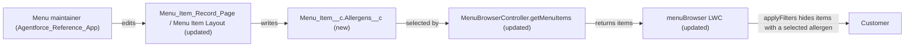

# Implementation spec — Menu item allergens and customer allergen filter

> Record the allergens of each menu item and let customers hide items that contain nuts, gluten, dairy, or shellfish in the existing menu browser.

_Based on the requirement, the evidence reported by AskCoworker, and read-only org queries where noted. Assumptions and missing evidence are identified below. Specification only — nothing is implemented or deployed._

---

## 1. The requirement

Store structured allergen information (nuts, gluten, dairy, shellfish) on each `Menu_Item__c` record, and let customers filter out items that contain any allergen they select. No user decision changed the scope, and the request contained no out-of-scope instruction.

| # | Responsibility | Trigger | Where it lives |
| --- | --- | --- | --- |
| 1 | Record which of Nuts, Gluten, Dairy, Shellfish a menu item contains | A user creates or edits a `Menu_Item__c` record | `Menu_Item__c.Allergens__c` on `Menu_Item_Record_Page` and `Menu_Item__c-Menu Item Layout` |
| 2 | Return allergen values to the customer menu UI | `menuBrowser` loads a menu | `MenuBrowserController.getMenuItems` |
| 3 | Let customers exclude items containing any selected allergen | Customer toggles an allergen checkbox | `menuBrowser` (`applyFilters`) |
| 4 | Give the users who maintain menu items access to the field | Permission set assignment | `Agentforce_Reference_App` |

## 2. Grounding — reuse before building

Target org: `TestWriteSpecDE` (org ID `00Dak00001COqNeEAL`, connected). API version: `67.0` (`sourceApiVersion` 67.0 in `sfdx-project.json`, _verified by project file_).

- **`Menu_Item__c`** (CustomObject, `DurableId` `01Iak00000Dx4JS`) — the menu item object. Its custom fields are exactly `Available__c`, `Calories__c`, `Description__c`, `Image_URL__c`, `Menu_Category__c`, `Menu__c`, `Price__c`; none records allergens. It holds 206 records. OWD is internal `ReadWrite`, external `Private`. _verified by org query_
- **No allergen or dietary field exists on any non-Data-360 object.** Tooling `CustomField` searches for `Allerg`, `Gluten`, `Nut`, `Dairy`, `Shellfish`, `Diet`, `Vegan` returned only data model object fields (`TableEnumOrId` starting `9sd`, for example `AllergyIntoleranceCategory`, `DietPreference`); `FieldDefinition` label scans on `Menu_Item__c`, `Menu__c`, `Menu_Category__c`, `Storefront__c`, `Storefront_Tag__c`, `Contact`, `Account`, `Product2` found none. _verified by org query_
- **`menuBrowser`** (LightningComponentBundle, `0Rbak000004r0ivCAA`) — the customer menu browser. Its meta file describes it as "A responsive menu browser component for displaying store menu categories and items with filtering capabilities" and exposes `lightningCommunity__Page` and `lightningCommunity__Default` targets. `applyFilters` already filters client-side by category, keyword, and `showVegetarian`/`showSpicy` checkboxes (keyword matches on `Name` and `Description__c`). _verified by org query_ (`LightningComponentResource` source)
- **`MenuBrowserController`** (ApexClass, `with sharing`) — `getMenuItems(String menuId)` selects `Id, Name, Description__c, Price__c, Image_URL__c, Menu_Category__c, Menu_Category__r.Name, Available__c, Calories__c` where `Available__c = true`; it does not enforce FLS. Its only referencing component is `menuBrowser` (`MetadataComponentDependency`). No test class named like `%MenuBrowser%` exists. _verified by org query_
- **`Menu_Item_Record_Page`** (FlexiPage, RecordPage for `Menu_Item__c`) — uses Dynamic Forms field instances for all seven custom fields. Activation and assignment could not be read. **`Menu_Item__c-Menu Item Layout`** (Layout, `00hak00000dDr1PAAS`) is the object's only layout. _verified by org query_
- **`Agentforce_Reference_App`** (PermissionSet, no namespace, 1 assignment) — grants Read/Create/Edit on `Menu_Item__c` and field access on its 7 custom fields. The other permission sets with `Menu_Item__c` access (`sfdc_accelerate_dms`, `sfdc_a360_sfcrm_data_extract`, `sfdc_slack`) are in namespace `sfdcInternalInt` and cannot be edited. Profiles with `Menu_Item__c` object access are `System Administrator` and `Analytics Cloud Integration User`; neither has a `FieldPermissions` row for any `Menu_Item__c` field. _verified by org query_
- **No automation on `Menu_Item__c`:** 0 Apex triggers, 0 record-triggered flows (`FlowDefinitionView`), 0 validation rules. _verified by org query_
- **Other readers and writers of `Menu_Item__c`** (`MetadataComponentDependency`, complete for Apex references found): `AgentGetMenuItemsActions`, `AgentUpdateMenuItemActions`, `AgentUpdateMenuItemPriceActions`, `AgentCreateMenuWithItemsActions`, `MenuBrowserController`, `MenuDescriptionPromptGrounding`. The agent actions (`Get_Menu_Items`, `Update_Menu_Item`, `Create_Menu_with_Items` and per-agent copies) belong to merchant agents; the planners in the org are `Merchant_Management_Agent_v1`, `Merchant_Support_Agent_*`, `Merchant_Account_Manager_Agent_v1`, and `SearchAgent`. _verified by org query_ `AgentGetMenuItemsActions` validates that the menu belongs to the caller's `accountId` (merchant ownership). _verified by org query_ (class body)
- **Experience sites:** `Customer Support`, `Merchant Support`, and `ESW_Merchant_Service_Agent_1737676393072`, all `UnderConstruction`. _verified by org query_
- **Data 360:** `SELECT COUNT() FROM DataStream` returned 0. _verified by org query_

Candidates examined and rejected: `Menu_Item__c.Description__c` — free text (Text Area 255), not a controlled or filterable value set; `Storefront_Tag__c` — its only custom field is `Storefront__c`, it tags storefronts, not items; the merchant agent actions — they serve merchants, not customers, so extending them is not needed (Section 8 proposal); data model object fields `AllergyIntoleranceCategory` and `DietPreference` — Data 360 objects unrelated to menu items.

Evidence sources: `sf org display`; `sf sobject list`; `sobject describe` of `Menu_Item__c` and `Storefront_Tag__c`; Tooling `EntityDefinition`, `CustomField`, `FieldDefinition`, `ApexTrigger`, `ValidationRule`, `MetadataComponentDependency`, `LightningComponentBundle`, `LightningComponentResource`, `AuraDefinitionBundle`, `FlexiPage` (with `Metadata` for three record pages), `Layout`, `ApexClass` bodies, `GenAiFunctionDefinition`, `GenAiPlannerDefinition`; standard `FlowDefinitionView`, `ObjectPermissions`, `FieldPermissions`, `PermissionSet`, `PermissionSetAssignment`, `Network`, `DataStream`. AskCoworker (D1, D2, I, R, T) returned no citedReferences.

## 3. Architecture

Why the pieces are drawn this way:

1. `Menu_Item__c.Allergens__c` is a new restricted multi-select picklist with the four values the requirement names. A multi-select picklist is the standard mechanism for a fixed set of values where an item can have several; no automation is needed because the value is entered data, not derived.
2. `MenuBrowserController.getMenuItems` is the only data source of `menuBrowser` (_verified by org query_). It only gains `Allergens__c` in its SELECT; its signature, sharing mode, and `Available__c` filter are unchanged.
3. The allergen filter lives in `menuBrowser.applyFilters`, next to the existing Vegetarian and Spicy filters, so all item filtering for this component stays in one place and needs no new Apex parameter. Code is used because the customer UI is already an LWC; there is no declarative filter UI to reuse.
4. Record page and layout placement plus the `Agentforce_Reference_App` grant let the users who maintain menu items set the value.

## 4. Metadata changes

**Data model**

- **Create `Menu_Item__c.Allergens__c`** — CustomField, Multi-Select Picklist, label "Allergens", restricted value set: `Nuts`, `Gluten`, `Dairy`, `Shellfish` (labels equal to API values), no default, visible lines 4, not required. Description: "Allergens this menu item contains. Blank means no allergens have been recorded." Help text: "Select every allergen the item contains." Not required because the 206 existing items have no value yet and no existing writer sets it.

**Apex**

- **Update `MenuBrowserController`** — ApexClass. Add `Allergens__c` to the SELECT list of `getMenuItems`. No other change: signature, `with sharing`, `Available__c = true` filter, and ordering stay as they are.

**Tests**

- **Create `MenuBrowserControllerTest`** — ApexClass (`@isTest`). Creates a `Storefront__c`, `Menu__c`, `Menu_Category__c`, and `Menu_Item__c` records (with `Allergens__c` = `Nuts;Dairy`, blank, and an unavailable item) and asserts that `getMenuItems` returns `Allergens__c` values, still returns blank-allergen items, still excludes unavailable items, and that `getMenuCategories` counts are unchanged (regression).

**UX**

- **Update `menuBrowser`** — LightningComponentBundle. Add four checkboxes labelled "No nuts", "No gluten", "No dairy", "No shellfish" beside the existing Vegetarian and Spicy filters, tracked in one `excludedAllergens` array. In `applyFilters`, when `excludedAllergens` is not empty, hide any item where `(item.Allergens__c || '').split(';')` contains any excluded value (an item is hidden if it contains any selected allergen). Show each item's allergens on its card as "Contains: {values}", or "Allergens not provided" when blank. Add a Jest test in `__tests__/menuBrowser.test.js` that mocks `getMenuItems` and asserts the exclusion logic (single, multiple, none selected, blank item shown).
- **Update `Menu_Item_Record_Page`** — FlexiPage. Add a Dynamic Forms field instance for `Record.Allergens__c` in the field section that holds `Calories__c`.
- **Update `Menu_Item__c-Menu Item Layout`** — Layout. Conditional: needed only if `Menu_Item_Record_Page` is not the activated record page for all apps and profiles (activation cannot be read). Add `Allergens__c` below `Calories__c`.

**Security**

- **Update `Agentforce_Reference_App`** — PermissionSet. Add field permission Read and Edit on `Menu_Item__c.Allergens__c`, matching the access it already grants on `Menu_Item__c.Calories__c`.

## 5. Data 360 (Data Cloud) data involved

Not applicable — this change does not use Data 360. The org has 0 data streams (_verified by org query_); the managed `sfdc_a360_sfcrm_data_extract` permission set will not receive access to the new field.

## 6. Security considerations

- **Execution context:** `MenuBrowserController` runs `with sharing` and does not enforce FLS (_verified by org query_, class body). After the change it returns `Allergens__c` to any user who can run the class and read the `Menu_Item__c` records, whatever their FLS on the field. This matches how it already returns `Calories__c` and `Price__c`; allergen values are not sensitive and customers need them. _assumption_
- **CRUD/FLS:** Deploying the new field grants no field access to any profile or permission set not in the deployment. `Agentforce_Reference_App` gets Read and Edit. `System Administrator` and `Analytics Cloud Integration User` get nothing, matching the current state, where neither profile has any `Menu_Item__c` field permission (_verified by org query_). The managed permission sets `sfdc_accelerate_dms`, `sfdc_a360_sfcrm_data_extract`, `sfdc_slack` cannot be edited and get no access.
- **Customer access:** No customer-facing profile or site guest user has `Menu_Item__c` access today, and `menuBrowser` is not placed on any page found (_verified by org query_). Publishing the browser to customers is an existing gap outside this change (Section 8, item 1).
- **Data exposure:** Only allergen values are added to the existing payload. No sharing change.

## 7. Testing strategy

| Test | Behavior |
| --- | --- |
| `MenuBrowserControllerTest.getMenuItems_returnsAllergens` | Item with `Nuts;Dairy` comes back with that `Allergens__c` value |
| `MenuBrowserControllerTest.getMenuItems_blankAllergensStillReturned` | Item with blank `Allergens__c` is returned |
| `MenuBrowserControllerTest.getMenuItems_excludesUnavailable` | Regression: `Available__c = false` items are still excluded |
| `MenuBrowserControllerTest.getMenuItems_bulk` | 200 items under one menu, mixed allergen values, all returned in one call |
| `MenuBrowserControllerTest.getMenuCategories_unchanged` | Regression: category item counts unchanged |
| `menuBrowser` Jest: exclusion logic | "No nuts" hides `Nuts;Dairy`; "No nuts" + "No gluten" hides items with either; no checkbox hides nothing; blank-allergen item stays visible; combined with the Vegetarian filter |

Tests set data up directly and do not rely on permission set assignments, because the controller does not enforce FLS.

Recommended verification (manual, in a sandbox):

1. As a user with `Agentforce_Reference_App`, open a `Menu_Item__c` record, set `Allergens__c` to `Gluten;Shellfish`, save, and confirm the value shows on the record page (and on the layout if row 6 applies).
2. Confirm a user without `Agentforce_Reference_App` cannot see the field on the record page.
3. Place `menuBrowser` on a test Lightning app page for a menu, select "No gluten", and confirm the `Gluten;Shellfish` item disappears and blank items stay with "Allergens not provided".
4. Confirm the existing Vegetarian, Spicy, keyword, and category filters behave as before.

## 8. Open decisions

### Open

1. **Customer channel for `menuBrowser` (blocking for delivery to customers).** `menuBrowser` is not placed on any record page checked, `MetadataComponentDependency` shows no page using it, and all three Experience sites are `UnderConstruction` with no customer profile holding `Menu_Item__c` access (_verified by org query_). The filter works wherever the component is placed, but customers reach it only once a customer page hosts it and grants Read on `Menu_Item__c`, `Menu_Category__c`, the new field, and `MenuBrowserController`. Recommended default: handle publishing in a separate change once the customer site is chosen.
2. **Backfill of allergen values (blocking for delivery).** All 206 existing `Menu_Item__c` records have no `Allergens__c` value (_verified by org query_ for the count; the field is new). Until they are populated, the filter hides nothing. Data step: menu maintainers set the value per item after deployment (record page or Data Import Wizard with a CSV export first as backup; rollback is re-importing the export with a blank column). Item allergen content is business data that no query can supply.
3. **Meaning of a blank value (non-blocking).** The user had no preference. Default: blank means "no allergens recorded"; blank items stay visible and show "Allergens not provided" so customers are not told they are allergen-free. _assumption_ Load-bearing for the filter behaviour; verified by manual step 3 in Section 7.
4. **Merchant agent actions (non-blocking, proposal).** `AgentGetMenuItemsActions`, `AgentUpdateMenuItemActions`, and `AgentCreateMenuWithItemsActions` do not read or write allergens. Extending them (and their per-agent `GenAiFunction` copies) would let merchants maintain allergens through their agents; the requirement does not need it.
5. **Conditional layout row (non-blocking).** `Menu_Item__c-Menu Item Layout` is updated only if `Menu_Item_Record_Page` is not activated for every app and profile; check activation in Setup before deploying.

Deployment sequence: `Menu_Item__c.Allergens__c` first; then `Agentforce_Reference_App`, `MenuBrowserController` with `MenuBrowserControllerTest`, `menuBrowser`, `Menu_Item_Record_Page`, and (if needed) `Menu_Item__c-Menu Item Layout`; then the backfill data step.

### Resolved

- **Data structure:** one restricted multi-select picklist with exactly the four named allergens (the requirement's list is complete). _assumption_
- **Filter semantics:** "filter out" hides items containing any selected allergen. The requirement's wording settles this. _assumption_
- **Filter location:** client-side in `menuBrowser.applyFilters`, next to the existing filters, instead of AskCoworker's proposal of a new `allergens` parameter on `getMenuItems`. The signature stays unchanged. _assumption_
- **Correction to AskCoworker (I):** it proposed filtering the multi-select picklist with SOQL `LIKE`. SOQL filters multi-select picklists with `INCLUDES`/`EXCLUDES`, and `LIKE` is not supported on them. _assumption (documented platform behavior)_ Dropped with the server-side filter.
- **Correction to AskCoworker (D2):** it said validation rules are not queryable; Tooling `ValidationRule` returned 0 rules for `Menu_Item__c`. It also said Data 360 would ingest the new field on the next sync; the org has 0 data streams. _verified by org query_ After these wrong claims, every AskCoworker fact kept in this spec was verified by query.
- **Dropped AskCoworker proposals:** updates to `AgentGetMenuItemsActions` and `AgentUpdateMenuItemActions` (not needed; item 4), a null guard in `getMenuItems` (existing behavior, not needed), and its claim about `sfdc_accelerate_dms` writes (not evidenced).
- **Question asked:** "When a menu item has no allergen information recorded yet, should the customer filter treat it as safe and show it, or hide it whenever an allergen filter is on?" Answer: "No preference; use your recommended default." Recorded as item 3.

## 9. Change set

| # | Action | Type | API name | Module | Why |
| --- | --- | --- | --- | --- | --- |
| 1 | Create | CustomField | `Menu_Item__c.Allergens__c` | force-app/main/default/objects/Menu_Item__c/fields | Stores the allergens each item contains |
| 2 | Update | ApexClass | `MenuBrowserController` | force-app/main/default/classes | Returns allergen values to the menu browser |
| 3 | Create | ApexClass | `MenuBrowserControllerTest` | force-app/main/default/classes | Covers the controller change and regression |
| 4 | Update | LightningComponentBundle | `menuBrowser` | force-app/main/default/lwc | Customer allergen exclusion filter and display |
| 5 | Update | FlexiPage | `Menu_Item_Record_Page` | force-app/main/default/flexipages | Lets maintainers see and edit the field |
| 6 | Update | Layout | `Menu_Item__c-Menu Item Layout` | force-app/main/default/layouts | Conditional placement if the record page is not activated everywhere |
| 7 | Update | PermissionSet | `Agentforce_Reference_App` | force-app/main/default/permissionsets | Read and Edit on the new field for menu maintainers |

A new multi-select picklist on `Menu_Item__c` feeds the existing `menuBrowser` component through `MenuBrowserController`, where a client-side filter hides items containing selected allergens.

Total: 7 · Create: 2 · Update: 5 · Delete: 0
